# Session 11: Kubernetes Services, DNS & Workload Identity

**Author:** Lavya ([@LAVYA255](https://github.com/LAVYA255))
**Course:** SST DevOps & Cloud [SWE]
**Session:** 11 - Services & Networking (tasks given in Lectures 12 and 13)
**Repository:** `devops-heros / session-11-kubernetes-services`

**Environment:** Minikube v1.39.0 (docker driver) on WSL2 Ubuntu 26.04, Kubernetes v1.37.0. All commands were run from this directory. `$(minikube ip)` is `192.168.49.2` throughout. Outputs are pasted verbatim; the PNGs in `./screenshots/` are captures of the same terminal session.

---

## Task 1: The Four Ports

Map `containerPort` → `targetPort` → `port` → `nodePort` and check the field docs with `kubectl explain`.

**Commands**
```bash
kubectl explain pod.spec.containers.ports.containerPort | head -12
kubectl explain service.spec.ports | head -20
grep -E 'containerPort' 02-nodeport/app-deployment.yaml
grep -E 'port:|targetPort:|nodePort:' 02-nodeport/service.yaml
```

**Output**
```text
$ kubectl explain pod.spec.containers.ports.containerPort | head -12
KIND:       Pod
VERSION:    v1

FIELD: containerPort <integer>

DESCRIPTION:
    Number of port to expose on the pod's IP address. This must be a valid port
    number, 0 < x < 65536.

$ kubectl explain service.spec.ports | head -20
KIND:       Service
VERSION:    v1

FIELD: ports <[]ServicePort>

DESCRIPTION:
    The list of ports that are exposed by this service. More info:
    https://kubernetes.io/docs/concepts/services-networking/service/#virtual-ips-and-service-proxies
    ServicePort contains information on service's port.

FIELDS:
  appProtocol	<string>
    The application protocol for this port. This is used as a hint for
    implementations to offer richer behavior for protocols that they understand.
    This field follows standard Kubernetes label syntax. Valid values are
    either:

    * Un-prefixed protocol names - reserved for IANA standard service names (as
    per RFC-6335 and https://www.iana.org/assignments/service-names).

$ grep -E 'containerPort' 02-nodeport/app-deployment.yaml
            - containerPort: 80

$ grep -E 'port:|targetPort:|nodePort:' 02-nodeport/service.yaml
      port: 80
      targetPort: 80
      nodePort: 30080
```

Packet path for `02-nodeport/`:

```text
Browser / curl  ──►  192.168.49.2:30080        nodePort       (opened on every node)
                             │
                             ▼
                     web-service-nodeport:80    port           (Service virtual IP 10.104.25.140)
                             │
                             ▼
                     10.244.0.83:80             targetPort     (Pod IP)
                             │
                             ▼
                     nginx listening on 80      containerPort  (inside the container)
```

- `containerPort` documents where the process listens - it does not open anything.
- `targetPort` is where the Service *sends* traffic (the Pod side).
- `port` is where the Service *listens* (the ClusterIP side); it can differ from `targetPort` - `01-clusterip/` uses `8080 → 80`.
- `nodePort` is the only one visible from outside the cluster, always in `30000-32767`.

**Screenshot**

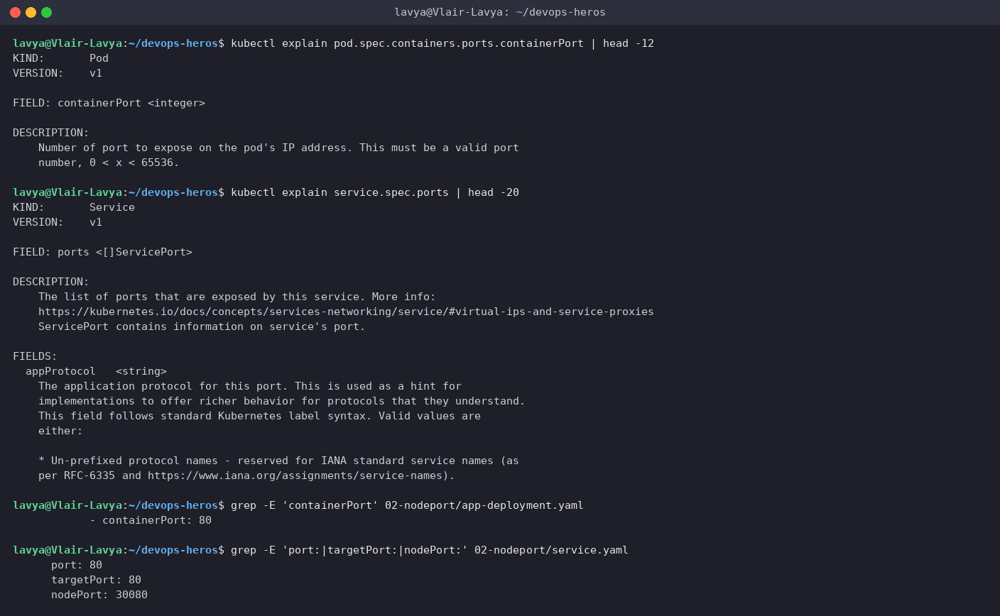

---

## Task 2: ClusterIP - Internal Networking (`01-clusterip/`)

Expose a 3-replica backend on an internal virtual IP and reach it from another Pod by short name, FQDN and IP.

**Commands**
```bash
kubectl apply -f 01-clusterip/app-deployment.yaml
kubectl apply -f 01-clusterip/service.yaml
kubectl get pods -l app=web-clusterip -o wide
kubectl get svc web-service-clusterip
kubectl get endpoints web-service-clusterip
kubectl get endpointslices -l kubernetes.io/service-name=web-service-clusterip
kubectl apply -f 01-clusterip/client-pod.yaml
kubectl wait --for=condition=ready pod/curl-client --timeout=60s
kubectl exec curl-client -- curl -s http://web-service-clusterip:8080 | grep -i '<title>'
kubectl exec curl-client -- curl -s http://web-service-clusterip.default.svc.cluster.local:8080 | grep -i '<title>'
kubectl exec curl-client -- curl -s http://10.111.251.76:8080 | grep -i '<title>'
curl -s --connect-timeout 3 http://10.111.251.76:8080 || echo 'no route from the host - as expected for ClusterIP'
```

**Output**
```text
$ kubectl apply -f 01-clusterip/app-deployment.yaml
deployment.apps/web-app-clusterip created

$ kubectl apply -f 01-clusterip/service.yaml
service/web-service-clusterip created

$ kubectl get pods -l app=web-clusterip -o wide
NAME                                 READY   STATUS    RESTARTS   AGE   IP            NODE       NOMINATED NODE   READINESS GATES
web-app-clusterip-66865d4855-2ngg4   1/1     Running   0          1s    10.244.0.80   minikube   <none>           <none>
web-app-clusterip-66865d4855-qwslf   1/1     Running   0          1s    10.244.0.81   minikube   <none>           <none>
web-app-clusterip-66865d4855-vmmsd   1/1     Running   0          1s    10.244.0.79   minikube   <none>           <none>

$ kubectl get svc web-service-clusterip
NAME                    TYPE        CLUSTER-IP      EXTERNAL-IP   PORT(S)    AGE
web-service-clusterip   ClusterIP   10.111.251.76   <none>        8080/TCP   2s

$ kubectl get endpoints web-service-clusterip
Warning: v1 Endpoints is deprecated in v1.33+; use discovery.k8s.io/v1 EndpointSlice
NAME                    ENDPOINTS                                      AGE
web-service-clusterip   10.244.0.79:80,10.244.0.80:80,10.244.0.81:80   2s

$ kubectl get endpointslices -l kubernetes.io/service-name=web-service-clusterip
NAME                          ADDRESSTYPE   PORTS   ENDPOINTS                             AGE
web-service-clusterip-d2fqr   IPv4          80      10.244.0.81,10.244.0.80,10.244.0.79   2s

$ kubectl apply -f 01-clusterip/client-pod.yaml
pod/curl-client created

$ kubectl wait --for=condition=ready pod/curl-client --timeout=60s
pod/curl-client condition met

$ kubectl exec curl-client -- curl -s http://web-service-clusterip:8080 | grep -i '<title>'
<title>Welcome to nginx!</title>

$ kubectl exec curl-client -- curl -s http://web-service-clusterip.default.svc.cluster.local:8080 | grep -i '<title>'
<title>Welcome to nginx!</title>

$ kubectl exec curl-client -- curl -s http://10.111.251.76:8080 | grep -i '<title>'
<title>Welcome to nginx!</title>

# ClusterIP is not reachable from outside the cluster:
$ curl -s --connect-timeout 3 http://10.111.251.76:8080 || echo 'no route from the host - as expected for ClusterIP'
no route from the host - as expected for ClusterIP
```

**Screenshot**

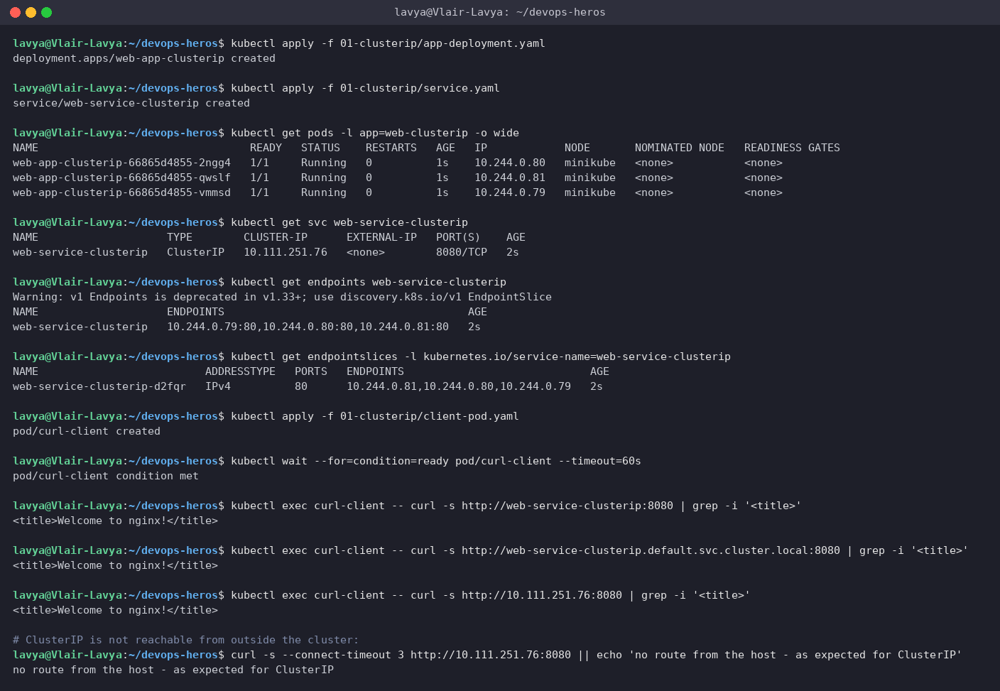

> The Service got VIP `10.111.251.76`; its EndpointSlice tracks the three Pod IPs automatically. All three ways of addressing it work *from inside* the cluster, and the last command shows the flip side: the VIP is not routable from my host at all. ClusterIP is the default and the right choice for anything that only other Pods need to reach.

---

## Task 3: NodePort - External Access via the Node (`02-nodeport/`)

Open port `30080` on the node and hit it from the host.

**Commands**
```bash
kubectl apply -f 02-nodeport/app-deployment.yaml
kubectl apply -f 02-nodeport/service.yaml
kubectl get pods -l app=web-nodeport -o wide
kubectl get svc web-service-nodeport
MINIKUBE_IP=$(minikube ip); echo $MINIKUBE_IP
curl -I http://192.168.49.2:30080
curl -s http://192.168.49.2:30080 | grep -i '<title>'
minikube service web-service-nodeport --url
curl -I http://127.0.0.1:45633
```

**Output**
```text
$ kubectl apply -f 02-nodeport/app-deployment.yaml
deployment.apps/web-app-nodeport created

$ kubectl apply -f 02-nodeport/service.yaml
service/web-service-nodeport created

$ kubectl get pods -l app=web-nodeport -o wide
NAME                              READY   STATUS    RESTARTS   AGE   IP            NODE       NOMINATED NODE   READINESS GATES
web-app-nodeport-6c8f48bd-crxc8   1/1     Running   0          1s    10.244.0.83   minikube   <none>           <none>
web-app-nodeport-6c8f48bd-qm6d9   1/1     Running   0          1s    10.244.0.84   minikube   <none>           <none>

$ kubectl get svc web-service-nodeport
NAME                   TYPE       CLUSTER-IP      EXTERNAL-IP   PORT(S)        AGE
web-service-nodeport   NodePort   10.104.25.140   <none>        80:30080/TCP   2s

$ MINIKUBE_IP=$(minikube ip); echo $MINIKUBE_IP
192.168.49.2

$ curl -I http://192.168.49.2:30080
  % Total    % Received % Xferd  Average Speed  Time    Time    Time   Current
                                 Dload  Upload  Total   Spent   Left   Speed

  0      0   0      0   0      0      0      0                              0
  0    615   0      0   0      0      0      0                              0
  0    615   0      0   0      0      0      0                              0
  0    615   0      0   0      0      0      0                              0
HTTP/1.1 200 OK
Server: nginx/1.25.5
Date: Thu, 17 Sep 2026 20:44:11 GMT
Content-Type: text/html
Content-Length: 615
Last-Modified: Tue, 16 Apr 2024 15:47:06 GMT
Connection: keep-alive
ETag: "661e9d7a-267"
Accept-Ranges: bytes

$ curl -s http://192.168.49.2:30080 | grep -i '<title>'
<title>Welcome to nginx!</title>

$ minikube service web-service-nodeport --url
http://127.0.0.1:45633
! Because you are using a Docker driver on linux, the terminal needs to be open to run it.
# (the tunnel stays open in that terminal; from a second terminal:)
$ curl -I http://127.0.0.1:45633
  % Total    % Received % Xferd  Average Speed  Time    Time    Time   Current
                                 Dload  Upload  Total   Spent   Left   Speed

  0      0   0      0   0      0      0      0                              0
  0    615   0      0   0      0      0      0                              0
  0    615   0      0   0      0      0      0                              0
  0    615   0      0   0      0      0      0                              0
HTTP/1.1 200 OK
Server: nginx/1.25.5
Date: Thu, 17 Sep 2026 20:54:17 GMT
Content-Type: text/html
Content-Length: 615
Last-Modified: Tue, 16 Apr 2024 15:47:06 GMT
Connection: keep-alive
ETag: "661e9d7a-267"
Accept-Ranges: bytes
```

**Screenshot**

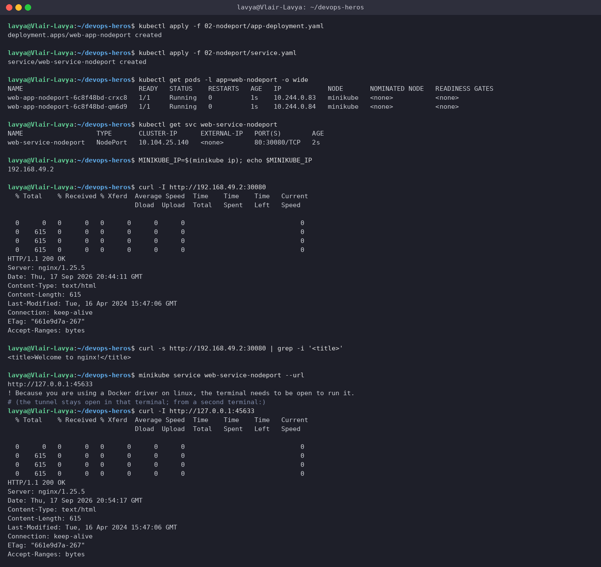

> `80:30080/TCP` reads as `port:nodePort`. Because my Docker engine runs natively inside WSL2, the node IP `192.168.49.2` is directly routable and `curl -I` returns `200 OK` straight away. `minikube service --url` gives a `127.0.0.1` alternative (more on that in Task 12).

---

## Task 4: LoadBalancer - Simulating a Cloud LB with `minikube tunnel` (`03-loadbalancer/`)

Create a `type: LoadBalancer` Service, watch it sit at `<pending>`, then let `minikube tunnel` play the role of the cloud controller.

**Commands**
```bash
kubectl apply -f 03-loadbalancer/app-deployment.yaml
kubectl apply -f 03-loadbalancer/service.yaml
kubectl get svc web-service-loadbalancer
cat /home/lavya/k8s-logs/tunnel.txt
kubectl get svc web-service-loadbalancer
kubectl describe svc web-service-loadbalancer | grep -E 'Type|IP:|LoadBalancer Ingress|Port|NodePort|Endpoints'
EXTERNAL_IP=$(kubectl get svc web-service-loadbalancer -o jsonpath='{.status.loadBalancer.ingress[0].ip}'); echo $EXTERNAL_IP
curl -s http://127.0.0.1:80 | grep -i '<title>'
curl -sI http://127.0.0.1:80 | head -1
kubectl get svc web-service-loadbalancer -o jsonpath='type={.spec.type}  clusterIP={.spec.clusterIP}  nodePort={.spec.ports[0].nodePort}  externalIP={.status.loadBalancer.ingress[0].ip}{"\n"}'
curl -s http://192.168.49.2:32402 | grep -i '<title>'
```

**Output**
```text
$ kubectl apply -f 03-loadbalancer/app-deployment.yaml
deployment.apps/web-app-loadbalancer created

$ kubectl apply -f 03-loadbalancer/service.yaml
service/web-service-loadbalancer created

$ kubectl get svc web-service-loadbalancer
NAME                       TYPE           CLUSTER-IP      EXTERNAL-IP   PORT(S)        AGE
web-service-loadbalancer   LoadBalancer   10.102.238.60   <pending>     80:32402/TCP   1s

# EXTERNAL-IP stays <pending> - there is no cloud controller on minikube to hand out an IP
# Terminal 2:  minikube tunnel   (needs root - it adds a route for the service CIDR on the host)
$ cat /home/lavya/k8s-logs/tunnel.txt
* Tunnel successfully started

* NOTE: Please do not close this terminal as this process must stay alive for the tunnel to be accessible ...

! The service/ingress web-service-loadbalancer requires privileged ports to be exposed: [80]
* sudo permission will be asked for it.
* Starting tunnel for service web-service-loadbalancer.

$ kubectl get svc web-service-loadbalancer
NAME                       TYPE           CLUSTER-IP      EXTERNAL-IP   PORT(S)        AGE
web-service-loadbalancer   LoadBalancer   10.102.238.60   127.0.0.1     80:32402/TCP   8s

$ kubectl describe svc web-service-loadbalancer | grep -E 'Type|IP:|LoadBalancer Ingress|Port|NodePort|Endpoints'
Type:                     LoadBalancer
IP:                       10.102.238.60
LoadBalancer Ingress:     127.0.0.1 (VIP)
Port:                     http  80/TCP
TargetPort:               80/TCP
NodePort:                 http  32402/TCP
Endpoints:                10.244.0.100:80,10.244.0.98:80,10.244.0.99:80

$ EXTERNAL_IP=$(kubectl get svc web-service-loadbalancer -o jsonpath='{.status.loadBalancer.ingress[0].ip}'); echo $EXTERNAL_IP
127.0.0.1

$ curl -s http://127.0.0.1:80 | grep -i '<title>'
<title>Welcome to nginx!</title>

$ curl -sI http://127.0.0.1:80 | head -1
HTTP/1.1 200 OK

# a LoadBalancer service is built on top of a NodePort, which is built on top of a ClusterIP:
$ kubectl get svc web-service-loadbalancer -o jsonpath='type={.spec.type}  clusterIP={.spec.clusterIP}  nodePort={.spec.ports[0].nodePort}  externalIP={.status.loadBalancer.ingress[0].ip}{"\n"}'
type=LoadBalancer  clusterIP=10.102.238.60  nodePort=32402  externalIP=127.0.0.1

$ curl -s http://192.168.49.2:32402 | grep -i '<title>'
<title>Welcome to nginx!</title>
```

**Screenshot**

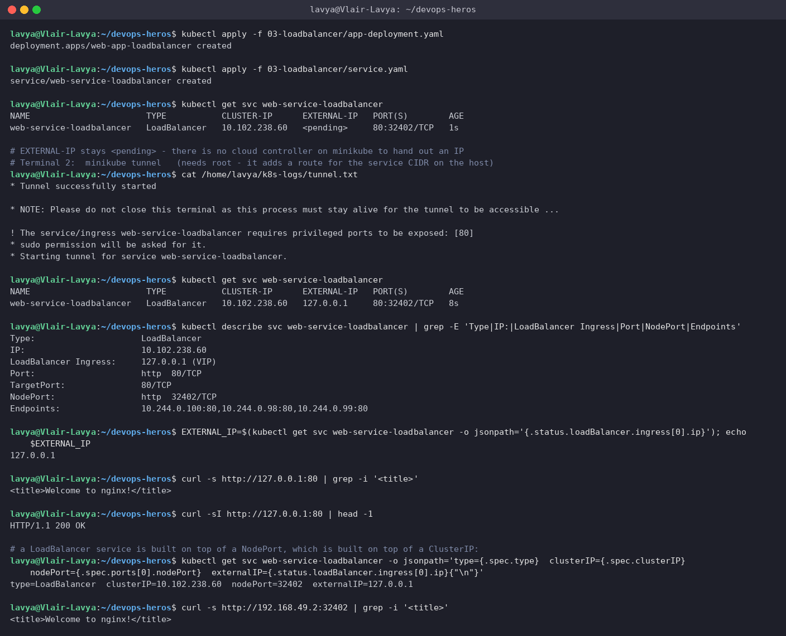

> On AWS/GCP/Azure a cloud controller would provision a real load balancer and write its IP into `status.loadBalancer.ingress`. Minikube has no such controller, so `EXTERNAL-IP` stays `<pending>` until `minikube tunnel` (run as root in a second terminal) steps in and publishes `127.0.0.1`. The `describe` output shows the layering: a LoadBalancer Service *is* a NodePort Service (`32402`) *is* a ClusterIP Service (`10.102.238.60`) - each type adds one more way in. One local gotcha: my old `apache-host` container from the Docker session was still bound to port 80, so I had to stop it before the tunnel could claim the port.

---

## Task 5: ExternalName - a CNAME Alias in Cluster DNS (`04-externalname/`)

Create a selector-less Service that is nothing but a DNS alias to an outside hostname.

**Commands**
```bash
cat 04-externalname/service.yaml
kubectl apply -f 04-externalname/service.yaml
kubectl apply -f 04-externalname/client-pod.yaml
kubectl wait --for=condition=ready pod/dns-test-client --timeout=60s
kubectl get svc external-database-service
kubectl get endpoints external-database-service 2>&1 || true
kubectl exec dns-test-client -- nslookup external-database-service
kubectl exec dns-test-client -- nslookup nencyravaliya.me
cat /tmp/github-alias.yaml
kubectl apply -f /tmp/github-alias.yaml
kubectl get svc github-api-alias
kubectl exec dns-test-client -- nslookup github-api-alias 2>&1 | grep -v NXDOMAIN | grep -v '^$'
kubectl exec dns-test-client -- curl -s -o /dev/null -w 'HTTP %{http_code}  (resolved via alias to %{remote_ip})\n' -H 'Host: api.github.com' https://github-api-alias/ -k
kubectl delete svc github-api-alias
```

**Output**
```text
$ cat 04-externalname/service.yaml
apiVersion: v1
kind: Service
metadata:
  name: external-database-service
spec:
  type: ExternalName
  externalName: nencyravaliya.me

$ kubectl apply -f 04-externalname/service.yaml
service/external-database-service created

$ kubectl apply -f 04-externalname/client-pod.yaml
pod/dns-test-client created

$ kubectl wait --for=condition=ready pod/dns-test-client --timeout=60s
pod/dns-test-client condition met

$ kubectl get svc external-database-service
NAME                        TYPE           CLUSTER-IP   EXTERNAL-IP        PORT(S)   AGE
external-database-service   ExternalName   <none>       nencyravaliya.me   <none>    2s

$ kubectl get endpoints external-database-service 2>&1 || true
Warning: v1 Endpoints is deprecated in v1.33+; use discovery.k8s.io/v1 EndpointSlice
Error from server (NotFound): endpoints "external-database-service" not found

$ kubectl exec dns-test-client -- nslookup external-database-service
Server:		10.96.0.10
Address:	10.96.0.10:53

** server can't find external-database-service.svc.cluster.local: NXDOMAIN

** server can't find external-database-service.svc.cluster.local: NXDOMAIN

** server can't find external-database-service.cluster.local: NXDOMAIN

** server can't find external-database-service.cluster.local: NXDOMAIN

external-database-service.default.svc.cluster.local	canonical name = nencyravaliya.me

external-database-service.default.svc.cluster.local	canonical name = nencyravaliya.me

command terminated with exit code 1

$ kubectl exec dns-test-client -- nslookup nencyravaliya.me
Server:		10.96.0.10
Address:	10.96.0.10:53

** server can't find nencyravaliya.me: NXDOMAIN

** server can't find nencyravaliya.me: NXDOMAIN

command terminated with exit code 1

# the CNAME target in the course manifest has no A record right now, so end-to-end traffic cannot flow through that alias.
# same pattern against a real external host (api.github.com) to prove the full path: alias -> CNAME -> IP -> HTTP
$ cat /tmp/github-alias.yaml
apiVersion: v1
kind: Service
metadata:
  name: github-api-alias
spec:
  type: ExternalName
  externalName: api.github.com

$ kubectl apply -f /tmp/github-alias.yaml
service/github-api-alias created

$ kubectl get svc github-api-alias
NAME               TYPE           CLUSTER-IP   EXTERNAL-IP      PORT(S)   AGE
github-api-alias   ExternalName   <none>       api.github.com   <none>    1s

$ kubectl exec dns-test-client -- nslookup github-api-alias 2>&1 | grep -v NXDOMAIN | grep -v '^$'
Server:		10.96.0.10
Address:	10.96.0.10:53
github-api-alias.default.svc.cluster.local	canonical name = api.github.com
Name:	api.github.com
Address: 20.207.73.85
github-api-alias.default.svc.cluster.local	canonical name = api.github.com
command terminated with exit code 1

$ kubectl exec dns-test-client -- curl -s -o /dev/null -w 'HTTP %{http_code}  (resolved via alias to %{remote_ip})\n' -H 'Host: api.github.com' https://github-api-alias/ -k
HTTP 200  (resolved via alias to 20.207.73.85)

$ kubectl delete svc github-api-alias
service "github-api-alias" deleted from default namespace
```

**Screenshot**

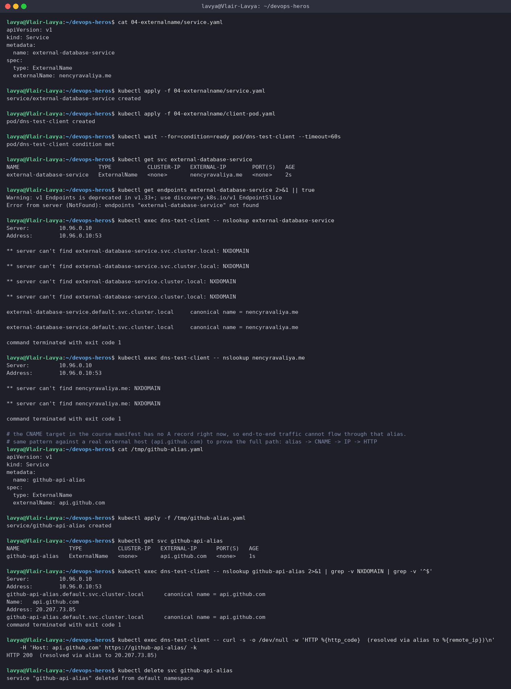

> No ClusterIP, no Endpoints object - CoreDNS just answers `external-database-service.default.svc.cluster.local` with a `CNAME` to `nencyravaliya.me`. That particular domain currently has no A record, so I repeated the pattern with `api.github.com` to prove the complete chain: alias → CNAME → real IP → `HTTP 200`. This is how you give an external database or SaaS API an in-cluster name that you can later swap for a real Service without touching the app.

---

## Task 6: Headless Service + StatefulSet (`05-headless/`)

`clusterIP: None` - DNS returns the Pods themselves instead of a virtual IP.

**Commands**
```bash
cat 05-headless/service.yaml
kubectl apply -f 05-headless/service.yaml
kubectl apply -f 05-headless/app-statefulset.yaml
kubectl apply -f 05-headless/client-pod.yaml
kubectl rollout status statefulset/web-stateful --timeout=120s
kubectl get pods -l app=web-headless -o wide
kubectl get svc web-service-headless
kubectl exec headless-dns-client -- nslookup web-service-headless
kubectl exec headless-dns-client -- nslookup web-stateful-0.web-service-headless.default.svc.cluster.local
kubectl exec headless-dns-client -- curl -s http://web-stateful-0.web-service-headless:80 | grep -i '<title>'
kubectl exec headless-dns-client -- curl -s http://web-stateful-2.web-service-headless:80 | grep -i '<title>'
```

**Output**
```text
$ cat 05-headless/service.yaml
apiVersion: v1
kind: Service
metadata:
  name: web-service-headless
  labels:
    app: web-headless
spec:
  clusterIP: None
  selector:
    app: web-headless
  ports:
    - name: web
      port: 80
      targetPort: 80
      protocol: TCP

$ kubectl apply -f 05-headless/service.yaml
service/web-service-headless created

$ kubectl apply -f 05-headless/app-statefulset.yaml
statefulset.apps/web-stateful created

$ kubectl apply -f 05-headless/client-pod.yaml
pod/headless-dns-client created

$ kubectl rollout status statefulset/web-stateful --timeout=120s
Waiting for 3 pods to be ready...
Waiting for 2 pods to be ready...
Waiting for 2 pods to be ready...
Waiting for 1 pods to be ready...
Waiting for 1 pods to be ready...
partitioned roll out complete: 3 new pods have been updated...

$ kubectl get pods -l app=web-headless -o wide
NAME             READY   STATUS    RESTARTS   AGE   IP            NODE       NOMINATED NODE   READINESS GATES
web-stateful-0   1/1     Running   0          6s    10.244.0.86   minikube   <none>           <none>
web-stateful-1   1/1     Running   0          4s    10.244.0.88   minikube   <none>           <none>
web-stateful-2   1/1     Running   0          2s    10.244.0.89   minikube   <none>           <none>

$ kubectl get svc web-service-headless
NAME                   TYPE        CLUSTER-IP   EXTERNAL-IP   PORT(S)   AGE
web-service-headless   ClusterIP   None         <none>        80/TCP    8s

$ kubectl exec headless-dns-client -- nslookup web-service-headless
Server:		10.96.0.10
Address:	10.96.0.10:53

** server can't find web-service-headless.cluster.local: NXDOMAIN

** server can't find web-service-headless.cluster.local: NXDOMAIN

** server can't find web-service-headless.svc.cluster.local: NXDOMAIN

** server can't find web-service-headless.svc.cluster.local: NXDOMAIN

Name:	web-service-headless.default.svc.cluster.local
Address: 10.244.0.88
Name:	web-service-headless.default.svc.cluster.local
Address: 10.244.0.89
Name:	web-service-headless.default.svc.cluster.local
Address: 10.244.0.86

command terminated with exit code 1

$ kubectl exec headless-dns-client -- nslookup web-stateful-0.web-service-headless.default.svc.cluster.local
Server:		10.96.0.10
Address:	10.96.0.10:53

Name:	web-stateful-0.web-service-headless.default.svc.cluster.local
Address: 10.244.0.86

$ kubectl exec headless-dns-client -- curl -s http://web-stateful-0.web-service-headless:80 | grep -i '<title>'
<title>Welcome to nginx!</title>

$ kubectl exec headless-dns-client -- curl -s http://web-stateful-2.web-service-headless:80 | grep -i '<title>'
<title>Welcome to nginx!</title>
```

**Screenshot**

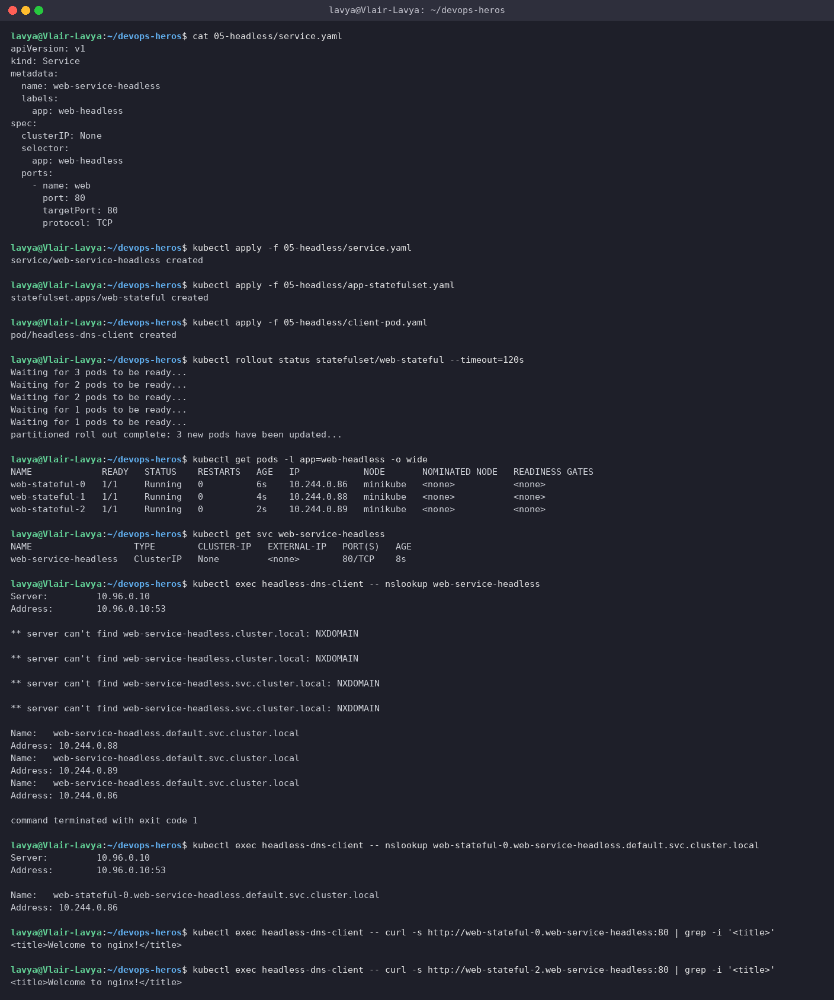

> `nslookup web-service-headless` returns **three A records** (`10.244.0.88 / .89 / .86`), one per StatefulSet Pod, instead of a single VIP - the client does its own load balancing or picks a specific member. Each Pod also gets a stable per-Pod DNS name, `web-stateful-0.web-service-headless.default.svc.cluster.local`, which is how database clusters find their peers (`mysql-0` is the primary, `mysql-1` replicates from it, and so on).

---

## Task 7: Service Without a Selector + Manual Endpoints

Build a Service with no selector and hand-wire it to an external IP with an `Endpoints` object of the same name.

**Commands**
```bash
cat /tmp/ext-svc.yaml
kubectl apply -f /tmp/ext-svc.yaml
kubectl get svc external-legacy-db
kubectl get endpoints external-legacy-db
cat /tmp/ext-ep.yaml
kubectl apply -f /tmp/ext-ep.yaml
kubectl get endpoints external-legacy-db
kubectl describe svc external-legacy-db | grep -E 'Selector|Endpoints'
kubectl delete svc external-legacy-db
```

**Output**
```text
$ cat /tmp/ext-svc.yaml
apiVersion: v1
kind: Service
metadata:
  name: external-legacy-db
spec:
  ports:
    - protocol: TCP
      port: 3306
      targetPort: 3306

$ kubectl apply -f /tmp/ext-svc.yaml
service/external-legacy-db created

$ kubectl get svc external-legacy-db
NAME                 TYPE        CLUSTER-IP       EXTERNAL-IP   PORT(S)    AGE
external-legacy-db   ClusterIP   10.110.187.141   <none>        3306/TCP   1s

$ kubectl get endpoints external-legacy-db
Warning: v1 Endpoints is deprecated in v1.33+; use discovery.k8s.io/v1 EndpointSlice
Error from server (NotFound): endpoints "external-legacy-db" not found

$ cat /tmp/ext-ep.yaml
apiVersion: v1
kind: Endpoints
metadata:
  name: external-legacy-db
subsets:
  - addresses:
      - ip: 192.168.1.150
    ports:
      - port: 3306

$ kubectl apply -f /tmp/ext-ep.yaml
Warning: v1 Endpoints is deprecated in v1.33+; use discovery.k8s.io/v1 EndpointSlice
endpoints/external-legacy-db created

$ kubectl get endpoints external-legacy-db
Warning: v1 Endpoints is deprecated in v1.33+; use discovery.k8s.io/v1 EndpointSlice
NAME                 ENDPOINTS            AGE
external-legacy-db   192.168.1.150:3306   0s

$ kubectl describe svc external-legacy-db | grep -E 'Selector|Endpoints'
Selector:                 <none>
Endpoints:                192.168.1.150:3306

$ kubectl delete svc external-legacy-db
service "external-legacy-db" deleted from default namespace
```

**Screenshot**

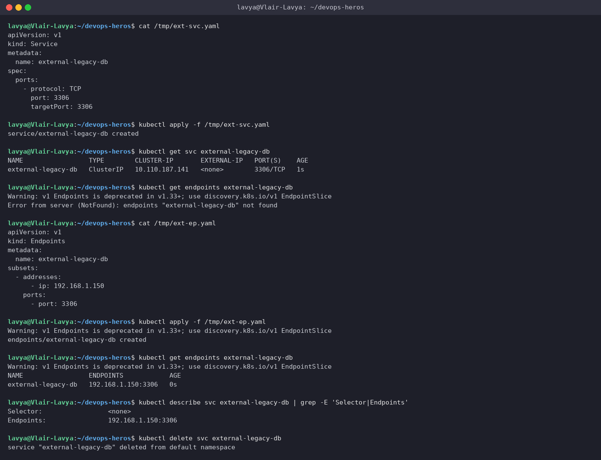

> Without a selector Kubernetes creates no Endpoints at all (`NotFound`). The moment an `Endpoints` object with the *same name* appears, the Service starts routing `external-legacy-db:3306` to `192.168.1.150:3306`. In-cluster apps talk to a normal Service name; the backend can be a VM, a bare-metal database, or anything else with an IP.

---

## Task 8: FQDN & CoreDNS Deep Dive

Look at how a Pod resolves names, and why `ndots:5` costs extra round-trips for external hostnames.

**Commands**
```bash
kubectl get pods -n kube-system -l k8s-app=kube-dns -o wide
kubectl get svc -n kube-system kube-dns
kubectl exec curl-client -- cat /etc/resolv.conf
kubectl exec curl-client -- nslookup web-service-clusterip
kubectl exec curl-client -- nslookup web-service-clusterip.default.svc.cluster.local
kubectl exec curl-client -- nslookup api.github.com
kubectl exec curl-client -- sh -c 'for s in default.svc.cluster.local svc.cluster.local cluster.local; do echo "trying api.github.com.$s"; nslookup api.github.com.$s 2>&1 | grep -E "NXDOMAIN|can.t"; done; echo "then finally: api.github.com"; nslookup api.github.com | grep -A1 ^Name'
kubectl exec curl-client -- nslookup api.github.com.
```

**Output**
```text
$ kubectl get pods -n kube-system -l k8s-app=kube-dns -o wide
NAME                       READY   STATUS    RESTARTS      AGE   IP           NODE       NOMINATED NODE   READINESS GATES
coredns-559f6c778d-blkrr   1/1     Running   2 (31m ago)   49m   10.244.0.2   minikube   <none>           <none>

$ kubectl get svc -n kube-system kube-dns
NAME       TYPE        CLUSTER-IP   EXTERNAL-IP   PORT(S)                  AGE
kube-dns   ClusterIP   10.96.0.10   <none>        53/UDP,53/TCP,9153/TCP   49m

$ kubectl exec curl-client -- cat /etc/resolv.conf
search default.svc.cluster.local svc.cluster.local cluster.local
nameserver 10.96.0.10
options ndots:5

$ kubectl exec curl-client -- nslookup web-service-clusterip
Server:		10.96.0.10
Address:	10.96.0.10:53

** server can't find web-service-clusterip.cluster.local: NXDOMAIN

** server can't find web-service-clusterip.cluster.local: NXDOMAIN

Name:	web-service-clusterip.default.svc.cluster.local
Address: 10.111.251.76

** server can't find web-service-clusterip.svc.cluster.local: NXDOMAIN

** server can't find web-service-clusterip.svc.cluster.local: NXDOMAIN

command terminated with exit code 1

$ kubectl exec curl-client -- nslookup web-service-clusterip.default.svc.cluster.local
Server:		10.96.0.10
Address:	10.96.0.10:53

Name:	web-service-clusterip.default.svc.cluster.local
Address: 10.111.251.76

$ kubectl exec curl-client -- nslookup api.github.com
Server:		10.96.0.10
Address:	10.96.0.10:53

Non-authoritative answer:
Name:	api.github.com
Address: 20.207.73.85

Non-authoritative answer:

# why ndots:5 hurts: 'api.github.com' has only 2 dots (<5), so the resolver tries every search suffix first
$ kubectl exec curl-client -- sh -c 'for s in default.svc.cluster.local svc.cluster.local cluster.local; do echo "trying api.github.com.$s"; nslookup api.github.com.$s 2>&1 | grep -E "NXDOMAIN|can.t"; done; echo "then finally: api.github.com"; nslookup api.github.com | grep -A1 ^Name'
trying api.github.com.default.svc.cluster.local
** server can't find api.github.com.default.svc.cluster.local: NXDOMAIN
** server can't find api.github.com.default.svc.cluster.local: NXDOMAIN
trying api.github.com.svc.cluster.local
** server can't find api.github.com.svc.cluster.local: NXDOMAIN
** server can't find api.github.com.svc.cluster.local: NXDOMAIN
trying api.github.com.cluster.local
** server can't find api.github.com.cluster.local: NXDOMAIN
** server can't find api.github.com.cluster.local: NXDOMAIN
then finally: api.github.com
Name:	api.github.com
Address: 20.207.73.85

$ kubectl exec curl-client -- nslookup api.github.com.
Server:		10.96.0.10
Address:	10.96.0.10:53

Name:	api.github.com
Address: 20.207.73.85
```

**Screenshot**

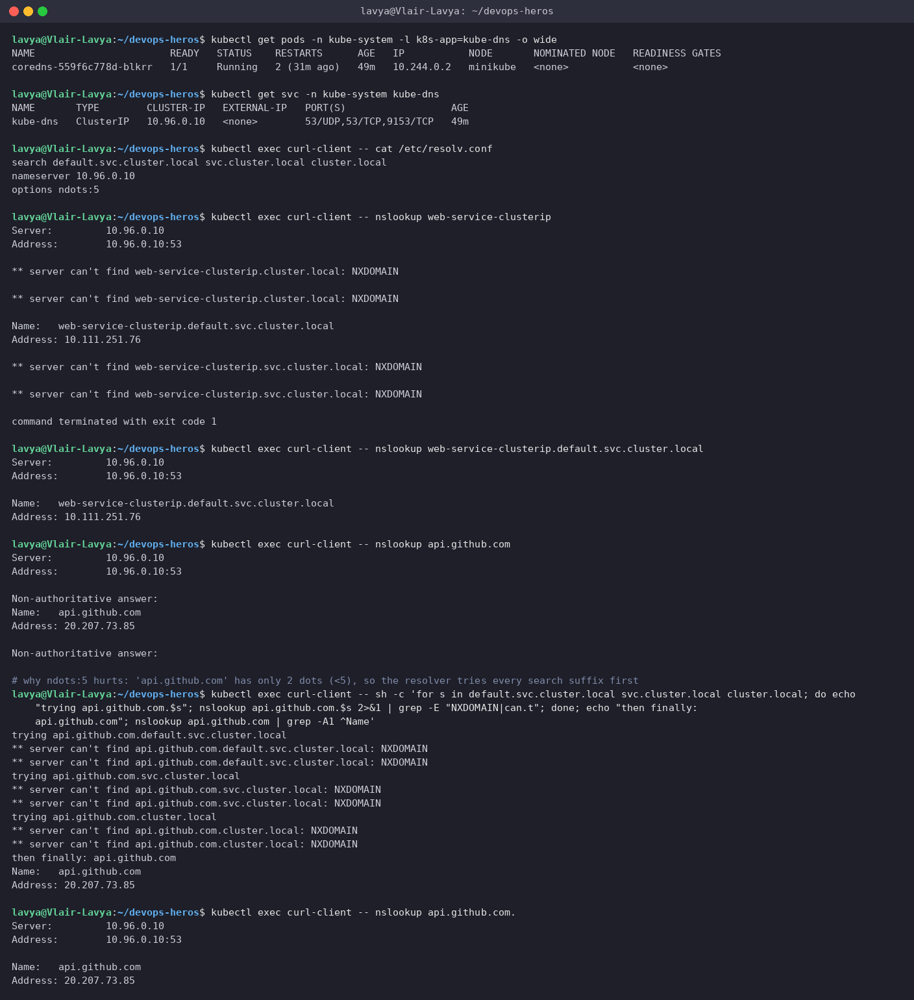

> **FQDN anatomy:** `web-service-clusterip` `.default` `.svc` `.cluster.local` = *service* . *namespace* . `svc` . *cluster domain*. The `search` list in `/etc/resolv.conf` is what lets a Pod use the short name: the resolver appends `default.svc.cluster.local` first, which is why the same-namespace short name works and why you need `name.namespace` to reach a Service in a different namespace.
>
> **Why `ndots:5` hurts:** a name with fewer than 5 dots is treated as *relative*, so `api.github.com` (2 dots) is first tried as `api.github.com.default.svc.cluster.local`, then `.svc.cluster.local`, then `.cluster.local` - three NXDOMAIN round-trips to CoreDNS *before* the real query. At scale that is measurable latency and DNS load. Fixes: use a trailing dot (`api.github.com.` is absolute and skips the search list - last command above), or set `dnsConfig.options: [{name: ndots, value: "2"}]` on the Pod.

---

## Task 9: Pod Identity - Deployment vs StatefulSet

Delete a Pod from each controller and compare what comes back.

**Commands**
```bash
kubectl get pods -l app=web-clusterip
kubectl get pods -l app=web-headless
echo Deleting Stateless Deployment Pod: web-app-clusterip-66865d4855-2ngg4
kubectl delete pod web-app-clusterip-66865d4855-2ngg4 --wait=false
kubectl get pods -l app=web-clusterip
echo Deleting StatefulSet Pod: web-stateful-0
kubectl delete pod web-stateful-0 --wait=false
kubectl get pods -l app=web-headless
kubectl get pods -l app=web-headless
kubectl get pod web-stateful-0 -o jsonpath='{.metadata.name} on {.status.podIP} hostname={.spec.hostname} subdomain={.spec.subdomain}{"\n"}'
```

**Output**
```text
$ kubectl get pods -l app=web-clusterip
NAME                                 READY   STATUS    RESTARTS   AGE
web-app-clusterip-66865d4855-2ngg4   1/1     Running   0          10m
web-app-clusterip-66865d4855-qwslf   1/1     Running   0          10m
web-app-clusterip-66865d4855-vmmsd   1/1     Running   0          10m

$ kubectl get pods -l app=web-headless
NAME             READY   STATUS    RESTARTS   AGE
web-stateful-0   1/1     Running   0          13s
web-stateful-1   1/1     Running   0          11s
web-stateful-2   1/1     Running   0          9s

$ echo Deleting Stateless Deployment Pod: web-app-clusterip-66865d4855-2ngg4
Deleting Stateless Deployment Pod: web-app-clusterip-66865d4855-2ngg4

$ kubectl delete pod web-app-clusterip-66865d4855-2ngg4 --wait=false
pod "web-app-clusterip-66865d4855-2ngg4" deleted from default namespace

$ kubectl get pods -l app=web-clusterip
NAME                                 READY   STATUS    RESTARTS   AGE
web-app-clusterip-66865d4855-99cb6   1/1     Running   0          3s
web-app-clusterip-66865d4855-qwslf   1/1     Running   0          10m
web-app-clusterip-66865d4855-vmmsd   1/1     Running   0          10m

$ echo Deleting StatefulSet Pod: web-stateful-0
Deleting StatefulSet Pod: web-stateful-0

$ kubectl delete pod web-stateful-0 --wait=false
pod "web-stateful-0" deleted from default namespace

$ kubectl get pods -l app=web-headless
NAME             READY   STATUS              RESTARTS   AGE
web-stateful-0   0/1     ContainerCreating   0          1s
web-stateful-1   1/1     Running             0          17s
web-stateful-2   1/1     Running             0          15s

$ kubectl get pods -l app=web-headless
NAME             READY   STATUS    RESTARTS   AGE
web-stateful-0   1/1     Running   0          7s
web-stateful-1   1/1     Running   0          23s
web-stateful-2   1/1     Running   0          21s

$ kubectl get pod web-stateful-0 -o jsonpath='{.metadata.name} on {.status.podIP} hostname={.spec.hostname} subdomain={.spec.subdomain}{"\n"}'
web-stateful-0 on 10.244.0.91 hostname=web-stateful-0 subdomain=web-service-headless
```

**Screenshot**

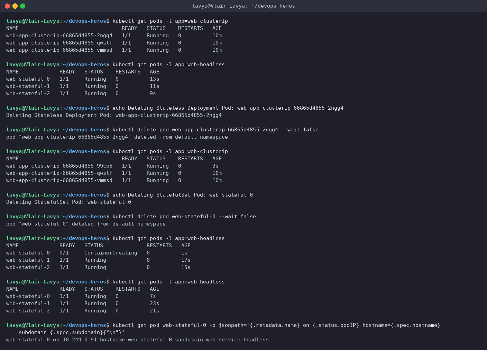

> Deployment: `web-app-clusterip-66865d4855-2ngg4` died and `web-app-clusterip-66865d4855-99cb6` took its place - same ReplicaSet hash, brand-new random suffix, new IP. Nobody is supposed to care which one they talk to.
> StatefulSet: I deleted `web-stateful-0` and the replacement is called `web-stateful-0` again, with the same hostname and DNS entry. The identity is part of the contract, which is exactly what stateful systems need.

---

## Task 10: Deployment vs StatefulSet vs DaemonSet

**Commands**
```bash
kubectl explain deployment.spec | grep -A2 -E '^  (replicas|strategy|selector)'
kubectl explain statefulset.spec | grep -A2 -E '^  (serviceName|volumeClaimTemplates|podManagementPolicy|ordinals)'
kubectl explain daemonset.spec | grep -A2 -E '^  (updateStrategy|selector|template)'
kubectl apply -f /mnt/l/Devops/devops-heros/session10-k8s-core-objects/daemonset/node-agent-ds.yaml
kubectl get deploy,sts,ds
kubectl get pods -o custom-columns=NAME:.metadata.name,OWNER:.metadata.ownerReferences[0].kind,NODE:.spec.nodeName
kubectl delete -f /mnt/l/Devops/devops-heros/session10-k8s-core-objects/daemonset/node-agent-ds.yaml
```

**Output**
```text
$ kubectl explain deployment.spec | grep -A2 -E '^  (replicas|strategy|selector)'
  replicas	<integer>
    Number of desired pods. This is a pointer to distinguish between explicit
    zero and not specified. Defaults to 1.
--
  selector	<LabelSelector> -required-
    Label selector for pods. Existing ReplicaSets whose pods are selected by
    this will be the ones affected by this deployment. It must match the pod
--
  strategy	<DeploymentStrategy>
    The deployment strategy to use to replace existing pods with new ones.

$ kubectl explain statefulset.spec | grep -A2 -E '^  (serviceName|volumeClaimTemplates|podManagementPolicy|ordinals)'
  ordinals	<StatefulSetOrdinals>
    ordinals controls the numbering of replica indices in a StatefulSet. The
    default ordinals behavior assigns a "0" index to the first replica and
--
  podManagementPolicy	<string>
  enum: OrderedReady, Parallel
    podManagementPolicy controls how pods are created during initial scale up,
--
  serviceName	<string>
    serviceName is the name of the service that governs this StatefulSet. This
    service must exist before the StatefulSet, and is responsible for the
--
  volumeClaimTemplates	<[]PersistentVolumeClaim>
    volumeClaimTemplates is a list of claims that pods are allowed to reference.
    The StatefulSet controller is responsible for mapping network identities to

$ kubectl explain daemonset.spec | grep -A2 -E '^  (updateStrategy|selector|template)'
  selector	<LabelSelector> -required-
    A label query over pods that are managed by the daemon set. Must match in
    order to be controlled. It must match the pod template's labels. More info:
--
  template	<PodTemplateSpec> -required-
    An object that describes the pod that will be created. The DaemonSet will
    create exactly one copy of this pod on every node that matches the
--
  updateStrategy	<DaemonSetUpdateStrategy>
    An update strategy to replace existing DaemonSet pods with new pods.

$ kubectl apply -f /mnt/l/Devops/devops-heros/session10-k8s-core-objects/daemonset/node-agent-ds.yaml
daemonset.apps/node-logging-agent created

$ kubectl get deploy,sts,ds
NAME                                READY   UP-TO-DATE   AVAILABLE   AGE
deployment.apps/web-app-clusterip   3/3     3            3           10m
deployment.apps/web-app-nodeport    2/2     2            2           10m

NAME                            READY   AGE
statefulset.apps/web-stateful   3/3     34s

NAME                                DESIRED   CURRENT   READY   UP-TO-DATE   AVAILABLE   NODE SELECTOR   AGE
daemonset.apps/node-logging-agent   1         1         1       1            1           <none>          8s

$ kubectl get pods -o custom-columns=NAME:.metadata.name,OWNER:.metadata.ownerReferences[0].kind,NODE:.spec.nodeName
NAME                                 OWNER         NODE
curl-client                          <none>        minikube
dns-test-client                      <none>        minikube
headless-dns-client                  <none>        minikube
node-logging-agent-fpbzd             DaemonSet     minikube
web-app-clusterip-66865d4855-99cb6   ReplicaSet    minikube
web-app-clusterip-66865d4855-qwslf   ReplicaSet    minikube
web-app-clusterip-66865d4855-vmmsd   ReplicaSet    minikube
web-app-nodeport-6c8f48bd-crxc8      ReplicaSet    minikube
web-app-nodeport-6c8f48bd-qm6d9      ReplicaSet    minikube
web-stateful-0                       StatefulSet   minikube
web-stateful-1                       StatefulSet   minikube
web-stateful-2                       StatefulSet   minikube

$ kubectl delete -f /mnt/l/Devops/devops-heros/session10-k8s-core-objects/daemonset/node-agent-ds.yaml
daemonset.apps "node-logging-agent" deleted from default namespace
```

| | Deployment | StatefulSet | DaemonSet |
| --- | --- | --- | --- |
| **Typical workload** | Stateless web/API tiers | Databases, queues, anything with peers and disks | Per-node agents: logging, metrics, CNI, security |
| **Pod naming** | `<name>-<rs-hash>-<random>` | `<name>-0`, `<name>-1`, ... | `<name>-<random>`, one per node |
| **Identity after restart** | New name, new IP | Same ordinal, same hostname, same DNS record | Re-created on the same node |
| **Start / stop order** | Parallel, no ordering | Ordered `0 → 1 → 2`; reverse on scale-down (`podManagementPolicy: OrderedReady`) | Parallel across nodes |
| **Storage** | Shared or ephemeral | One PVC per ordinal from `volumeClaimTemplates`; survives Pod deletion | Usually `hostPath` on the node |
| **Service pairing** | ClusterIP / NodePort / LoadBalancer | Needs a **headless** Service (`serviceName`) for per-Pod DNS | Often none, or a ClusterIP for scraping |
| **Scaling** | `kubectl scale` anywhere | Adds/removes from the tail (`-N`) | Automatic: one Pod appears per new node |
| **Seen in this course** | `app-rolling`, `yatri-backend` | `mysql`, `web-stateful` | `node-exporter`, `node-logging-agent` |

**Screenshot**

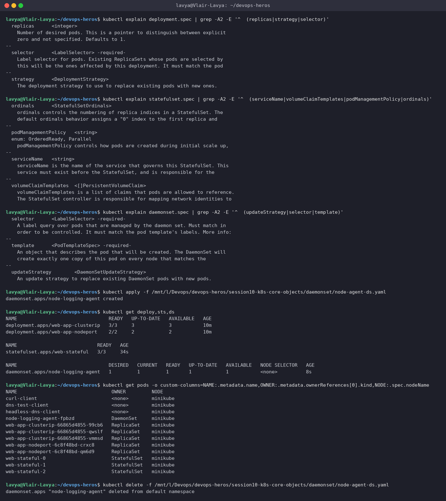

> The custom-columns view is my favourite proof: the same cluster, three owner kinds, and you can read the identity model straight off the Pod names.

---

## Task 11: Service Selection Decision Tree & the Cost of LoadBalancers

### The anti-pattern

Every `type: LoadBalancer` Service on a public cloud provisions its **own** load balancer, billed hourly (roughly $18-25/month each on AWS/GCP/Azure before traffic charges).

```text
ANTI-PATTERN: one cloud LB per microservice
  users ──► NLB #1  ($25/mo) ──► Service A (ClusterIP)
  users ──► NLB #2  ($25/mo) ──► Service B (ClusterIP)
  users ──► NLB #3  ($25/mo) ──► Service C (ClusterIP)
  ...
  50 services  =  50 load balancers  ≈  $1,250 / month, 50 public IPs, 50 TLS certs to manage

BEST PRACTICE: one LB in front of an Ingress controller
  users ──► ONE cloud LB ($25/mo)
                 │
                 ▼
        NGINX Ingress Controller  (Layer 7: routes on hostname + path, terminates TLS)
           │          │          │
           ▼          ▼          ▼
       Service A   Service B   Service C   (all plain ClusterIP)
  50 services  =  1 load balancer  ≈  $25 / month   (saves ~$1,225 / month)
```

Session 12 builds exactly this: `yatri-frontend-service` and `yatri-backend-service` are ClusterIP, and a single Ingress routes `/` and `/api` to them.

### Decision tree

```text
Does anything OUTSIDE the cluster need to reach it?
│
├── NO ──► Do clients need to address individual Pods (DB replicas, Kafka brokers)?
│           ├── YES ──► HEADLESS SERVICE (clusterIP: None) + StatefulSet
│           └── NO  ──► CLUSTERIP (the default)
│
└── YES ──► Is the "service" actually an external hostname (RDS, Stripe, a SaaS API)?
             ├── YES ──► EXTERNALNAME (or a selector-less Service + Endpoints for a bare IP)
             └── NO  ──► Running on a public cloud?
                          ├── YES, HTTP/HTTPS ──► ClusterIP per app + ONE Ingress exposed via LOADBALANCER
                          ├── YES, raw TCP/UDP ──► LOADBALANCER per protocol endpoint
                          └── NO (on-prem / laptop / CI) ──► NODEPORT (or MetalLB + LoadBalancer)
```

---

## Task 12: The Minikube Docker-Driver NodePort Gotcha

Why `curl http://$(minikube ip):30080` hangs on macOS/Windows, and the two workarounds.

**Commands**
```bash
kubectl get svc web-service-nodeport
NODE_IP=$(minikube ip); echo $NODE_IP
docker network inspect minikube -f '{{range .IPAM.Config}}{{.Subnet}}{{end}}'
ip route | grep 192.168.49 || echo 'no host route to the minikube docker network'
curl --connect-timeout 2 -sI http://192.168.49.2:30080 | head -1 || echo 'Connection Failed as expected!'
minikube service web-service-nodeport --url
curl -sI http://127.0.0.1:45377 | head -1
kubectl get svc web-service-loadbalancer -o wide
curl -sI http://127.0.0.1 | head -1
curl -s http://127.0.0.1 | grep -i '<title>'
```

**Output**
```text
$ kubectl get svc web-service-nodeport
NAME                   TYPE       CLUSTER-IP      EXTERNAL-IP   PORT(S)        AGE
web-service-nodeport   NodePort   10.102.114.26   <none>        80:30080/TCP   10s

$ NODE_IP=$(minikube ip); echo $NODE_IP
192.168.49.2

$ docker network inspect minikube -f '{{range .IPAM.Config}}{{.Subnet}}{{end}}'
192.168.49.0/24

$ ip route | grep 192.168.49 || echo 'no host route to the minikube docker network'
192.168.49.0/24 dev br-587c0e49056c proto kernel scope link src 192.168.49.1

# on macOS / Windows (Docker Desktop) the docker bridge lives inside a hidden VM, so this direct call hangs:
$ curl --connect-timeout 2 -sI http://192.168.49.2:30080 | head -1 || echo 'Connection Failed as expected!'
HTTP/1.1 200 OK

# here the cluster runs on a native Linux docker engine (WSL2 Ubuntu) so the bridge IS routable and the call works
# WORKAROUND 1 - minikube service <svc> --url (opens a local port-forward on 127.0.0.1)
$ minikube service web-service-nodeport --url
http://127.0.0.1:45377
! Because you are using a Docker driver on linux, the terminal needs to be open to run it.

$ curl -sI http://127.0.0.1:45377 | head -1
HTTP/1.1 200 OK

# WORKAROUND 2 - minikube tunnel (already running from Task 4) - routes the LoadBalancer IP on the host
$ kubectl get svc web-service-loadbalancer -o wide
NAME                       TYPE           CLUSTER-IP      EXTERNAL-IP   PORT(S)        AGE   SELECTOR
web-service-loadbalancer   LoadBalancer   10.102.238.60   127.0.0.1     80:32402/TCP   14s   app=web-loadbalancer

$ curl -sI http://127.0.0.1 | head -1
HTTP/1.1 200 OK

$ curl -s http://127.0.0.1 | grep -i '<title>'
<title>Welcome to nginx!</title>
```

**Screenshot**

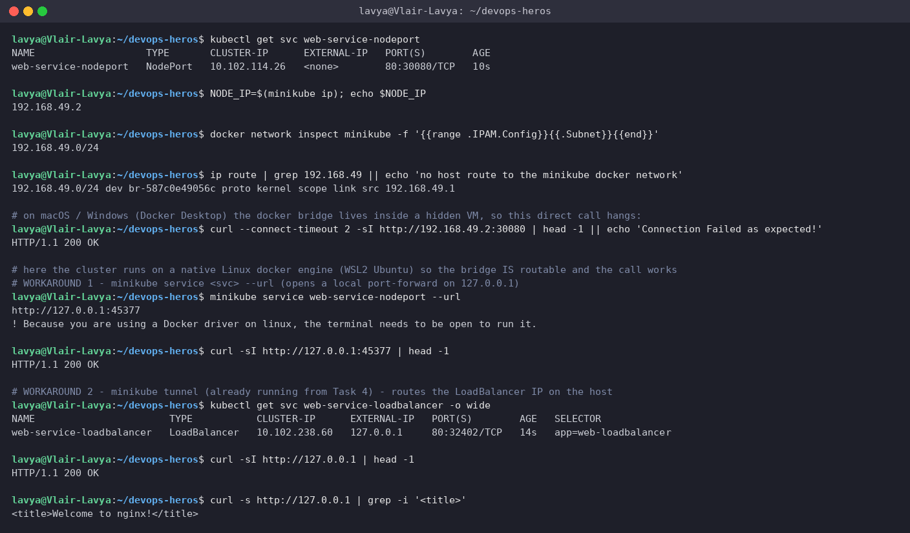

> **Root cause.** With `--driver=docker`, the "node" is a container on the `minikube` Docker network (`192.168.49.0/24`). On a real Linux host that bridge is a local interface, so the node IP is routable - my `ip route` output shows exactly that route, which is why the "failing" curl actually succeeded in my WSL2 setup. On macOS and Windows with Docker Desktop, the Docker engine runs inside a hidden VM; the bridge exists *there*, the host kernel has no route to `192.168.49.x`, and the request times out.
>
> **Workaround 1 - `minikube service <svc> --url`:** opens an SSH port-forward from `127.0.0.1:<random>` into the container. It has to stay running ("the terminal needs to be open"), which is also why it blocked my first scripted run until I put it in the background.
>
> **Workaround 2 - `minikube tunnel`:** a long-running process that (as root) adds routes / port-forwards so LoadBalancer Services get a reachable `EXTERNAL-IP` (`127.0.0.1` here). It is the same tunnel that made Task 4 work.

---

## References

- Services: https://kubernetes.io/docs/concepts/services-networking/service/
- DNS for Services and Pods: https://kubernetes.io/docs/concepts/services-networking/dns-pod-service/
- StatefulSets: https://kubernetes.io/docs/concepts/workloads/controllers/statefulset/
- Minikube networking: https://minikube.sigs.k8s.io/docs/handbook/accessing/
- Course notes: `service.md`, `fqdn.md` in this directory
