# Session 12: ConfigMaps, Secrets & Ingress

**Author:** Lavya ([@LAVYA255](https://github.com/LAVYA255))
**Course:** SST DevOps & Cloud [SWE]
**Session:** 12 - ConfigMaps, Secrets and Ingress (tasks given in Lecture 14)
**Repository:** `devops-heros / session-12-ingress-configmaps-secrets`

**Environment:** Minikube v1.39.0 (docker driver) on WSL2 Ubuntu 26.04, Kubernetes v1.37.0, NGINX Ingress Controller v1.15.1 (minikube addon). All commands were run from this directory; `$(minikube ip)` is `192.168.49.2`. Outputs are pasted verbatim and the PNGs in `./screenshots/` are captures of the same terminal session. Tasks 2 and 6 depend on each other, so I ran Task 6 (deploy the backend) before Task 2 (patch the ConfigMap it reads).

---

## Task 1: ConfigMaps - Decoupling Non-Sensitive Configuration

Store runtime settings in a `ConfigMap` and read them back with `describe` and JSONPath.

**Commands**
```bash
cat 01-configmap/app-config.yaml
kubectl apply -f 01-configmap/app-config.yaml
kubectl get configmap yatri-app-config
kubectl describe configmap yatri-app-config
kubectl get configmap yatri-app-config -o jsonpath='{.data.ENVIRONMENT}' && echo
kubectl get configmap yatri-app-config -o jsonpath='{.data.LOG_LEVEL}' && echo
kubectl get configmap yatri-app-config -o jsonpath='{.data}' && echo
```

**Output**
```text
$ cat 01-configmap/app-config.yaml
apiVersion: v1
kind: ConfigMap
metadata:
  name: yatri-app-config
  labels:
    app: yatri-backend
data:
  ENVIRONMENT: "production"
  LOG_LEVEL: "INFO"
  PORT: "5000"
  DEFAULT_CURRENCY: "INR"
  MAX_BOOKING_DAYS: "30"

$ kubectl apply -f 01-configmap/app-config.yaml
configmap/yatri-app-config created

$ kubectl get configmap yatri-app-config
NAME               DATA   AGE
yatri-app-config   5      0s

$ kubectl describe configmap yatri-app-config
Name:         yatri-app-config
Namespace:    default
Labels:       app=yatri-backend
Annotations:  <none>

Data
====
DEFAULT_CURRENCY:
----
INR

ENVIRONMENT:
----
production

LOG_LEVEL:
----
INFO

MAX_BOOKING_DAYS:
----
30

PORT:
----
5000

BinaryData
====

Events:  <none>

$ kubectl get configmap yatri-app-config -o jsonpath='{.data.ENVIRONMENT}' && echo
production

$ kubectl get configmap yatri-app-config -o jsonpath='{.data.LOG_LEVEL}' && echo
INFO

$ kubectl get configmap yatri-app-config -o jsonpath='{.data}' && echo
{"DEFAULT_CURRENCY":"INR","ENVIRONMENT":"production","LOG_LEVEL":"INFO","MAX_BOOKING_DAYS":"30","PORT":"5000"}
```

**Screenshot**

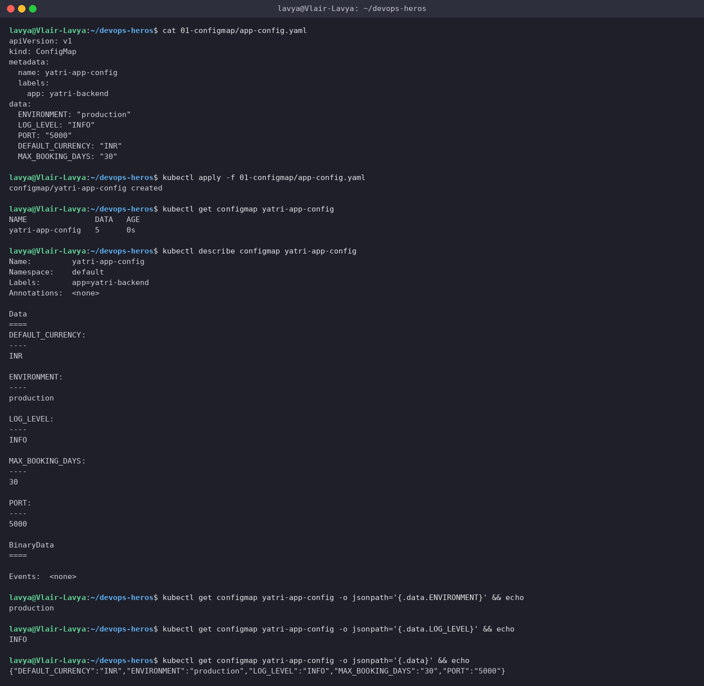

> Five plain-text keys, stored in etcd, completely separate from the container image. The same image can now run in `staging` or `production` just by pointing it at a different ConfigMap.

---

## Task 2: ConfigMap Live Update - Running Pods Do *Not* See It

Patch the ConfigMap in place, prove the running container still has the old value, then `rollout restart` to pick it up.

**Commands**
```bash
kubectl exec deploy/yatri-backend -- env | grep ENVIRONMENT
kubectl patch configmap yatri-app-config --type merge -p '{"data":{"ENVIRONMENT":"staging"}}'
kubectl get configmap yatri-app-config -o jsonpath='{.data.ENVIRONMENT}' && echo
kubectl exec deploy/yatri-backend -- env | grep ENVIRONMENT
kubectl rollout restart deployment/yatri-backend
kubectl rollout status deployment/yatri-backend
kubectl get pods -l app=yatri-backend
kubectl exec deploy/yatri-backend -- env | grep ENVIRONMENT
kubectl patch configmap yatri-app-config --type merge -p '{"data":{"ENVIRONMENT":"production"}}'
kubectl rollout restart deployment/yatri-backend
kubectl rollout status deployment/yatri-backend
kubectl exec deploy/yatri-backend -- env | grep ENVIRONMENT
```

**Output**
```text
$ kubectl exec deploy/yatri-backend -- env | grep ENVIRONMENT
ENVIRONMENT=production

$ kubectl patch configmap yatri-app-config --type merge -p '{"data":{"ENVIRONMENT":"staging"}}'
configmap/yatri-app-config patched

$ kubectl get configmap yatri-app-config -o jsonpath='{.data.ENVIRONMENT}' && echo
staging

# the ConfigMap changed, but the running container still has the old value:
$ kubectl exec deploy/yatri-backend -- env | grep ENVIRONMENT
ENVIRONMENT=production

$ kubectl rollout restart deployment/yatri-backend
deployment.apps/yatri-backend restarted

$ kubectl rollout status deployment/yatri-backend
Waiting for deployment "yatri-backend" rollout to finish: 1 out of 2 new replicas have been updated...
Waiting for deployment "yatri-backend" rollout to finish: 1 out of 2 new replicas have been updated...
Waiting for deployment "yatri-backend" rollout to finish: 1 out of 2 new replicas have been updated...
Waiting for deployment "yatri-backend" rollout to finish: 1 old replicas are pending termination...
Waiting for deployment "yatri-backend" rollout to finish: 1 old replicas are pending termination...
deployment "yatri-backend" successfully rolled out

$ kubectl get pods -l app=yatri-backend
NAME                             READY   STATUS        RESTARTS   AGE
yatri-backend-6c58cb99c7-p7n8q   1/1     Terminating   0          5s
yatri-backend-6c58cb99c7-qrh6r   1/1     Terminating   0          5s
yatri-backend-7b45b9dbfb-g6mr8   1/1     Running       0          2s
yatri-backend-7b45b9dbfb-q8lxf   1/1     Running       0          1s

$ kubectl exec deploy/yatri-backend -- env | grep ENVIRONMENT
ENVIRONMENT=staging

# revert for the rest of the labs
$ kubectl patch configmap yatri-app-config --type merge -p '{"data":{"ENVIRONMENT":"production"}}'
configmap/yatri-app-config patched

$ kubectl rollout restart deployment/yatri-backend
deployment.apps/yatri-backend restarted

$ kubectl rollout status deployment/yatri-backend
Waiting for deployment "yatri-backend" rollout to finish: 1 out of 2 new replicas have been updated...
Waiting for deployment "yatri-backend" rollout to finish: 1 out of 2 new replicas have been updated...
Waiting for deployment "yatri-backend" rollout to finish: 1 out of 2 new replicas have been updated...
Waiting for deployment "yatri-backend" rollout to finish: 1 old replicas are pending termination...
Waiting for deployment "yatri-backend" rollout to finish: 1 old replicas are pending termination...
deployment "yatri-backend" successfully rolled out

$ kubectl exec deploy/yatri-backend -- env | grep ENVIRONMENT
ENVIRONMENT=production
```

**Screenshot**

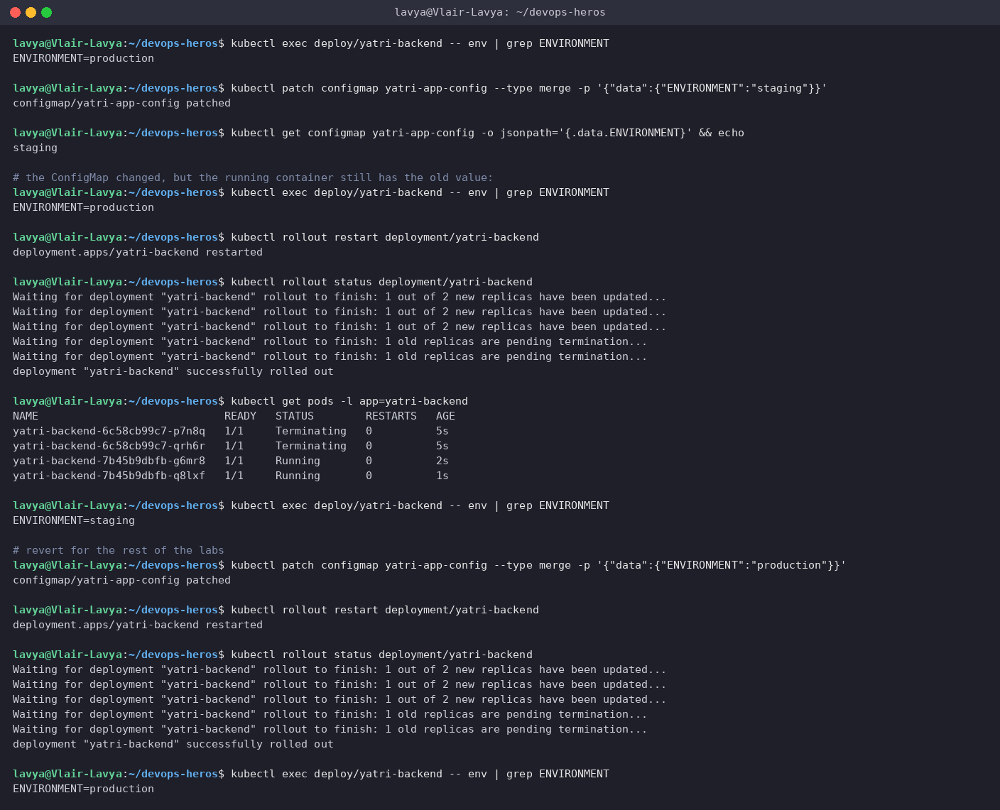

> Environment variables are copied into the process **once, at container start**. The ConfigMap said `staging` while the Pod still said `production` until new Pods were rolled out. `kubectl rollout restart` does this as a normal zero-downtime rolling update (new ReplicaSet `7b45b9dbfb` replaced `6c58cb99c7`). If you *need* live updates without a restart, mount the ConfigMap as a **volume** instead - the kubelet refreshes those files periodically - but env vars never change.

---

## Task 3: Secrets & Base64 Mechanics

Store database credentials in an `Opaque` Secret, see that `describe` masks them, and decode them on the CLI.

**Commands**
```bash
cat 02-secret/db-secret.yaml
kubectl apply -f 02-secret/db-secret.yaml
kubectl get secret yatri-db-secret
kubectl describe secret yatri-db-secret
kubectl get secret yatri-db-secret -o jsonpath='{.data.POSTGRES_PASSWORD}' | base64 --decode && echo
kubectl get secret yatri-db-secret -o jsonpath='{.data.POSTGRES_USER}' | base64 --decode && echo
kubectl get secret yatri-db-secret -o jsonpath='{.data.POSTGRES_DB}' | base64 --decode && echo
echo 'c2VjcmV0cGFzc3dvcmQ=' | base64 --decode && echo
```

**Output**
```text
$ cat 02-secret/db-secret.yaml
apiVersion: v1
kind: Secret
metadata:
  name: yatri-db-secret
  labels:
    app: yatri-backend
type: Opaque
data:
  # Base64 for 'yatri_admin' -> echo -n "yatri_admin" | base64
  POSTGRES_USER: eWF0cmlfYWRtaW4=
  # Base64 for 'secretpassword' -> echo -n "secretpassword" | base64
  POSTGRES_PASSWORD: c2VjcmV0cGFzc3dvcmQ=
  # Base64 for 'yatri_production_db' -> echo -n "yatri_production_db" | base64
  POSTGRES_DB: eWF0cmlfcHJvZHVjdGlvbl9kYg==

$ kubectl apply -f 02-secret/db-secret.yaml
secret/yatri-db-secret created

$ kubectl get secret yatri-db-secret
NAME              TYPE     DATA   AGE
yatri-db-secret   Opaque   3      1s

$ kubectl describe secret yatri-db-secret
Name:         yatri-db-secret
Namespace:    default
Labels:       app=yatri-backend
Annotations:  <none>

Type:  Opaque

Data
====
POSTGRES_DB:        19 bytes
POSTGRES_PASSWORD:  14 bytes
POSTGRES_USER:      11 bytes

$ kubectl get secret yatri-db-secret -o jsonpath='{.data.POSTGRES_PASSWORD}' | base64 --decode && echo
secretpassword

$ kubectl get secret yatri-db-secret -o jsonpath='{.data.POSTGRES_USER}' | base64 --decode && echo
yatri_admin

$ kubectl get secret yatri-db-secret -o jsonpath='{.data.POSTGRES_DB}' | base64 --decode && echo
yatri_production_db

# base64 is reversible by anyone who can read the object - it is encoding, not encryption
$ echo 'c2VjcmV0cGFzc3dvcmQ=' | base64 --decode && echo
secretpassword
```

**Screenshot**

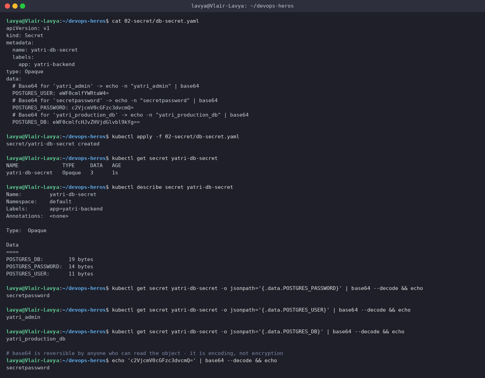

> `describe` only shows byte lengths, but `-o jsonpath | base64 --decode` gives the plaintext in one line. Base64 is there so arbitrary bytes fit in YAML/JSON - it is **encoding, not encryption**. The real protection for Secrets is RBAC (who may `get secrets`), etcd encryption at rest, and not committing them to git (Task 5).

---

## Task 4: The Trailing-Newline Gotcha

`echo` appends `\n`; `echo -n` does not. Encoding a password with the wrong one silently breaks authentication.

**Commands**
```bash
echo "secretpassword" | xxd
echo "secretpassword" | base64
echo -n "secretpassword" | xxd
echo -n "secretpassword" | base64
echo "Wrong (with newline): $(echo "secretpassword" | base64)"
echo "Right (no newline):   $(echo -n "secretpassword" | base64)"
echo "c2VjcmV0cGFzc3dvcmQK" | base64 --decode | xxd
echo "c2VjcmV0cGFzc3dvcmQ=" | base64 --decode | xxd
echo "c2VjcmV0cGFzc3dvcmQK" | base64 --decode | wc -c; echo "c2VjcmV0cGFzc3dvcmQ=" | base64 --decode | wc -c
grep POSTGRES_PASSWORD 02-secret/db-secret.yaml
kubectl create secret generic demo-secret --from-literal=password=secretpassword --dry-run=client -o yaml | grep password
```

**Output**
```text
$ echo "secretpassword" | xxd
00000000: 7365 6372 6574 7061 7373 776f 7264 0a    secretpassword.

$ echo "secretpassword" | base64
c2VjcmV0cGFzc3dvcmQK

$ echo -n "secretpassword" | xxd
00000000: 7365 6372 6574 7061 7373 776f 7264       secretpassword

$ echo -n "secretpassword" | base64
c2VjcmV0cGFzc3dvcmQ=

$ echo "Wrong (with newline): $(echo "secretpassword" | base64)"
Wrong (with newline): c2VjcmV0cGFzc3dvcmQK

$ echo "Right (no newline):   $(echo -n "secretpassword" | base64)"
Right (no newline):   c2VjcmV0cGFzc3dvcmQ=

# decoding both shows the extra byte:
$ echo "c2VjcmV0cGFzc3dvcmQK" | base64 --decode | xxd
00000000: 7365 6372 6574 7061 7373 776f 7264 0a    secretpassword.

$ echo "c2VjcmV0cGFzc3dvcmQ=" | base64 --decode | xxd
00000000: 7365 6372 6574 7061 7373 776f 7264       secretpassword

$ echo "c2VjcmV0cGFzc3dvcmQK" | base64 --decode | wc -c; echo "c2VjcmV0cGFzc3dvcmQ=" | base64 --decode | wc -c
15
14

# the value in the repo manifest is the clean one:
$ grep POSTGRES_PASSWORD 02-secret/db-secret.yaml
  POSTGRES_PASSWORD: c2VjcmV0cGFzc3dvcmQ=

# kubectl create secret encodes the exact bytes for you - the safest option:
$ kubectl create secret generic demo-secret --from-literal=password=secretpassword --dry-run=client -o yaml | grep password
  password: c2VjcmV0cGFzc3dvcmQ=
```

**Screenshot**

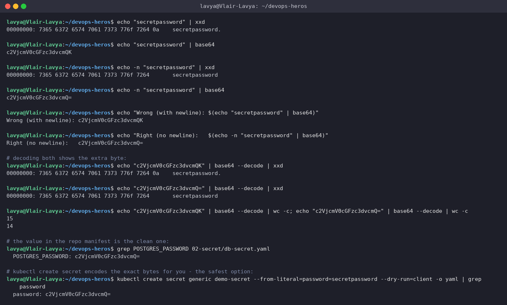

> The `xxd` dumps show the extra `0a` byte, and the encoded strings differ in their last characters: `...cmQK` (15 bytes, ends in a newline) vs `...cmQ=` (14 bytes). An app that reads `POSTGRES_PASSWORD` would send `secretpassword\n` to Postgres and get "password authentication failed" with no obvious reason. Safest options: `echo -n`, `printf '%s'`, or just let `kubectl create secret --from-literal` do the encoding - it encodes exactly the bytes you give it (last command above).

---

## Task 5: Enterprise Secret Management & CI/CD Integration

**Commands**
```bash
kubectl get crds | grep -i secret || echo 'Standard native secrets in use'
kubectl get secret yatri-db-secret -o yaml | grep -A3 '^data:'
```

**Output**
```text
$ kubectl get crds | grep -i secret || echo 'Standard native secrets in use'
No resources found
Standard native secrets in use

$ kubectl get secret yatri-db-secret -o yaml | grep -A3 '^data:'
data:
  POSTGRES_DB: eWF0cmlfcHJvZHVjdGlvbl9kYg==
  POSTGRES_PASSWORD: c2VjcmV0cGFzc3dvcmQ=
  POSTGRES_USER: eWF0cmlfYWRtaW4=

# everything above is plaintext-equivalent: anyone with 'get secret' RBAC, or a copy of the manifest in git, has the credentials
```

**Screenshot**

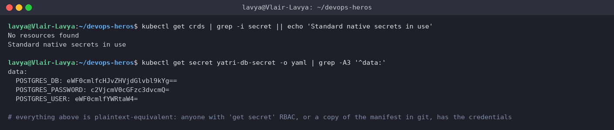

### Why `02-secret/db-secret.yaml` must never be committed to a real repo

- **Git never forgets.** Even after a "remove secret" commit, the value is in the history of every clone and fork, and in every CI cache that pulled the repo.
- **Base64 is not a lock.** Anyone with read access to the repo has the credential (Task 3 decoded it in one command).
- **No rotation.** A credential baked into a manifest gets rotated when someone remembers, which is never.
- **RBAC bypass.** You can carefully restrict `get secrets` in the cluster and still leak the value through the repo's read permissions.

### How production clusters do it

```text
   AWS Secrets Manager / Azure Key Vault / HashiCorp Vault      (single source of truth, audited, rotated)
                             │
                             │  operator authenticates with a cloud/workload identity, never a static key
                             ▼
              External Secrets Operator (ESO)  -or-  Vault Agent Injector / CSI Secrets Store driver
                             │
                             │  ExternalSecret CR:  "make a k8s Secret called yatri-db-secret from vault path db/yatri"
                             ▼
                    Kubernetes Secret (created and refreshed by the operator, never in git)
                             │
                             ▼
                 Pod  →  env.valueFrom.secretKeyRef  /  volume mount  (exactly what backend.yaml does today)
```

- **External Secrets Operator** watches `ExternalSecret` objects and keeps a matching Kubernetes `Secret` in sync with the external store on a refresh interval. Git holds only the *reference* (`remoteRef.key: prod/yatri/db`), never the value.
- **Vault Agent Injector / CSI driver** skip the Kubernetes Secret entirely and write the value straight into the Pod's filesystem at startup, using the Pod's ServiceAccount to authenticate.
- **Sealed Secrets / SOPS** are the "GitOps" variant: the *encrypted* secret is committed and only the controller in the cluster holds the key to decrypt it.

### CI/CD pipelines

- **GitHub Actions:** values live in *Settings → Secrets*, are injected at run time as `${{ secrets.DB_PASSWORD }}`, masked in logs, and used with `kubectl create secret ... --from-literal` or a Helm `--set`, so the manifest in the repo has no credential at all.
- **Azure DevOps:** *Variable Groups* linked to Key Vault, referenced as `$(DB_PASSWORD)` in the pipeline.
- Either way the manifest repo contains the *shape* of the secret (name, keys) and the pipeline or operator supplies the *values*.

---

## Task 6: ConfigMap + Secret Injection into One Pod

`04-full-demo/backend.yaml` bulk-imports the ConfigMap with `envFrom` and cherry-picks three keys from the Secret with `secretKeyRef`.

**Commands**
```bash
grep -n -A3 'envFrom:' 04-full-demo/backend.yaml
grep -n -B1 -A4 'secretKeyRef' 04-full-demo/backend.yaml | head -20
kubectl apply -f 04-full-demo/configmap.yaml
kubectl apply -f 04-full-demo/secret.yaml
kubectl apply -f 04-full-demo/backend.yaml
kubectl rollout status deployment/yatri-backend
kubectl exec deploy/yatri-backend -- env | grep -E 'ENVIRONMENT|LOG_LEVEL|POSTGRES|DEFAULT_CURRENCY|MAX_BOOKING|APP_PORT'
kubectl get svc yatri-backend-service
```

**Output**
```text
$ grep -n -A3 'envFrom:' 04-full-demo/backend.yaml
61:          envFrom:
62-            - configMapRef:
63-                name: yatri-app-config
64-          # Inject sensitive credentials from Secret

$ grep -n -B1 -A4 'secretKeyRef' 04-full-demo/backend.yaml | head -20
67-              valueFrom:
68:                secretKeyRef:
69-                  name: yatri-db-secret
70-                  key: POSTGRES_USER
71-            - name: POSTGRES_PASSWORD
72-              valueFrom:
73:                secretKeyRef:
74-                  name: yatri-db-secret
75-                  key: POSTGRES_PASSWORD
76-            - name: POSTGRES_DB
77-              valueFrom:
78:                secretKeyRef:
79-                  name: yatri-db-secret
80-                  key: POSTGRES_DB
81-          resources:
82-            requests:

$ kubectl apply -f 04-full-demo/configmap.yaml
configmap/yatri-app-config configured

$ kubectl apply -f 04-full-demo/secret.yaml
secret/yatri-db-secret configured

$ kubectl apply -f 04-full-demo/backend.yaml
deployment.apps/yatri-backend created
service/yatri-backend-service created

$ kubectl rollout status deployment/yatri-backend
Waiting for deployment "yatri-backend" rollout to finish: 0 of 2 updated replicas are available...
Waiting for deployment "yatri-backend" rollout to finish: 1 of 2 updated replicas are available...
deployment "yatri-backend" successfully rolled out

$ kubectl exec deploy/yatri-backend -- env | grep -E 'ENVIRONMENT|LOG_LEVEL|POSTGRES|DEFAULT_CURRENCY|MAX_BOOKING|APP_PORT'
POSTGRES_USER=yatri_admin
POSTGRES_PASSWORD=secretpassword
POSTGRES_DB=yatri_production_db
LOG_LEVEL=INFO
MAX_BOOKING_DAYS=30
APP_PORT=5000
DEFAULT_CURRENCY=INR
ENVIRONMENT=production

$ kubectl get svc yatri-backend-service
NAME                    TYPE        CLUSTER-IP     EXTERNAL-IP   PORT(S)   AGE
yatri-backend-service   ClusterIP   10.107.31.12   <none>        80/TCP    2s
```

**Screenshot**

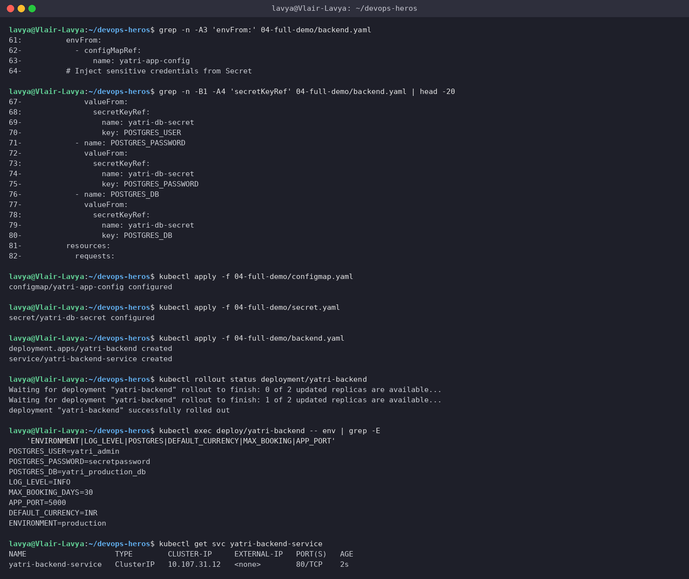

> Inside the container both sources are just environment variables - the app cannot tell which came from where. `envFrom.configMapRef` pulls in every key (`ENVIRONMENT`, `LOG_LEVEL`, `APP_PORT`, ...); `env[].valueFrom.secretKeyRef` maps one named key at a time, which keeps the sensitive surface explicit and small.

---

## Task 7: Ingress Resource vs Ingress Controller

**Commands**
```bash
kubectl api-resources | grep -i ingress
kubectl get pods -A -l app.kubernetes.io/name=ingress-nginx 2>/dev/null; echo '(no controller pods yet - the Ingress API exists, but nothing is implementing it)'
```

**Output**
```text
$ kubectl api-resources | grep -i ingress
ingressclasses                                   networking.k8s.io/v1              false        IngressClass
ingresses                           ing          networking.k8s.io/v1              true         Ingress

$ kubectl get pods -A -l app.kubernetes.io/name=ingress-nginx 2>/dev/null; echo '(no controller pods yet - the Ingress API exists, but nothing is implementing it)'
(no controller pods yet - the Ingress API exists, but nothing is implementing it)
```

**Screenshot**

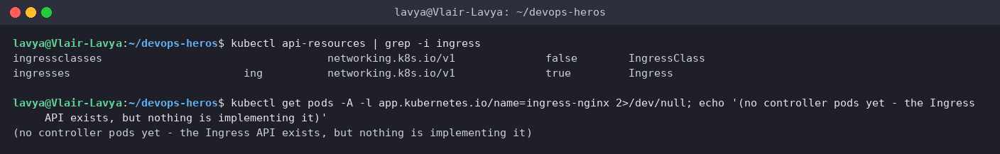

| | **Ingress (resource)** | **Ingress Controller** |
| --- | --- | --- |
| What it is | A Kubernetes API object (`networking.k8s.io/v1`) | A running reverse proxy (NGINX, Traefik, HAProxy, Envoy/Contour...) plus a control loop |
| Contains | Hostnames, paths, TLS secret names, target Service + port | The actual listeners on `:80` / `:443` |
| Does on its own | Nothing - it is a declaration | Watches the API for Ingress objects, renders them into `nginx.conf`, reloads, and forwards real traffic |
| Ships with Kubernetes? | Yes (the API exists on every cluster - first command above) | No - you install one; before I enabled the addon there were no controller Pods at all |
| Which one handles a given Ingress | Selected by `spec.ingressClassName` (`nginx` here) | Registers an `IngressClass` and claims matching Ingresses |

```text
kubectl apply ingress.yaml ──► API server / etcd ──► [Ingress Controller watch loop] ──► writes nginx.conf ──► nginx reload
                                                                                                      │
   client ──► :80/:443 on the controller Pod ──► host/path match ──► Service ──► Pod ◄────────────────┘
```

An Ingress without a controller is like a Deployment without a kubelet - a valid object that nothing acts on.

---

## Task 8: Enabling the NGINX Ingress Controller

**Commands**
```bash
minikube addons enable ingress
kubectl get pods -n ingress-nginx
kubectl wait --namespace ingress-nginx --for=condition=ready pod --selector=app.kubernetes.io/component=controller --timeout=180s
kubectl get pods -n ingress-nginx
kubectl get service -n ingress-nginx
kubectl get ingressclass
```

**Output**
```text
$ minikube addons enable ingress
* ingress is an addon maintained by Kubernetes. For any concerns contact minikube on GitHub.
You can view the list of minikube maintainers at: https://github.com/kubernetes/minikube/blob/master/OWNERS
  - Using image registry.k8s.io/ingress-nginx/kube-webhook-certgen:v1.6.9
  - Using image registry.k8s.io/ingress-nginx/controller:v1.15.1
  - Using image registry.k8s.io/ingress-nginx/kube-webhook-certgen:v1.6.9
* Verifying ingress addon...
* The 'ingress' addon is enabled

$ kubectl get pods -n ingress-nginx
NAME                                       READY   STATUS      RESTARTS   AGE
ingress-nginx-admission-create-xlnr8       0/1     Completed   0          42s
ingress-nginx-admission-patch-7md9j        0/1     Completed   0          42s
ingress-nginx-controller-d7cd8c989-cfdjp   0/1     Running     0          42s

$ kubectl wait --namespace ingress-nginx --for=condition=ready pod --selector=app.kubernetes.io/component=controller --timeout=180s
pod/ingress-nginx-controller-d7cd8c989-cfdjp condition met

$ kubectl get pods -n ingress-nginx
NAME                                       READY   STATUS      RESTARTS   AGE
ingress-nginx-admission-create-xlnr8       0/1     Completed   0          54s
ingress-nginx-admission-patch-7md9j        0/1     Completed   0          54s
ingress-nginx-controller-d7cd8c989-cfdjp   1/1     Running     0          54s

$ kubectl get service -n ingress-nginx
NAME                                 TYPE        CLUSTER-IP      EXTERNAL-IP   PORT(S)                      AGE
ingress-nginx-controller             NodePort    10.102.68.230   <none>        80:32765/TCP,443:30264/TCP   54s
ingress-nginx-controller-admission   ClusterIP   10.101.147.89   <none>        443/TCP                      54s

$ kubectl get ingressclass
NAME              CONTROLLER             PARAMETERS   AGE
nginx (default)   k8s.io/ingress-nginx   <none>       54s
```

**Screenshot**

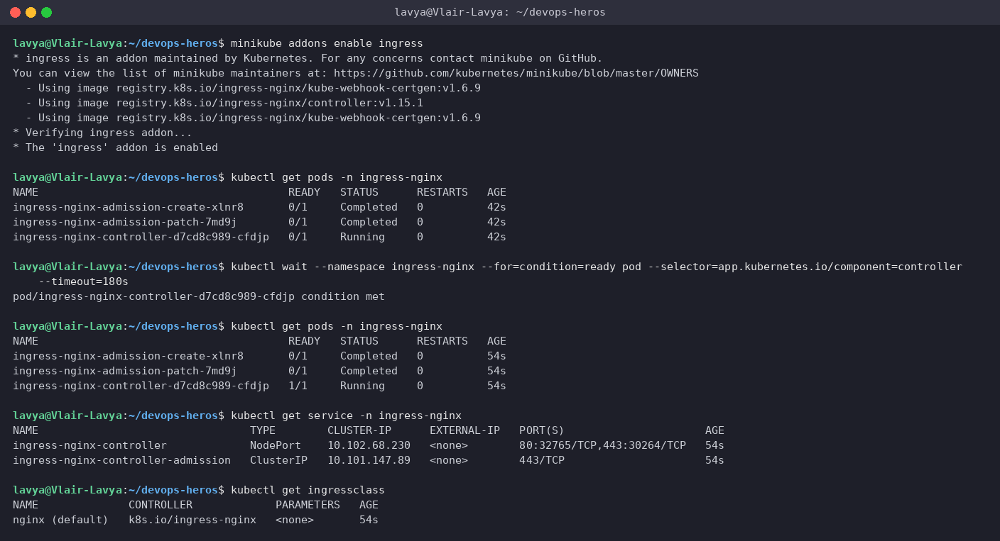

> The addon creates the `ingress-nginx` namespace, two one-shot `admission-*` Jobs that generate the webhook certificate, and the controller Deployment. `kubectl wait` blocks until the controller passes its readiness probe (`condition met`). On minikube the controller is published as a NodePort Service **and** bound directly to `:80`/`:443` on the node, which is why `http://192.168.49.2/` works without a port number in the next tasks.

---

## Task 9: Local DNS via `/etc/hosts`

Map `yatri.local` to the minikube IP so a browser or curl can use a real hostname.

**Commands**
```bash
MINIKUBE_IP=$(minikube ip); echo "Minikube IP is: $MINIKUBE_IP"
grep -q 'yatri.local' /etc/hosts || echo "192.168.49.2  yatri.local" | sudo tee -a /etc/hosts
grep yatri.local /etc/hosts
getent hosts yatri.local
curl -sI http://yatri.local/ | head -1
```

**Output**
```text
$ MINIKUBE_IP=$(minikube ip); echo "Minikube IP is: $MINIKUBE_IP"
Minikube IP is: 192.168.49.2

$ grep -q 'yatri.local' /etc/hosts || echo "192.168.49.2  yatri.local" | sudo tee -a /etc/hosts
192.168.49.2  yatri.local

$ grep yatri.local /etc/hosts
192.168.49.2  yatri.local

$ getent hosts yatri.local
192.168.49.2    yatri.local

$ curl -sI http://yatri.local/ | head -1
HTTP/1.1 404 Not Found
```

**Screenshot**

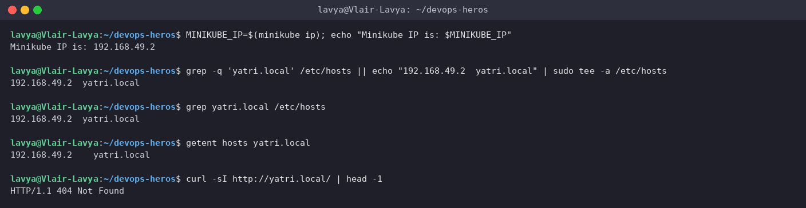

> `getent hosts yatri.local` proves the OS resolver now returns `192.168.49.2`. The `404 Not Found` at the end is *good news*: the request reached the NGINX controller, which just has no rule for `yatri.local` yet. (On WSL2 `/etc/hosts` is regenerated on restart, so this entry is temporary.)

---

## Task 10: Layer 7 Path-Based Routing

One host, two paths: `/` → frontend (nginx), `/api/...` → backend (Python), with the `/api` prefix stripped by `rewrite-target: /$2`.

**Commands**
```bash
grep -E 'rewrite-target|use-regex|path:|name: yatri' 04-full-demo/ingress.yaml
kubectl apply -f 04-full-demo/frontend.yaml
kubectl apply -f 04-full-demo/backend.yaml
kubectl apply -f 04-full-demo/ingress.yaml
kubectl get ingress yatri-ingress
kubectl describe ingress yatri-ingress
curl -s http://yatri.local/ | grep -i '<title>'
curl -s http://yatri.local/api/
curl -s http://yatri.local/api/anything -o /dev/null -w 'HTTP %{http_code} for /api/anything (rewritten to /anything on the backend)\n'
```

**Output**
```text
$ grep -E 'rewrite-target|use-regex|path:|name: yatri' 04-full-demo/ingress.yaml
  name: yatri-ingress
    nginx.ingress.kubernetes.io/use-regex: "true"
    nginx.ingress.kubernetes.io/rewrite-target: /$2
          - path: /api(/|$)(.*)
                name: yatri-backend-service
          - path: /
                name: yatri-frontend-service

$ kubectl apply -f 04-full-demo/frontend.yaml
deployment.apps/yatri-frontend created
service/yatri-frontend-service created

$ kubectl apply -f 04-full-demo/backend.yaml
deployment.apps/yatri-backend unchanged
service/yatri-backend-service unchanged

$ kubectl apply -f 04-full-demo/ingress.yaml
ingress.networking.k8s.io/yatri-ingress created

$ kubectl get ingress yatri-ingress
NAME            CLASS   HOSTS         ADDRESS   PORTS   AGE
yatri-ingress   nginx   yatri.local             80      9s

$ kubectl describe ingress yatri-ingress
Name:             yatri-ingress
Labels:           app=yatri-app
Namespace:        default
Address:
Ingress Class:    nginx
Default backend:  <default>
Rules:
  Host         Path  Backends
  ----         ----  --------
  yatri.local
               /api(/|$)(.*)   yatri-backend-service:80 (10.244.0.105:5000,10.244.0.106:5000)
               /               yatri-frontend-service:80 (10.244.0.111:80,10.244.0.110:80)
Annotations:   nginx.ingress.kubernetes.io/rewrite-target: /$2
               nginx.ingress.kubernetes.io/ssl-redirect: false
               nginx.ingress.kubernetes.io/use-regex: true
Events:
  Type    Reason  Age   From                      Message
  ----    ------  ----  ----                      -------
  Normal  Sync    9s    nginx-ingress-controller  Scheduled for sync

$ curl -s http://yatri.local/ | grep -i '<title>'
<title>Welcome to nginx!</title>

$ curl -s http://yatri.local/api/
Yatri Backend API
=================
ENVIRONMENT     : production
LOG_LEVEL       : INFO
DEFAULT_CURRENCY: INR
POSTGRES_USER   : yatri_admin
POSTGRES_DB     : yatri_production_db

$ curl -s http://yatri.local/api/anything -o /dev/null -w 'HTTP %{http_code} for /api/anything (rewritten to /anything on the backend)\n'
HTTP 200 for /api/anything (rewritten to /anything on the backend)
```

**Screenshot**

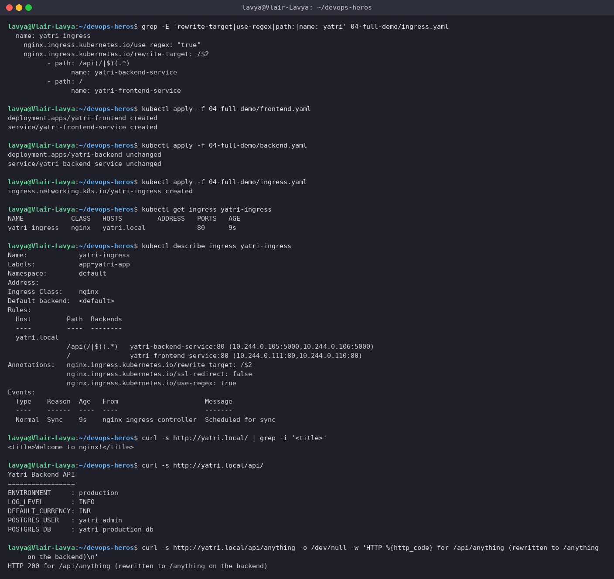

> `describe ingress` shows the routing table the controller built, including the live Pod IPs behind each Service. The regex `/api(/|$)(.*)` captures everything after `/api/` into group 2, and `rewrite-target: /$2` forwards `/api/anything` to the backend as `/anything` - the backend never has to know it lives under `/api`.

---

## Task 11: Virtual-Host (Subdomain) Routing

Same IP, two hostnames: `portal.campus.local` → frontend, `api.campus.local` → backend.

**Commands**
```bash
grep -E 'host:|path:|name: yatri' 03-ingress/ingress-tls.yaml
echo "192.168.49.2  portal.campus.local api.campus.local" | sudo tee -a /etc/hosts
grep campus.local /etc/hosts
curl -sk https://portal.campus.local/ | grep -i '<title>'
curl -sk https://api.campus.local/api/
curl -sk -H 'Host: portal.campus.local' https://192.168.49.2/ | grep -i '<title>'
curl -sk -H 'Host: api.campus.local' https://192.168.49.2/api/ | head -3
curl -sk -H 'Host: unknown.campus.local' https://192.168.49.2/ -o /dev/null -w 'HTTP %{http_code}\n'
```

**Output**
```text
$ grep -E 'host:|path:|name: yatri' 03-ingress/ingress-tls.yaml
    - host: portal.campus.local
          - path: /()(.*)
                name: yatri-frontend-service
    - host: api.campus.local
          - path: /api(/|$)(.*)
                name: yatri-backend-service

$ echo "192.168.49.2  portal.campus.local api.campus.local" | sudo tee -a /etc/hosts
192.168.49.2  portal.campus.local api.campus.local

$ grep campus.local /etc/hosts
192.168.49.2  portal.campus.local api.campus.local

$ curl -sk https://portal.campus.local/ | grep -i '<title>'
<title>Welcome to nginx!</title>

$ curl -sk https://api.campus.local/api/
Yatri Backend API
=================
ENVIRONMENT     : production
LOG_LEVEL       : INFO
DEFAULT_CURRENCY: INR
POSTGRES_USER   : yatri_admin
POSTGRES_DB     : yatri_production_db

# same IP, different Host header -> different backend; a host with no matching rule gets the controller default 404:
$ curl -sk -H 'Host: portal.campus.local' https://192.168.49.2/ | grep -i '<title>'
<title>Welcome to nginx!</title>

$ curl -sk -H 'Host: api.campus.local' https://192.168.49.2/api/ | head -3
Yatri Backend API
=================
ENVIRONMENT     : production

$ curl -sk -H 'Host: unknown.campus.local' https://192.168.49.2/ -o /dev/null -w 'HTTP %{http_code}\n'
HTTP 404
```

**Screenshot**

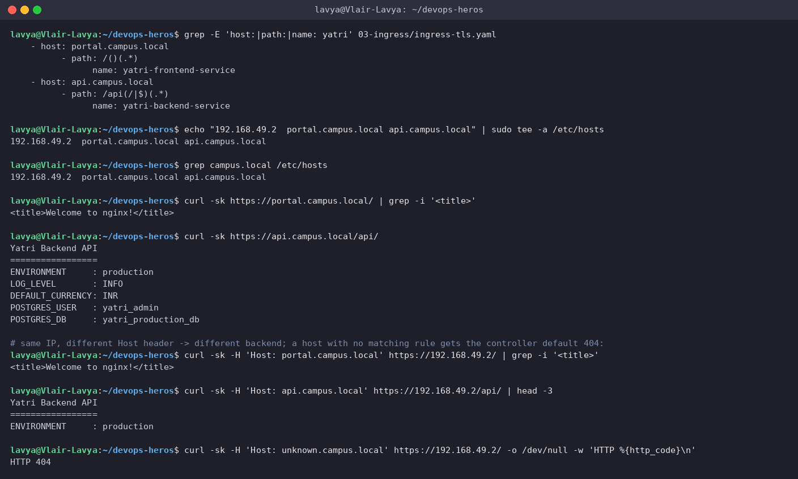

> The controller picks the rule purely from the HTTP `Host` header - the last three requests all go to `192.168.49.2` and only the header differs. An unknown host falls through to the controller's default backend and gets `404`. (`https` + `-k` because `ingress-tls.yaml` has `ssl-redirect: "true"`, see Task 13.)

---

## Task 12: Hybrid Routing - Host *and* Path in One Ingress

**Commands**
```bash
kubectl get ingress
kubectl describe ingress campus-ingress-tls
curl -sk https://portal.campus.local/ -o /dev/null -w 'portal.campus.local/      -> HTTP %{http_code}\n'
curl -sk https://api.campus.local/api/ -o /dev/null -w 'api.campus.local/api/     -> HTTP %{http_code}\n'
curl -sk https://api.campus.local/ -o /dev/null -w 'api.campus.local/         -> HTTP %{http_code} (no rule for / on the api host)\n'
curl -sk https://portal.campus.local/api/ -o /dev/null -w 'portal.campus.local/api/  -> HTTP %{http_code} (goes to frontend, nginx has no /api page)\n'
```

**Output**
```text
$ kubectl get ingress
NAME                 CLASS   HOSTS                                  ADDRESS   PORTS     AGE
campus-ingress-tls   nginx   portal.campus.local,api.campus.local             80, 443   9s
yatri-ingress        nginx   yatri.local                                      80        19s

$ kubectl describe ingress campus-ingress-tls
Name:             campus-ingress-tls
Labels:           <none>
Namespace:        default
Address:
Ingress Class:    nginx
Default backend:  <default>
TLS:
  campus-tls-cert terminates portal.campus.local,api.campus.local
Rules:
  Host                 Path  Backends
  ----                 ----  --------
  portal.campus.local
                       /()(.*)   yatri-frontend-service:80 (10.244.0.111:80,10.244.0.110:80)
  api.campus.local
                       /api(/|$)(.*)   yatri-backend-service:80 (10.244.0.105:5000,10.244.0.106:5000)
Annotations:           nginx.ingress.kubernetes.io/rewrite-target: /$2
                       nginx.ingress.kubernetes.io/ssl-redirect: true
Events:
  Type    Reason  Age   From                      Message
  ----    ------  ----  ----                      -------
  Normal  Sync    9s    nginx-ingress-controller  Scheduled for sync

$ curl -sk https://portal.campus.local/ -o /dev/null -w 'portal.campus.local/      -> HTTP %{http_code}\n'
portal.campus.local/      -> HTTP 200

$ curl -sk https://api.campus.local/api/ -o /dev/null -w 'api.campus.local/api/     -> HTTP %{http_code}\n'
api.campus.local/api/     -> HTTP 200

$ curl -sk https://api.campus.local/ -o /dev/null -w 'api.campus.local/         -> HTTP %{http_code} (no rule for / on the api host)\n'
api.campus.local/         -> HTTP 404 (no rule for / on the api host)

$ curl -sk https://portal.campus.local/api/ -o /dev/null -w 'portal.campus.local/api/  -> HTTP %{http_code} (goes to frontend, nginx has no /api page)\n'
portal.campus.local/api/  -> HTTP 404 (goes to frontend, nginx has no /api page)
```

**Screenshot**

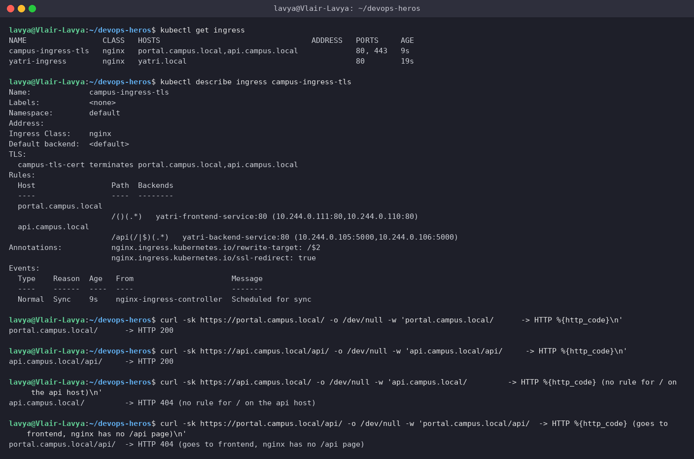

> `campus-ingress-tls` carries two hosts, each with its own path rule, plus a TLS block - all in one object. The four probes show the isolation: `portal/` and `api/api/` are `200`, while `api/` (no rule for `/` on that host) and `portal/api/` (routed to the frontend, which has no such page) are `404`. Both Ingresses (`yatri-ingress` from Task 10 and this one) coexist on the same controller because their hosts differ.

---

## Task 13: TLS Termination at the Ingress

Generate a self-signed certificate, store it in a `kubernetes.io/tls` Secret, reference it from `spec.tls`, and verify HTTPS.

**Commands**
```bash
openssl req -x509 -nodes -days 365 -newkey rsa:2048 -keyout tls.key -out tls.crt -subj '/CN=campus.local/O=CampusDevOps' 2>/dev/null; ls -l tls.key tls.crt
openssl x509 -in tls.crt -noout -subject -issuer -dates
kubectl create secret tls campus-tls-cert --cert=tls.crt --key=tls.key
kubectl get secret campus-tls-cert
grep -A4 'tls:' 03-ingress/ingress-tls.yaml
kubectl apply -f 03-ingress/ingress-tls.yaml
curl -k -v --resolve portal.campus.local:443:192.168.49.2 https://portal.campus.local/ 2>&1 | grep -E 'subject:|issuer:|^< HTTP/'
kubectl logs -n ingress-nginx -l app.kubernetes.io/component=controller --tail=200 | grep -i 'certificate' | grep -i campus | tail -2
openssl req -x509 -nodes -days 365 -newkey rsa:2048 -keyout tls.key -out tls.crt -subj '/CN=campus.local/O=CampusDevOps' -addext 'subjectAltName=DNS:campus.local,DNS:portal.campus.local,DNS:api.campus.local' 2>/dev/null
openssl x509 -in tls.crt -noout -subject -ext subjectAltName
kubectl delete secret campus-tls-cert
kubectl create secret tls campus-tls-cert --cert=tls.crt --key=tls.key
kubectl describe secret campus-tls-cert | grep -A3 '^Data'
kubectl get ingress campus-ingress-tls
curl -k -v --resolve portal.campus.local:443:192.168.49.2 https://portal.campus.local/ 2>&1 | grep -E 'subject:|issuer:|SSL connection|^< HTTP/'
curl -k -s --resolve portal.campus.local:443:192.168.49.2 https://portal.campus.local/ | grep -i '<title>'
curl -k -v --resolve api.campus.local:443:192.168.49.2 https://api.campus.local/api/ 2>&1 | grep -E 'subject:|^< HTTP/'
curl -k -s --resolve api.campus.local:443:192.168.49.2 https://api.campus.local/api/ | head -3
curl -sI --resolve portal.campus.local:80:192.168.49.2 http://portal.campus.local/ | grep -E 'HTTP/|Location'
```

**Output**
```text
# first attempt - exactly as in the assignment (CN only):
$ openssl req -x509 -nodes -days 365 -newkey rsa:2048 -keyout tls.key -out tls.crt -subj '/CN=campus.local/O=CampusDevOps' 2>/dev/null; ls -l tls.key tls.crt
-rwxrwxrwx 1 lavya lavya 1184 Sep 17 21:25 tls.crt
-rwxrwxrwx 1 lavya lavya 1708 Sep 17 21:25 tls.key

$ openssl x509 -in tls.crt -noout -subject -issuer -dates
subject=CN=campus.local, O=CampusDevOps
issuer=CN=campus.local, O=CampusDevOps
notBefore=Sep 17 21:25:59 2026 GMT
notAfter=Sep 17 21:25:59 2027 GMT

$ kubectl create secret tls campus-tls-cert --cert=tls.crt --key=tls.key
secret/campus-tls-cert created

$ kubectl get secret campus-tls-cert
NAME              TYPE                DATA   AGE
campus-tls-cert   kubernetes.io/tls   2      0s

$ grep -A4 'tls:' 03-ingress/ingress-tls.yaml
  tls:
    - hosts:
        - portal.campus.local
        - api.campus.local
      secretName: campus-tls-cert

$ kubectl apply -f 03-ingress/ingress-tls.yaml
ingress.networking.k8s.io/campus-ingress-tls created

$ curl -k -v --resolve portal.campus.local:443:192.168.49.2 https://portal.campus.local/ 2>&1 | grep -E 'subject:|issuer:|^< HTTP/'
*   subject: O=Acme Co; CN=Kubernetes Ingress Controller Fake Certificate
*   issuer: O=Acme Co; CN=Kubernetes Ingress Controller Fake Certificate
< HTTP/2 200

# the handshake works but nginx served its built-in fake certificate, not ours. The controller log says why:
$ kubectl logs -n ingress-nginx -l app.kubernetes.io/component=controller --tail=200 | grep -i 'certificate' | grep -i campus | tail -2
W0917 21:26:03.865907       7 controller.go:1482] Unexpected error validating SSL certificate "default/campus-tls-cert" for server "api.campus.local": x509: certificate is not valid for any names, but wanted to match api.campus.local
W0917 21:26:03.865917       7 controller.go:1488] SSL certificate "default/campus-tls-cert" does not contain a Common Name or Subject Alternative Name for server "api.campus.local": x509: certificate is not valid for any names, but wanted to match api.campus.local

# a CN of campus.local does not cover portal.campus.local / api.campus.local - modern TLS needs SubjectAltNames.
# second attempt - same command plus SANs for both hosts:
$ openssl req -x509 -nodes -days 365 -newkey rsa:2048 -keyout tls.key -out tls.crt -subj '/CN=campus.local/O=CampusDevOps' -addext 'subjectAltName=DNS:campus.local,DNS:portal.campus.local,DNS:api.campus.local' 2>/dev/null

$ openssl x509 -in tls.crt -noout -subject -ext subjectAltName
subject=CN=campus.local, O=CampusDevOps
X509v3 Subject Alternative Name:
    DNS:campus.local, DNS:portal.campus.local, DNS:api.campus.local

$ kubectl delete secret campus-tls-cert
secret "campus-tls-cert" deleted from default namespace

$ kubectl create secret tls campus-tls-cert --cert=tls.crt --key=tls.key
secret/campus-tls-cert created

$ kubectl describe secret campus-tls-cert | grep -A3 '^Data'
Data
====
tls.crt:  1273 bytes
tls.key:  1704 bytes

$ kubectl get ingress campus-ingress-tls
NAME                 CLASS   HOSTS                                  ADDRESS   PORTS     AGE
campus-ingress-tls   nginx   portal.campus.local,api.campus.local             80, 443   24s

$ curl -k -v --resolve portal.campus.local:443:192.168.49.2 https://portal.campus.local/ 2>&1 | grep -E 'subject:|issuer:|SSL connection|^< HTTP/'
* SSL connection using TLSv1.3 / TLS_AES_256_GCM_SHA384 / X25519MLKEM768 / RSASSA-PSS
*   subject: CN=campus.local; O=CampusDevOps
*   issuer: CN=campus.local; O=CampusDevOps
< HTTP/2 200

$ curl -k -s --resolve portal.campus.local:443:192.168.49.2 https://portal.campus.local/ | grep -i '<title>'
<title>Welcome to nginx!</title>

$ curl -k -v --resolve api.campus.local:443:192.168.49.2 https://api.campus.local/api/ 2>&1 | grep -E 'subject:|^< HTTP/'
*   subject: CN=campus.local; O=CampusDevOps
< HTTP/2 200

$ curl -k -s --resolve api.campus.local:443:192.168.49.2 https://api.campus.local/api/ | head -3
Yatri Backend API
=================
ENVIRONMENT     : production

# plain HTTP is redirected to HTTPS by the ssl-redirect annotation:
$ curl -sI --resolve portal.campus.local:80:192.168.49.2 http://portal.campus.local/ | grep -E 'HTTP/|Location'
HTTP/1.1 308 Permanent Redirect
Location: https://portal.campus.local

# TLS is terminated at the ingress controller; the pods behind it still speak plain HTTP on 80/5000
```

**Screenshot**


> **What I ran into:** the certificate from the assignment's exact `openssl` command has only `CN=campus.local`. The handshake worked, but curl reported the issuer as `Kubernetes Ingress Controller Fake Certificate` - the controller had silently fallen back to its default cert, and its log explained why: *"certificate is not valid for any names, but wanted to match api.campus.local"*. Modern TLS (and ingress-nginx) ignores the CN and needs the hostnames in **SubjectAltName**. Re-issuing with `-addext 'subjectAltName=DNS:...'` fixed it: `subject: CN=campus.local; O=CampusDevOps` over `TLSv1.3` / `HTTP/2 200`.
>
> The `308` on plain HTTP is the `ssl-redirect` annotation. TLS ends at the controller; the frontend and backend Pods still receive plain HTTP on `80` and `5000` - one certificate to manage instead of one per service.

---

## Task 14: End-to-End Demo - `run-demo.sh` / `cleanup.sh`

Deploy the whole Session 12 stack with the provided script, verify it, tear it down with the cleanup script.

**Commands**
```bash
grep -c '^---' 04-full-demo/backend.yaml 04-full-demo/frontend.yaml
grep -E '^kind:|^  name:' 04-full-demo/backend.yaml
bash 04-full-demo/run-demo.sh
kubectl get configmap,secret,ingress,deploy,svc,pods -l app=yatri-app
kubectl get deploy,svc,pods -l 'app in (yatri-frontend,yatri-backend)'
curl -s --max-time 10 http://yatri.local/ | grep -i '<title>'
curl -s --max-time 10 http://yatri.local/api/
bash 04-full-demo/cleanup.sh
kubectl get ingress yatri-ingress || echo 'Ingress deleted'
kubectl get deployment yatri-backend yatri-frontend || echo 'Deployments deleted'
kubectl get all
```

**Output**
```text
$ grep -c '^---' 04-full-demo/backend.yaml 04-full-demo/frontend.yaml
04-full-demo/backend.yaml:2
04-full-demo/frontend.yaml:2

$ grep -E '^kind:|^  name:' 04-full-demo/backend.yaml
kind: Deployment
  name: yatri-backend
kind: Service
  name: yatri-backend-service

# starting from a clean cluster so the script performs a real deploy
$ bash 04-full-demo/run-demo.sh
[INFO] Step 1: Enabling NGINX Ingress Controller on Minikube...
* ingress is an addon maintained by Kubernetes. For any concerns contact minikube on GitHub.
You can view the list of minikube maintainers at: https://github.com/kubernetes/minikube/blob/master/OWNERS
  - Using image registry.k8s.io/ingress-nginx/controller:v1.15.1
  - Using image registry.k8s.io/ingress-nginx/kube-webhook-certgen:v1.6.9
  - Using image registry.k8s.io/ingress-nginx/kube-webhook-certgen:v1.6.9
* Verifying ingress addon...
* The 'ingress' addon is enabled
[INFO] Waiting 30 seconds for Ingress Controller pods to become Ready...
pod/ingress-nginx-controller-5479f5f4f-lr8jm condition met
[INFO] Ingress Controller is Ready.

[INFO] Step 2: Applying ConfigMap (plain-text configuration)...
configmap/yatri-app-config created
NAME               DATA   AGE
yatri-app-config   5      0s

[INFO] Step 3: Applying Secret (sensitive database credentials)...
secret/yatri-db-secret created
NAME              TYPE     DATA   AGE
yatri-db-secret   Opaque   3      0s

[INFO] Step 4: Deploying Frontend (Nginx) + ClusterIP Service...
deployment.apps/yatri-frontend created
service/yatri-frontend-service created

[INFO] Step 5: Deploying Backend (Python HTTP server) + ClusterIP Service...
deployment.apps/yatri-backend created
service/yatri-backend-service created

[INFO] Step 6: Waiting for all pods to reach Running state...
Waiting for deployment "yatri-frontend" rollout to finish: 0 of 2 updated replicas are available...
Waiting for deployment "yatri-frontend" rollout to finish: 1 of 2 updated replicas are available...
deployment "yatri-frontend" successfully rolled out
deployment "yatri-backend" successfully rolled out

[INFO] Step 7: Applying Ingress routing rules...
ingress.networking.k8s.io/yatri-ingress created

[INFO] Step 8: Summary of deployed resources...
NAME               DATA   AGE
yatri-app-config   5      3s
NAME              TYPE     DATA   AGE
yatri-db-secret   Opaque   3      3s
NAME                             READY   STATUS    RESTARTS   AGE
yatri-frontend-ddcfc4b5f-hx8d8   1/1     Running   0          2s
yatri-frontend-ddcfc4b5f-hxvql   1/1     Running   0          2s
NAME                             READY   STATUS    RESTARTS   AGE
yatri-backend-6c58cb99c7-4rrld   1/1     Running   0          2s
yatri-backend-6c58cb99c7-xmztw   1/1     Running   0          2s
NAME                     TYPE        CLUSTER-IP       EXTERNAL-IP   PORT(S)   AGE
yatri-frontend-service   ClusterIP   10.97.213.54     <none>        80/TCP    3s
yatri-backend-service    ClusterIP   10.106.234.203   <none>        80/TCP    3s
NAME            CLASS   HOSTS         ADDRESS   PORTS   AGE
yatri-ingress   nginx   yatri.local             80      2s

[INFO] Step 9: Adding yatri.local to /etc/hosts (requires sudo)...
[INFO] Minikube IP detected: 192.168.49.2
[INFO] yatri.local already exists in /etc/hosts. Skipping.

[INFO] ============================================================
[INFO] Demo is READY. Test with the following commands:

  Test FRONTEND (path: /):
    curl http://yatri.local
    OR open http://yatri.local in your browser

  Test BACKEND API (path: /api/) -- shows ConfigMap + Secret values:
    curl http://yatri.local/api/

  Verify environment variable injection inside backend pod:
    kubectl exec -it deploy/yatri-backend -- env | grep -E 'ENVIRONMENT|LOG_LEVEL|POSTGRES'

  Decode Secret password:
    kubectl get secret yatri-db-secret -o jsonpath='{.data.POSTGRES_PASSWORD}' | base64 --decode
[INFO] ============================================================

$ kubectl get configmap,secret,ingress,deploy,svc,pods -l app=yatri-app
NAME                         DATA   AGE
configmap/yatri-app-config   5      10s

NAME                     TYPE     DATA   AGE
secret/yatri-db-secret   Opaque   3      10s

NAME                                      CLASS   HOSTS         ADDRESS   PORTS   AGE
ingress.networking.k8s.io/yatri-ingress   nginx   yatri.local             80      8s

$ kubectl get deploy,svc,pods -l 'app in (yatri-frontend,yatri-backend)'
NAME                             READY   UP-TO-DATE   AVAILABLE   AGE
deployment.apps/yatri-backend    2/2     2            2           9s
deployment.apps/yatri-frontend   2/2     2            2           9s

NAME                             TYPE        CLUSTER-IP       EXTERNAL-IP   PORT(S)   AGE
service/yatri-backend-service    ClusterIP   10.106.234.203   <none>        80/TCP    9s
service/yatri-frontend-service   ClusterIP   10.97.213.54     <none>        80/TCP    9s

NAME                                 READY   STATUS    RESTARTS   AGE
pod/yatri-backend-6c58cb99c7-4rrld   1/1     Running   0          9s
pod/yatri-backend-6c58cb99c7-xmztw   1/1     Running   0          9s
pod/yatri-frontend-ddcfc4b5f-hx8d8   1/1     Running   0          9s
pod/yatri-frontend-ddcfc4b5f-hxvql   1/1     Running   0          9s

$ curl -s --max-time 10 http://yatri.local/ | grep -i '<title>'
<title>Welcome to nginx!</title>

$ curl -s --max-time 10 http://yatri.local/api/
Yatri Backend API
=================
ENVIRONMENT     : production
LOG_LEVEL       : INFO
DEFAULT_CURRENCY: INR
POSTGRES_USER   : yatri_admin
POSTGRES_DB     : yatri_production_db

$ bash 04-full-demo/cleanup.sh
[INFO] Deleting Ingress...
ingress.networking.k8s.io "yatri-ingress" deleted from default namespace
[INFO] Deleting Backend Deployment and Service...
deployment.apps "yatri-backend" deleted from default namespace
service "yatri-backend-service" deleted from default namespace
[INFO] Deleting Frontend Deployment and Service...
deployment.apps "yatri-frontend" deleted from default namespace
service "yatri-frontend-service" deleted from default namespace
[INFO] Deleting Secret...
secret "yatri-db-secret" deleted from default namespace
[INFO] Deleting ConfigMap...
configmap "yatri-app-config" deleted from default namespace
[INFO] All demo resources removed.

$ kubectl get ingress yatri-ingress || echo 'Ingress deleted'
Error from server (NotFound): ingresses.networking.k8s.io "yatri-ingress" not found
Ingress deleted

$ kubectl get deployment yatri-backend yatri-frontend || echo 'Deployments deleted'
Error from server (NotFound): deployments.apps "yatri-backend" not found
Error from server (NotFound): deployments.apps "yatri-frontend" not found
Deployments deleted

$ kubectl get all
NAME                                 READY   STATUS        RESTARTS   AGE
pod/yatri-backend-6c58cb99c7-4rrld   1/1     Terminating   0          11s
pod/yatri-backend-6c58cb99c7-xmztw   1/1     Terminating   0          11s

NAME                 TYPE        CLUSTER-IP   EXTERNAL-IP   PORT(S)   AGE
service/kubernetes   ClusterIP   10.96.0.1    <none>        443/TCP   78m
```

**Screenshot**

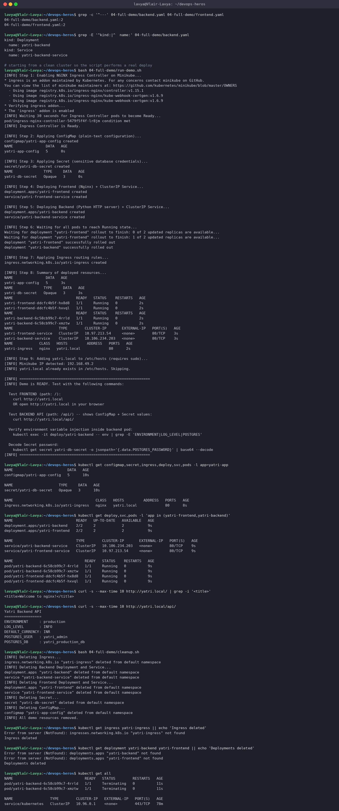

> **Multi-document YAML:** `backend.yaml` and `frontend.yaml` each hold a Deployment *and* its Service separated by `---`, so one `kubectl apply -f` creates (and one `delete -f` removes) a complete tier. `run-demo.sh` chains the ingress addon → ConfigMap → Secret → frontend → backend → `rollout status` waits → Ingress → `/etc/hosts`, and `cleanup.sh` deletes in reverse with `--ignore-not-found` so it is safe to run twice.
>
> One thing that bit me: my clone had been checked out with Windows CRLF line endings, so `set -euo pipefail\r` made both scripts fail with `set: pipefail: invalid option name`. Re-checking out with `core.autocrlf=false` fixed it - worth remembering for any shell script that travels through a Windows machine.

---

## References

- ConfigMaps: https://kubernetes.io/docs/concepts/configuration/configmap/
- Secrets: https://kubernetes.io/docs/concepts/configuration/secret/
- Ingress: https://kubernetes.io/docs/concepts/services-networking/ingress/
- ingress-nginx rewrite annotations: https://kubernetes.github.io/ingress-nginx/examples/rewrite/
- External Secrets Operator: https://external-secrets.io/
- Course notes: `lab.md`, `troubleshooting/secret-base64-gotcha.md` in this directory
