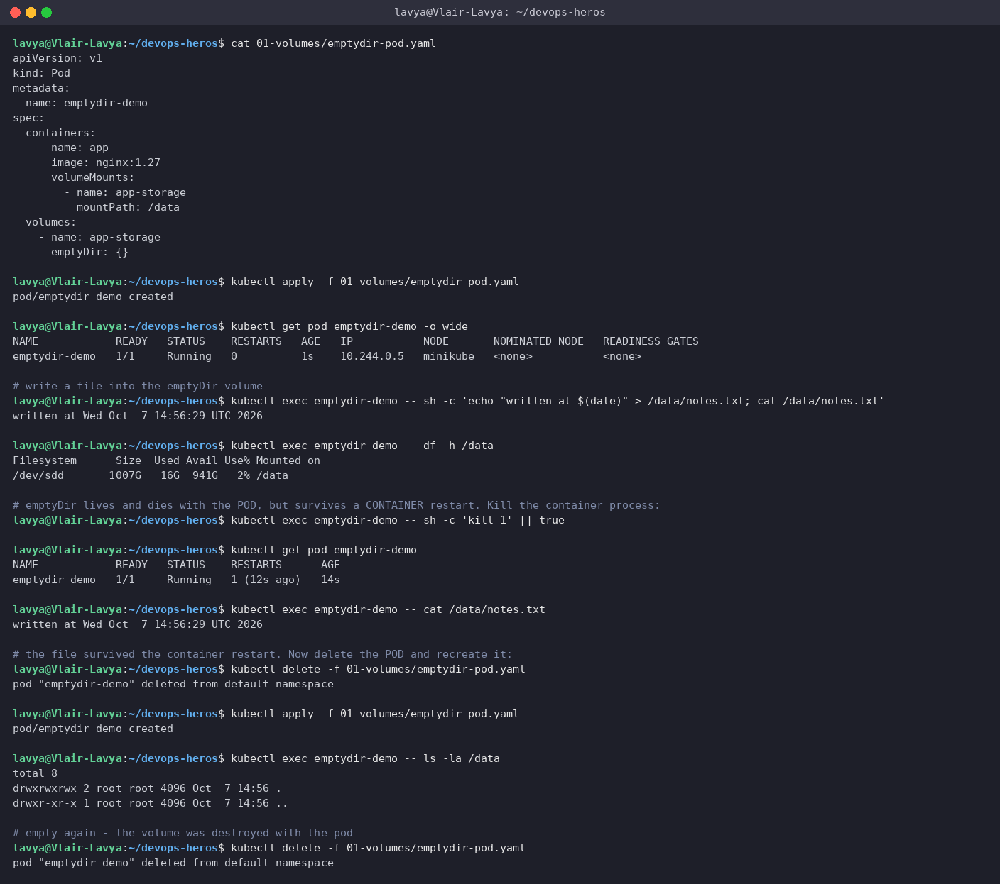
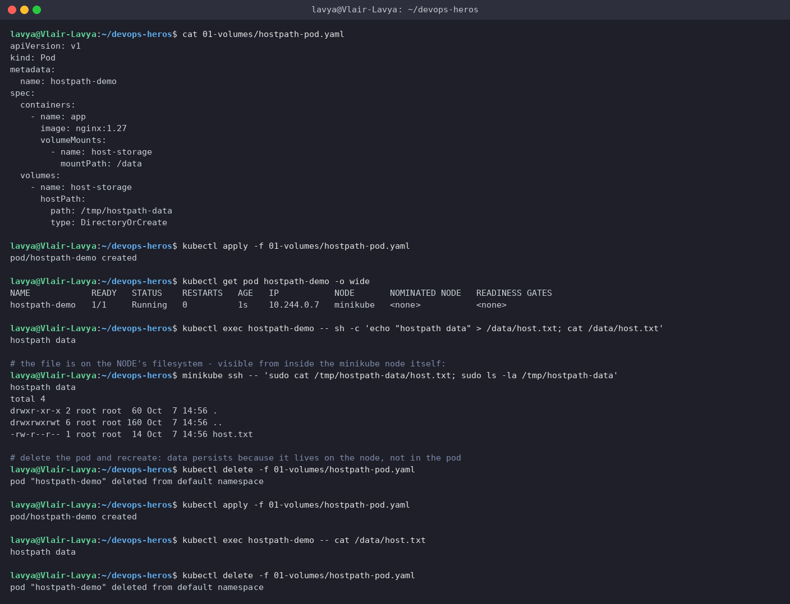
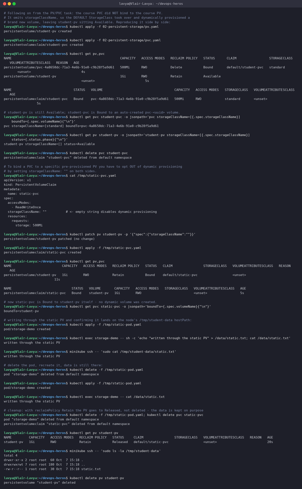
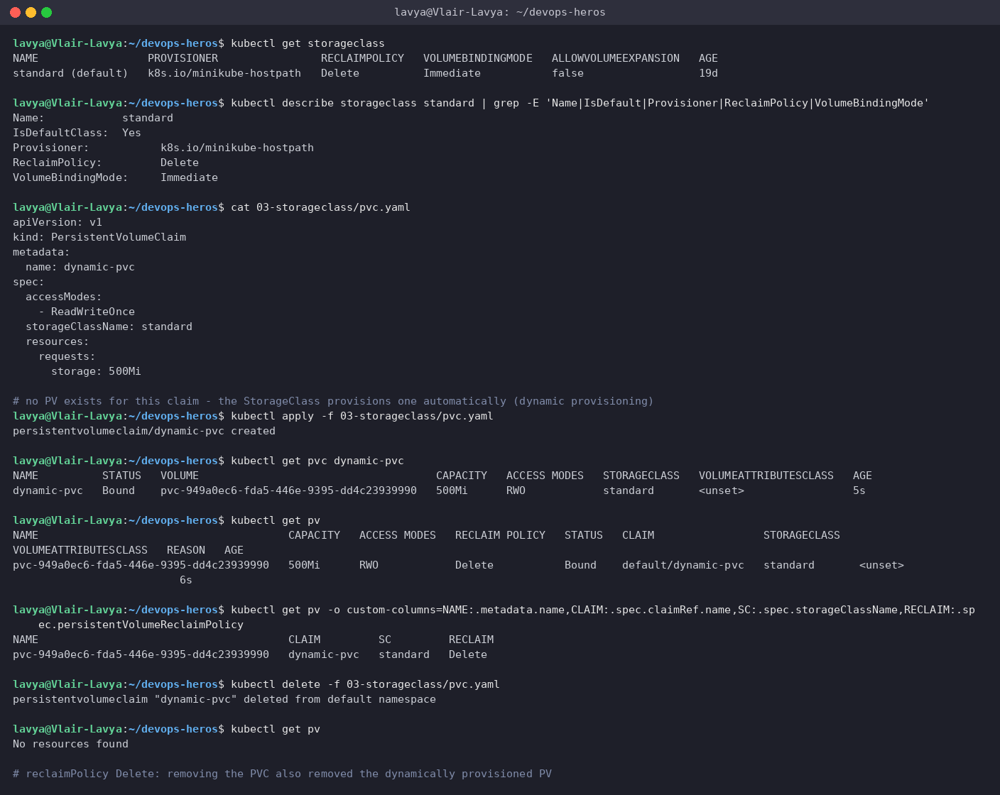
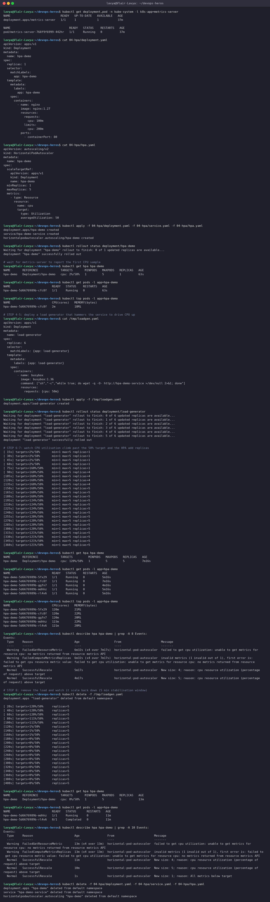
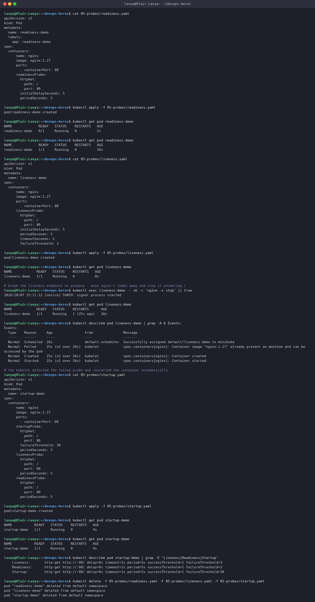
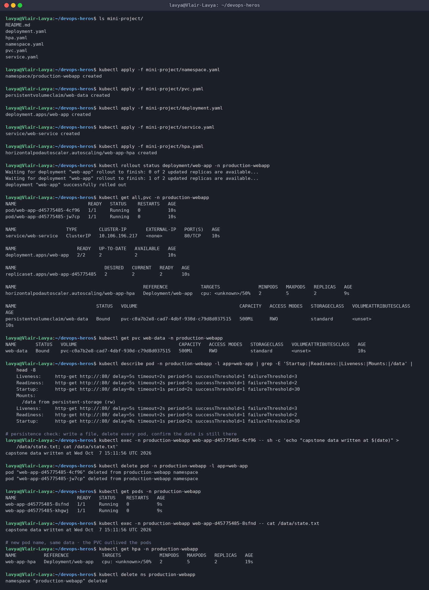

# Session 13: Kubernetes Storage, HPA & Probes

**Author:** Lavya ([@LAVYA255](https://github.com/LAVYA255))
**Course:** SST DevOps & Cloud [SWE]
**Session:** 13 - Storage, Autoscaling and Health Probes
**Repository:** `devops-heros / session-13-storage-hpa-probes`

**Setup:** Minikube v1.39.0 on the docker driver, running Kubernetes v1.37.0 inside WSL2 Ubuntu. The `metrics-server` addon is enabled, which the HPA needs for CPU readings. Everything below was run from this folder and the output is pasted exactly as it came back. Screenshots in `./screenshots/` are captures of the same terminal session.

---

## Task 1: Kubernetes Volumes

### 1.1 emptyDir

An `emptyDir` is created when the Pod is assigned to a node and deleted when the Pod goes away. The interesting bit is what happens in between, so I tested both cases: restarting the container, and deleting the whole Pod.

**Commands**
```bash
cat 01-volumes/emptydir-pod.yaml
kubectl apply -f 01-volumes/emptydir-pod.yaml
kubectl get pod emptydir-demo -o wide
kubectl exec emptydir-demo -- sh -c 'echo "written at $(date)" > /data/notes.txt; cat /data/notes.txt'
kubectl exec emptydir-demo -- df -h /data
kubectl exec emptydir-demo -- sh -c 'kill 1' || true
kubectl get pod emptydir-demo
kubectl exec emptydir-demo -- cat /data/notes.txt
kubectl delete -f 01-volumes/emptydir-pod.yaml
kubectl apply -f 01-volumes/emptydir-pod.yaml
kubectl exec emptydir-demo -- ls -la /data
kubectl delete -f 01-volumes/emptydir-pod.yaml
```

**Output**
```text
$ cat 01-volumes/emptydir-pod.yaml
apiVersion: v1
kind: Pod
metadata:
  name: emptydir-demo
spec:
  containers:
    - name: app
      image: nginx:1.27
      volumeMounts:
        - name: app-storage
          mountPath: /data
  volumes:
    - name: app-storage
      emptyDir: {}

$ kubectl apply -f 01-volumes/emptydir-pod.yaml
pod/emptydir-demo created

$ kubectl get pod emptydir-demo -o wide
NAME            READY   STATUS    RESTARTS   AGE   IP           NODE       NOMINATED NODE   READINESS GATES
emptydir-demo   1/1     Running   0          1s    10.244.0.5   minikube   <none>           <none>

# write a file into the emptyDir volume
$ kubectl exec emptydir-demo -- sh -c 'echo "written at $(date)" > /data/notes.txt; cat /data/notes.txt'
written at Wed Oct  7 14:56:29 UTC 2026

$ kubectl exec emptydir-demo -- df -h /data
Filesystem      Size  Used Avail Use% Mounted on
/dev/sdd       1007G   16G  941G   2% /data

# emptyDir lives and dies with the POD, but survives a CONTAINER restart. Kill the container process:
$ kubectl exec emptydir-demo -- sh -c 'kill 1' || true

$ kubectl get pod emptydir-demo
NAME            READY   STATUS    RESTARTS      AGE
emptydir-demo   1/1     Running   1 (12s ago)   14s

$ kubectl exec emptydir-demo -- cat /data/notes.txt
written at Wed Oct  7 14:56:29 UTC 2026

# the file survived the container restart. Now delete the POD and recreate it:
$ kubectl delete -f 01-volumes/emptydir-pod.yaml
pod "emptydir-demo" deleted from default namespace

$ kubectl apply -f 01-volumes/emptydir-pod.yaml
pod/emptydir-demo created

$ kubectl exec emptydir-demo -- ls -la /data
total 8
drwxrwxrwx 2 root root 4096 Oct  7 14:56 .
drwxr-xr-x 1 root root 4096 Oct  7 14:56 ..

# empty again - the volume was destroyed with the pod
$ kubectl delete -f 01-volumes/emptydir-pod.yaml
pod "emptydir-demo" deleted from default namespace
```

**Screenshot**



The file survived `kill 1` (the container restarted, `RESTARTS 1`, file still there) but was gone after I deleted and recreated the Pod. That is the whole point of `emptyDir`: it is scratch space tied to the Pod, good for caches, temp files and sharing data between containers in the same Pod, useless for anything you actually need to keep.

### 1.2 hostPath

`hostPath` mounts a directory from the node's own filesystem into the Pod.

**Commands**
```bash
cat 01-volumes/hostpath-pod.yaml
kubectl apply -f 01-volumes/hostpath-pod.yaml
kubectl get pod hostpath-demo -o wide
kubectl exec hostpath-demo -- sh -c 'echo "hostpath data" > /data/host.txt; cat /data/host.txt'
minikube ssh -- 'sudo cat /tmp/hostpath-data/host.txt; sudo ls -la /tmp/hostpath-data'
kubectl delete -f 01-volumes/hostpath-pod.yaml
kubectl apply -f 01-volumes/hostpath-pod.yaml
kubectl exec hostpath-demo -- cat /data/host.txt
kubectl delete -f 01-volumes/hostpath-pod.yaml
```

**Output**
```text
$ cat 01-volumes/hostpath-pod.yaml
apiVersion: v1
kind: Pod
metadata:
  name: hostpath-demo
spec:
  containers:
    - name: app
      image: nginx:1.27
      volumeMounts:
        - name: host-storage
          mountPath: /data
  volumes:
    - name: host-storage
      hostPath:
        path: /tmp/hostpath-data
        type: DirectoryOrCreate

$ kubectl apply -f 01-volumes/hostpath-pod.yaml
pod/hostpath-demo created

$ kubectl get pod hostpath-demo -o wide
NAME            READY   STATUS    RESTARTS   AGE   IP           NODE       NOMINATED NODE   READINESS GATES
hostpath-demo   1/1     Running   0          1s    10.244.0.7   minikube   <none>           <none>

$ kubectl exec hostpath-demo -- sh -c 'echo "hostpath data" > /data/host.txt; cat /data/host.txt'
hostpath data

# the file is on the NODE's filesystem - visible from inside the minikube node itself:
$ minikube ssh -- 'sudo cat /tmp/hostpath-data/host.txt; sudo ls -la /tmp/hostpath-data'
hostpath data
total 4
drwxr-xr-x 2 root root  60 Oct  7 14:56 .
drwxrwxrwt 6 root root 160 Oct  7 14:56 ..
-rw-r--r-- 1 root root  14 Oct  7 14:56 host.txt

# delete the pod and recreate: data persists because it lives on the node, not in the pod
$ kubectl delete -f 01-volumes/hostpath-pod.yaml
pod "hostpath-demo" deleted from default namespace

$ kubectl apply -f 01-volumes/hostpath-pod.yaml
pod/hostpath-demo created

$ kubectl exec hostpath-demo -- cat /data/host.txt
hostpath data

$ kubectl delete -f 01-volumes/hostpath-pod.yaml
pod "hostpath-demo" deleted from default namespace
```

**Screenshot**



I wrote the file from inside the Pod and then read it back by SSH-ing into the minikube node itself, which proves it is really sitting on the node at `/tmp/hostpath-data`. Delete the Pod and the data stays.

The catch is that it is tied to *that one node*. If the Pod gets rescheduled somewhere else it sees an empty directory, so `hostPath` is only sensible for node-level agents (log collectors, monitoring) and is a security risk in a shared cluster because it exposes the host filesystem.

### 1.3 PersistentVolume and PersistentVolumeClaim

A PV is a piece of storage in the cluster. A PVC is a request for storage. The two get bound together, and the Pod only ever refers to the claim.

**Commands**
```bash
cat 02-persistent-storage/pv.yaml
cat 02-persistent-storage/pvc.yaml
kubectl apply -f 02-persistent-storage/pv.yaml
kubectl get pv student-pv
kubectl apply -f 02-persistent-storage/pvc.yaml
kubectl get pvc student-pvc
kubectl get pv student-pv
kubectl describe pvc student-pvc | grep -E 'Status|Volume:|Capacity|Access Modes|StorageClass'
kubectl apply -f 02-persistent-storage/pod.yaml
kubectl exec storage-demo -- sh -c 'echo "persistent across pod deletion" > /data/pv.txt; cat /data/pv.txt'
kubectl delete -f 02-persistent-storage/pod.yaml
kubectl apply -f 02-persistent-storage/pod.yaml
kubectl exec storage-demo -- cat /data/pv.txt
kubectl delete -f 02-persistent-storage/pod.yaml -f 02-persistent-storage/pvc.yaml
kubectl get pv student-pv
kubectl delete -f 02-persistent-storage/pv.yaml
```

**Output**
```text
$ cat 02-persistent-storage/pv.yaml
apiVersion: v1
kind: PersistentVolume
metadata:
  name: student-pv
spec:
  capacity:
    storage: 1Gi
  accessModes:
    - ReadWriteOnce
  persistentVolumeReclaimPolicy: Retain
  hostPath:
    path: /tmp/student-data

$ cat 02-persistent-storage/pvc.yaml
apiVersion: v1
kind: PersistentVolumeClaim
metadata:
  name: student-pvc
spec:
  accessModes:
    - ReadWriteOnce
  resources:
    requests:
      storage: 500Mi

$ kubectl apply -f 02-persistent-storage/pv.yaml
persistentvolume/student-pv created

$ kubectl get pv student-pv
NAME         CAPACITY   ACCESS MODES   RECLAIM POLICY   STATUS      CLAIM   STORAGECLASS   VOLUMEATTRIBUTESCLASS   REASON   AGE
student-pv   1Gi        RWO            Retain           Available                          <unset>                          0s

# the PVC is a REQUEST; the control plane binds it to a matching PV
$ kubectl apply -f 02-persistent-storage/pvc.yaml
persistentvolumeclaim/student-pvc created

$ kubectl get pvc student-pvc
NAME          STATUS   VOLUME                                     CAPACITY   ACCESS MODES   STORAGECLASS   VOLUMEATTRIBUTESCLASS   AGE
student-pvc   Bound    pvc-c40c5adf-2238-4d9a-b7da-fcfa2b9b3f58   500Mi      RWO            standard       <unset>                 4s

$ kubectl get pv student-pv
NAME         CAPACITY   ACCESS MODES   RECLAIM POLICY   STATUS      CLAIM   STORAGECLASS   VOLUMEATTRIBUTESCLASS   REASON   AGE
student-pv   1Gi        RWO            Retain           Available                          <unset>                          4s

$ kubectl describe pvc student-pvc | grep -E 'Status|Volume:|Capacity|Access Modes|StorageClass'
StorageClass:  standard
Status:        Bound
Volume:        pvc-c40c5adf-2238-4d9a-b7da-fcfa2b9b3f58
Capacity:      500Mi
Access Modes:  RWO
  Type     Status  LastProbeTime                     LastTransitionTime                Reason           Message

$ kubectl apply -f 02-persistent-storage/pod.yaml
pod/storage-demo created

$ kubectl exec storage-demo -- sh -c 'echo "persistent across pod deletion" > /data/pv.txt; cat /data/pv.txt'
persistent across pod deletion

$ kubectl delete -f 02-persistent-storage/pod.yaml
pod "storage-demo" deleted from default namespace

$ kubectl apply -f 02-persistent-storage/pod.yaml
pod/storage-demo created

$ kubectl exec storage-demo -- cat /data/pv.txt
persistent across pod deletion

# data survived because it lives in the PV, decoupled from the pod lifecycle
$ kubectl delete -f 02-persistent-storage/pod.yaml -f 02-persistent-storage/pvc.yaml
pod "storage-demo" deleted from default namespace
persistentvolumeclaim "student-pvc" deleted from default namespace

$ kubectl get pv student-pv
NAME         CAPACITY   ACCESS MODES   RECLAIM POLICY   STATUS      CLAIM   STORAGECLASS   VOLUMEATTRIBUTESCLASS   REASON   AGE
student-pv   1Gi        RWO            Retain           Available                          <unset>                          9s

# reclaimPolicy: Retain - the PV stays as Released (not auto-deleted) so an admin can recover the data
$ kubectl delete -f 02-persistent-storage/pv.yaml
persistentvolume "student-pv" deleted
```

The data survived deleting and recreating the Pod, which is the headline result. But look closely at the `kubectl get pv` output and something is off, which took me to the next bit.

### 1.4 The PVC did not bind to the PV I created

`student-pvc` shows `Bound`, but to a volume called `pvc-c40c5adf-...`, not to `student-pv`. Meanwhile `student-pv` is still sitting there `Available`. So the claim was satisfied by a brand new, automatically created volume and my hand-written PV was ignored.

**Output**
```text
# Following on from the PV/PVC task: the course PVC did NOT bind to the course PV.
# It omits storageClassName, so the DEFAULT StorageClass took over and dynamically provisioned a
# brand new volume, leaving student-pv sitting Available. Reproducing it side by side:
$ kubectl apply -f 02-persistent-storage/pv.yaml
persistentvolume/student-pv created

$ kubectl apply -f 02-persistent-storage/pvc.yaml
persistentvolumeclaim/student-pvc created

$ kubectl get pv,pvc
NAME                                                        CAPACITY   ACCESS MODES   RECLAIM POLICY   STATUS      CLAIM                 STORAGECLASS   VOLUMEATTRIBUTESCLASS   REASON   AGE
persistentvolume/pvc-4a8650dc-71a3-4e6b-91e0-c9b28f5a9d61   500Mi      RWO            Delete           Bound       default/student-pvc   standard       <unset>                          4s
persistentvolume/student-pv                                 1Gi        RWO            Retain           Available                                        <unset>                          5s

NAME                                STATUS   VOLUME                                     CAPACITY   ACCESS MODES   STORAGECLASS   VOLUMEATTRIBUTESCLASS   AGE
persistentvolumeclaim/student-pvc   Bound    pvc-4a8650dc-71a3-4e6b-91e0-c9b28f5a9d61   500Mi      RWO            standard       <unset>                 5s

# student-pv is still Available; student-pvc is Bound to an auto-created pvc-<uuid> volume.
$ kubectl get pvc student-pvc -o jsonpath='pvc storageClassName=[{.spec.storageClassName}] boundTo={.spec.volumeName}{"\n"}'
pvc storageClassName=[standard] boundTo=pvc-4a8650dc-71a3-4e6b-91e0-c9b28f5a9d61

$ kubectl get pv student-pv -o jsonpath='student-pv storageClassName=[{.spec.storageClassName}] status={.status.phase}{"\n"}'
student-pv storageClassName=[] status=Available

$ kubectl delete pvc student-pvc
persistentvolumeclaim "student-pvc" deleted from default namespace

# To bind a PVC to a specific pre-provisioned PV you have to opt OUT of dynamic provisioning
# by setting storageClassName: "" on both sides.
$ cat /tmp/static-pvc.yaml
apiVersion: v1
kind: PersistentVolumeClaim
metadata:
  name: static-pvc
spec:
  accessModes:
    - ReadWriteOnce
  storageClassName: ""          # <- empty string disables dynamic provisioning
  resources:
    requests:
      storage: 500Mi

$ kubectl patch pv student-pv -p '{"spec":{"storageClassName":""}}'
persistentvolume/student-pv patched (no change)

$ kubectl apply -f /tmp/static-pvc.yaml
persistentvolumeclaim/static-pvc created

$ kubectl get pv,pvc
NAME                          CAPACITY   ACCESS MODES   RECLAIM POLICY   STATUS   CLAIM                STORAGECLASS   VOLUMEATTRIBUTESCLASS   REASON   AGE
persistentvolume/student-pv   1Gi        RWO            Retain           Bound    default/static-pvc                  <unset>                          11s

NAME                               STATUS   VOLUME       CAPACITY   ACCESS MODES   STORAGECLASS   VOLUMEATTRIBUTESCLASS   AGE
persistentvolumeclaim/static-pvc   Bound    student-pv   1Gi        RWO                           <unset>                 5s

# now static-pvc is Bound to student-pv itself - no dynamic volume was created.
$ kubectl get pvc static-pvc -o jsonpath='boundTo={.spec.volumeName}{"\n"}'
boundTo=student-pv

# writing through the static PV and confirming it lands on the node's /tmp/student-data hostPath:
$ kubectl apply -f /tmp/static-pod.yaml
pod/storage-demo created

$ kubectl exec storage-demo -- sh -c 'echo "written through the static PV" > /data/static.txt; cat /data/static.txt'
written through the static PV

$ minikube ssh -- 'sudo cat /tmp/student-data/static.txt'
written through the static PV

# delete the pod, recreate it, data is still there:
$ kubectl delete -f /tmp/static-pod.yaml
pod "storage-demo" deleted from default namespace

$ kubectl apply -f /tmp/static-pod.yaml
pod/storage-demo created

$ kubectl exec storage-demo -- cat /data/static.txt
written through the static PV

# cleanup: with reclaimPolicy Retain the PV goes to Released, not deleted - the data is kept on purpose
$ kubectl delete -f /tmp/static-pod.yaml; kubectl delete pvc static-pvc
pod "storage-demo" deleted from default namespace
persistentvolumeclaim "static-pvc" deleted from default namespace

$ kubectl get pv student-pv
NAME         CAPACITY   ACCESS MODES   RECLAIM POLICY   STATUS     CLAIM                STORAGECLASS   VOLUMEATTRIBUTESCLASS   REASON   AGE
student-pv   1Gi        RWO            Retain           Released   default/static-pvc                  <unset>                          20s

$ minikube ssh -- 'sudo ls -la /tmp/student-data'
total 4
drwxr-xr-x 2 root root  60 Oct  7 15:18 .
drwxrwxrwt 7 root root 180 Oct  7 15:18 ..
-rw-r--r-- 1 root root  30 Oct  7 15:18 static.txt

$ kubectl delete pv student-pv
persistentvolume "student-pv" deleted
```

**Screenshot**



The reason is that `02-persistent-storage/pvc.yaml` has no `storageClassName` field. When that field is absent the cluster applies the **default StorageClass**, which on minikube is `standard`. So instead of looking for a matching existing PV, the control plane asked the `standard` provisioner for a new one.

To bind to a specific pre-made PV you have to opt out of dynamic provisioning by setting `storageClassName: ""` on both the PV and the PVC. Once I did that, `static-pvc` bound to `student-pv` directly, and writing through it landed in `/tmp/student-data` on the node, exactly as intended.

Worth knowing because the symptom is silent: the PVC says `Bound`, the Pod runs, everything looks fine, and you are quietly using different storage than you thought.

### 1.5 StorageClass and dynamic provisioning

**Commands**
```bash
kubectl get storageclass
kubectl describe storageclass standard | grep -E 'Name|IsDefault|Provisioner|ReclaimPolicy|VolumeBindingMode'
cat 03-storageclass/pvc.yaml
kubectl apply -f 03-storageclass/pvc.yaml
kubectl get pvc dynamic-pvc
kubectl get pv
kubectl get pv -o custom-columns=NAME:.metadata.name,CLAIM:.spec.claimRef.name,SC:.spec.storageClassName,RECLAIM:.spec.persistentVolumeReclaimPolicy
kubectl delete -f 03-storageclass/pvc.yaml
kubectl get pv
```

**Output**
```text
$ kubectl get storageclass
NAME                 PROVISIONER                RECLAIMPOLICY   VOLUMEBINDINGMODE   ALLOWVOLUMEEXPANSION   AGE
standard (default)   k8s.io/minikube-hostpath   Delete          Immediate           false                  19d

$ kubectl describe storageclass standard | grep -E 'Name|IsDefault|Provisioner|ReclaimPolicy|VolumeBindingMode'
Name:            standard
IsDefaultClass:  Yes
Provisioner:           k8s.io/minikube-hostpath
ReclaimPolicy:         Delete
VolumeBindingMode:     Immediate

$ cat 03-storageclass/pvc.yaml
apiVersion: v1
kind: PersistentVolumeClaim
metadata:
  name: dynamic-pvc
spec:
  accessModes:
    - ReadWriteOnce
  storageClassName: standard
  resources:
    requests:
      storage: 500Mi

# no PV exists for this claim - the StorageClass provisions one automatically (dynamic provisioning)
$ kubectl apply -f 03-storageclass/pvc.yaml
persistentvolumeclaim/dynamic-pvc created

$ kubectl get pvc dynamic-pvc
NAME          STATUS   VOLUME                                     CAPACITY   ACCESS MODES   STORAGECLASS   VOLUMEATTRIBUTESCLASS   AGE
dynamic-pvc   Bound    pvc-949a0ec6-fda5-446e-9395-dd4c23939990   500Mi      RWO            standard       <unset>                 5s

$ kubectl get pv
NAME                                       CAPACITY   ACCESS MODES   RECLAIM POLICY   STATUS   CLAIM                 STORAGECLASS   VOLUMEATTRIBUTESCLASS   REASON   AGE
pvc-949a0ec6-fda5-446e-9395-dd4c23939990   500Mi      RWO            Delete           Bound    default/dynamic-pvc   standard       <unset>                          6s

$ kubectl get pv -o custom-columns=NAME:.metadata.name,CLAIM:.spec.claimRef.name,SC:.spec.storageClassName,RECLAIM:.spec.persistentVolumeReclaimPolicy
NAME                                       CLAIM         SC         RECLAIM
pvc-949a0ec6-fda5-446e-9395-dd4c23939990   dynamic-pvc   standard   Delete

$ kubectl delete -f 03-storageclass/pvc.yaml
persistentvolumeclaim "dynamic-pvc" deleted from default namespace

$ kubectl get pv
No resources found

# reclaimPolicy Delete: removing the PVC also removed the dynamically provisioned PV
```

**Screenshot**



No PV existed before I applied the claim. The `standard` StorageClass (`k8s.io/minikube-hostpath`) created one on demand, and because its reclaim policy is `Delete`, removing the PVC removed the PV with it. On a cloud provider the same mechanism provisions a real EBS/Persistent Disk volume.

### Summary of the storage types

| | Lifetime | Survives pod delete | Survives reschedule to another node | Typical use |
| --- | --- | --- | --- | --- |
| `emptyDir` | Pod | No | No | Scratch space, cache, sharing files between containers in a Pod |
| `hostPath` | Node | Yes | No | Node agents that need to read the host (log shippers, metrics) |
| PV + PVC (static) | Independent of Pod | Yes | Yes, if backing storage allows | Admin pre-provisions storage, app claims it |
| StorageClass (dynamic) | Independent of Pod | Yes | Yes | The normal case: app asks, cluster provisions automatically |

Reclaim policy is the other dial: `Delete` throws the volume away with the claim, `Retain` keeps it as `Released` so a human can recover the data before it is wiped.

---

## Task 2: HPA Hands-on

The Horizontal Pod Autoscaler watches a metric and changes the replica count of a Deployment to keep that metric near a target. Here the target is 50% CPU utilisation, measured as a percentage of the Pod's CPU **request** (100m), scaling between 1 and 5 replicas.

**Commands**
```bash
kubectl get deployment,pod -n kube-system -l k8s-app=metrics-server
cat 04-hpa/deployment.yaml
cat 04-hpa/hpa.yaml
kubectl apply -f 04-hpa/deployment.yaml -f 04-hpa/service.yaml -f 04-hpa/hpa.yaml
kubectl rollout status deployment/hpa-demo
kubectl get hpa hpa-demo
kubectl get pods -l app=hpa-demo
kubectl top pods -l app=hpa-demo
cat /tmp/loadgen.yaml
kubectl apply -f /tmp/loadgen.yaml
kubectl rollout status deployment/load-generator
kubectl get hpa hpa-demo
kubectl get pods -l app=hpa-demo
kubectl top pods -l app=hpa-demo
kubectl describe hpa hpa-demo | grep -A 8 Events:
kubectl delete -f /tmp/loadgen.yaml
kubectl get hpa hpa-demo
kubectl get pods -l app=hpa-demo
kubectl describe hpa hpa-demo | grep -A 10 Events:
kubectl delete -f 04-hpa/deployment.yaml -f 04-hpa/service.yaml -f 04-hpa/hpa.yaml
```

**Output**
```text
$ kubectl get deployment,pod -n kube-system -l k8s-app=metrics-server
NAME                             READY   UP-TO-DATE   AVAILABLE   AGE
deployment.apps/metrics-server   1/1     1            1           37m

NAME                                  READY   STATUS    RESTARTS   AGE
pod/metrics-server-768f9f6999-442hr   1/1     Running   0          37m

$ cat 04-hpa/deployment.yaml
apiVersion: apps/v1
kind: Deployment
metadata:
  name: hpa-demo
spec:
  replicas: 1
  selector:
    matchLabels:
      app: hpa-demo
  template:
    metadata:
      labels:
        app: hpa-demo
    spec:
      containers:
        - name: nginx
          image: nginx:1.27
          resources:
            requests:
              cpu: 100m
            limits:
              cpu: 200m
          ports:
            - containerPort: 80

$ cat 04-hpa/hpa.yaml
apiVersion: autoscaling/v2
kind: HorizontalPodAutoscaler
metadata:
  name: hpa-demo
spec:
  scaleTargetRef:
    apiVersion: apps/v1
    kind: Deployment
    name: hpa-demo
  minReplicas: 1
  maxReplicas: 5
  metrics:
    - type: Resource
      resource:
        name: cpu
        target:
          type: Utilization
          averageUtilization: 50

$ kubectl apply -f 04-hpa/deployment.yaml -f 04-hpa/service.yaml -f 04-hpa/hpa.yaml
deployment.apps/hpa-demo created
service/hpa-demo-service created
horizontalpodautoscaler.autoscaling/hpa-demo created

$ kubectl rollout status deployment/hpa-demo
Waiting for deployment "hpa-demo" rollout to finish: 0 of 1 updated replicas are available...
deployment "hpa-demo" successfully rolled out

# wait for metrics-server to report the first CPU sample
$ kubectl get hpa hpa-demo
NAME       REFERENCE             TARGETS       MINPODS   MAXPODS   REPLICAS   AGE
hpa-demo   Deployment/hpa-demo   cpu: 2%/50%   1         5         1          63s

$ kubectl get pods -l app=hpa-demo
NAME                        READY   STATUS    RESTARTS   AGE
hpa-demo-5d6676989b-cfc8f   1/1     Running   0          63s

$ kubectl top pods -l app=hpa-demo
NAME                        CPU(cores)   MEMORY(bytes)
hpa-demo-5d6676989b-cfc8f   2m           18Mi

# STEP 4-5: deploy a load generator that hammers the service to drive CPU up
$ cat /tmp/loadgen.yaml
apiVersion: apps/v1
kind: Deployment
metadata:
  name: load-generator
spec:
  replicas: 6
  selector:
    matchLabels: {app: load-generator}
  template:
    metadata:
      labels: {app: load-generator}
    spec:
      containers:
        - name: busybox
          image: busybox:1.36
          command: ["sh","-c","while true; do wget -q -O- http://hpa-demo-service >/dev/null 2>&1; done"]
          resources:
            requests: {cpu: 50m}

$ kubectl apply -f /tmp/loadgen.yaml
deployment.apps/load-generator created

$ kubectl rollout status deployment/load-generator
Waiting for deployment "load-generator" rollout to finish: 0 of 6 updated replicas are available...
Waiting for deployment "load-generator" rollout to finish: 1 of 6 updated replicas are available...
Waiting for deployment "load-generator" rollout to finish: 2 of 6 updated replicas are available...
Waiting for deployment "load-generator" rollout to finish: 3 of 6 updated replicas are available...
Waiting for deployment "load-generator" rollout to finish: 4 of 6 updated replicas are available...
Waiting for deployment "load-generator" rollout to finish: 5 of 6 updated replicas are available...
deployment "load-generator" successfully rolled out

# STEP 6-7: watch CPU utilisation climb past the 50% target and the HPA add replicas
[ 15s] targets=2%/50%       min=1 max=5 replicas=1
[ 30s] targets=2%/50%       min=1 max=5 replicas=1
[ 45s] targets=2%/50%       min=1 max=5 replicas=1
[ 60s] targets=2%/50%       min=1 max=5 replicas=1
[ 75s] targets=160%/50%     min=1 max=5 replicas=1
[ 90s] targets=160%/50%     min=1 max=5 replicas=4
[105s] targets=160%/50%     min=1 max=5 replicas=4
[120s] targets=160%/50%     min=1 max=5 replicas=4
[135s] targets=160%/50%     min=1 max=5 replicas=4
[150s] targets=160%/50%     min=1 max=5 replicas=5
[165s] targets=160%/50%     min=1 max=5 replicas=5
[180s] targets=160%/50%     min=1 max=5 replicas=5
[195s] targets=124%/50%     min=1 max=5 replicas=5
[210s] targets=124%/50%     min=1 max=5 replicas=5
[225s] targets=124%/50%     min=1 max=5 replicas=5
[240s] targets=124%/50%     min=1 max=5 replicas=5
[255s] targets=120%/50%     min=1 max=5 replicas=5
[270s] targets=120%/50%     min=1 max=5 replicas=5
[285s] targets=120%/50%     min=1 max=5 replicas=5
[300s] targets=120%/50%     min=1 max=5 replicas=5
[315s] targets=121%/50%     min=1 max=5 replicas=5
[330s] targets=121%/50%     min=1 max=5 replicas=5
[345s] targets=121%/50%     min=1 max=5 replicas=5
[360s] targets=121%/50%     min=1 max=5 replicas=5

$ kubectl get hpa hpa-demo
NAME       REFERENCE             TARGETS         MINPODS   MAXPODS   REPLICAS   AGE
hpa-demo   Deployment/hpa-demo   cpu: 120%/50%   1         5         5          7m16s

$ kubectl get pods -l app=hpa-demo
NAME                        READY   STATUS    RESTARTS   AGE
hpa-demo-5d6676989b-5fx29   1/1     Running   0          5m16s
hpa-demo-5d6676989b-cfc8f   1/1     Running   0          7m16s
hpa-demo-5d6676989b-ggfn7   1/1     Running   0          4m16s
hpa-demo-5d6676989b-mdhhz   1/1     Running   0          5m16s
hpa-demo-5d6676989b-rl4v6   1/1     Running   0          5m16s

$ kubectl top pods -l app=hpa-demo
NAME                        CPU(cores)   MEMORY(bytes)
hpa-demo-5d6676989b-5fx29   120m         21Mi
hpa-demo-5d6676989b-cfc8f   120m         22Mi
hpa-demo-5d6676989b-ggfn7   120m         20Mi
hpa-demo-5d6676989b-mdhhz   123m         22Mi
hpa-demo-5d6676989b-rl4v6   121m         20Mi

$ kubectl describe hpa hpa-demo | grep -A 8 Events:
Events:
  Type     Reason                        Age                    From                       Message
  ----     ------                        ----                   ----                       -------
  Warning  FailedGetResourceMetric       6m32s (x4 over 7m17s)  horizontal-pod-autoscaler  failed to get cpu utilization: unable to get metrics for resource cpu: no metrics returned from resource metrics API
  Warning  FailedComputeMetricsReplicas  6m32s (x4 over 7m17s)  horizontal-pod-autoscaler  invalid metrics (1 invalid out of 1), first error is: failed to get cpu resource metric value: failed to get cpu utilization: unable to get metrics for resource cpu: no metrics returned from resource metrics API
  Normal   SuccessfulRescale             5m17s                  horizontal-pod-autoscaler  New size: 4; reason: cpu resource utilization (percentage of request) above target
  Normal   SuccessfulRescale             4m17s                  horizontal-pod-autoscaler  New size: 5; reason: cpu resource utilization (percentage of request) above target

# STEP 8: remove the load and watch it scale back down (5 min stabilisation window)
$ kubectl delete -f /tmp/loadgen.yaml
deployment.apps "load-generator" deleted from default namespace

[ 20s] targets=120%/50%     replicas=5
[ 40s] targets=120%/50%     replicas=5
[ 60s] targets=120%/50%     replicas=5
[ 80s] targets=111%/50%     replicas=5
[100s] targets=111%/50%     replicas=5
[120s] targets=1%/50%       replicas=5
[140s] targets=1%/50%       replicas=5
[160s] targets=1%/50%       replicas=5
[180s] targets=0%/50%       replicas=5
[200s] targets=0%/50%       replicas=5
[220s] targets=0%/50%       replicas=5
[240s] targets=0%/50%       replicas=5
[260s] targets=0%/50%       replicas=5
[280s] targets=0%/50%       replicas=5
[300s] targets=0%/50%       replicas=5
[320s] targets=0%/50%       replicas=5
[340s] targets=0%/50%       replicas=5
[360s] targets=0%/50%       replicas=5
[380s] targets=0%/50%       replicas=5
[400s] targets=0%/50%       replicas=5

$ kubectl get hpa hpa-demo
NAME       REFERENCE             TARGETS       MINPODS   MAXPODS   REPLICAS   AGE
hpa-demo   Deployment/hpa-demo   cpu: 0%/50%   1         5         5          13m

$ kubectl get pods -l app=hpa-demo
NAME                        READY   STATUS      RESTARTS   AGE
hpa-demo-5d6676989b-mdhhz   1/1     Running     0          11m
hpa-demo-5d6676989b-rl4v6   0/1     Completed   0          11m

$ kubectl describe hpa hpa-demo | grep -A 10 Events:
Events:
  Type     Reason                        Age                From                       Message
  ----     ------                        ----               ----                       -------
  Warning  FailedGetResourceMetric       13m (x4 over 13m)  horizontal-pod-autoscaler  failed to get cpu utilization: unable to get metrics for resource cpu: no metrics returned from resource metrics API
  Warning  FailedComputeMetricsReplicas  13m (x4 over 13m)  horizontal-pod-autoscaler  invalid metrics (1 invalid out of 1), first error is: failed to get cpu resource metric value: failed to get cpu utilization: unable to get metrics for resource cpu: no metrics returned from resource metrics API
  Normal   SuccessfulRescale             11m                horizontal-pod-autoscaler  New size: 4; reason: cpu resource utilization (percentage of request) above target
  Normal   SuccessfulRescale             10m                horizontal-pod-autoscaler  New size: 5; reason: cpu resource utilization (percentage of request) above target
  Normal   SuccessfulRescale             1s                 horizontal-pod-autoscaler  New size: 1; reason: All metrics below target

$ kubectl delete -f 04-hpa/deployment.yaml -f 04-hpa/service.yaml -f 04-hpa/hpa.yaml
deployment.apps "hpa-demo" deleted from default namespace
service "hpa-demo-service" deleted from default namespace
horizontalpodautoscaler.autoscaling "hpa-demo" deleted from default namespace
```

**Screenshot**



What the run shows, step by step:

1. **Baseline.** 1 replica, `cpu: 2%/50%`, nothing to do.
2. **Load on.** Six busybox pods hammering the Service in a tight loop. Within about a minute CPU reads `160%/50%`.
3. **Scale up.** The HPA goes 1 to 4 immediately, then 4 to 5 a minute later, stopping at `maxReplicas: 5`. Events confirm it: `SuccessfulRescale ... reason: cpu resource utilization (percentage of request) above target`.
4. **Steady state.** With 5 pods sharing the load, each sits at about 120m CPU. Still over target, but it cannot scale past `maxReplicas`.
5. **Load off.** CPU drops to 0% almost at once, but the replica count stays at 5 for a full five minutes.
6. **Scale down.** Then one event: `New size: 1; reason: All metrics below target`.

That five minute delay is not a bug, it is `--horizontal-pod-autoscaler-downscale-stabilization`, which defaults to 300s. Scaling up fast is cheap and safe; scaling down fast risks thrashing if the traffic comes straight back, so the HPA deliberately waits.

Two other things I noticed. The first few HPA readings were `<unknown>` and the events show `FailedGetResourceMetric` warnings, because metrics-server needs a scrape cycle or two before it has any data. And the scale-up is not gradual: the HPA computes `desired = ceil(current × currentMetric / targetMetric)` in one shot, which from 1 pod at 160% gives `ceil(1 × 160/50) = 4` straight away.

An HPA cannot work without resource **requests** on the container. The percentage is meaningless otherwise, which is why `04-hpa/deployment.yaml` sets `requests.cpu: 100m`.

---

## Probes: readiness, liveness and startup

**Commands**
```bash
cat 05-probes/readiness.yaml
kubectl apply -f 05-probes/readiness.yaml
kubectl get pod readiness-demo
kubectl get pod readiness-demo
cat 05-probes/liveness.yaml
kubectl apply -f 05-probes/liveness.yaml
kubectl get pod liveness-demo
kubectl exec liveness-demo -- sh -c 'nginx -s stop' || true
kubectl get pod liveness-demo
kubectl describe pod liveness-demo | grep -A 8 Events:
cat 05-probes/startup.yaml
kubectl apply -f 05-probes/startup.yaml
kubectl get pod startup-demo
kubectl get pod startup-demo
kubectl describe pod startup-demo | grep -E 'Liveness|Readiness|Startup'
kubectl delete -f 05-probes/readiness.yaml -f 05-probes/liveness.yaml -f 05-probes/startup.yaml
```

**Output**
```text
$ cat 05-probes/readiness.yaml
apiVersion: v1
kind: Pod
metadata:
  name: readiness-demo
  labels:
    app: readiness-demo
spec:
  containers:
    - name: nginx
      image: nginx:1.27
      ports:
        - containerPort: 80
      readinessProbe:
        httpGet:
          path: /
          port: 80
        initialDelaySeconds: 5
        periodSeconds: 5

$ kubectl apply -f 05-probes/readiness.yaml
pod/readiness-demo created

$ kubectl get pod readiness-demo
NAME             READY   STATUS    RESTARTS   AGE
readiness-demo   0/1     Running   0          2s

$ kubectl get pod readiness-demo
NAME             READY   STATUS    RESTARTS   AGE
readiness-demo   1/1     Running   0          10s

$ cat 05-probes/liveness.yaml
apiVersion: v1
kind: Pod
metadata:
  name: liveness-demo
spec:
  containers:
    - name: nginx
      image: nginx:1.27
      ports:
        - containerPort: 80
      livenessProbe:
        httpGet:
          path: /
          port: 80
        initialDelaySeconds: 5
        periodSeconds: 5
        timeoutSeconds: 2
        failureThreshold: 3

$ kubectl apply -f 05-probes/liveness.yaml
pod/liveness-demo created

$ kubectl get pod liveness-demo
NAME            READY   STATUS    RESTARTS   AGE
liveness-demo   1/1     Running   0          0s

# break the liveness endpoint on purpose - move nginx's index away and stop it answering /
$ kubectl exec liveness-demo -- sh -c 'nginx -s stop' || true
2026/10/07 15:11:12 [notice] 59#59: signal process started

$ kubectl get pod liveness-demo
NAME            READY   STATUS    RESTARTS      AGE
liveness-demo   1/1     Running   1 (25s ago)   26s

$ kubectl describe pod liveness-demo | grep -A 8 Events:
Events:
  Type    Reason     Age                From               Message
  ----    ------     ----               ----               -------
  Normal  Scheduled  26s                default-scheduler  Successfully assigned default/liveness-demo to minikube
  Normal  Pulled     25s (x2 over 26s)  kubelet            spec.containers{nginx}: Container image "nginx:1.27" already present on machine and can be accessed by the pod
  Normal  Created    25s (x2 over 26s)  kubelet            spec.containers{nginx}: Container created
  Normal  Started    25s (x2 over 26s)  kubelet            spec.containers{nginx}: Container started

# the kubelet detected the failed probe and restarted the container automatically
$ cat 05-probes/startup.yaml
apiVersion: v1
kind: Pod
metadata:
  name: startup-demo
spec:
  containers:
    - name: nginx
      image: nginx:1.27
      ports:
        - containerPort: 80
      startupProbe:
        httpGet:
          path: /
          port: 80
        failureThreshold: 30
        periodSeconds: 2
      livenessProbe:
        httpGet:
          path: /
          port: 80
        periodSeconds: 5
      readinessProbe:
        httpGet:
          path: /
          port: 80
        periodSeconds: 5

$ kubectl apply -f 05-probes/startup.yaml
pod/startup-demo created

$ kubectl get pod startup-demo
NAME           READY   STATUS    RESTARTS   AGE
startup-demo   1/1     Running   0          4s

$ kubectl get pod startup-demo
NAME           READY   STATUS    RESTARTS   AGE
startup-demo   1/1     Running   0          4s

$ kubectl describe pod startup-demo | grep -E 'Liveness|Readiness|Startup'
    Liveness:       http-get http://:80/ delay=0s timeout=1s period=5s successThreshold=1 failureThreshold=3
    Readiness:      http-get http://:80/ delay=0s timeout=1s period=5s successThreshold=1 failureThreshold=3
    Startup:        http-get http://:80/ delay=0s timeout=1s period=2s successThreshold=1 failureThreshold=30

$ kubectl delete -f 05-probes/readiness.yaml -f 05-probes/liveness.yaml -f 05-probes/startup.yaml
pod "readiness-demo" deleted from default namespace
pod "liveness-demo" deleted from default namespace
pod "startup-demo" deleted from default namespace
```

**Screenshot**



- **Readiness** decides whether the Pod receives traffic. At 2s the container was `Running` but `0/1` ready, so the Service would not have sent it anything yet. At 10s it went `1/1`. Failing readiness pulls the Pod out of the Service endpoints but does not restart it.
- **Liveness** decides whether the container is still healthy. I stopped nginx from inside the container, the probe started failing, and the kubelet killed and restarted the container on its own. That is the self-healing behaviour, and the events spell it out.
- **Startup** protects slow starters. While it is running, liveness and readiness are not evaluated at all, so an app that legitimately takes a minute to boot does not get killed by an impatient liveness probe. Once it passes, it never runs again and the other two take over.

The practical rule: readiness for "can I serve traffic", liveness for "am I wedged and need restarting", startup for "give me time to boot". Pointing liveness at a dependency like a database is a classic mistake, because a database blip then restarts all your app pods for no reason.

---

## Task 3: Mini Project

The capstone combines all three pillars: a PVC for state, an HPA for elasticity, and all three probes for health, in a dedicated namespace.

**Commands**
```bash
ls mini-project/
kubectl apply -f mini-project/namespace.yaml
kubectl apply -f mini-project/pvc.yaml
kubectl apply -f mini-project/deployment.yaml
kubectl apply -f mini-project/service.yaml
kubectl apply -f mini-project/hpa.yaml
kubectl rollout status deployment/web-app -n production-webapp
kubectl get all,pvc -n production-webapp
kubectl get pvc web-data -n production-webapp
kubectl describe pod -n production-webapp -l app=web-app | grep -E 'Startup:|Readiness:|Liveness:|Mounts:|/data' | head -8
kubectl exec -n production-webapp web-app-d45775485-4cf96 -- sh -c 'echo "capstone data written at $(date)" > /data/state.txt; cat /data/state.txt'
kubectl delete pod -n production-webapp -l app=web-app
kubectl get pods -n production-webapp
kubectl exec -n production-webapp web-app-d45775485-8sfnd -- cat /data/state.txt
kubectl get hpa -n production-webapp
kubectl delete ns production-webapp
```

**Output**
```text
$ ls mini-project/
README.md
deployment.yaml
hpa.yaml
namespace.yaml
pvc.yaml
service.yaml

$ kubectl apply -f mini-project/namespace.yaml
namespace/production-webapp created

$ kubectl apply -f mini-project/pvc.yaml
persistentvolumeclaim/web-data created

$ kubectl apply -f mini-project/deployment.yaml
deployment.apps/web-app created

$ kubectl apply -f mini-project/service.yaml
service/web-service created

$ kubectl apply -f mini-project/hpa.yaml
horizontalpodautoscaler.autoscaling/web-app-hpa created

$ kubectl rollout status deployment/web-app -n production-webapp
Waiting for deployment "web-app" rollout to finish: 0 of 2 updated replicas are available...
Waiting for deployment "web-app" rollout to finish: 1 of 2 updated replicas are available...
deployment "web-app" successfully rolled out

$ kubectl get all,pvc -n production-webapp
NAME                          READY   STATUS    RESTARTS   AGE
pod/web-app-d45775485-4cf96   1/1     Running   0          10s
pod/web-app-d45775485-jw7cp   1/1     Running   0          10s

NAME                  TYPE        CLUSTER-IP       EXTERNAL-IP   PORT(S)   AGE
service/web-service   ClusterIP   10.106.196.217   <none>        80/TCP    10s

NAME                      READY   UP-TO-DATE   AVAILABLE   AGE
deployment.apps/web-app   2/2     2            2           10s

NAME                                DESIRED   CURRENT   READY   AGE
replicaset.apps/web-app-d45775485   2         2         2       10s

NAME                                              REFERENCE            TARGETS              MINPODS   MAXPODS   REPLICAS   AGE
horizontalpodautoscaler.autoscaling/web-app-hpa   Deployment/web-app   cpu: <unknown>/50%   2         5         2          9s

NAME                             STATUS   VOLUME                                     CAPACITY   ACCESS MODES   STORAGECLASS   VOLUMEATTRIBUTESCLASS   AGE
persistentvolumeclaim/web-data   Bound    pvc-c0a7b2e8-cad7-4dbf-930d-c79d8d037515   500Mi      RWO            standard       <unset>                 10s

$ kubectl get pvc web-data -n production-webapp
NAME       STATUS   VOLUME                                     CAPACITY   ACCESS MODES   STORAGECLASS   VOLUMEATTRIBUTESCLASS   AGE
web-data   Bound    pvc-c0a7b2e8-cad7-4dbf-930d-c79d8d037515   500Mi      RWO            standard       <unset>                 10s

$ kubectl describe pod -n production-webapp -l app=web-app | grep -E 'Startup:|Readiness:|Liveness:|Mounts:|/data' | head -8
    Liveness:     http-get http://:80/ delay=5s timeout=2s period=5s successThreshold=1 failureThreshold=3
    Readiness:    http-get http://:80/ delay=5s timeout=2s period=5s successThreshold=1 failureThreshold=2
    Startup:      http-get http://:80/ delay=0s timeout=1s period=2s successThreshold=1 failureThreshold=30
    Mounts:
      /data from persistent-storage (rw)
    Liveness:     http-get http://:80/ delay=5s timeout=2s period=5s successThreshold=1 failureThreshold=3
    Readiness:    http-get http://:80/ delay=5s timeout=2s period=5s successThreshold=1 failureThreshold=2
    Startup:      http-get http://:80/ delay=0s timeout=1s period=2s successThreshold=1 failureThreshold=30

# persistence check: write a file, delete every pod, confirm the data is still there
$ kubectl exec -n production-webapp web-app-d45775485-4cf96 -- sh -c 'echo "capstone data written at $(date)" > /data/state.txt; cat /data/state.txt'
capstone data written at Wed Oct  7 15:11:56 UTC 2026

$ kubectl delete pod -n production-webapp -l app=web-app
pod "web-app-d45775485-4cf96" deleted from production-webapp namespace
pod "web-app-d45775485-jw7cp" deleted from production-webapp namespace

$ kubectl get pods -n production-webapp
NAME                      READY   STATUS    RESTARTS   AGE
web-app-d45775485-8sfnd   1/1     Running   0          9s
web-app-d45775485-khgwj   1/1     Running   0          9s

$ kubectl exec -n production-webapp web-app-d45775485-8sfnd -- cat /data/state.txt
capstone data written at Wed Oct  7 15:11:56 UTC 2026

# new pod name, same data - the PVC outlived the pods
$ kubectl get hpa -n production-webapp
NAME          REFERENCE            TARGETS              MINPODS   MAXPODS   REPLICAS   AGE
web-app-hpa   Deployment/web-app   cpu: <unknown>/50%   2         5         2          19s

$ kubectl delete ns production-webapp
namespace "production-webapp" deleted
```

**Screenshot**



The persistence test is the part that matters. I wrote a file into `/data`, deleted **every** pod in the deployment, let the Deployment recreate them, and read the file back from a Pod with a completely different name. Same data, new pods, because the PVC is a separate object with its own lifecycle.

The HPA sits at `minReplicas: 2` here rather than 1, which is the sensible production choice: two replicas means a single pod failure or a node drain does not take the service down.

---

## What I took away

- `emptyDir` survives container restarts but not Pod deletion. Worth knowing precisely, it is a common interview question.
- A PVC with no `storageClassName` will quietly use the default StorageClass and ignore PVs you created by hand. Set `storageClassName: ""` when you actually mean static binding.
- An HPA is only as good as your resource requests, and it scales up quickly but down slowly on purpose.
- `Running` and `Ready` are different states, and the difference is exactly what the readiness probe controls.

---

## References

- Volumes: https://kubernetes.io/docs/concepts/storage/volumes/
- Persistent Volumes: https://kubernetes.io/docs/concepts/storage/persistent-volumes/
- Storage Classes: https://kubernetes.io/docs/concepts/storage/storage-classes/
- Horizontal Pod Autoscaling: https://kubernetes.io/docs/tasks/run-application/horizontal-pod-autoscale/
- Configure Liveness, Readiness and Startup Probes: https://kubernetes.io/docs/tasks/configure-pod-container/configure-liveness-readiness-startup-probes/
- Course notes in this folder: `01-volumes/volume.md`, `05-probes/probes.md`, `mini-project/README.md`
