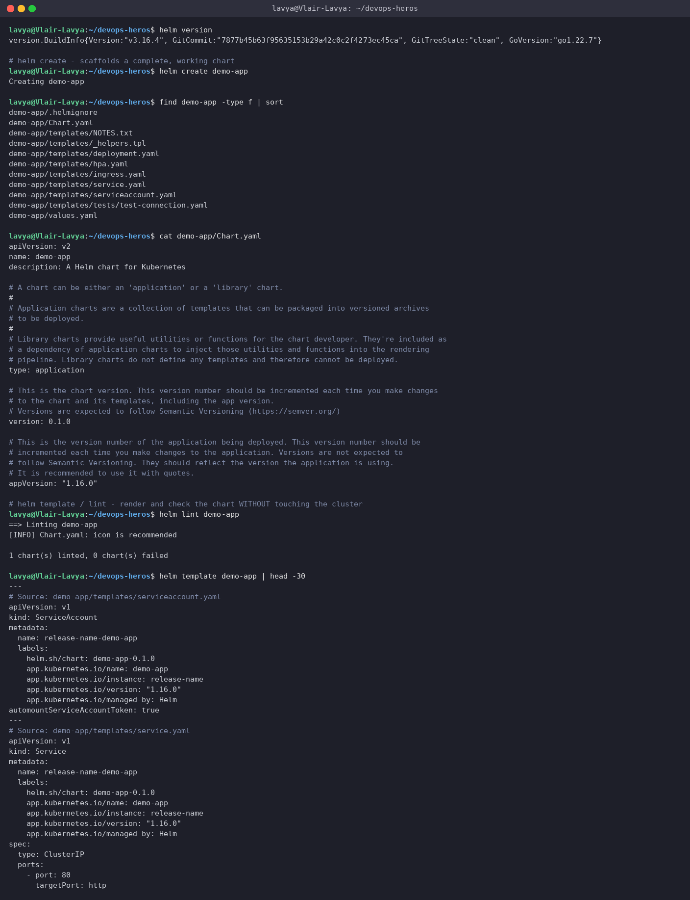
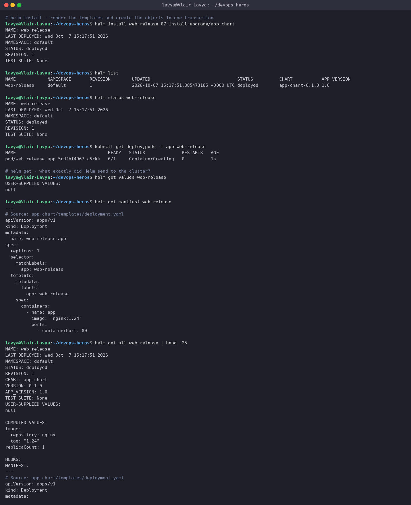
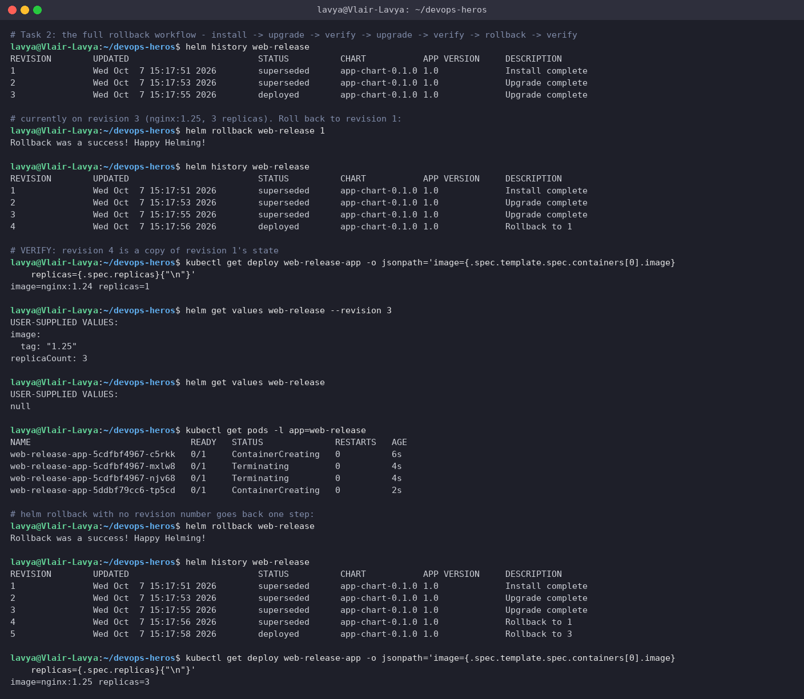
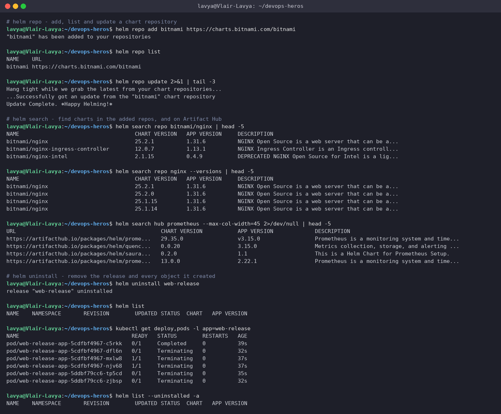
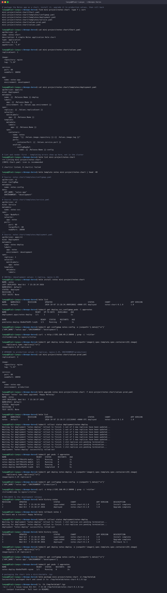

# Session 15: Helm

**Author:** Lavya ([@LAVYA255](https://github.com/LAVYA255))
**Course:** SST DevOps & Cloud [SWE]
**Session:** 15 - Helm
**Repository:** `devops-heros / session-15-helm`

**Setup:** Helm v3.16.4 against Minikube v1.39.0 (Kubernetes v1.37.0) in WSL2 Ubuntu. Every command was run for real and the output is pasted as it came back. Screenshots in `./screenshots/` are from the same session.

The short version of why Helm exists: a plain `kubectl apply -f` gives you no versioning, no rollback, and no way to deploy the same manifests to dev and prod with different values without copy-pasting YAML. Helm packages the manifests as a chart, templates the bits that change, and keeps a numbered revision history you can roll back to.

---

## Task 1: The Helm command set

### 1.1 `helm create`, `helm lint`, `helm template`

**Commands**
```bash
helm version
helm create demo-app
find demo-app -type f | sort
cat demo-app/Chart.yaml
helm lint demo-app
helm template demo-app | head -30
```

**Output**
```text
$ helm version
version.BuildInfo{Version:"v3.16.4", GitCommit:"7877b45b63f95635153b29a42c0c2f4273ec45ca", GitTreeState:"clean", GoVersion:"go1.22.7"}

# helm create - scaffolds a complete, working chart
$ helm create demo-app
Creating demo-app

$ find demo-app -type f | sort
demo-app/.helmignore
demo-app/Chart.yaml
demo-app/templates/NOTES.txt
demo-app/templates/_helpers.tpl
demo-app/templates/deployment.yaml
demo-app/templates/hpa.yaml
demo-app/templates/ingress.yaml
demo-app/templates/service.yaml
demo-app/templates/serviceaccount.yaml
demo-app/templates/tests/test-connection.yaml
demo-app/values.yaml

$ cat demo-app/Chart.yaml
apiVersion: v2
name: demo-app
description: A Helm chart for Kubernetes

# A chart can be either an 'application' or a 'library' chart.
#
# Application charts are a collection of templates that can be packaged into versioned archives
# to be deployed.
#
# Library charts provide useful utilities or functions for the chart developer. They're included as
# a dependency of application charts to inject those utilities and functions into the rendering
# pipeline. Library charts do not define any templates and therefore cannot be deployed.
type: application

# This is the chart version. This version number should be incremented each time you make changes
# to the chart and its templates, including the app version.
# Versions are expected to follow Semantic Versioning (https://semver.org/)
version: 0.1.0

# This is the version number of the application being deployed. This version number should be
# incremented each time you make changes to the application. Versions are not expected to
# follow Semantic Versioning. They should reflect the version the application is using.
# It is recommended to use it with quotes.
appVersion: "1.16.0"

# helm template / lint - render and check the chart WITHOUT touching the cluster
$ helm lint demo-app
==> Linting demo-app
[INFO] Chart.yaml: icon is recommended

1 chart(s) linted, 0 chart(s) failed

$ helm template demo-app | head -30
---
# Source: demo-app/templates/serviceaccount.yaml
apiVersion: v1
kind: ServiceAccount
metadata:
  name: release-name-demo-app
  labels:
    helm.sh/chart: demo-app-0.1.0
    app.kubernetes.io/name: demo-app
    app.kubernetes.io/instance: release-name
    app.kubernetes.io/version: "1.16.0"
    app.kubernetes.io/managed-by: Helm
automountServiceAccountToken: true
---
# Source: demo-app/templates/service.yaml
apiVersion: v1
kind: Service
metadata:
  name: release-name-demo-app
  labels:
    helm.sh/chart: demo-app-0.1.0
    app.kubernetes.io/name: demo-app
    app.kubernetes.io/instance: release-name
    app.kubernetes.io/version: "1.16.0"
    app.kubernetes.io/managed-by: Helm
spec:
  type: ClusterIP
  ports:
    - port: 80
      targetPort: http
```

**Screenshot**



`helm create` scaffolds a complete working chart. `helm lint` and `helm template` are the two commands worth using constantly: they render and check the chart **without touching the cluster**, so templating mistakes surface locally instead of as a half-applied release.

### 1.2 `helm install`, `list`, `status`, `get`

**Commands**
```bash
helm install web-release 07-install-upgrade/app-chart
helm list
helm status web-release
kubectl get deploy,pods -l app=web-release
helm get values web-release
helm get manifest web-release
helm get all web-release | head -25
```

**Output**
```text
# helm install - render the templates and create the objects in one transaction
$ helm install web-release 07-install-upgrade/app-chart
NAME: web-release
LAST DEPLOYED: Wed Oct  7 15:17:51 2026
NAMESPACE: default
STATUS: deployed
REVISION: 1
TEST SUITE: None

$ helm list
NAME       	NAMESPACE	REVISION	UPDATED                                	STATUS  	CHART          	APP VERSION
web-release	default  	1       	2026-10-07 15:17:51.085473185 +0000 UTC	deployed	app-chart-0.1.0	1.0

$ helm status web-release
NAME: web-release
LAST DEPLOYED: Wed Oct  7 15:17:51 2026
NAMESPACE: default
STATUS: deployed
REVISION: 1
TEST SUITE: None

$ kubectl get deploy,pods -l app=web-release
NAME                                   READY   STATUS              RESTARTS   AGE
pod/web-release-app-5cdfbf4967-c5rkk   0/1     ContainerCreating   0          1s

# helm get - what exactly did Helm send to the cluster?
$ helm get values web-release
USER-SUPPLIED VALUES:
null

$ helm get manifest web-release
---
# Source: app-chart/templates/deployment.yaml
apiVersion: apps/v1
kind: Deployment
metadata:
  name: web-release-app
spec:
  replicas: 1
  selector:
    matchLabels:
      app: web-release
  template:
    metadata:
      labels:
        app: web-release
    spec:
      containers:
        - name: app
          image: "nginx:1.24"
          ports:
            - containerPort: 80

$ helm get all web-release | head -25
NAME: web-release
LAST DEPLOYED: Wed Oct  7 15:17:51 2026
NAMESPACE: default
STATUS: deployed
REVISION: 1
CHART: app-chart
VERSION: 0.1.0
APP_VERSION: 1.0
TEST SUITE: None
USER-SUPPLIED VALUES:
null

COMPUTED VALUES:
image:
  repository: nginx
  tag: "1.24"
replicaCount: 1

HOOKS:
MANIFEST:
---
# Source: app-chart/templates/deployment.yaml
apiVersion: apps/v1
kind: Deployment
metadata:
```

**Screenshot**



`helm install <release> <chart>` renders the templates and creates the objects as one named release. The release name matters: it is the key for every later upgrade, rollback and uninstall, and it is what `{{ .Release.Name }}` resolves to inside the templates.

`helm get` is the one people forget. `get values` shows what you supplied, `get manifest` shows the exact YAML Helm sent to the API server. When a release does not do what you expect, `get manifest` settles the argument immediately.

### 1.3 `helm upgrade` and `helm history`

**Commands**
```bash
cat 07-install-upgrade/app-chart/values.yaml
helm upgrade web-release 07-install-upgrade/app-chart --set replicaCount=3
helm list
kubectl get pods -l app=web-release
helm upgrade web-release 07-install-upgrade/app-chart --set replicaCount=3 --set image.tag=1.25
kubectl get deploy web-release-app -o jsonpath='image={.spec.template.spec.containers[0].image} replicas={.spec.replicas}{"\n"}'
helm history web-release
```

**Output**
```text
# helm upgrade - change a value and roll out revision 2
$ cat 07-install-upgrade/app-chart/values.yaml
replicaCount: 1

image:
  repository: nginx
  tag: "1.24"

$ helm upgrade web-release 07-install-upgrade/app-chart --set replicaCount=3
Release "web-release" has been upgraded. Happy Helming!
NAME: web-release
LAST DEPLOYED: Wed Oct  7 15:17:53 2026
NAMESPACE: default
STATUS: deployed
REVISION: 2
TEST SUITE: None

$ helm list
NAME       	NAMESPACE	REVISION	UPDATED                                	STATUS  	CHART          	APP VERSION
web-release	default  	2       	2026-10-07 15:17:53.902233029 +0000 UTC	deployed	app-chart-0.1.0	1.0

$ kubectl get pods -l app=web-release
NAME                               READY   STATUS              RESTARTS   AGE
web-release-app-5cdfbf4967-c5rkk   0/1     ContainerCreating   0          3s
web-release-app-5cdfbf4967-mxlw8   0/1     ContainerCreating   0          1s
web-release-app-5cdfbf4967-njv68   0/1     ContainerCreating   0          1s

# revision 3: change the image tag too
$ helm upgrade web-release 07-install-upgrade/app-chart --set replicaCount=3 --set image.tag=1.25
Release "web-release" has been upgraded. Happy Helming!
NAME: web-release
LAST DEPLOYED: Wed Oct  7 15:17:55 2026
NAMESPACE: default
STATUS: deployed
REVISION: 3
TEST SUITE: None

$ kubectl get deploy web-release-app -o jsonpath='image={.spec.template.spec.containers[0].image} replicas={.spec.replicas}{"\n"}'
image=nginx:1.25 replicas=3

$ helm history web-release
REVISION	UPDATED                 	STATUS    	CHART          	APP VERSION	DESCRIPTION
1       	Wed Oct  7 15:17:51 2026	superseded	app-chart-0.1.0	1.0        	Install complete
2       	Wed Oct  7 15:17:53 2026	superseded	app-chart-0.1.0	1.0        	Upgrade complete
3       	Wed Oct  7 15:17:55 2026	deployed  	app-chart-0.1.0	1.0        	Upgrade complete
```

Each `helm upgrade` creates a new revision. `--set replicaCount=3` made revision 2, changing the image tag as well made revision 3. Helm stores each revision as a Secret in the namespace, which is how `history` and `rollback` work at all.

---

## Task 2: The full rollback workflow

Install, upgrade, verify, upgrade again, verify, roll back, verify.

**Commands**
```bash
helm history web-release
helm rollback web-release 1
helm history web-release
kubectl get deploy web-release-app -o jsonpath='image={.spec.template.spec.containers[0].image} replicas={.spec.replicas}{"\n"}'
helm get values web-release --revision 3
helm get values web-release
kubectl get pods -l app=web-release
helm rollback web-release
helm history web-release
kubectl get deploy web-release-app -o jsonpath='image={.spec.template.spec.containers[0].image} replicas={.spec.replicas}{"\n"}'
```

**Output**
```text
# Task 2: the full rollback workflow - install -> upgrade -> verify -> upgrade -> verify -> rollback -> verify
$ helm history web-release
REVISION	UPDATED                 	STATUS    	CHART          	APP VERSION	DESCRIPTION
1       	Wed Oct  7 15:17:51 2026	superseded	app-chart-0.1.0	1.0        	Install complete
2       	Wed Oct  7 15:17:53 2026	superseded	app-chart-0.1.0	1.0        	Upgrade complete
3       	Wed Oct  7 15:17:55 2026	deployed  	app-chart-0.1.0	1.0        	Upgrade complete

# currently on revision 3 (nginx:1.25, 3 replicas). Roll back to revision 1:
$ helm rollback web-release 1
Rollback was a success! Happy Helming!

$ helm history web-release
REVISION	UPDATED                 	STATUS    	CHART          	APP VERSION	DESCRIPTION
1       	Wed Oct  7 15:17:51 2026	superseded	app-chart-0.1.0	1.0        	Install complete
2       	Wed Oct  7 15:17:53 2026	superseded	app-chart-0.1.0	1.0        	Upgrade complete
3       	Wed Oct  7 15:17:55 2026	superseded	app-chart-0.1.0	1.0        	Upgrade complete
4       	Wed Oct  7 15:17:56 2026	deployed  	app-chart-0.1.0	1.0        	Rollback to 1

# VERIFY: revision 4 is a copy of revision 1's state
$ kubectl get deploy web-release-app -o jsonpath='image={.spec.template.spec.containers[0].image} replicas={.spec.replicas}{"\n"}'
image=nginx:1.24 replicas=1

$ helm get values web-release --revision 3
USER-SUPPLIED VALUES:
image:
  tag: "1.25"
replicaCount: 3

$ helm get values web-release
USER-SUPPLIED VALUES:
null

$ kubectl get pods -l app=web-release
NAME                               READY   STATUS              RESTARTS   AGE
web-release-app-5cdfbf4967-c5rkk   0/1     ContainerCreating   0          6s
web-release-app-5cdfbf4967-mxlw8   0/1     Terminating         0          4s
web-release-app-5cdfbf4967-njv68   0/1     Terminating         0          4s
web-release-app-5ddbf79cc6-tp5cd   0/1     ContainerCreating   0          2s

# helm rollback with no revision number goes back one step:
$ helm rollback web-release
Rollback was a success! Happy Helming!

$ helm history web-release
REVISION	UPDATED                 	STATUS    	CHART          	APP VERSION	DESCRIPTION
1       	Wed Oct  7 15:17:51 2026	superseded	app-chart-0.1.0	1.0        	Install complete
2       	Wed Oct  7 15:17:53 2026	superseded	app-chart-0.1.0	1.0        	Upgrade complete
3       	Wed Oct  7 15:17:55 2026	superseded	app-chart-0.1.0	1.0        	Upgrade complete
4       	Wed Oct  7 15:17:56 2026	superseded	app-chart-0.1.0	1.0        	Rollback to 1
5       	Wed Oct  7 15:17:58 2026	deployed  	app-chart-0.1.0	1.0        	Rollback to 3

$ kubectl get deploy web-release-app -o jsonpath='image={.spec.template.spec.containers[0].image} replicas={.spec.replicas}{"\n"}'
image=nginx:1.25 replicas=3
```

**Screenshot**



The thing to notice: `helm rollback web-release 1` does not delete revisions 2 and 3. It creates **revision 4** whose content is a copy of revision 1. The history only ever grows forward.

That is the same idea as `kubectl rollout undo` from Session 10, and it matters for the same reason: your history stays a complete audit trail, and you can roll back a rollback. `helm rollback` with no number goes back exactly one step.

`helm get values --revision 3` is how you prove what a past revision actually contained, which is useful when someone asks "what was deployed last Tuesday".

---

## Task 3: `helm repo`, `helm search`, `helm uninstall`

**Commands**
```bash
helm repo add bitnami https://charts.bitnami.com/bitnami
helm repo list
helm repo update 2>&1 | tail -3
helm search repo bitnami/nginx | head -5
helm search repo nginx --versions | head -5
helm search hub prometheus --max-col-width=45 2>/dev/null | head -5
helm uninstall web-release
helm list
kubectl get deploy,pods -l app=web-release
helm list --uninstalled -a
```

**Output**
```text
# helm repo - add, list and update a chart repository
$ helm repo add bitnami https://charts.bitnami.com/bitnami
"bitnami" has been added to your repositories

$ helm repo list
NAME   	URL
bitnami	https://charts.bitnami.com/bitnami

$ helm repo update 2>&1 | tail -3
Hang tight while we grab the latest from your chart repositories...
...Successfully got an update from the "bitnami" chart repository
Update Complete. ⎈Happy Helming!⎈

# helm search - find charts in the added repos, and on Artifact Hub
$ helm search repo bitnami/nginx | head -5
NAME                            	CHART VERSION	APP VERSION	DESCRIPTION
bitnami/nginx                   	25.2.1       	1.31.6     	NGINX Open Source is a web server that can be a...
bitnami/nginx-ingress-controller	12.0.7       	1.13.1     	NGINX Ingress Controller is an Ingress controll...
bitnami/nginx-intel             	2.1.15       	0.4.9      	DEPRECATED NGINX Open Source for Intel is a lig...

$ helm search repo nginx --versions | head -5
NAME                            	CHART VERSION	APP VERSION	DESCRIPTION
bitnami/nginx                   	25.2.1       	1.31.6     	NGINX Open Source is a web server that can be a...
bitnami/nginx                   	25.2.0       	1.31.6     	NGINX Open Source is a web server that can be a...
bitnami/nginx                   	25.1.15      	1.31.6     	NGINX Open Source is a web server that can be a...
bitnami/nginx                   	25.1.14      	1.31.6     	NGINX Open Source is a web server that can be a...

$ helm search hub prometheus --max-col-width=45 2>/dev/null | head -5
URL                                          	CHART VERSION     	APP VERSION            	DESCRIPTION
https://artifacthub.io/packages/helm/prome...	29.35.0           	v3.15.0                	Prometheus is a monitoring system and time...
https://artifacthub.io/packages/helm/quenc...	0.0.20            	3.15.0                 	Metrics collection, storage, and alerting ...
https://artifacthub.io/packages/helm/saura...	0.2.0             	1.1                    	This is a Helm Chart for Prometheus Setup.
https://artifacthub.io/packages/helm/prome...	13.0.0            	2.22.1                 	Prometheus is a monitoring system and time...

# helm uninstall - remove the release and every object it created
$ helm uninstall web-release
release "web-release" uninstalled

$ helm list
NAME	NAMESPACE	REVISION	UPDATED	STATUS	CHART	APP VERSION

$ kubectl get deploy,pods -l app=web-release
NAME                                   READY   STATUS        RESTARTS   AGE
pod/web-release-app-5cdfbf4967-c5rkk   0/1     Completed     0          39s
pod/web-release-app-5cdfbf4967-dfl6n   0/1     Terminating   0          32s
pod/web-release-app-5cdfbf4967-mxlw8   1/1     Terminating   0          37s
pod/web-release-app-5cdfbf4967-njv68   1/1     Terminating   0          37s
pod/web-release-app-5ddbf79cc6-tp5cd   0/1     Terminating   0          35s
pod/web-release-app-5ddbf79cc6-zjbsp   0/1     Terminating   0          32s

$ helm list --uninstalled -a
NAME	NAMESPACE	REVISION	UPDATED	STATUS	CHART	APP VERSION
```

**Screenshot**



A repository is just an index of packaged charts over HTTP. `helm search repo` looks in the repos you have added; `helm search hub` searches Artifact Hub across all public repos.

`helm uninstall` removes every object the release created, in one command, with no need to remember what it made. That is one of the real day-to-day wins over `kubectl apply`: deleting a release is reliable, whereas deleting a pile of hand-applied manifests always leaves something behind.

---

## Task 4: Mini project, packaging the Notes app

Package an app as a chart, install it with development values, upgrade it to production values, then roll back.

**Commands**
```bash
find mini-project/notes-chart -type f | sort
cat mini-project/notes-chart/Chart.yaml
cat mini-project/notes-chart/values.yaml
cat mini-project/notes-chart/templates/deployment.yaml
helm lint mini-project/notes-chart
helm template notes mini-project/notes-chart | head -40
helm install notes mini-project/notes-chart
helm list
kubectl get deploy,svc,configmap,pods -l app=notes
kubectl get configmap notes-config -o jsonpath='{.data}{"\n"}'
curl -s http://192.168.49.2:30090 | grep -i '<title>'
kubectl get deploy notes-deploy -o jsonpath='image={.spec.template.spec.containers[0].image} replicas={.spec.replicas}{"\n"}'
cat mini-project/notes-chart/values-prod.yaml
helm upgrade notes mini-project/notes-chart -f mini-project/notes-chart/values-prod.yaml
helm list
kubectl rollout status deployment/notes-deploy
kubectl get pods -l app=notes
kubectl get deploy notes-deploy -o jsonpath='image={.spec.template.spec.containers[0].image} replicas={.spec.replicas}{"\n"}'
kubectl get configmap notes-config -o jsonpath='{.data}{"\n"}'
curl -s http://192.168.49.2:30090 | grep -i '<title>'
helm history notes
helm rollback notes 1
kubectl rollout status deployment/notes-deploy
helm history notes
kubectl get deploy notes-deploy -o jsonpath='image={.spec.template.spec.containers[0].image} replicas={.spec.replicas}{"\n"}'
kubectl get configmap notes-config -o jsonpath='{.data}{"\n"}'
kubectl get pods -l app=notes
helm package mini-project/notes-chart -d /tmp/helmlab
ls -lh /tmp/helmlab/*.tgz
helm show chart /tmp/helmlab/notes-chart-0.1.0.tgz
helm uninstall notes
helm list
kubectl get all -l app=notes
```

**Output**
```text
# package the Notes app as a chart, install it, upgrade it to production values, then roll back
$ find mini-project/notes-chart -type f | sort
mini-project/notes-chart/Chart.yaml
mini-project/notes-chart/templates/configmap.yaml
mini-project/notes-chart/templates/deployment.yaml
mini-project/notes-chart/templates/service.yaml
mini-project/notes-chart/values-prod.yaml
mini-project/notes-chart/values.yaml

$ cat mini-project/notes-chart/Chart.yaml
apiVersion: v2
name: notes-chart
description: A simple Notes application Helm chart
type: application
version: 0.1.0
appVersion: "1.0"

$ cat mini-project/notes-chart/values.yaml
replicaCount: 1

image:
  repository: nginx
  tag: "1.24"

service:
  port: 80
  nodePort: 30090

app:
  name: notes-app
  environment: development

$ cat mini-project/notes-chart/templates/deployment.yaml
apiVersion: apps/v1
kind: Deployment
metadata:
  name: {{ .Release.Name }}-deploy
  labels:
    app: {{ .Release.Name }}
    environment: {{ .Values.app.environment }}
spec:
  replicas: {{ .Values.replicaCount }}
  selector:
    matchLabels:
      app: {{ .Release.Name }}
  template:
    metadata:
      labels:
        app: {{ .Release.Name }}
    spec:
      containers:
        - name: notes
          image: "{{ .Values.image.repository }}:{{ .Values.image.tag }}"
          ports:
            - containerPort: {{ .Values.service.port }}
          envFrom:
            - configMapRef:
                name: {{ .Release.Name }}-config

# lint and render first - templating errors show up here, not in the cluster
$ helm lint mini-project/notes-chart
==> Linting mini-project/notes-chart
[INFO] Chart.yaml: icon is recommended

1 chart(s) linted, 0 chart(s) failed

$ helm template notes mini-project/notes-chart | head -40
---
# Source: notes-chart/templates/configmap.yaml
apiVersion: v1
kind: ConfigMap
metadata:
  name: notes-config
data:
  APP_NAME: "notes-app"
  ENVIRONMENT: "development"
---
# Source: notes-chart/templates/service.yaml
apiVersion: v1
kind: Service
metadata:
  name: notes-svc
spec:
  type: NodePort
  selector:
    app: notes
  ports:
    - port: 80
      targetPort: 80
      nodePort: 30090
---
# Source: notes-chart/templates/deployment.yaml
apiVersion: apps/v1
kind: Deployment
metadata:
  name: notes-deploy
  labels:
    app: notes
    environment: development
spec:
  replicas: 1
  selector:
    matchLabels:
      app: notes
  template:
    metadata:
      labels:

# INSTALL (development values: 1 replica, nginx:1.24)
$ helm install notes mini-project/notes-chart
NAME: notes
LAST DEPLOYED: Wed Oct  7 15:18:34 2026
NAMESPACE: default
STATUS: deployed
REVISION: 1
TEST SUITE: None

$ helm list
NAME 	NAMESPACE	REVISION	UPDATED                                	STATUS  	CHART            	APP VERSION
notes	default  	1       	2026-10-07 15:18:34.408910662 +0000 UTC	deployed	notes-chart-0.1.0	1.0

$ kubectl get deploy,svc,configmap,pods -l app=notes
NAME                           READY   UP-TO-DATE   AVAILABLE   AGE
deployment.apps/notes-deploy   1/1     1            1           1s

NAME                                READY   STATUS    RESTARTS   AGE
pod/notes-deploy-6bdbd76d95-lzq2b   1/1     Running   0          1s

$ kubectl get configmap notes-config -o jsonpath='{.data}{"\n"}'
{"APP_NAME":"notes-app","ENVIRONMENT":"development"}

$ curl -s http://192.168.49.2:30090 | grep -i '<title>'
<title>Welcome to nginx!</title>

$ kubectl get deploy notes-deploy -o jsonpath='image={.spec.template.spec.containers[0].image} replicas={.spec.replicas}{"\n"}'
image=nginx:1.24 replicas=1

# UPGRADE to production values (3 replicas, nginx:1.25, ENVIRONMENT=production)
$ cat mini-project/notes-chart/values-prod.yaml
replicaCount: 3

image:
  repository: nginx
  tag: "1.25"

service:
  port: 80
  nodePort: 30090

app:
  name: notes-app
  environment: production

$ helm upgrade notes mini-project/notes-chart -f mini-project/notes-chart/values-prod.yaml
Release "notes" has been upgraded. Happy Helming!
NAME: notes
LAST DEPLOYED: Wed Oct  7 15:18:37 2026
NAMESPACE: default
STATUS: deployed
REVISION: 2
TEST SUITE: None

$ helm list
NAME 	NAMESPACE	REVISION	UPDATED                                	STATUS  	CHART            	APP VERSION
notes	default  	2       	2026-10-07 15:18:37.122136965 +0000 UTC	deployed	notes-chart-0.1.0	1.0

$ kubectl rollout status deployment/notes-deploy
Waiting for deployment "notes-deploy" rollout to finish: 1 out of 3 new replicas have been updated...
Waiting for deployment "notes-deploy" rollout to finish: 1 out of 3 new replicas have been updated...
Waiting for deployment "notes-deploy" rollout to finish: 2 out of 3 new replicas have been updated...
Waiting for deployment "notes-deploy" rollout to finish: 2 out of 3 new replicas have been updated...
Waiting for deployment "notes-deploy" rollout to finish: 2 out of 3 new replicas have been updated...
Waiting for deployment "notes-deploy" rollout to finish: 2 out of 3 new replicas have been updated...
Waiting for deployment "notes-deploy" rollout to finish: 1 old replicas are pending termination...
Waiting for deployment "notes-deploy" rollout to finish: 1 old replicas are pending termination...
Waiting for deployment "notes-deploy" rollout to finish: 1 old replicas are pending termination...
deployment "notes-deploy" successfully rolled out

$ kubectl get pods -l app=notes
NAME                            READY   STATUS      RESTARTS   AGE
notes-deploy-54f799c6f6-bw9jx   1/1     Running     0          1s
notes-deploy-54f799c6f6-mb8zh   1/1     Running     0          2s
notes-deploy-54f799c6f6-mr7x4   1/1     Running     0          2s
notes-deploy-6bdbd76d95-lzq2b   0/1     Completed   0          5s

$ kubectl get deploy notes-deploy -o jsonpath='image={.spec.template.spec.containers[0].image} replicas={.spec.replicas}{"\n"}'
image=nginx:1.25 replicas=3

$ kubectl get configmap notes-config -o jsonpath='{.data}{"\n"}'
{"APP_NAME":"notes-app","ENVIRONMENT":"production"}

$ curl -s http://192.168.49.2:30090 | grep -i '<title>'
<title>Welcome to nginx!</title>

# ROLLBACK to the development release
$ helm history notes
REVISION	UPDATED                 	STATUS    	CHART            	APP VERSION	DESCRIPTION
1       	Wed Oct  7 15:18:34 2026	superseded	notes-chart-0.1.0	1.0        	Install complete
2       	Wed Oct  7 15:18:37 2026	deployed  	notes-chart-0.1.0	1.0        	Upgrade complete

$ helm rollback notes 1
Rollback was a success! Happy Helming!

$ kubectl rollout status deployment/notes-deploy
Waiting for deployment "notes-deploy" rollout to finish: 1 old replicas are pending termination...
Waiting for deployment "notes-deploy" rollout to finish: 1 old replicas are pending termination...
deployment "notes-deploy" successfully rolled out

$ helm history notes
REVISION	UPDATED                 	STATUS    	CHART            	APP VERSION	DESCRIPTION
1       	Wed Oct  7 15:18:34 2026	superseded	notes-chart-0.1.0	1.0        	Install complete
2       	Wed Oct  7 15:18:37 2026	superseded	notes-chart-0.1.0	1.0        	Upgrade complete
3       	Wed Oct  7 15:18:40 2026	deployed  	notes-chart-0.1.0	1.0        	Rollback to 1

$ kubectl get deploy notes-deploy -o jsonpath='image={.spec.template.spec.containers[0].image} replicas={.spec.replicas}{"\n"}'
image=nginx:1.24 replicas=1

$ kubectl get configmap notes-config -o jsonpath='{.data}{"\n"}'
{"APP_NAME":"notes-app","ENVIRONMENT":"development"}

$ kubectl get pods -l app=notes
NAME                            READY   STATUS    RESTARTS   AGE
notes-deploy-6bdbd76d95-rqznm   1/1     Running   0          2s

# packaging the chart into a distributable .tgz
$ helm package mini-project/notes-chart -d /tmp/helmlab
Successfully packaged chart and saved it to: /tmp/helmlab/notes-chart-0.1.0.tgz

$ ls -lh /tmp/helmlab/*.tgz
-rw-r--r-- 1 lavya lavya 811 Oct  7 15:18 /tmp/helmlab/notes-chart-0.1.0.tgz

$ helm show chart /tmp/helmlab/notes-chart-0.1.0.tgz
apiVersion: v2
appVersion: "1.0"
description: A simple Notes application Helm chart
name: notes-chart
type: application
version: 0.1.0

# cleanup
$ helm uninstall notes
release "notes" uninstalled

$ helm list
NAME	NAMESPACE	REVISION	UPDATED	STATUS	CHART	APP VERSION

$ kubectl get all -l app=notes
NAME                                READY   STATUS      RESTARTS   AGE
pod/notes-deploy-6bdbd76d95-rqznm   0/1     Completed   0          4s
```

**Screenshot**



The chart is three templates driven by `values.yaml`:

```
notes-chart/
  Chart.yaml            name, version, appVersion
  values.yaml           development: 1 replica, nginx:1.24, ENVIRONMENT=development
  values-prod.yaml      production:  3 replicas, nginx:1.25, ENVIRONMENT=production
  templates/
    configmap.yaml      {{ .Release.Name }}-config
    deployment.yaml     replicas, image and envFrom all templated
    service.yaml        NodePort 30090
```

What the run demonstrates, in order:

| Step | Result |
| --- | --- |
| `helm install notes` | revision 1, 1 replica, `nginx:1.24`, ConfigMap says `development` |
| `helm upgrade -f values-prod.yaml` | revision 2, 3 replicas, `nginx:1.25`, ConfigMap says `production` |
| `helm rollback notes 1` | revision 3, back to 1 replica, `nginx:1.24`, ConfigMap says `development` |

The ConfigMap is the detail that makes the point. It is not just the replica count that rolls back, it is the whole release: image, replicas and config all move together as one versioned unit. Doing that by hand means remembering to revert three separate files consistently.

`helm package` then turns the chart into a single versioned `.tgz` (811 bytes here) that can be pushed to a repository and installed anywhere, which is what makes charts shareable in the first place.

---

## What I took away

- `helm lint` and `helm template` before every install. Templating errors are much cheaper to find locally than in a half-applied release.
- The release name is the unit of everything. Install, upgrade, rollback and uninstall all key off it.
- Rollback rolls forward: it creates a new revision that copies an old one, so the history is never rewritten.
- One chart plus two values files replaces two near-identical copies of the manifests, and that is really the whole argument for Helm.

---

## References

- Helm docs: https://helm.sh/docs/
- Chart template guide: https://helm.sh/docs/chart_template_guide/
- Helm commands: https://helm.sh/docs/helm/
- Artifact Hub: https://artifacthub.io/
- Course notes in this folder: the numbered directories and `mini-project/README.md`
