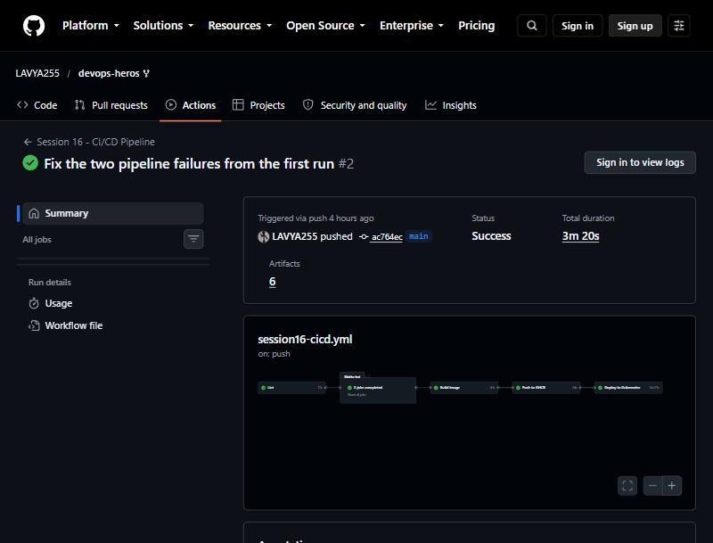

# Session 16: CI/CD with GitHub Actions

**Author:** Lavya ([@LAVYA255](https://github.com/LAVYA255))
**Course:** SST DevOps & Cloud [SWE]
**Session:** 16 - CI/CD and GitHub Actions
**Repository:** `devops-heros / session-16-github-actions`

**This pipeline really runs.** Every job below executed on GitHub's hosted runners under my account, not locally and not as a mock.

- Workflow file: [`.github/workflows/session16-cicd.yml`](../.github/workflows/session16-cicd.yml)
- Application: [`session-16-github-actions/demo-project/`](./demo-project)
- Green run: https://github.com/LAVYA255/devops-heros/actions/runs/37646273993

---

## One thing to know before reading the rest

GitHub only executes workflows found in `.github/workflows/` **at the root of the repository**. Every workflow file already in this course folder (`03-github-actions-intro/.github/workflows/hello.yml`, `09-build-test-pipeline/.github/workflows/ci.yml`, and so on) is inert, because it sits in a subdirectory. They are useful to read, but GitHub never runs them.

So my pipeline lives at the repo root and uses a `paths:` filter to only trigger on changes under `session-16-github-actions/demo-project/`, with `defaults.run.working-directory` pointing at the project so the individual steps stay short.

---

## The application

A small Flask calculator API, chosen because it is simple enough to read in one sitting but real enough to test, containerise and deploy.

```
demo-project/
├── app/
│   ├── calculator.py     pure functions, no framework, trivially unit-testable
│   └── server.py         Flask wrapper: /healthz, /, /calc
├── tests/
│   ├── test_calculator.py   6 tests on the pure logic
│   └── test_server.py       5 tests on the HTTP layer
├── k8s/deployment.yaml   Deployment + NodePort Service, with probes
├── Dockerfile            multi-stage, non-root, healthcheck
├── requirements.txt      pinned runtime deps
└── requirements-dev.txt  pytest, pytest-cov, flake8
```

The split between `calculator.py` and `server.py` is deliberate: the business logic has no Flask import, so most of the tests need no HTTP machinery at all.

The Dockerfile is multi-stage. The first stage builds wheels, the second installs them, so no compiler or pip cache ends up in the shipped image. It also creates a `appuser` (uid 10001) and sets `USER appuser`, because running as root is the first thing any image scanner flags, and the Session 17 gate rejects it.

---

## The pipeline

```
 push / PR to main (paths: demo-project/**)
        │
        ▼
   ┌─────────┐
   │  lint   │  flake8
   └────┬────┘
        ▼
   ┌────────────────────────────────┐
   │  test (matrix)                 │  pytest + coverage
   │  python 3.10 │ 3.11 │ 3.12     │  3 jobs in parallel
   └────┬───────────────────────────┘
        ▼
   ┌─────────┐
   │  build  │  docker build -> run the container -> curl /healthz -> save as artifact
   └────┬────┘
        │   (main only, not on PRs)
        ▼
   ┌──────────┐
   │ publish  │  push to ghcr.io
   └────┬─────┘
        ▼
   ┌──────────┐
   │  deploy  │  create a kind cluster, load the image, kubectl apply, verify
   └──────────┘
```

CI (lint, test, build) runs on every push and pull request. CD (publish, deploy) is gated on `github.ref == 'refs/heads/main'`, which is the usual split: you want tests on every branch, but you only release from the trunk.

### Run result

All seven jobs green:

| Job | Result | Duration |
| --- | --- | --- |
| Lint | success | 17s |
| Test (Python 3.10) | success | 17s |
| Test (Python 3.11) | success | 9s |
| Test (Python 3.12) | success | 11s |
| Build image | success | 41s |
| Push to GHCR | success | 24s |
| Deploy to Kubernetes | success | 1m 21s |

The three test jobs started at the same second and finished independently, which is the matrix doing its job.

---

## How each concept shows up

**CI vs CD.** CI is the first three jobs: prove the change is good. CD is the last two: get it to users. The `if:` condition on `publish` is the actual boundary between them.

**Workflow, jobs, steps.** One workflow file, seven jobs, each job a list of steps. Jobs run on separate runners and are parallel unless `needs:` forces an order. Steps inside a job are sequential and share a filesystem. That is why the image has to be passed between `build` and `deploy` as an artifact rather than just existing.

**Runners.** All `ubuntu-latest`, GitHub-hosted. The `test` job uses `strategy.matrix` to run the same steps on three Python versions, with `fail-fast: false` so one failing version does not cancel the others.

**Secrets.** No secret had to be created by hand. `secrets.GITHUB_TOKEN` is injected automatically per run, scoped to this repository, and expires when the run ends. Giving the job `permissions: packages: write` is enough to push to GHCR. A long-lived personal access token in the repo settings would have worked too, and would have been strictly worse.

**Artifacts.** Three kinds: test results and coverage XML per Python version (`if: always()` so they upload even when tests fail, which is exactly when you want them), and the built container image as a tarball so the deploy job gets the identical bits that were tested rather than rebuilding.

**Build and test.** `pytest` with `--junitxml` and `--cov`, and `flake8` as a separate upstream job so a formatting problem fails in 17 seconds instead of after the whole matrix.

---

## The deploy job is a real deployment

This is the part I did not want to fake. The job creates an actual Kubernetes cluster inside the runner with `helm/kind-action`, loads the image that was built earlier, applies the manifests, waits for the rollout, and then verifies by curling the Service from inside the cluster:

```
kubectl run verifier --rm -i --restart=Never --image=curlimages/curl:8.5.0 -- \
  sh -c 'curl -sf http://calculator-api/healthz && curl -sf "http://calculator-api/calc?op=add&a=40&b=2"'
```

If the image were broken, the manifest wrong, or the probes misconfigured, `kubectl rollout status` would time out and the job would fail. It passes, so the artifact genuinely runs in Kubernetes.

---

## What went wrong first time

The first run failed on exactly this job, with `error: timed out waiting for the condition` after `1 out of 2 new replicas have been updated`.

The cause: the committed manifest pins `image: ...:latest`. A `:latest` tag makes the kubelet default to `imagePullPolicy: Always`, so it ignored the image I had just loaded into the node and tried to pull from GHCR instead, where the package is private on a fresh repository. The pull failed, the pod never went Ready, and the rollout sat there until it timed out.

Two changes fixed it:

1. `imagePullPolicy: IfNotPresent` in the committed manifest, so the kubelet uses the local copy.
2. The deploy step now renders the exact image reference into the manifest with `sed` before applying, instead of applying `:latest` first and patching afterwards. That way no pod is ever created pointing at a tag that has to be pulled.

I also made both deploy jobs dump `kubectl get pods -o wide` and `kubectl describe pods` on failure, because a bare timeout message tells you nothing. That is the change I would keep in any real pipeline.

---

## Screenshots



All seven jobs green, 6 artifacts produced, 3m 20s total.

---

## References

- GitHub Actions docs: https://docs.github.com/en/actions
- Workflow syntax: https://docs.github.com/en/actions/using-workflows/workflow-syntax-for-github-actions
- Publishing to GHCR: https://docs.github.com/en/packages/managing-github-packages-using-github-actions-workflows
- kind-action: https://github.com/helm/kind-action
- Course material in this folder: `01-ci-vs-cd` through `10-final-cicd-pipeline`
