# Session 10: Kubernetes Core Objects - Pods, Controllers & Deployment Strategies

**Author:** Lavya ([@LAVYA255](https://github.com/LAVYA255))
**Course:** SST DevOps & Cloud [SWE]
**Session:** 10 - Core Objects (plus the Session 10 material that was covered in Lectures 11 and 12)
**Repository:** `devops-heros / session10-k8s-core-objects`

**Environment:** Minikube v1.39.0 (docker driver) on WSL2 Ubuntu 26.04, Kubernetes v1.37.0, containerd 2.3.4. Everything was run from this directory (`cd session10-k8s-core-objects`) unless a task says otherwise. Outputs are pasted verbatim; screenshots in `./screenshots/` are captures of the same terminal session. All NodePort tests use `$(minikube ip)` = `192.168.49.2`.

---

## Task 1: Cluster Health Verification & Baseline Checks

Make sure the cluster, its control plane endpoints and CoreDNS are all up before deploying anything.

**Commands**
```bash
kubectl version
kubectl cluster-info
kubectl get nodes -o wide
kubectl get pods -n kube-system
```

**Output**
```text
$ kubectl version
Client Version: v1.37.0
Kustomize Version: v5.8.1
Server Version: v1.37.0

$ kubectl cluster-info
Kubernetes control plane is running at https://127.0.0.1:32771
CoreDNS is running at https://127.0.0.1:32771/api/v1/namespaces/kube-system/services/kube-dns:dns/proxy

To further debug and diagnose cluster problems, use 'kubectl cluster-info dump'.

$ kubectl get nodes -o wide
NAME       STATUS   ROLES           AGE     VERSION   INTERNAL-IP    EXTERNAL-IP   OS-IMAGE                         KERNEL-VERSION                              CONTAINER-RUNTIME
minikube   Ready    control-plane   5m18s   v1.37.0   192.168.49.2   <none>        Debian GNU/Linux 12 (bookworm)   6.18.33.2-microsoft-standard-WSL2 (amd64)   containerd://2.3.4

$ kubectl get pods -n kube-system
NAME                               READY   STATUS    RESTARTS        AGE
coredns-559f6c778d-blkrr           1/1     Running   1 (2m32s ago)   5m12s
etcd-minikube                      1/1     Running   1 (2m32s ago)   5m18s
kindnet-7ptc8                      1/1     Running   1 (2m32s ago)   5m12s
kube-apiserver-minikube            1/1     Running   1 (2m32s ago)   5m18s
kube-controller-manager-minikube   1/1     Running   1 (2m32s ago)   5m19s
kube-proxy-f9kch                   1/1     Running   1 (2m32s ago)   5m12s
kube-scheduler-minikube            1/1     Running   1 (2m32s ago)   5m18s
storage-provisioner                1/1     Running   2 (98s ago)     5m15s
```

**Screenshot**

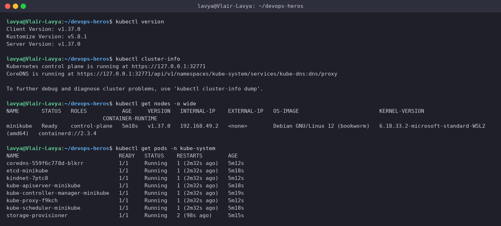

---

## Task 2: Standard Pod Deployment, Inspection & Teardown (`pod.yml`)

Create a single Nginx Pod, inspect its IP / node / labels / logs, then delete it.

**Commands**
```bash
cat pod.yml
kubectl apply -f pod.yml
kubectl wait --for=condition=Ready pod/nginx-pod --timeout=60s
kubectl get pods
kubectl get pods -o wide
kubectl get pod nginx-pod --show-labels
kubectl logs nginx-pod
kubectl delete -f pod.yml
kubectl get pods
```

**Output**
```text
$ cat pod.yml
apiVersion: v1
kind: Pod

metadata:
  name: nginx-pod
  labels:
    app: nginx

spec:
  containers:
    - name: nginx
      image: nginx:latest
      ports:
        - containerPort: 80
$ kubectl apply -f pod.yml
pod/nginx-pod created

$ kubectl wait --for=condition=Ready pod/nginx-pod --timeout=60s
pod/nginx-pod condition met

$ kubectl get pods
NAME        READY   STATUS    RESTARTS   AGE
nginx-pod   1/1     Running   0          6s

$ kubectl get pods -o wide
NAME        READY   STATUS    RESTARTS   AGE   IP           NODE       NOMINATED NODE   READINESS GATES
nginx-pod   1/1     Running   0          9s    10.244.0.3   minikube   <none>           <none>

$ kubectl get pod nginx-pod --show-labels
NAME        READY   STATUS    RESTARTS   AGE   LABELS
nginx-pod   1/1     Running   0          11s   app=nginx

$ kubectl logs nginx-pod
/docker-entrypoint.sh: /docker-entrypoint.d/ is not empty, will attempt to perform configuration
/docker-entrypoint.sh: Looking for shell scripts in /docker-entrypoint.d/
/docker-entrypoint.sh: Launching /docker-entrypoint.d/10-listen-on-ipv6-by-default.sh
10-listen-on-ipv6-by-default.sh: info: Getting the checksum of /etc/nginx/conf.d/default.conf
10-listen-on-ipv6-by-default.sh: info: Enabled listen on IPv6 in /etc/nginx/conf.d/default.conf
/docker-entrypoint.sh: Sourcing /docker-entrypoint.d/15-local-resolvers.envsh
/docker-entrypoint.sh: Launching /docker-entrypoint.d/20-envsubst-on-templates.sh
/docker-entrypoint.sh: Launching /docker-entrypoint.d/30-tune-worker-processes.sh
/docker-entrypoint.sh: Configuration complete; ready for start up
2026/09/17 20:10:29 [notice] 1#1: using the "epoll" event method
2026/09/17 20:10:29 [notice] 1#1: nginx/1.31.6
2026/09/17 20:10:29 [notice] 1#1: built by gcc 14.2.0 (Debian 14.2.0-19)
2026/09/17 20:10:29 [notice] 1#1: OS: Linux 6.18.33.2-microsoft-standard-WSL2
2026/09/17 20:10:29 [notice] 1#1: getrlimit(RLIMIT_NOFILE): 1048576:1048576
2026/09/17 20:10:29 [notice] 1#1: start worker processes
2026/09/17 20:10:29 [notice] 1#1: start worker process 29
2026/09/17 20:10:29 [notice] 1#1: start worker process 30
2026/09/17 20:10:29 [notice] 1#1: start worker process 31
2026/09/17 20:10:29 [notice] 1#1: start worker process 32
2026/09/17 20:10:29 [notice] 1#1: start worker process 33
2026/09/17 20:10:29 [notice] 1#1: start worker process 34
2026/09/17 20:10:29 [notice] 1#1: start worker process 35
2026/09/17 20:10:29 [notice] 1#1: start worker process 36
2026/09/17 20:10:29 [notice] 1#1: start worker process 37
2026/09/17 20:10:29 [notice] 1#1: start worker process 38
2026/09/17 20:10:29 [notice] 1#1: start worker process 39
2026/09/17 20:10:29 [notice] 1#1: start worker process 40
2026/09/17 20:10:29 [notice] 1#1: start worker process 41
2026/09/17 20:10:29 [notice] 1#1: start worker process 42
2026/09/17 20:10:29 [notice] 1#1: start worker process 43
2026/09/17 20:10:29 [notice] 1#1: start worker process 44
2026/09/17 20:10:29 [notice] 1#1: start worker process 45
2026/09/17 20:10:29 [notice] 1#1: start worker process 46
2026/09/17 20:10:29 [notice] 1#1: start worker process 47
2026/09/17 20:10:29 [notice] 1#1: start worker process 48
2026/09/17 20:10:29 [notice] 1#1: start worker process 49
2026/09/17 20:10:29 [notice] 1#1: start worker process 50
2026/09/17 20:10:29 [notice] 1#1: start worker process 51
2026/09/17 20:10:29 [notice] 1#1: start worker process 52

$ kubectl delete -f pod.yml
pod "nginx-pod" deleted from default namespace

$ kubectl get pods
No resources found in default namespace.
```

**Screenshot**

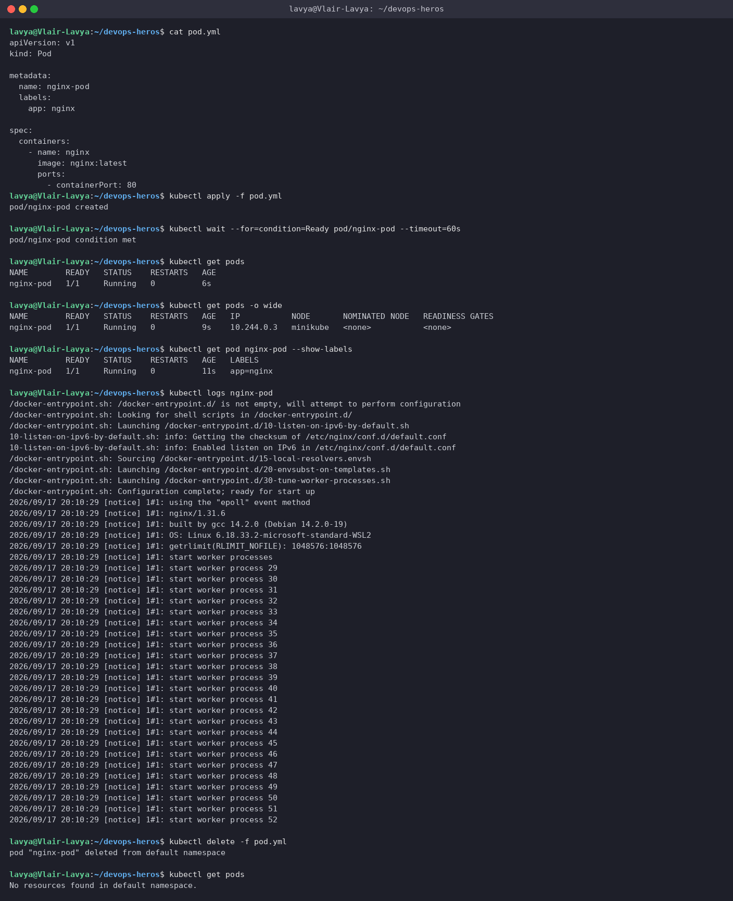

> `pod.yml` has exactly the four mandatory top-level fields: `apiVersion`, `kind`, `metadata`, `spec`. The Pod got IP `10.244.0.3` from the node's pod CIDR and landed on the only node, `minikube`.

---

## Task 3: Error State Simulation - `ErrImagePull` → `ImagePullBackOff`

Point a Pod at an image that does not exist and watch the kubelet fail, retry, and back off.

**Commands**
```bash
cat pod-lifecycle/06-imagepullbackoff.yaml
kubectl apply -f pod-lifecycle/06-imagepullbackoff.yaml
kubectl get pod lifecycle-image-error
kubectl get pod lifecycle-image-error
kubectl describe pod lifecycle-image-error | grep -A 12 Events:
kubectl delete -f pod-lifecycle/06-imagepullbackoff.yaml
kubectl get pod lifecycle-image-error
```

**Output**
```text
$ cat pod-lifecycle/06-imagepullbackoff.yaml
apiVersion: v1
kind: Pod
metadata:
  name: lifecycle-image-error
spec:
  containers:
    - name: broken-image
      image: jakwehrgkaejw:kahsdfgkhj

$ kubectl apply -f pod-lifecycle/06-imagepullbackoff.yaml
pod/lifecycle-image-error created

$ kubectl get pod lifecycle-image-error
NAME                    READY   STATUS         RESTARTS   AGE
lifecycle-image-error   0/1     ErrImagePull   0          6s

$ kubectl get pod lifecycle-image-error
NAME                    READY   STATUS         RESTARTS   AGE
lifecycle-image-error   0/1     ErrImagePull   0          31s

$ kubectl describe pod lifecycle-image-error | grep -A 12 Events:
Events:
  Type     Reason     Age                From               Message
  ----     ------     ----               ----               -------
  Normal   Scheduled  32s                default-scheduler  Successfully assigned default/lifecycle-image-error to minikube
  Normal   Pulling    14s (x2 over 31s)  kubelet            spec.containers{broken-image}: Pulling image "jakwehrgkaejw:kahsdfgkhj"
  Warning  Failed     13s (x2 over 29s)  kubelet            spec.containers{broken-image}: Failed to pull image "jakwehrgkaejw:kahsdfgkhj": failed to pull and unpack image "docker.io/library/jakwehrgkaejw:kahsdfgkhj": failed to resolve reference "docker.io/library/jakwehrgkaejw:kahsdfgkhj": pull access denied, repository does not exist or may require authorization: server message: insufficient_scope: authorization failed
  Warning  Failed     13s (x2 over 29s)  kubelet            spec.containers{broken-image}: Error: ErrImagePull
  Normal   BackOff    1s (x2 over 29s)   kubelet            spec.containers{broken-image}: Back-off pulling image "jakwehrgkaejw:kahsdfgkhj"
  Warning  Failed     1s (x2 over 29s)   kubelet            spec.containers{broken-image}: Error: ImagePullBackOff

$ kubectl delete -f pod-lifecycle/06-imagepullbackoff.yaml
pod "lifecycle-image-error" deleted from default namespace

# re-applying and polling until the state flips from ErrImagePull to ImagePullBackOff
$ kubectl get pod lifecycle-image-error
NAME                    READY   STATUS             RESTARTS   AGE
lifecycle-image-error   0/1     ImagePullBackOff   0          18s
```

**Screenshot**

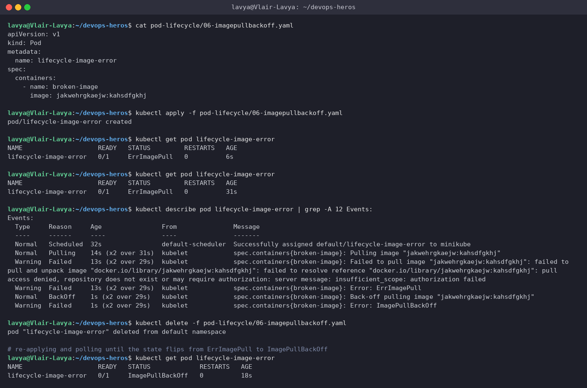

> **Why does `kubectl apply` succeed if the image is broken?** The API server only validates the *schema* of the manifest and writes the desired state to etcd - it never touches a registry. The scheduler happily assigns the Pod to a node. The failure only shows up when the **kubelet** on that node asks containerd to pull `jakwehrgkaejw:kahsdfgkhj`. The first failure is reported as `ErrImagePull`; after that the kubelet retries with an exponential delay (10s, 20s, 40s ... capped at 5 min) and the waiting state is called `ImagePullBackOff`. The Pod object itself is perfectly healthy in etcd the whole time - that is the gap between *declared* and *actual* state.

---

## Task 4: Capturing Transient Pod Phases (`hello.yml`)

A `busybox` Pod with `restartPolicy: Never` runs one `echo` and exits; poll fast enough to see all three states.

**Commands**
```bash
cat hello.yml
kubectl apply -f hello.yml
kubectl get pod hello-pod
kubectl get pod hello-pod
kubectl get pod hello-pod
kubectl get pod hello-pod
kubectl get pod hello-pod
kubectl get pod hello-pod
kubectl get pods -w
kubectl logs hello-pod
kubectl get pod hello-pod -o jsonpath='{.status.phase}{"\n"}'
kubectl get pod hello-pod -o jsonpath='{.status.containerStatuses[0].state.terminated.exitCode}{"\n"}'
kubectl delete -f hello.yml
```

**Output**
```text
$ cat hello.yml
apiVersion: v1
kind: Pod

metadata:
  name: hello-pod

spec:
  restartPolicy: Never

  containers:
    - name: hello
      image: busybox
      command: ["sh", "-c", "echo Hello Kubernetes"]
# Terminal 1: kubectl get pods -w   (started before apply, captured below)
$ kubectl apply -f hello.yml
pod/hello-pod created

$ kubectl get pod hello-pod
NAME        READY   STATUS              RESTARTS   AGE
hello-pod   0/1     ContainerCreating   0          1s

$ kubectl get pod hello-pod
NAME        READY   STATUS              RESTARTS   AGE
hello-pod   0/1     ContainerCreating   0          2s

$ kubectl get pod hello-pod
NAME        READY   STATUS    RESTARTS   AGE
hello-pod   1/1     Running   0          3s

$ kubectl get pod hello-pod
NAME        READY   STATUS      RESTARTS   AGE
hello-pod   0/1     Completed   0          4s

$ kubectl get pod hello-pod
NAME        READY   STATUS      RESTARTS   AGE
hello-pod   0/1     Completed   0          6s

$ kubectl get pod hello-pod
NAME        READY   STATUS      RESTARTS   AGE
hello-pod   0/1     Completed   0          7s

$ kubectl get pods -w
NAME        READY   STATUS    RESTARTS   AGE
hello-pod   0/1     Pending   0          0s
hello-pod   0/1     Pending   0          0s
hello-pod   0/1     ContainerCreating   0          1s
hello-pod   0/1     ContainerCreating   0          1s
hello-pod   1/1     Running             0          2s
hello-pod   0/1     Completed           0          3s
hello-pod   0/1     Completed           0          4s

$ kubectl logs hello-pod
Hello Kubernetes

$ kubectl get pod hello-pod -o jsonpath='{.status.phase}{"\n"}'
Succeeded

$ kubectl get pod hello-pod -o jsonpath='{.status.containerStatuses[0].state.terminated.exitCode}{"\n"}'
0

$ kubectl delete -f hello.yml
pod "hello-pod" deleted from default namespace
```

**Screenshot**

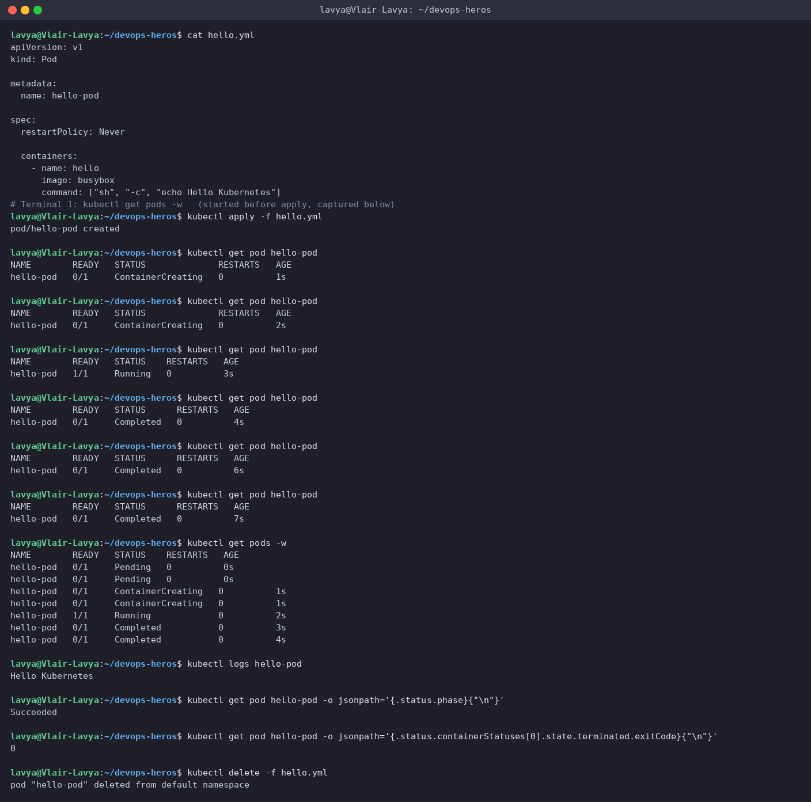

> `Pending → ContainerCreating → Running → Completed` inside four seconds. The final phase is `Succeeded` with exit code `0`; because `restartPolicy` is `Never`, the kubelet leaves it alone instead of restarting it.

---

## Task 5: Pod Lifecycle States & Probes Lab (`pod-lifecycle/`)

Run all twelve manifests in `pod-lifecycle/` and capture what each state looks like.

```bash
cd pod-lifecycle/
```

### 5.1 `01-running.yaml` - Running
```text
# 1) Running
$ kubectl apply -f 01-running.yaml
pod/lifecycle-running created

$ kubectl get pod lifecycle-running
NAME                READY   STATUS    RESTARTS   AGE
lifecycle-running   1/1     Running   0          1s

$ kubectl delete -f 01-running.yaml --wait=false
pod "lifecycle-running" deleted from default namespace
```

### 5.2 `02-pending.yaml` - Pending (unschedulable)
```text
# 2) Pending (requests 9Gi memory - node cannot satisfy it)
$ kubectl apply -f 02-pending.yaml
pod/lifecycle-pending created

$ kubectl get pod lifecycle-pending
NAME                READY   STATUS    RESTARTS   AGE
lifecycle-pending   0/1     Pending   0          5s

$ kubectl describe pod lifecycle-pending | grep -A 5 Events:
Events:
  Type     Reason            Age   From               Message
  ----     ------            ----  ----               -------
  Warning  FailedScheduling  5s    default-scheduler  0/1 nodes are available: 1 Insufficient memory. preemption: 0/1 nodes are available: 1 Preemption is not helpful for scheduling.

$ kubectl delete -f 02-pending.yaml
pod "lifecycle-pending" deleted from default namespace
```

> The Pod asks for 9Gi of memory; my node has 4Gi. The scheduler records a `FailedScheduling` event and the Pod just sits in `Pending` - nothing is ever started.

### 5.3 `03-succeeded.yaml` - Succeeded (exit 0, `restartPolicy: Never`)
```text
# 3) Succeeded (restartPolicy: Never, exit 0)
$ kubectl apply -f 03-succeeded.yaml
pod/lifecycle-succeeded created

$ kubectl get pod lifecycle-succeeded
NAME                  READY   STATUS      RESTARTS   AGE
lifecycle-succeeded   0/1     Completed   0          9s

$ kubectl logs lifecycle-succeeded
Task started
Task completed successfully

$ kubectl delete -f 03-succeeded.yaml
pod "lifecycle-succeeded" deleted from default namespace
```

### 5.4 `04-failed.yaml` - Failed (exit 1, `restartPolicy: Never`)
```text
# 4) Failed (restartPolicy: Never, exit 1)
$ kubectl apply -f 04-failed.yaml
pod/lifecycle-failed created

$ kubectl get pod lifecycle-failed
NAME               READY   STATUS   RESTARTS   AGE
lifecycle-failed   0/1     Error    0          7s

$ kubectl get pod lifecycle-failed -o jsonpath='{.status.containerStatuses[0].state.terminated.reason}: exit code {.status.containerStatuses[0].state.terminated.exitCode}{"\n"}'
Error: exit code 1

$ kubectl logs lifecycle-failed
Task started
Task failed

$ kubectl delete -f 04-failed.yaml
pod "lifecycle-failed" deleted from default namespace
```

### 5.5 `05-crashloopbackoff.yaml` - CrashLoopBackOff
```text
# 5) CrashLoopBackOff
$ cat 05-crashloopbackoff.yaml
apiVersion: v1
kind: Pod
metadata:
  name: lifecycle-crashloop
spec:
  containers:
    - name: crashing-app
      image: busybox:1.36
      command: ["sh", "-c", "echo 'Application started'; sleep 3; echo 'Application crashed'; exit 1"]

$ kubectl apply -f 05-crashloopbackoff.yaml
pod/lifecycle-crashloop created

# watching the pod for ~1 minute: it starts, exits 1, and the kubelet restarts it with a growing back-off delay
$ kubectl get pod lifecycle-crashloop
NAME                  READY   STATUS    RESTARTS     AGE
lifecycle-crashloop   1/1     Running   1 (4s ago)   8s

$ kubectl get pod lifecycle-crashloop
NAME                  READY   STATUS   RESTARTS      AGE
lifecycle-crashloop   0/1     Error    1 (11s ago)   15s

$ kubectl get pod lifecycle-crashloop
NAME                  READY   STATUS    RESTARTS      AGE
lifecycle-crashloop   1/1     Running   2 (14s ago)   22s

$ kubectl get pod lifecycle-crashloop
NAME                  READY   STATUS   RESTARTS      AGE
lifecycle-crashloop   0/1     Error    2 (22s ago)   30s

$ kubectl get pod lifecycle-crashloop
NAME                  READY   STATUS   RESTARTS      AGE
lifecycle-crashloop   0/1     Error    2 (30s ago)   38s

$ kubectl get pod lifecycle-crashloop
NAME                  READY   STATUS   RESTARTS      AGE
lifecycle-crashloop   0/1     Error    2 (37s ago)   45s

$ kubectl get pod lifecycle-crashloop
NAME                  READY   STATUS   RESTARTS      AGE
lifecycle-crashloop   0/1     Error    2 (44s ago)   52s

$ kubectl get pod lifecycle-crashloop
NAME                  READY   STATUS   RESTARTS      AGE
lifecycle-crashloop   0/1     Error    3 (35s ago)   59s

$ kubectl logs lifecycle-crashloop
Application started
Application crashed

$ kubectl describe pod lifecycle-crashloop | grep -A 8 Events:
Events:
  Type     Reason     Age               From               Message
  ----     ------     ----              ----               -------
  Normal   Scheduled  59s               default-scheduler  Successfully assigned default/lifecycle-crashloop to minikube
  Normal   Pulled     7s (x4 over 59s)  kubelet            spec.containers{crashing-app}: Container image "busybox:1.36" already present on machine and can be accessed by the pod
  Normal   Created    7s (x4 over 59s)  kubelet            spec.containers{crashing-app}: Container created
  Normal   Started    7s (x4 over 59s)  kubelet            spec.containers{crashing-app}: Container started
  Warning  BackOff    3s (x3 over 51s)  kubelet            spec.containers{crashing-app}: Back-off restarting failed container crashing-app in pod lifecycle-crashloop_default(8be24101-7d75-4ab1-8477-60e020a6a189)

$ kubectl get pod lifecycle-crashloop -o jsonpath='restartCount={.status.containerStatuses[0].restartCount}  lastExitCode={.status.containerStatuses[0].lastState.terminated.exitCode}{"\n"}'
restartCount=3  lastExitCode=1

$ kubectl delete -f 05-crashloopbackoff.yaml
pod "lifecycle-crashloop" deleted from default namespace
```

> The container exits `1` every ~3 seconds. `RESTARTS` keeps climbing (1 → 2 → 3) and the gaps between restarts get longer - that is the exponential back-off. The kubelet's `Warning BackOff: Back-off restarting failed container` event is the CrashLoopBackOff mechanism in action. One thing I noticed on this cluster (Kubernetes v1.37): between attempts `kubectl get pod` shows the container's last **terminated** state (`Error`) rather than the classic `CrashLoopBackOff` waiting reason in the STATUS column - the events and restart counter tell the real story.

### 5.6 `06-imagepullbackoff.yaml` - ImagePullBackOff
Covered in full in [Task 3](#task-3-error-state-simulation---errimagepull--imagepullbackoff) above.

### 5.7 `07-readiness.yaml` - Running ≠ Ready
```text
# 7) Readiness probe: Running but not Ready until the probe passes
$ kubectl apply -f 07-readiness.yaml
pod/lifecycle-readiness created

$ kubectl get pod lifecycle-readiness
NAME                  READY   STATUS    RESTARTS   AGE
lifecycle-readiness   0/1     Running   0          2s

$ kubectl get pod lifecycle-readiness
NAME                  READY   STATUS    RESTARTS   AGE
lifecycle-readiness   1/1     Running   0          10s

$ kubectl delete -f 07-readiness.yaml --wait=false
pod "lifecycle-readiness" deleted from default namespace
```

> At 2s the container is `Running` but `READY 0/1` - the readiness probe (`initialDelaySeconds: 5`) has not passed yet, so a Service would not send it traffic. At 10s it flips to `1/1`.

### 5.8 `08-liveness.yaml` - self-healing restart
```text
# 8) Liveness probe: container restarted automatically when /tmp/healthy disappears
$ kubectl apply -f 08-liveness.yaml
pod/lifecycle-liveness created

$ kubectl get pod lifecycle-liveness
NAME                 READY   STATUS    RESTARTS   AGE
lifecycle-liveness   1/1     Running   0          10s

$ kubectl get pod lifecycle-liveness
NAME                 READY   STATUS    RESTARTS     AGE
lifecycle-liveness   1/1     Running   1 (1s ago)   61s

$ kubectl describe pod lifecycle-liveness | grep -A 8 Events:
Events:
  Type     Reason     Age                From               Message
  ----     ------     ----               ----               -------
  Normal   Scheduled  61s                default-scheduler  Successfully assigned default/lifecycle-liveness to minikube
  Warning  Unhealthy  32s (x2 over 37s)  kubelet            spec.containers{app}: Liveness probe failed:
  Normal   Killing    32s                kubelet            spec.containers{app}: Container app failed liveness probe, will be restarted
  Normal   Pulled     2s (x2 over 62s)   kubelet            spec.containers{app}: Container image "busybox:1.36" already present on machine and can be accessed by the pod
  Normal   Created    2s (x2 over 62s)   kubelet            spec.containers{app}: Container created
  Normal   Started    2s (x2 over 62s)   kubelet            spec.containers{app}: Container started

$ kubectl delete -f 08-liveness.yaml --wait=false
pod "lifecycle-liveness" deleted from default namespace
```

> The app deletes its own `/tmp/healthy` file after 20s. Two consecutive liveness failures (`failureThreshold: 2`, `periodSeconds: 5`) and the kubelet kills and restarts the container: `RESTARTS 0 → 1`, with the `Unhealthy` / `Killing` events to prove it.

### 5.9 `09-startup.yaml` - protecting a slow starter
```text
# 9) Startup probe: slow app protected for up to 50s before liveness kicks in
$ kubectl apply -f 09-startup.yaml
pod/lifecycle-startup created

$ kubectl get pod lifecycle-startup
NAME                READY   STATUS    RESTARTS   AGE
lifecycle-startup   0/1     Running   0          10s

$ kubectl get pod lifecycle-startup
NAME                READY   STATUS    RESTARTS   AGE
lifecycle-startup   1/1     Running   0          41s

$ kubectl delete -f 09-startup.yaml --wait=false
pod "lifecycle-startup" deleted from default namespace
```

> The startup probe gives the app up to `10 × 5s = 50s` to create `/tmp/started`. Until then liveness/readiness are not evaluated, so the slow app is not killed prematurely. It became `1/1` at ~41s.

### 5.10 `10-init-container.yaml` - sequential setup
```text
# 10) Init container runs to completion before the app container starts
$ kubectl apply -f 10-init-container.yaml
pod/lifecycle-init created

$ kubectl get pod lifecycle-init
NAME             READY   STATUS     RESTARTS   AGE
lifecycle-init   0/1     Init:0/1   0          3s

$ kubectl get pod lifecycle-init
NAME             READY   STATUS    RESTARTS   AGE
lifecycle-init   1/1     Running   0          12s

$ kubectl describe pod lifecycle-init | grep -A 10 'Init Containers:'
Init Containers:
  setup:
    Container ID:  containerd://37e2b1605c1ffee916c101e8bc840fe55e34bf30561d6c24e2784819cca51aaf
    Image:         busybox:1.36
    Image ID:      docker.io/library/busybox@sha256:73aaf090f3d85aa34ee199857f03fa3a95c8ede2ffd4cc2cdb5b94e566b11662
    Port:          <none>
    Host Port:     <none>
    Command:
      sh
      -c
      echo 'Init container running'; sleep 10; echo 'Init complete'

$ kubectl delete -f 10-init-container.yaml --wait=false
pod "lifecycle-init" deleted from default namespace
```

> `STATUS Init:0/1` while the `setup` init container runs its 10s job; the app container only starts once it exits `0`.

### 5.11 `11-multi-container.yaml` - app + sidecar
```text
# 11) Multi-container pod: app + sidecar (READY 2/2)
$ kubectl apply -f 11-multi-container.yaml
pod/lifecycle-multi-container created

$ kubectl get pod lifecycle-multi-container
NAME                        READY   STATUS    RESTARTS   AGE
lifecycle-multi-container   2/2     Running   0          1s

$ kubectl get pod lifecycle-multi-container -o jsonpath='{.spec.containers[*].name}{"\n"}'
app sidecar

$ kubectl logs lifecycle-multi-container -c sidecar | tail -5
Sidecar is running

$ kubectl delete -f 11-multi-container.yaml --wait=false
pod "lifecycle-multi-container" deleted from default namespace
```

> `READY 2/2`: nginx plus a busybox logging sidecar share one Pod (same IP, same volumes). `-c sidecar` picks which container's logs to read.

### 5.12 `12-termination.yaml` - graceful shutdown
```text
# 12) Graceful termination: SIGTERM trap + terminationGracePeriodSeconds
$ kubectl apply -f 12-termination.yaml
pod/lifecycle-termination created

$ kubectl get pod lifecycle-termination
NAME                    READY   STATUS    RESTARTS   AGE
lifecycle-termination   1/1     Running   0          1s

$ time kubectl delete -f 12-termination.yaml
pod "lifecycle-termination" deleted from default namespace

real	0m11.187s
user	0m0.071s
sys	0m0.047s
```

> The container traps `SIGTERM`, prints a message, sleeps 10s for "cleanup" and then exits `0`. `kubectl delete` blocked for ~11 seconds - well inside the `terminationGracePeriodSeconds: 20` budget, so the kubelet never had to send `SIGKILL`.

**Screenshots**

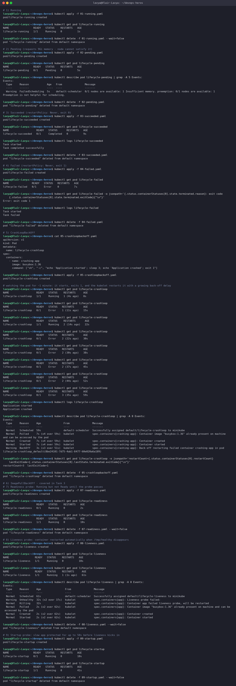

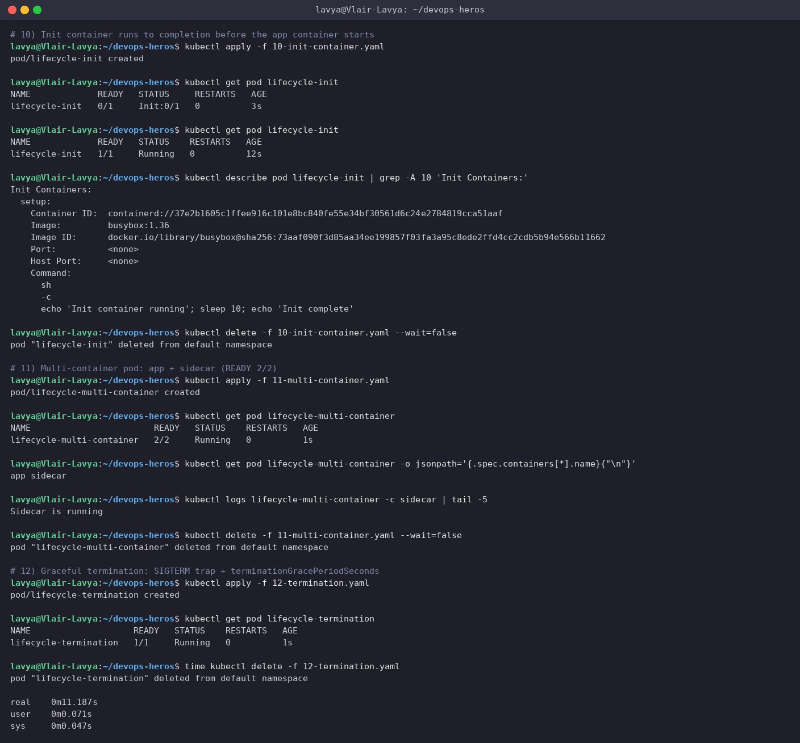

---

## Task 6: Core Controllers - ReplicaSet & StatefulSet

Prove that a ReplicaSet heals itself when a Pod dies, and that a StatefulSet gives Pods stable ordinal names and their own volumes.

**Commands**
```bash
kubectl apply -f replicaset.yml
kubectl get rs nginx-rs
kubectl get pods -l app=nginx
kubectl delete pod nginx-rs-t4hks --wait=false
kubectl get pods -l app=nginx
kubectl get pods -l app=nginx
kubectl get rs nginx-rs
kubectl delete -f replicaset.yml
kubectl apply -f k8s-core-objects/statefulset.yml
kubectl get pods -l app=mysql
kubectl get statefulset mysql
kubectl get pods -l app=mysql
kubectl get pvc
kubectl delete -f k8s-core-objects/statefulset.yml
kubectl delete pvc -l app=mysql
```

**Output**
```text
# Part A: ReplicaSet
$ kubectl apply -f replicaset.yml
replicaset.apps/nginx-rs created

$ kubectl get rs nginx-rs
NAME       DESIRED   CURRENT   READY   AGE
nginx-rs   3         3         3       7s

$ kubectl get pods -l app=nginx
NAME             READY   STATUS    RESTARTS   AGE
nginx-rs-t4hks   1/1     Running   0          7s
nginx-rs-vvtlx   1/1     Running   0          7s
nginx-rs-xr28s   1/1     Running   0          7s

# deleting one pod manually: nginx-rs-t4hks
$ kubectl delete pod nginx-rs-t4hks --wait=false
pod "nginx-rs-t4hks" deleted from default namespace

$ kubectl get pods -l app=nginx
NAME             READY   STATUS              RESTARTS   AGE
nginx-rs-vvtlx   1/1     Running             0          10s
nginx-rs-xjt72   0/1     ContainerCreating   0          2s
nginx-rs-xr28s   1/1     Running             0          10s

$ kubectl get pods -l app=nginx
NAME             READY   STATUS    RESTARTS   AGE
nginx-rs-vvtlx   1/1     Running   0          18s
nginx-rs-xjt72   1/1     Running   0          10s
nginx-rs-xr28s   1/1     Running   0          18s

$ kubectl get rs nginx-rs
NAME       DESIRED   CURRENT   READY   AGE
nginx-rs   3         3         3       18s

$ kubectl delete -f replicaset.yml
replicaset.apps "nginx-rs" deleted from default namespace

# Part B: StatefulSet
$ kubectl apply -f k8s-core-objects/statefulset.yml
statefulset.apps/mysql created

$ kubectl get pods -l app=mysql
NAME      READY   STATUS    RESTARTS   AGE
mysql-0   1/1     Running   0          5s
mysql-1   1/1     Running   0          4s
mysql-2   1/1     Running   0          4s

$ kubectl get statefulset mysql
NAME    READY   AGE
mysql   3/3     6s

$ kubectl get pods -l app=mysql
NAME      READY   STATUS    RESTARTS   AGE
mysql-0   1/1     Running   0          6s
mysql-1   1/1     Running   0          5s
mysql-2   1/1     Running   0          5s

$ kubectl get pvc
NAME                               STATUS   VOLUME                                     CAPACITY   ACCESS MODES   STORAGECLASS   VOLUMEATTRIBUTESCLASS   AGE
mysql-persistent-storage-mysql-0   Bound    pvc-fe8020a2-5744-47db-9182-bafd9a1e25ee   5Gi        RWO            standard       <unset>                 7s
mysql-persistent-storage-mysql-1   Bound    pvc-c3a9b40f-65a3-41e6-8f43-f299f9303ecf   5Gi        RWO            standard       <unset>                 6s
mysql-persistent-storage-mysql-2   Bound    pvc-21600ee8-c1f9-48b6-92f9-e2be450a6f80   5Gi        RWO            standard       <unset>                 6s

$ kubectl delete -f k8s-core-objects/statefulset.yml
statefulset.apps "mysql" deleted from default namespace

$ kubectl delete pvc -l app=mysql
persistentvolumeclaim "mysql-persistent-storage-mysql-0" deleted from default namespace
persistentvolumeclaim "mysql-persistent-storage-mysql-1" deleted from default namespace
persistentvolumeclaim "mysql-persistent-storage-mysql-2" deleted from default namespace
```

**Screenshot**

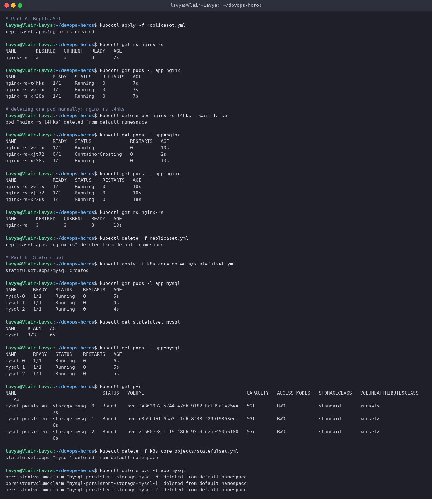

> After I deleted `nginx-rs-t4hks`, the ReplicaSet controller had already created `nginx-rs-xjt72` within 2 seconds to keep `DESIRED = 3`. The StatefulSet named its Pods `mysql-0/1/2` and the `volumeClaimTemplates` produced one bound 5Gi PVC per ordinal - those PVCs deliberately survive `kubectl delete -f statefulset.yml`, which is why I had to delete them explicitly.

---

## Task 7: DaemonSet - One Agent Pod Per Node

Deploy node-level agents (`node-exporter`, and the `node-logging-agent` from `daemonset/`) and verify one Pod lands on every node.

**Commands**
```bash
minikube node add
kubectl get nodes
kubectl apply -f k8s-core-objects/deamonset.yml
kubectl get ds node-exporter
kubectl get pods -l app=node-exporter -o wide
kubectl apply -f daemonset/node-agent-ds.yaml
kubectl get ds
kubectl get pods -l app=node-logging-agent -o wide
kubectl logs -l app=node-logging-agent --tail=2
kubectl delete -f k8s-core-objects/deamonset.yml -f daemonset/node-agent-ds.yaml
minikube node delete minikube-m02
kubectl get nodes
```

**Output**
```text
# adding a second node to the cluster so the DaemonSet has 2 nodes to land on
$ minikube node add
* Adding node m02 to cluster minikube as [worker]
* Starting "minikube-m02" worker node in "minikube" cluster
* Pulling base image v0.0.51 ...
* Preparing Kubernetes v1.37.0 on containerd 2.3.4 ...
* Verifying Kubernetes components...
* Successfully added m02 to minikube!

$ kubectl get nodes
NAME           STATUS   ROLES           AGE   VERSION
minikube       Ready    control-plane   25m   v1.37.0
minikube-m02   Ready    <none>          35s   v1.37.0

$ kubectl apply -f k8s-core-objects/deamonset.yml
daemonset.apps/node-exporter created

$ kubectl get ds node-exporter
NAME            DESIRED   CURRENT   READY   UP-TO-DATE   AVAILABLE   NODE SELECTOR   AGE
node-exporter   2         2         2       2            2           <none>          15s

$ kubectl get pods -l app=node-exporter -o wide
NAME                  READY   STATUS    RESTARTS   AGE   IP            NODE           NOMINATED NODE   READINESS GATES
node-exporter-m8d29   1/1     Running   0          15s   10.244.1.2    minikube-m02   <none>           <none>
node-exporter-msct6   1/1     Running   0          15s   10.244.0.22   minikube       <none>           <none>

$ kubectl apply -f daemonset/node-agent-ds.yaml
daemonset.apps/node-logging-agent created

$ kubectl get ds
NAME                 DESIRED   CURRENT   READY   UP-TO-DATE   AVAILABLE   NODE SELECTOR   AGE
node-exporter        2         2         2       2            2           <none>          26s
node-logging-agent   2         2         2       2            2           <none>          10s

$ kubectl get pods -l app=node-logging-agent -o wide
NAME                       READY   STATUS    RESTARTS   AGE   IP            NODE           NOMINATED NODE   READINESS GATES
node-logging-agent-9rp69   1/1     Running   0          10s   10.244.0.23   minikube       <none>           <none>
node-logging-agent-bqk8k   1/1     Running   0          10s   10.244.1.3    minikube-m02   <none>           <none>

$ kubectl logs -l app=node-logging-agent --tail=2
[Thu Sep 17 20:30:59 UTC 2026] Collecting host system metrics on node-logging-agent-9rp69
[Thu Sep 17 20:31:06 UTC 2026] Collecting host system metrics on node-logging-agent-bqk8k

$ kubectl delete -f k8s-core-objects/deamonset.yml -f daemonset/node-agent-ds.yaml
daemonset.apps "node-exporter" deleted from default namespace
daemonset.apps "node-logging-agent" deleted from default namespace

$ minikube node delete minikube-m02
* Deleting node minikube-m02 from cluster minikube
* Stopping node "minikube-m02"  ...
* Powering off "minikube-m02" via SSH ...
* Deleting "minikube-m02" in docker ...
* Node minikube-m02 was successfully deleted.

$ kubectl get nodes
NAME       STATUS   ROLES           AGE   VERSION
minikube   Ready    control-plane   26m   v1.37.0
```

**Screenshot**

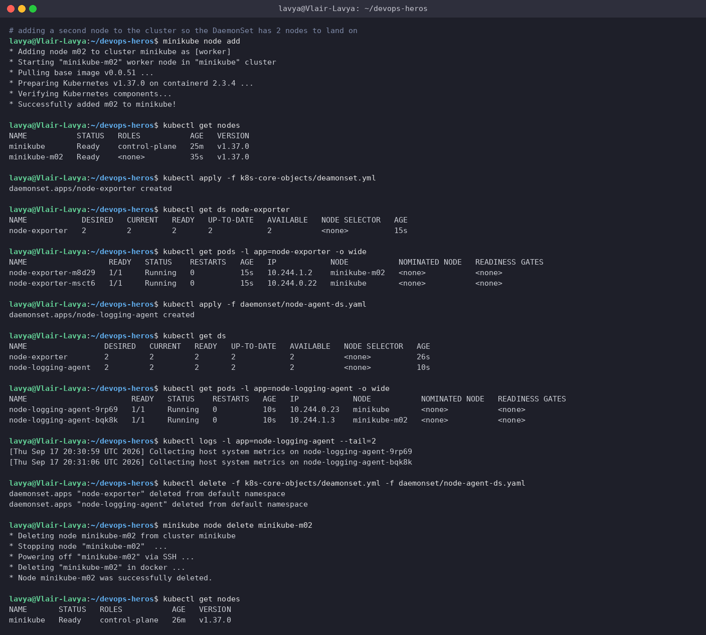

> With a single node a DaemonSet looks just like a 1-replica Deployment, so I temporarily added a second node (`minikube node add`). Both DaemonSets immediately went to `DESIRED 2 / CURRENT 2`, with exactly one Pod on `minikube` and one on `minikube-m02`, no `replicas:` field anywhere. I removed the extra node again afterwards.

---

## Task 8: Rolling Update & Instant Rollback (`01-rolling-update/`)

Upgrade `app-rolling` from v1 to v2 with `maxSurge: 1, maxUnavailable: 0`, then roll back.

**Commands**
```bash
grep -A4 'strategy:' deployment-v1.yaml
kubectl apply -f deployment-v1.yaml
kubectl apply -f service.yaml
kubectl rollout status deployment/app-rolling
kubectl get pods -l app=app-rolling --show-labels
curl -s http://192.168.49.2:30010 | grep -o 'VERSION: v[0-9]'
kubectl apply -f deployment-v2.yaml
kubectl rollout status deployment/app-rolling
kubectl get pods -l app=app-rolling -w   # (was running in a second terminal during the update)
kubectl get pods -l app=app-rolling --show-labels
kubectl rollout history deployment/app-rolling
kubectl rollout undo deployment/app-rolling
kubectl rollout status deployment/app-rolling
kubectl get pods -l app=app-rolling --show-labels
curl -s http://192.168.49.2:30010 | grep -o 'VERSION: v[0-9]'
kubectl rollout history deployment/app-rolling
kubectl delete -f service.yaml -f deployment-v1.yaml
```

**Output**
```text
$ grep -A4 'strategy:' deployment-v1.yaml
  strategy:
    type: RollingUpdate
    rollingUpdate:
      maxSurge: 1
      maxUnavailable: 0

$ kubectl apply -f deployment-v1.yaml
deployment.apps/app-rolling created

$ kubectl apply -f service.yaml
service/app-rolling-service created

$ kubectl rollout status deployment/app-rolling
Waiting for deployment "app-rolling" rollout to finish: 0 of 4 updated replicas are available...
Waiting for deployment "app-rolling" rollout to finish: 1 of 4 updated replicas are available...
Waiting for deployment "app-rolling" rollout to finish: 2 of 4 updated replicas are available...
Waiting for deployment "app-rolling" rollout to finish: 3 of 4 updated replicas are available...
deployment "app-rolling" successfully rolled out

$ kubectl get pods -l app=app-rolling --show-labels
NAME                           READY   STATUS    RESTARTS   AGE   LABELS
app-rolling-86d7d44d5b-4cgzt   1/1     Running   0          7s    app=app-rolling,pod-template-hash=86d7d44d5b,version=v1
app-rolling-86d7d44d5b-gxgk7   1/1     Running   0          7s    app=app-rolling,pod-template-hash=86d7d44d5b,version=v1
app-rolling-86d7d44d5b-nwf82   1/1     Running   0          7s    app=app-rolling,pod-template-hash=86d7d44d5b,version=v1
app-rolling-86d7d44d5b-q2zqh   1/1     Running   0          7s    app=app-rolling,pod-template-hash=86d7d44d5b,version=v1

$ curl -s http://192.168.49.2:30010 | grep -o 'VERSION: v[0-9]'
VERSION: v1

# trigger the update to v2 and watch pods being replaced one at a time (maxSurge=1, maxUnavailable=0)
$ kubectl apply -f deployment-v2.yaml
deployment.apps/app-rolling configured

$ kubectl rollout status deployment/app-rolling
Waiting for deployment "app-rolling" rollout to finish: 1 out of 4 new replicas have been updated...
Waiting for deployment "app-rolling" rollout to finish: 1 out of 4 new replicas have been updated...
Waiting for deployment "app-rolling" rollout to finish: 1 out of 4 new replicas have been updated...
Waiting for deployment "app-rolling" rollout to finish: 2 out of 4 new replicas have been updated...
Waiting for deployment "app-rolling" rollout to finish: 2 out of 4 new replicas have been updated...
Waiting for deployment "app-rolling" rollout to finish: 2 out of 4 new replicas have been updated...
Waiting for deployment "app-rolling" rollout to finish: 2 out of 4 new replicas have been updated...
Waiting for deployment "app-rolling" rollout to finish: 3 out of 4 new replicas have been updated...
Waiting for deployment "app-rolling" rollout to finish: 3 out of 4 new replicas have been updated...
Waiting for deployment "app-rolling" rollout to finish: 3 out of 4 new replicas have been updated...
Waiting for deployment "app-rolling" rollout to finish: 3 out of 4 new replicas have been updated...
Waiting for deployment "app-rolling" rollout to finish: 1 old replicas are pending termination...
Waiting for deployment "app-rolling" rollout to finish: 1 old replicas are pending termination...
Waiting for deployment "app-rolling" rollout to finish: 1 old replicas are pending termination...
deployment "app-rolling" successfully rolled out

$ kubectl get pods -l app=app-rolling -w   # (was running in a second terminal during the update)
NAME                           READY   STATUS    RESTARTS   AGE
app-rolling-86d7d44d5b-4cgzt   1/1     Running   0          7s
app-rolling-86d7d44d5b-gxgk7   1/1     Running   0          7s
app-rolling-86d7d44d5b-nwf82   1/1     Running   0          7s
app-rolling-86d7d44d5b-q2zqh   1/1     Running   0          7s
app-rolling-56bff6d88c-j2vbg   0/1     Pending   0          0s
app-rolling-56bff6d88c-j2vbg   0/1     Pending   0          0s
app-rolling-56bff6d88c-j2vbg   0/1     ContainerCreating   0          0s
app-rolling-56bff6d88c-j2vbg   0/1     ContainerCreating   0          0s
app-rolling-56bff6d88c-j2vbg   0/1     Running             0          1s
app-rolling-56bff6d88c-j2vbg   1/1     Running             0          6s
app-rolling-56bff6d88c-j2vbg   1/1     Running             0          6s
app-rolling-86d7d44d5b-4cgzt   1/1     Terminating         0          13s
app-rolling-86d7d44d5b-4cgzt   1/1     Terminating         0          13s
app-rolling-56bff6d88c-zbjxw   0/1     Pending             0          0s
app-rolling-56bff6d88c-zbjxw   0/1     Pending             0          0s
app-rolling-56bff6d88c-zbjxw   0/1     ContainerCreating   0          0s
app-rolling-86d7d44d5b-4cgzt   0/1     Completed           0          14s
app-rolling-56bff6d88c-zbjxw   0/1     ContainerCreating   0          1s
app-rolling-56bff6d88c-zbjxw   0/1     Running             0          1s
app-rolling-86d7d44d5b-4cgzt   0/1     Completed           0          14s
app-rolling-86d7d44d5b-4cgzt   0/1     Completed           0          14s
app-rolling-56bff6d88c-zbjxw   1/1     Running             0          6s
app-rolling-56bff6d88c-zbjxw   1/1     Running             0          6s
app-rolling-86d7d44d5b-q2zqh   1/1     Terminating         0          19s
app-rolling-86d7d44d5b-q2zqh   1/1     Terminating         0          19s
app-rolling-56bff6d88c-fh4n6   0/1     Pending             0          0s
app-rolling-56bff6d88c-fh4n6   0/1     Pending             0          0s
app-rolling-56bff6d88c-fh4n6   0/1     ContainerCreating   0          0s
app-rolling-86d7d44d5b-q2zqh   0/1     Completed           0          20s
app-rolling-56bff6d88c-fh4n6   0/1     ContainerCreating   0          1s
app-rolling-86d7d44d5b-q2zqh   0/1     Completed           0          20s
app-rolling-86d7d44d5b-q2zqh   0/1     Completed           0          20s
app-rolling-56bff6d88c-fh4n6   0/1     Running             0          1s
app-rolling-56bff6d88c-fh4n6   1/1     Running             0          7s
app-rolling-56bff6d88c-fh4n6   1/1     Running             0          7s
app-rolling-86d7d44d5b-gxgk7   1/1     Terminating         0          26s
app-rolling-56bff6d88c-2cgpw   0/1     Pending             0          0s
app-rolling-86d7d44d5b-gxgk7   1/1     Terminating         0          26s
app-rolling-56bff6d88c-2cgpw   0/1     Pending             0          0s
app-rolling-56bff6d88c-2cgpw   0/1     ContainerCreating   0          0s
app-rolling-86d7d44d5b-gxgk7   0/1     Completed           0          27s
app-rolling-56bff6d88c-2cgpw   0/1     ContainerCreating   0          1s
app-rolling-56bff6d88c-2cgpw   0/1     Running             0          1s
app-rolling-86d7d44d5b-gxgk7   0/1     Completed           0          27s
app-rolling-86d7d44d5b-gxgk7   0/1     Completed           0          27s
app-rolling-86d7d44d5b-gxgk7   0/1     Completed           0          27s
app-rolling-56bff6d88c-2cgpw   1/1     Running             0          6s
app-rolling-56bff6d88c-2cgpw   1/1     Running             0          6s
app-rolling-86d7d44d5b-nwf82   1/1     Terminating         0          32s
app-rolling-86d7d44d5b-nwf82   1/1     Terminating         0          32s

$ kubectl get pods -l app=app-rolling --show-labels
NAME                           READY   STATUS        RESTARTS   AGE   LABELS
app-rolling-56bff6d88c-2cgpw   1/1     Running       0          7s    app=app-rolling,pod-template-hash=56bff6d88c,version=v2
app-rolling-56bff6d88c-fh4n6   1/1     Running       0          14s   app=app-rolling,pod-template-hash=56bff6d88c,version=v2
app-rolling-56bff6d88c-j2vbg   1/1     Running       0          26s   app=app-rolling,pod-template-hash=56bff6d88c,version=v2
app-rolling-56bff6d88c-zbjxw   1/1     Running       0          20s   app=app-rolling,pod-template-hash=56bff6d88c,version=v2
app-rolling-86d7d44d5b-nwf82   1/1     Terminating   0          33s   app=app-rolling,pod-template-hash=86d7d44d5b,version=v1

$ kubectl rollout history deployment/app-rolling
deployment.apps/app-rolling
REVISION  CHANGE-CAUSE
1         <none>
2         <none>

$ kubectl rollout undo deployment/app-rolling
Warning: resource deployments/app-rolling was previously managed with 'kubectl apply'. Rolling back will not update the kubectl.kubernetes.io/last-applied-configuration annotation, which may cause unexpected behavior on future 'kubectl apply' operations. Consider using 'kubectl apply' with your previous configuration file instead.
deployment.apps/app-rolling rolled back

$ kubectl rollout status deployment/app-rolling
Waiting for deployment "app-rolling" rollout to finish: 1 out of 4 new replicas have been updated...
Waiting for deployment "app-rolling" rollout to finish: 1 out of 4 new replicas have been updated...
Waiting for deployment "app-rolling" rollout to finish: 1 out of 4 new replicas have been updated...
Waiting for deployment "app-rolling" rollout to finish: 2 out of 4 new replicas have been updated...
Waiting for deployment "app-rolling" rollout to finish: 2 out of 4 new replicas have been updated...
Waiting for deployment "app-rolling" rollout to finish: 2 out of 4 new replicas have been updated...
Waiting for deployment "app-rolling" rollout to finish: 2 out of 4 new replicas have been updated...
Waiting for deployment "app-rolling" rollout to finish: 3 out of 4 new replicas have been updated...
Waiting for deployment "app-rolling" rollout to finish: 3 out of 4 new replicas have been updated...
Waiting for deployment "app-rolling" rollout to finish: 3 out of 4 new replicas have been updated...
Waiting for deployment "app-rolling" rollout to finish: 3 out of 4 new replicas have been updated...
Waiting for deployment "app-rolling" rollout to finish: 1 old replicas are pending termination...
Waiting for deployment "app-rolling" rollout to finish: 1 old replicas are pending termination...
Waiting for deployment "app-rolling" rollout to finish: 1 old replicas are pending termination...
deployment "app-rolling" successfully rolled out

$ kubectl get pods -l app=app-rolling --show-labels
NAME                           READY   STATUS        RESTARTS   AGE   LABELS
app-rolling-56bff6d88c-zbjxw   1/1     Terminating   0          46s   app=app-rolling,pod-template-hash=56bff6d88c,version=v2
app-rolling-86d7d44d5b-6phjt   1/1     Running       0          26s   app=app-rolling,pod-template-hash=86d7d44d5b,version=v1
app-rolling-86d7d44d5b-l6pwn   1/1     Running       0          13s   app=app-rolling,pod-template-hash=86d7d44d5b,version=v1
app-rolling-86d7d44d5b-ntwqn   1/1     Running       0          20s   app=app-rolling,pod-template-hash=86d7d44d5b,version=v1
app-rolling-86d7d44d5b-rkb4p   1/1     Running       0          7s    app=app-rolling,pod-template-hash=86d7d44d5b,version=v1

$ curl -s http://192.168.49.2:30010 | grep -o 'VERSION: v[0-9]'
VERSION: v1

$ kubectl rollout history deployment/app-rolling
deployment.apps/app-rolling
REVISION  CHANGE-CAUSE
2         <none>
3         <none>

$ kubectl delete -f service.yaml -f deployment-v1.yaml
service "app-rolling-service" deleted from default namespace
deployment.apps "app-rolling" deleted from default namespace
```

**Screenshot**

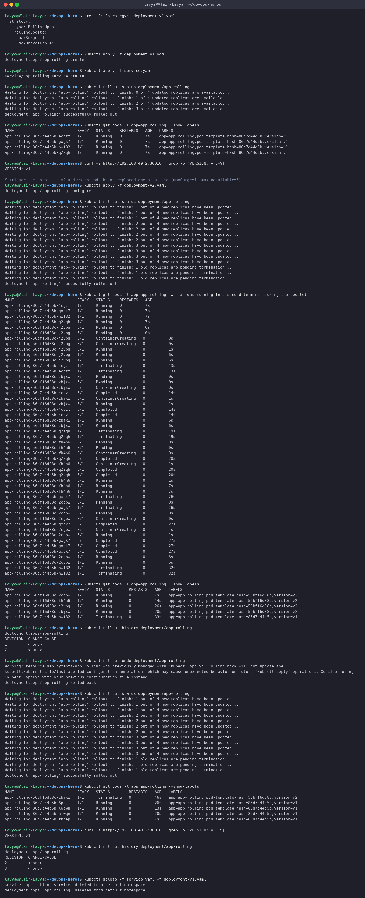

> The `-w` watch shows the exact choreography: one **new** v2 Pod is created (surge to 5), it becomes `1/1` after its readiness probe, and only *then* is one v1 Pod terminated. Repeat four times. At no point are fewer than 4 Pods ready - that is `maxUnavailable: 0` doing its job. `rollout undo` is just another rolling update in the opposite direction, which is why the history shows revision 3 (a copy of revision 1) rather than going back to "1".

---

## Task 9: Troubleshooting Drills (`troubleshooting/`)

**Drill 1** - a rollout that stalls on an unpullable image; **Drill 2** - a manifest the API server refuses.

**Commands**
```bash
grep -E 'image:|version:' /tmp/yatri-v1.yaml
kubectl apply -f /tmp/yatri-v1.yaml
kubectl rollout status deployment/yatri-backend
kubectl get pods -l app=yatri-backend
grep -E 'image:|version:' broken-image.yaml
kubectl apply -f broken-image.yaml
kubectl rollout status deployment/yatri-backend --timeout=30s
kubectl get pods -l app=yatri-backend
kubectl get deployment yatri-backend
kubectl describe pod -l version=broken-v3 | grep -A6 Events:
kubectl rollout history deployment/yatri-backend
kubectl rollout undo deployment/yatri-backend
kubectl rollout status deployment/yatri-backend
kubectl get pods -l app=yatri-backend
kubectl delete -f broken-image.yaml
cat selector-mismatch.yaml
kubectl apply -f selector-mismatch.yaml
diff selector-mismatch.yaml /tmp/selector-fixed.yaml
kubectl apply -f /tmp/selector-fixed.yaml
kubectl get deployment selector-error-demo
kubectl delete deployment selector-error-demo
```

**Output**
```text
# Drill 1: start from a healthy v1 of the same deployment (same manifest, working image), then roll out the broken tag
$ grep -E 'image:|version:' /tmp/yatri-v1.yaml
    version: "v1"
        version: "v1"
          image: nginx:1.24-alpine

$ kubectl apply -f /tmp/yatri-v1.yaml
deployment.apps/yatri-backend created

$ kubectl rollout status deployment/yatri-backend
Waiting for deployment "yatri-backend" rollout to finish: 0 of 3 updated replicas are available...
Waiting for deployment "yatri-backend" rollout to finish: 1 of 3 updated replicas are available...
Waiting for deployment "yatri-backend" rollout to finish: 2 of 3 updated replicas are available...
deployment "yatri-backend" successfully rolled out

$ kubectl get pods -l app=yatri-backend
NAME                             READY   STATUS    RESTARTS   AGE
yatri-backend-678cd66b4d-28v6c   1/1     Running   0          1s
yatri-backend-678cd66b4d-wn5sq   1/1     Running   0          1s
yatri-backend-678cd66b4d-zlhpz   1/1     Running   0          1s

$ grep -E 'image:|version:' broken-image.yaml
    version: "broken-v3"
        version: "broken-v3"
          image: yatri-backend:non-existent-tag-v999

$ kubectl apply -f broken-image.yaml
deployment.apps/yatri-backend configured

$ kubectl rollout status deployment/yatri-backend --timeout=30s
Waiting for deployment "yatri-backend" rollout to finish: 1 out of 3 new replicas have been updated...
error: timed out waiting for the condition

$ kubectl get pods -l app=yatri-backend
NAME                             READY   STATUS             RESTARTS   AGE
yatri-backend-678cd66b4d-28v6c   1/1     Running            0          31s
yatri-backend-678cd66b4d-wn5sq   1/1     Running            0          31s
yatri-backend-678cd66b4d-zlhpz   1/1     Running            0          31s
yatri-backend-77dbb657cd-h6vr7   0/1     ImagePullBackOff   0          30s

$ kubectl get deployment yatri-backend
NAME            READY   UP-TO-DATE   AVAILABLE   AGE
yatri-backend   3/3     1            3           32s

$ kubectl describe pod -l version=broken-v3 | grep -A6 Events:
Events:
  Type     Reason     Age                From               Message
  ----     ------     ----               ----               -------
  Normal   Scheduled  31s                default-scheduler  Successfully assigned default/yatri-backend-77dbb657cd-h6vr7 to minikube
  Normal   BackOff    29s                kubelet            spec.containers{backend}: Back-off pulling image "yatri-backend:non-existent-tag-v999"
  Warning  Failed     29s                kubelet            spec.containers{backend}: Error: ImagePullBackOff
  Normal   Pulling    15s (x2 over 31s)  kubelet            spec.containers{backend}: Pulling image "yatri-backend:non-existent-tag-v999"

# old v1 pods are still Running - maxUnavailable=0 kept the service alive while the surged pod failed to pull
$ kubectl rollout history deployment/yatri-backend
deployment.apps/yatri-backend
REVISION  CHANGE-CAUSE
1         <none>
2         <none>

$ kubectl rollout undo deployment/yatri-backend
Warning: resource deployments/yatri-backend was previously managed with 'kubectl apply'. Rolling back will not update the kubectl.kubernetes.io/last-applied-configuration annotation, which may cause unexpected behavior on future 'kubectl apply' operations. Consider using 'kubectl apply' with your previous configuration file instead.
deployment.apps/yatri-backend rolled back

$ kubectl rollout status deployment/yatri-backend
deployment "yatri-backend" successfully rolled out

$ kubectl get pods -l app=yatri-backend
NAME                             READY   STATUS        RESTARTS   AGE
yatri-backend-678cd66b4d-28v6c   1/1     Running       0          33s
yatri-backend-678cd66b4d-wn5sq   1/1     Running       0          33s
yatri-backend-678cd66b4d-zlhpz   1/1     Running       0          33s
yatri-backend-77dbb657cd-h6vr7   0/1     Terminating   0          32s

$ kubectl delete -f broken-image.yaml
deployment.apps "yatri-backend" deleted from default namespace

# Drill 2: selector does not match the pod template labels - the API server rejects it
$ cat selector-mismatch.yaml
# ==============================================================================
# INTENTIONALLY BROKEN MANIFEST FOR IMMUTABLE SELECTOR DRILL
# Demonstrates API server validation error when selector labels do not match pod template labels
# ==============================================================================

apiVersion: apps/v1
kind: Deployment
metadata:
  name: selector-error-demo
spec:
  replicas: 1
  selector:
    matchLabels:
      app: correct-app-name
  template:
    metadata:
      labels:
        # BUG: Label does not match selector.matchLabels above!
        app: wrong-app-name
    spec:
      containers:
        - name: nginx
          image: nginx:alpine

$ kubectl apply -f selector-mismatch.yaml
The Deployment "selector-error-demo" is invalid: spec.template.metadata.labels: Invalid value: {"app":"wrong-app-name"}: `selector` does not match template `labels`

# fix: make template label match the selector (app: correct-app-name)
$ diff selector-mismatch.yaml /tmp/selector-fixed.yaml
19c19
<         app: wrong-app-name
---
>         app: correct-app-name

$ kubectl apply -f /tmp/selector-fixed.yaml
deployment.apps/selector-error-demo created

$ kubectl get deployment selector-error-demo
NAME                  READY   UP-TO-DATE   AVAILABLE   AGE
selector-error-demo   0/1     1            0           0s

$ kubectl delete deployment selector-error-demo
deployment.apps "selector-error-demo" deleted from default namespace
```

**Screenshot**

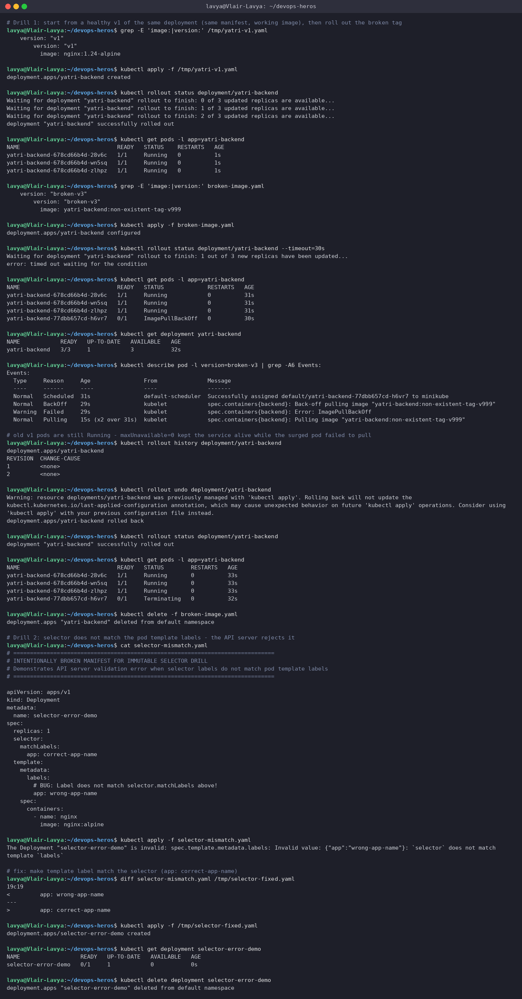

> **Drill 1:** the Deployment surged one Pod with the broken tag, that Pod went `ImagePullBackOff`, and the rollout simply stopped - `UP-TO-DATE 1`, `AVAILABLE 3`. The three v1 Pods never went away, so users saw nothing. `kubectl rollout undo` scaled the broken ReplicaSet to zero and we were back to a clean v1.
>
> **Drill 2:** here nothing ever reaches the cluster. The API server's validation rejects the object because `spec.selector.matchLabels` (`correct-app-name`) does not select the Pods the template would create (`wrong-app-name`) - a Deployment that could never own its own Pods. The fix is a one-line label change. (Selectors are also *immutable* after creation, so this is worth getting right the first time.)

---

## Task 10: Concepts Writeup

### 10.1 The four ports

| Field | Lives in | Meaning |
| --- | --- | --- |
| `containerPort` | Pod spec (`containers[].ports`) | The port the process inside the container listens on. Purely informational - documenting it does not open or block anything. |
| `targetPort` | Service spec | The port on the **Pod** the Service forwards to. Defaults to `port` if omitted. Can be a number or a named container port. |
| `port` | Service spec | The port the **Service** itself exposes on its ClusterIP. Other Pods call `service-name:port`. |
| `nodePort` | Service spec (`type: NodePort` / `LoadBalancer`) | A port in `30000-32767` opened on **every node's IP**. Traffic arriving there is forwarded to `port` → `targetPort`. |

Traffic path for the NodePort services used in this session:
`client → <node-ip>:30010 (nodePort) → app-rolling-service:80 (port) → pod:80 (targetPort) → nginx listening on containerPort 80`

### 10.2 Labels vs Selectors

- **Labels** are arbitrary `key: value` pairs stuck onto objects (`app: myapp`, `slot: blue`, `version: v2`). They carry no behaviour by themselves.
- **Selectors** are queries over labels. A Service's `selector` decides which Pods receive traffic; a Deployment/ReplicaSet's `selector.matchLabels` decides which Pods it owns; `kubectl get pods -l app=myapp` is the same idea on the CLI.
- The whole blue-green trick in Task 11 is nothing more than changing one label value in a Service selector.

### 10.3 The four deployment strategies

| Strategy | How | Downtime | Extra capacity | Rollback | Used in |
| --- | --- | --- | --- | --- | --- |
| **RollingUpdate** (default) | Replace old Pods with new ones gradually, bounded by `maxSurge` / `maxUnavailable`. | None (if probes are correct) | Small (`maxSurge`) | `rollout undo` - another rolling update | Task 8 |
| **Recreate** | Kill *all* old Pods, then start the new ones. | Yes - the gap between the two | None | `rollout undo` (with another outage) | Task 13 |
| **Blue-Green** | Run two full environments; flip the Service selector from blue to green. | None; the switch is atomic | 2× while both are up | Flip the selector back - instant | Task 11 |
| **Canary** | Run a small number of new Pods next to the stable ones behind the same Service; grow the share over time. | None | Small | Scale canary to 0 | Task 12 |

### 10.4 `maxSurge` vs `maxUnavailable`

Both can be an absolute number or a percentage of `replicas` (surge rounds **up**, unavailable rounds **down**).

For `01-rolling-update/deployment-v1.yaml` (`replicas: 4`, `maxSurge: 1`, `maxUnavailable: 0`):

- maximum Pods during the rollout = `4 + 1 = 5`
- minimum *available* Pods during the rollout = `4 - 0 = 4` → 100 % capacity at all times, which is what the watch output in Task 8 shows.

With the defaults (`25%` / `25%`) on 4 replicas: surge = `ceil(1) = 1`, unavailable = `floor(1) = 1`, so the rollout could dip to 3 available Pods. With `maxSurge: 0, maxUnavailable: 1` you get an in-place, no-extra-capacity rollout that always runs one Pod short.

### 10.5 Requests vs Limits, GB vs GiB

- **`requests`** are what the **scheduler** uses to find a node with enough free capacity, and what the container is *guaranteed*. Task 5.2 is a request the node could not satisfy → `Pending`.
- **`limits`** are enforced by the kernel via cgroups: CPU above the limit is **throttled**; memory above the limit gets the container **OOM-killed** (exit 137) and restarted.
- Units: `1 GB = 10^9 bytes` (decimal, SI). `1 GiB = 2^30 = 1,073,741,824 bytes` (binary, IEC) - about 7 % more. Kubernetes manifests use the binary suffixes `Ki / Mi / Gi` (`memory: "64Mi"` in these manifests) and CPU in millicores (`"30m"` = 0.03 of a core).

---

## Task 11: Blue-Green Deployment - Instant Selector Cutover (`02-blue-green/`)

Run Blue (v1) and Green (v2) side by side, point the Service at Blue, flip it to Green, then flip it back.

**Commands**
```bash
kubectl apply -f deployment-blue.yaml
kubectl apply -f deployment-green.yaml
kubectl get pods -l app=myapp --show-labels
kubectl apply -f service-blue.yaml
kubectl describe svc myapp-service | grep Selector
kubectl get endpoints myapp-service
curl -s http://192.168.49.2:30020 | grep ENVIRONMENT
kubectl apply -f service-green.yaml
kubectl describe svc myapp-service | grep Selector
kubectl get endpoints myapp-service
curl -s http://192.168.49.2:30020 | grep ENVIRONMENT
for i in 1 2 3 4 5; do curl -s http://192.168.49.2:30020 | grep -o 'BLUE ENVIRONMENT\|GREEN ENVIRONMENT'; done
kubectl apply -f service-blue.yaml
kubectl describe svc myapp-service | grep Selector
curl -s http://192.168.49.2:30020 | grep ENVIRONMENT
kubectl delete -f service-blue.yaml -f deployment-blue.yaml -f deployment-green.yaml
```

**Output**
```text
$ kubectl apply -f deployment-blue.yaml
deployment.apps/app-blue created

$ kubectl apply -f deployment-green.yaml
deployment.apps/app-green created

$ kubectl get pods -l app=myapp --show-labels
NAME                        READY   STATUS    RESTARTS   AGE   LABELS
app-blue-5c69d7785c-d2mpt   1/1     Running   0          7s    app=myapp,pod-template-hash=5c69d7785c,slot=blue,version=v1
app-blue-5c69d7785c-fvgz8   1/1     Running   0          7s    app=myapp,pod-template-hash=5c69d7785c,slot=blue,version=v1
app-blue-5c69d7785c-n6bh2   1/1     Running   0          7s    app=myapp,pod-template-hash=5c69d7785c,slot=blue,version=v1
app-green-84df7f978-dbbf5   1/1     Running   0          7s    app=myapp,pod-template-hash=84df7f978,slot=green,version=v2
app-green-84df7f978-hbs68   1/1     Running   0          7s    app=myapp,pod-template-hash=84df7f978,slot=green,version=v2
app-green-84df7f978-pwv7w   1/1     Running   0          7s    app=myapp,pod-template-hash=84df7f978,slot=green,version=v2

$ kubectl apply -f service-blue.yaml
service/myapp-service created

$ kubectl describe svc myapp-service | grep Selector
Selector:                 app=myapp,slot=blue

$ kubectl get endpoints myapp-service
Warning: v1 Endpoints is deprecated in v1.33+; use discovery.k8s.io/v1 EndpointSlice
NAME            ENDPOINTS                                      AGE
myapp-service   10.244.0.46:80,10.244.0.47:80,10.244.0.48:80   3s

$ curl -s http://192.168.49.2:30020 | grep ENVIRONMENT
<p>BLUE ENVIRONMENT</p>

# THE SWITCH - flip the selector to green
$ kubectl apply -f service-green.yaml
service/myapp-service configured

$ kubectl describe svc myapp-service | grep Selector
Selector:                 app=myapp,slot=green

$ kubectl get endpoints myapp-service
Warning: v1 Endpoints is deprecated in v1.33+; use discovery.k8s.io/v1 EndpointSlice
NAME            ENDPOINTS                                      AGE
myapp-service   10.244.0.49:80,10.244.0.50:80,10.244.0.51:80   5s

$ curl -s http://192.168.49.2:30020 | grep ENVIRONMENT
<p>GREEN ENVIRONMENT</p>

$ for i in 1 2 3 4 5; do curl -s http://192.168.49.2:30020 | grep -o 'BLUE ENVIRONMENT\|GREEN ENVIRONMENT'; done
GREEN ENVIRONMENT
GREEN ENVIRONMENT
GREEN ENVIRONMENT
GREEN ENVIRONMENT
GREEN ENVIRONMENT

# instant rollback - flip back to blue
$ kubectl apply -f service-blue.yaml
service/myapp-service configured

$ kubectl describe svc myapp-service | grep Selector
Selector:                 app=myapp,slot=blue

$ curl -s http://192.168.49.2:30020 | grep ENVIRONMENT
<p>BLUE ENVIRONMENT</p>

$ kubectl delete -f service-blue.yaml -f deployment-blue.yaml -f deployment-green.yaml
service "myapp-service" deleted from default namespace
deployment.apps "app-blue" deleted from default namespace
deployment.apps "app-green" deleted from default namespace
```

**Screenshot**

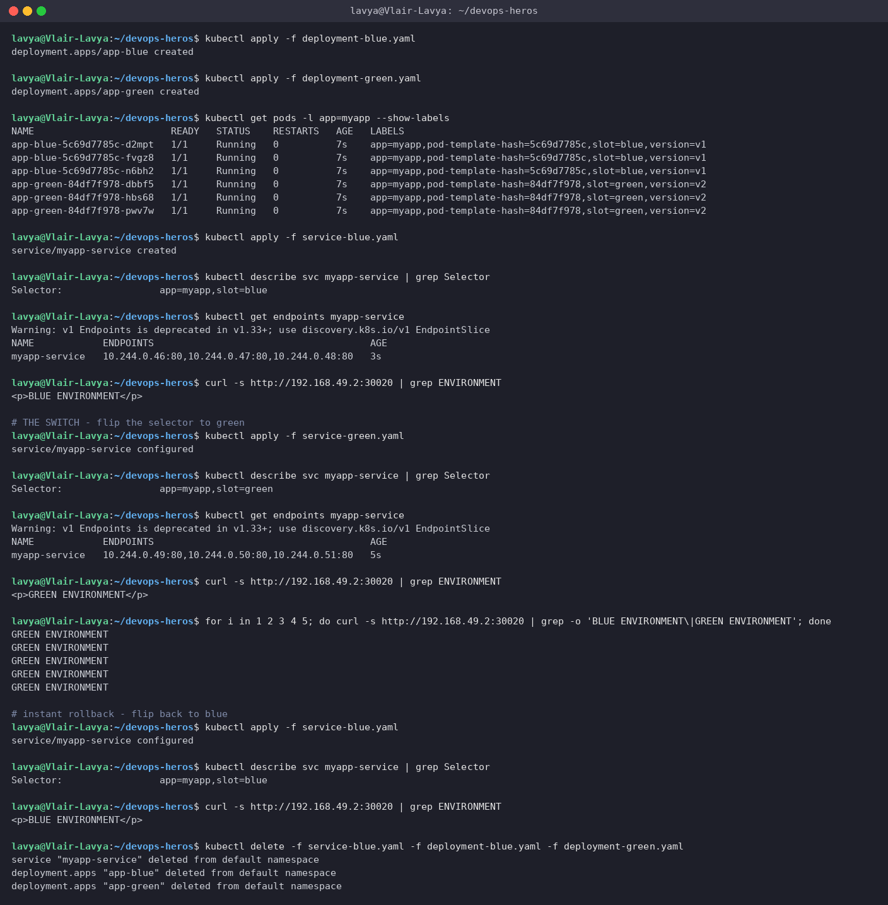

> The Service's `Endpoints` list changes in one shot from the three blue Pod IPs (`.46 .47 .48`) to the three green ones (`.49 .50 .51`). Five consecutive requests after the switch all returned `GREEN` - there is no window with mixed versions because kube-proxy swaps the whole backend set at once. The cost is obvious too: six Pods running for a three-Pod app.

---

## Task 12: Canary Deployment - Pod-Ratio Traffic Splitting (`03-canary/`)

Nine stable Pods plus one canary Pod behind a single Service ⇒ ~10 % of requests hit the canary. Then scale to 30 %, then abort.

**Commands**
```bash
kubectl apply -f deployment-stable.yaml
kubectl apply -f service.yaml
kubectl rollout status deployment/app-stable
kubectl apply -f deployment-canary.yaml
kubectl rollout status deployment/app-canary
kubectl get pods -l app=myapp-canary --show-labels
kubectl get endpoints myapp-canary-service
for i in $(seq 1 30); do curl -s http://192.168.49.2:30030 | grep -o 'STABLE v1\|CANARY v2'; done | sort | uniq -c
for i in $(seq 1 20); do curl -s http://192.168.49.2:30030 | grep -o 'STABLE v1\|CANARY v2'; done
kubectl scale deployment app-canary --replicas=3
kubectl scale deployment app-stable --replicas=7
kubectl get deploy app-stable app-canary
kubectl get endpoints myapp-canary-service
for i in $(seq 1 30); do curl -s http://192.168.49.2:30030 | grep -o 'STABLE v1\|CANARY v2'; done | sort | uniq -c
kubectl scale deployment app-canary --replicas=0
kubectl scale deployment app-stable --replicas=9
kubectl get deploy app-stable app-canary
for i in $(seq 1 10); do curl -s http://192.168.49.2:30030 | grep -o 'STABLE v1\|CANARY v2'; done | sort | uniq -c
kubectl delete -f service.yaml -f deployment-canary.yaml -f deployment-stable.yaml
```

**Output**
```text
$ kubectl apply -f deployment-stable.yaml
deployment.apps/app-stable created

$ kubectl apply -f service.yaml
service/myapp-canary-service created

$ kubectl rollout status deployment/app-stable
Waiting for deployment "app-stable" rollout to finish: 0 of 9 updated replicas are available...
Waiting for deployment "app-stable" rollout to finish: 1 of 9 updated replicas are available...
Waiting for deployment "app-stable" rollout to finish: 2 of 9 updated replicas are available...
Waiting for deployment "app-stable" rollout to finish: 3 of 9 updated replicas are available...
Waiting for deployment "app-stable" rollout to finish: 4 of 9 updated replicas are available...
Waiting for deployment "app-stable" rollout to finish: 5 of 9 updated replicas are available...
Waiting for deployment "app-stable" rollout to finish: 6 of 9 updated replicas are available...
Waiting for deployment "app-stable" rollout to finish: 7 of 9 updated replicas are available...
Waiting for deployment "app-stable" rollout to finish: 8 of 9 updated replicas are available...
deployment "app-stable" successfully rolled out

$ kubectl apply -f deployment-canary.yaml
deployment.apps/app-canary created

$ kubectl rollout status deployment/app-canary
Waiting for deployment "app-canary" rollout to finish: 0 of 1 updated replicas are available...
deployment "app-canary" successfully rolled out

$ kubectl get pods -l app=myapp-canary --show-labels
NAME                          READY   STATUS    RESTARTS   AGE   LABELS
app-canary-5849994497-2645v   1/1     Running   0          7s    app=myapp-canary,pod-template-hash=5849994497,track=canary,version=v2
app-stable-6ffb777f9d-5npqb   1/1     Running   0          16s   app=myapp-canary,pod-template-hash=6ffb777f9d,track=stable,version=v1
app-stable-6ffb777f9d-6b4vj   1/1     Running   0          15s   app=myapp-canary,pod-template-hash=6ffb777f9d,track=stable,version=v1
app-stable-6ffb777f9d-882fn   1/1     Running   0          15s   app=myapp-canary,pod-template-hash=6ffb777f9d,track=stable,version=v1
app-stable-6ffb777f9d-9sc6c   1/1     Running   0          16s   app=myapp-canary,pod-template-hash=6ffb777f9d,track=stable,version=v1
app-stable-6ffb777f9d-ckfxd   1/1     Running   0          15s   app=myapp-canary,pod-template-hash=6ffb777f9d,track=stable,version=v1
app-stable-6ffb777f9d-mmwt2   1/1     Running   0          15s   app=myapp-canary,pod-template-hash=6ffb777f9d,track=stable,version=v1
app-stable-6ffb777f9d-npk4q   1/1     Running   0          15s   app=myapp-canary,pod-template-hash=6ffb777f9d,track=stable,version=v1
app-stable-6ffb777f9d-pgh4w   1/1     Running   0          16s   app=myapp-canary,pod-template-hash=6ffb777f9d,track=stable,version=v1
app-stable-6ffb777f9d-xzzd5   1/1     Running   0          16s   app=myapp-canary,pod-template-hash=6ffb777f9d,track=stable,version=v1

$ kubectl get endpoints myapp-canary-service
Warning: v1 Endpoints is deprecated in v1.33+; use discovery.k8s.io/v1 EndpointSlice
NAME                   ENDPOINTS                                                  AGE
myapp-canary-service   10.244.0.52:80,10.244.0.53:80,10.244.0.54:80 + 7 more...   15s

# 30 requests through the shared Service - roughly 1 in 10 should land on the canary
$ for i in $(seq 1 30); do curl -s http://192.168.49.2:30030 | grep -o 'STABLE v1\|CANARY v2'; done | sort | uniq -c
      3 CANARY v2
     27 STABLE v1

$ for i in $(seq 1 20); do curl -s http://192.168.49.2:30030 | grep -o 'STABLE v1\|CANARY v2'; done
STABLE v1
STABLE v1
STABLE v1
STABLE v1
STABLE v1
STABLE v1
STABLE v1
STABLE v1
STABLE v1
STABLE v1
STABLE v1
STABLE v1
STABLE v1
STABLE v1
STABLE v1
STABLE v1
STABLE v1
STABLE v1
STABLE v1
STABLE v1

# shift to 30% canary: 3 canary + 7 stable
$ kubectl scale deployment app-canary --replicas=3
deployment.apps/app-canary scaled

$ kubectl scale deployment app-stable --replicas=7
deployment.apps/app-stable scaled

$ kubectl get deploy app-stable app-canary
NAME         READY   UP-TO-DATE   AVAILABLE   AGE
app-stable   7/7     7            7           27s
app-canary   3/3     3            3           18s

$ kubectl get endpoints myapp-canary-service
Warning: v1 Endpoints is deprecated in v1.33+; use discovery.k8s.io/v1 EndpointSlice
NAME                   ENDPOINTS                                                  AGE
myapp-canary-service   10.244.0.52:80,10.244.0.53:80,10.244.0.55:80 + 7 more...   26s

$ for i in $(seq 1 30); do curl -s http://192.168.49.2:30030 | grep -o 'STABLE v1\|CANARY v2'; done | sort | uniq -c
      9 CANARY v2
     21 STABLE v1

# rollback: abort the canary by scaling it to 0
$ kubectl scale deployment app-canary --replicas=0
deployment.apps/app-canary scaled

$ kubectl scale deployment app-stable --replicas=9
deployment.apps/app-stable scaled

$ kubectl get deploy app-stable app-canary
NAME         READY   UP-TO-DATE   AVAILABLE   AGE
app-stable   9/9     9            9           38s
app-canary   0/0     0            0           29s

$ for i in $(seq 1 10); do curl -s http://192.168.49.2:30030 | grep -o 'STABLE v1\|CANARY v2'; done | sort | uniq -c
     10 STABLE v1

$ kubectl delete -f service.yaml -f deployment-canary.yaml -f deployment-stable.yaml
service "myapp-canary-service" deleted from default namespace
deployment.apps "app-canary" deleted from default namespace
deployment.apps "app-stable" deleted from default namespace
```

**Screenshot**

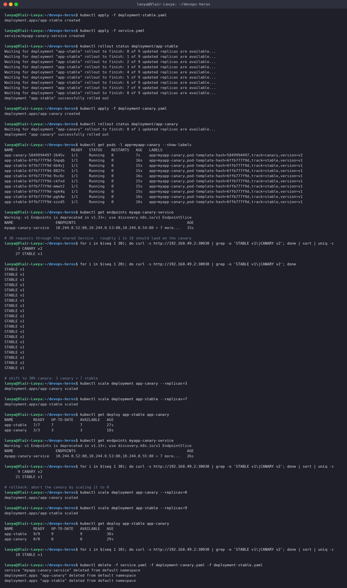

> With 10 endpoints the split is only *statistically* 90/10: my first 30 requests came back 27/3 (10 %), and a separate run of 20 requests happened to hit stable every time - kube-proxy picks a random endpoint per connection, there is no weighting. After scaling to 7+3 the same 30-request loop gave 21/9 (30 %). Scaling the canary to 0 removes its IP from the endpoints and traffic is 100 % stable again - that is the "rollback".

---

## Task 13: Recreate Deployment - Capturing the Outage (`04-recreate/`)

Update a `strategy.type: Recreate` Deployment while a curl loop is hammering it, and record the downtime window.

**Commands**
```bash
grep -A1 'strategy:' deployment-v1.yaml
kubectl apply -f deployment-v1.yaml
kubectl apply -f service.yaml
kubectl rollout status deployment/app-recreate
kubectl get pods -l app=app-recreate
kubectl apply -f deployment-v2.yaml
kubectl rollout status deployment/app-recreate
kubectl get pods -l app=app-recreate
kubectl rollout history deployment/app-recreate
kubectl rollout undo deployment/app-recreate
kubectl rollout status deployment/app-recreate
kubectl delete -f service.yaml -f deployment-v2.yaml
```

**Output**
```text
$ grep -A1 'strategy:' deployment-v1.yaml
  # Recreate strategy: Kubernetes terminates ALL old pods before creating any new pods.
  # This guarantees no two versions run concurrently, but causes a brief downtime.
  strategy:
    type: Recreate

$ kubectl apply -f deployment-v1.yaml
deployment.apps/app-recreate created

$ kubectl apply -f service.yaml
service/app-recreate-service created

$ kubectl rollout status deployment/app-recreate
Waiting for deployment "app-recreate" rollout to finish: 0 of 3 updated replicas are available...
Waiting for deployment "app-recreate" rollout to finish: 1 of 3 updated replicas are available...
Waiting for deployment "app-recreate" rollout to finish: 2 of 3 updated replicas are available...
deployment "app-recreate" successfully rolled out

$ kubectl get pods -l app=app-recreate
NAME                            READY   STATUS    RESTARTS   AGE
app-recreate-6c78cb55bb-cmvr9   1/1     Running   0          1s
app-recreate-6c78cb55bb-q27mm   1/1     Running   0          1s
app-recreate-6c78cb55bb-rrccq   1/1     Running   0          1s

# Terminal 1: kubectl get pods -l app=app-recreate -w
# Terminal 2: while true; do curl -s --connect-timeout 1 http://192.168.49.2:30040 | grep -o 'VERSION: [^<]*' || echo '[OUTAGE] Connection refused / 0 pods alive'; sleep 0.5; done
# Terminal 3: trigger the Recreate update
$ kubectl apply -f deployment-v2.yaml
deployment.apps/app-recreate configured

$ kubectl rollout status deployment/app-recreate
Waiting for deployment "app-recreate" rollout to finish: 0 out of 3 new replicas have been updated...
Waiting for deployment "app-recreate" rollout to finish: 0 out of 3 new replicas have been updated...
Waiting for deployment "app-recreate" rollout to finish: 0 out of 3 new replicas have been updated...
Waiting for deployment "app-recreate" rollout to finish: 0 out of 3 new replicas have been updated...
Waiting for deployment "app-recreate" rollout to finish: 0 out of 3 new replicas have been updated...
Waiting for deployment "app-recreate" rollout to finish: 0 of 3 updated replicas are available...
Waiting for deployment "app-recreate" rollout to finish: 1 of 3 updated replicas are available...
Waiting for deployment "app-recreate" rollout to finish: 2 of 3 updated replicas are available...
deployment "app-recreate" successfully rolled out

$ # Terminal 2 output (curl loop) during the update:
VERSION: v1
VERSION: v1
VERSION: v1
VERSION: v1
VERSION: v1
VERSION: v1
[OUTAGE] Connection refused / 0 pods alive
[OUTAGE] Connection refused / 0 pods alive
VERSION: v2 (UPGRADED)
VERSION: v2 (UPGRADED)
VERSION: v2 (UPGRADED)
VERSION: v2 (UPGRADED)
VERSION: v2 (UPGRADED)
VERSION: v2 (UPGRADED)
VERSION: v2 (UPGRADED)

$ # Terminal 1 output (kubectl get pods -w) during the update:
NAME                            READY   STATUS    RESTARTS   AGE
app-recreate-6c78cb55bb-cmvr9   1/1     Running   0          2s
app-recreate-6c78cb55bb-q27mm   1/1     Running   0          2s
app-recreate-6c78cb55bb-rrccq   1/1     Running   0          2s
app-recreate-6c78cb55bb-q27mm   1/1     Terminating   0          5s
app-recreate-6c78cb55bb-cmvr9   1/1     Terminating   0          5s
app-recreate-6c78cb55bb-rrccq   1/1     Terminating   0          5s
app-recreate-6c78cb55bb-q27mm   1/1     Terminating   0          5s
app-recreate-6c78cb55bb-rrccq   1/1     Terminating   0          5s
app-recreate-6c78cb55bb-cmvr9   1/1     Terminating   0          5s
app-recreate-6c78cb55bb-cmvr9   0/1     Completed     0          5s
app-recreate-6c78cb55bb-rrccq   0/1     Completed     0          5s
app-recreate-6c78cb55bb-q27mm   0/1     Completed     0          5s
app-recreate-7bd8d89b8b-p2kj5   0/1     Pending       0          0s
app-recreate-7bd8d89b8b-9qkpb   0/1     Pending       0          0s
app-recreate-7bd8d89b8b-p2kj5   0/1     Pending       0          0s
app-recreate-7bd8d89b8b-p247h   0/1     Pending       0          0s
app-recreate-7bd8d89b8b-9qkpb   0/1     Pending       0          0s
app-recreate-7bd8d89b8b-p247h   0/1     Pending       0          0s
app-recreate-7bd8d89b8b-p2kj5   0/1     ContainerCreating   0          0s
app-recreate-7bd8d89b8b-9qkpb   0/1     ContainerCreating   0          0s
app-recreate-7bd8d89b8b-p247h   0/1     ContainerCreating   0          0s
app-recreate-6c78cb55bb-rrccq   0/1     Completed           0          6s
app-recreate-6c78cb55bb-rrccq   0/1     Completed           0          6s
app-recreate-6c78cb55bb-q27mm   0/1     Completed           0          6s
app-recreate-6c78cb55bb-q27mm   0/1     Completed           0          6s
app-recreate-6c78cb55bb-cmvr9   0/1     Completed           0          6s
app-recreate-6c78cb55bb-cmvr9   0/1     Completed           0          6s
app-recreate-7bd8d89b8b-p247h   0/1     ContainerCreating   0          1s
app-recreate-7bd8d89b8b-9qkpb   0/1     ContainerCreating   0          1s
app-recreate-7bd8d89b8b-p2kj5   0/1     ContainerCreating   0          1s
app-recreate-7bd8d89b8b-9qkpb   1/1     Running             0          1s
app-recreate-7bd8d89b8b-p247h   1/1     Running             0          1s
app-recreate-7bd8d89b8b-p2kj5   1/1     Running             0          1s

$ kubectl get pods -l app=app-recreate
NAME                            READY   STATUS    RESTARTS   AGE
app-recreate-7bd8d89b8b-9qkpb   1/1     Running   0          6s
app-recreate-7bd8d89b8b-p247h   1/1     Running   0          6s
app-recreate-7bd8d89b8b-p2kj5   1/1     Running   0          6s

$ kubectl rollout history deployment/app-recreate
deployment.apps/app-recreate
REVISION  CHANGE-CAUSE
1         <none>
2         <none>

$ kubectl rollout undo deployment/app-recreate
Warning: resource deployments/app-recreate was previously managed with 'kubectl apply'. Rolling back will not update the kubectl.kubernetes.io/last-applied-configuration annotation, which may cause unexpected behavior on future 'kubectl apply' operations. Consider using 'kubectl apply' with your previous configuration file instead.
deployment.apps/app-recreate rolled back

$ kubectl rollout status deployment/app-recreate
Waiting for deployment "app-recreate" rollout to finish: 0 out of 3 new replicas have been updated...
Waiting for deployment "app-recreate" rollout to finish: 0 out of 3 new replicas have been updated...
Waiting for deployment "app-recreate" rollout to finish: 0 out of 3 new replicas have been updated...
Waiting for deployment "app-recreate" rollout to finish: 0 out of 3 new replicas have been updated...
Waiting for deployment "app-recreate" rollout to finish: 0 out of 3 new replicas have been updated...
Waiting for deployment "app-recreate" rollout to finish: 0 of 3 updated replicas are available...
Waiting for deployment "app-recreate" rollout to finish: 1 of 3 updated replicas are available...
Waiting for deployment "app-recreate" rollout to finish: 2 of 3 updated replicas are available...
deployment "app-recreate" successfully rolled out

$ kubectl delete -f service.yaml -f deployment-v2.yaml
service "app-recreate-service" deleted from default namespace
deployment.apps "app-recreate" deleted from default namespace
```

**Screenshot**

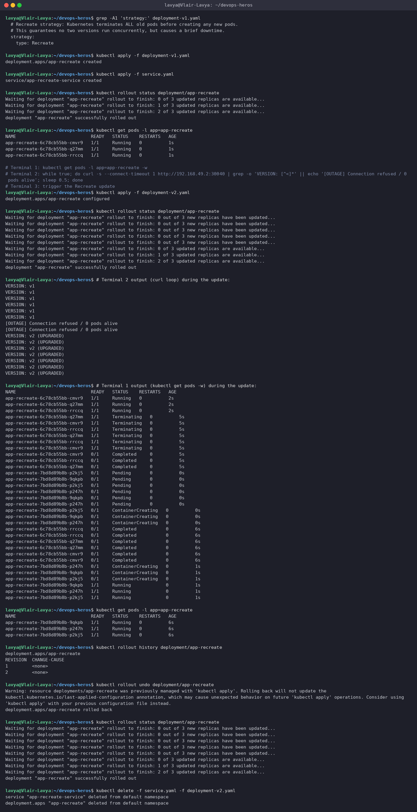

> The curl loop tells the whole story: `VERSION: v1` … `[OUTAGE]` … `VERSION: v2 (UPGRADED)`. The watch confirms why - all three v1 Pods go `Terminating` at the same instant, they reach `Completed`, and only *then* do the three v2 Pods appear as `Pending → ContainerCreating → Running`. For roughly a second there were zero endpoints behind the Service. Recreate is the right choice only when two versions must never overlap (schema migrations, singleton workers); for a web tier it is a self-inflicted outage.

---

## References

- https://github.com/Nency-Ravaliya/Kubernetes
- k8s core objects: https://github.com/Nency-Ravaliya/Kubernetes/blob/main/core-objects.md
- Pod lifecycle: https://kubernetes.io/docs/concepts/workloads/pods/pod-lifecycle/
- Deployments: https://kubernetes.io/docs/concepts/workloads/controllers/deployment/
