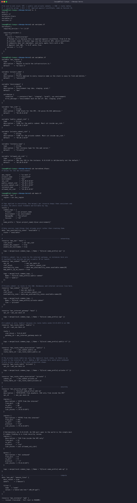
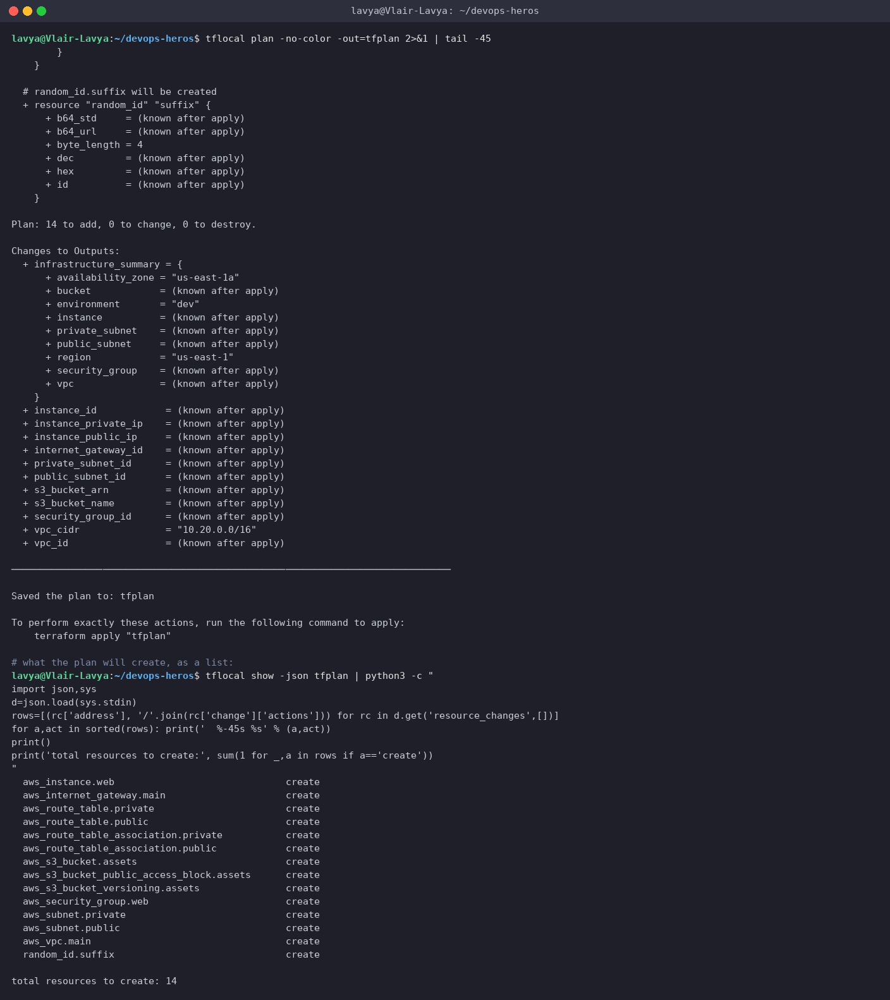
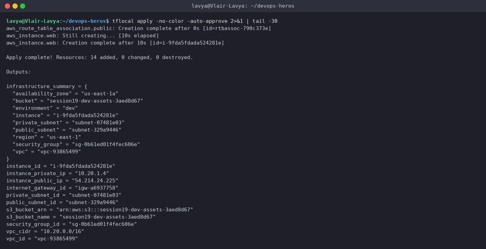
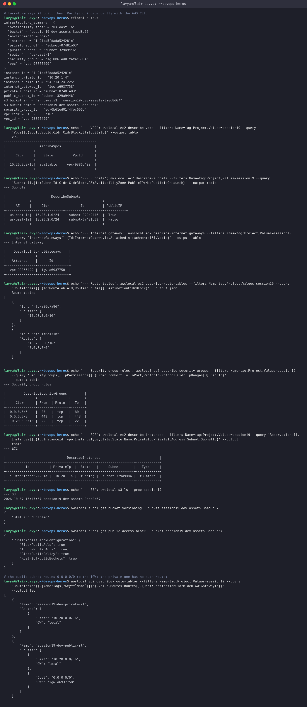
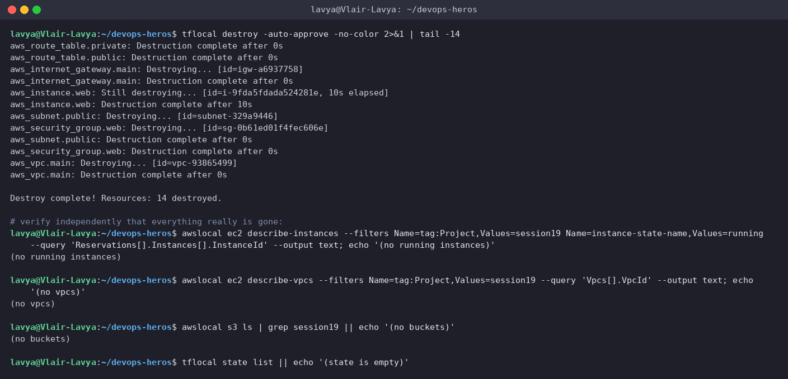

# Session 19: Cloud and Terraform in Action

**Author:** Lavya ([@LAVYA255](https://github.com/LAVYA255))
**Course:** SST DevOps & Cloud [SWE]
**Session:** 19 - Cloud and Terraform in Action
**Repository:** `devops-heros / session19-cloud-terraform`

**Same caveat as Session 18:** every command really ran, but against **LocalStack**, an AWS emulator in a container, not a real AWS account. The `.tf` files are ordinary AWS Terraform and would apply to real AWS unchanged. Provisioning real VPCs, EC2 instances and S3 buckets costs money and needs live credentials.

Terraform v1.9.8, AWS provider v5, LocalStack 3.8, WSL2 Ubuntu. Project: [`09-full-infrastructure/`](./09-full-infrastructure).

---

## Architecture

```
                            Internet
                                │
                       [ Internet Gateway ]
                                │
   ┌────────────────────────────┴─────────────────────────────┐
   │  VPC  10.20.0.0/16    (DNS support + DNS hostnames on)   │
   │                                                          │
   │  ┌────────────────────────────────────────────────┐      │
   │  │ PUBLIC SUBNET  10.20.1.0/24   (us-east-1a)     │      │
   │  │ route table: 0.0.0.0/0 -> IGW                  │      │
   │  │ map_public_ip_on_launch = true                 │      │
   │  │                                                │      │
   │  │   ┌──────────────────────────────────┐         │      │
   │  │   │  EC2  t3.micro                   │         │      │
   │  │   │  Amazon Linux 2 (via data source)│         │      │
   │  │   │  user_data installs httpd        │         │      │
   │  │   └───────────────┬──────────────────┘         │      │
   │  │                   │                            │      │
   │  │   ┌───────────────▼──────────────────┐         │      │
   │  │   │ Security Group                   │         │      │
   │  │   │  in : 80, 443 from 0.0.0.0/0     │         │      │
   │  │   │  in : 22 from 10.20.0.0/16 only  │         │      │
   │  │   │  out: all                        │         │      │
   │  │   └──────────────────────────────────┘         │      │
   │  └────────────────────────────────────────────────┘      │
   │                                                          │
   │  ┌────────────────────────────────────────────────┐      │
   │  │ PRIVATE SUBNET 10.20.2.0/24   (us-east-1a)     │      │
   │  │ route table: local only, NO default route      │      │
   │  │ (no internet in or out, by design)             │      │
   │  └────────────────────────────────────────────────┘      │
   └──────────────────────────────────────────────────────────┘

   ┌──────────────────────────────────────────────────────────┐
   │  S3  session19-dev-assets-<random>                       │
   │   versioning: Enabled                                    │
   │   public access block: all four set to true              │
   └──────────────────────────────────────────────────────────┘
```

14 resources in total.

---

## The project

**Commands and files**
```text
# An end-to-end stack: VPC -> public and private subnets -> IGW -> route tables
# -> security group -> EC2 -> S3. Applied against LocalStack, same as Session 18.
$ ls -1
main.tf
outputs.tf
terraform.tfvars
variables.tf
versions.tf

$ cat versions.tf
terraform {
  required_version = ">= 1.6.0"

  required_providers {
    aws = {
      source = "hashicorp/aws"
      # Pinned to 5.x because this is applied against LocalStack. From 6.0 the
      # provider reads S3 bucket tags via the s3control API, which LocalStack
      # community does not implement, and every apply fails with a 501.
      # Against real AWS, "~> 6.0" works fine.
      version = "~> 5.0"
    }
  }
}

$ cat variables.tf
variable "aws_region" {
  type        = string
  description = "Region to build the infrastructure in."
  default     = "us-east-1"
}

variable "project_name" {
  type        = string
  description = "Prefix applied to every resource name so the stack is easy to find and delete."
  default     = "session19"
}

variable "environment" {
  type        = string
  description = "Environment tag (dev, staging, prod)."
  default     = "dev"

  validation {
    condition     = contains(["dev", "staging", "prod"], var.environment)
    error_message = "environment must be one of: dev, staging, prod."
  }
}

variable "vpc_cidr" {
  type        = string
  description = "CIDR block for the VPC. /16 gives 65,536 addresses."
  default     = "10.20.0.0/16"
}

variable "public_subnet_cidr" {
  type        = string
  description = "CIDR for the public subnet. Must sit inside vpc_cidr."
  default     = "10.20.1.0/24"
}

variable "private_subnet_cidr" {
  type        = string
  description = "CIDR for the private subnet. Must sit inside vpc_cidr."
  default     = "10.20.2.0/24"
}

variable "instance_type" {
  type        = string
  description = "EC2 instance type for the web server."
  default     = "t3.micro"
}

variable "allowed_ssh_cidr" {
  type        = string
  description = "Who may SSH to the instance. 0.0.0.0/0 is deliberately not the default."
  default     = "10.20.0.0/16"
}

$ cat terraform.tfvars
# Values for the dev environment.

aws_region          = "us-east-1"
project_name        = "session19"
environment         = "dev"
vpc_cidr            = "10.20.0.0/16"
public_subnet_cidr  = "10.20.1.0/24"
private_subnet_cidr = "10.20.2.0/24"
instance_type       = "t3.micro"
allowed_ssh_cidr    = "10.20.0.0/16"

$ cat main.tf
provider "aws" {
  region = var.aws_region
}

# Tags applied to everything. One merge() per resource keeps them consistent and
# makes the whole stack findable and billable by tag.
locals {
  common_tags = {
    Project     = var.project_name
    Environment = var.environment
    ManagedBy   = "Terraform"
    Session     = "19"
  }
  name_prefix = "${var.project_name}-${var.environment}"
}

# Data sources read things that already exist rather than creating them.
data "aws_availability_zones" "available" {
  state = "available"
}

# ---------------------------------------------------------------- networking
resource "aws_vpc" "main" {
  cidr_block           = var.vpc_cidr
  enable_dns_support   = true
  enable_dns_hostnames = true

  tags = merge(local.common_tags, { Name = "${local.name_prefix}-vpc" })
}

# Public subnet: has a route to the internet gateway, so instances here are
# reachable from outside and get a public IP on launch.
resource "aws_subnet" "public" {
  vpc_id                  = aws_vpc.main.id
  cidr_block              = var.public_subnet_cidr
  availability_zone       = data.aws_availability_zones.available.names[0]
  map_public_ip_on_launch = true

  tags = merge(local.common_tags, {
    Name = "${local.name_prefix}-public-subnet"
    Tier = "public"
  })
}

# Private subnet: no route to the IGW. Databases and internal services live here.
resource "aws_subnet" "private" {
  vpc_id            = aws_vpc.main.id
  cidr_block        = var.private_subnet_cidr
  availability_zone = data.aws_availability_zones.available.names[0]

  tags = merge(local.common_tags, {
    Name = "${local.name_prefix}-private-subnet"
    Tier = "private"
  })
}

resource "aws_internet_gateway" "main" {
  vpc_id = aws_vpc.main.id

  tags = merge(local.common_tags, { Name = "${local.name_prefix}-igw" })
}

# A subnet is only "public" because its route table sends 0.0.0.0/0 to an IGW.
resource "aws_route_table" "public" {
  vpc_id = aws_vpc.main.id

  route {
    cidr_block = "0.0.0.0/0"
    gateway_id = aws_internet_gateway.main.id
  }

  tags = merge(local.common_tags, { Name = "${local.name_prefix}-public-rt" })
}

resource "aws_route_table_association" "public" {
  subnet_id      = aws_subnet.public.id
  route_table_id = aws_route_table.public.id
}

# The private route table has only the implicit local route, so there is no
# path to the internet at all. Adding a NAT gateway here would give outbound
# only access, which is the usual production shape.
resource "aws_route_table" "private" {
  vpc_id = aws_vpc.main.id

  tags = merge(local.common_tags, { Name = "${local.name_prefix}-private-rt" })
}

resource "aws_route_table_association" "private" {
  subnet_id      = aws_subnet.private.id
  route_table_id = aws_route_table.private.id
}

# ---------------------------------------------------------------- security
resource "aws_security_group" "web" {
  name        = "${local.name_prefix}-web-sg"
  description = "HTTP/HTTPS from anywhere, SSH only from inside the VPC"
  vpc_id      = aws_vpc.main.id

  ingress {
    description = "HTTP from the internet"
    from_port   = 80
    to_port     = 80
    protocol    = "tcp"
    cidr_blocks = ["0.0.0.0/0"]
  }

  ingress {
    description = "HTTPS from the internet"
    from_port   = 443
    to_port     = 443
    protocol    = "tcp"
    cidr_blocks = ["0.0.0.0/0"]
  }

  # Deliberately not 0.0.0.0/0. An SSH port open to the world is the single most
  # common finding in a cloud security review.
  ingress {
    description = "SSH from inside the VPC only"
    from_port   = 22
    to_port     = 22
    protocol    = "tcp"
    cidr_blocks = [var.allowed_ssh_cidr]
  }

  egress {
    description = "All outbound"
    from_port   = 0
    to_port     = 0
    protocol    = "-1"
    cidr_blocks = ["0.0.0.0/0"]
  }

  tags = merge(local.common_tags, { Name = "${local.name_prefix}-web-sg" })
}

# ---------------------------------------------------------------- compute
data "aws_ami" "amazon_linux" {
  most_recent = true
  owners      = ["amazon"]

  filter {
    name   = "name"
    values = ["amzn2-ami-hvm-*-x86_64-gp2"]
  }
}

resource "aws_instance" "web" {
  # Implicit dependencies: Terraform reads these references and works out that
  # the subnet and security group must exist first. No depends_on needed.
  ami                    = data.aws_ami.amazon_linux.id
  instance_type          = var.instance_type
  subnet_id              = aws_subnet.public.id
  vpc_security_group_ids = [aws_security_group.web.id]

  user_data = <<-EOF
    #!/bin/bash
    yum install -y httpd
    systemctl enable --now httpd
    echo "<h1>${local.name_prefix} web server</h1>" > /var/www/html/index.html
  EOF

  tags = merge(local.common_tags, { Name = "${local.name_prefix}-web" })
}

# ---------------------------------------------------------------- storage
resource "aws_s3_bucket" "assets" {
  bucket        = "${local.name_prefix}-assets-${random_id.suffix.hex}"
  force_destroy = true

  tags = merge(local.common_tags, { Name = "${local.name_prefix}-assets" })
}

# Bucket names are globally unique across all of AWS, so a random suffix keeps
# repeated applies from colliding.
resource "random_id" "suffix" {
  byte_length = 4
}

resource "aws_s3_bucket_versioning" "assets" {
  bucket = aws_s3_bucket.assets.id

  versioning_configuration {
    status = "Enabled"
  }
}

resource "aws_s3_bucket_public_access_block" "assets" {
  bucket = aws_s3_bucket.assets.id

  block_public_acls       = true
  block_public_policy     = true
  ignore_public_acls      = true
  restrict_public_buckets = true
}

$ cat outputs.tf
output "vpc_id" {
  description = "ID of the VPC."
  value       = aws_vpc.main.id
}

output "vpc_cidr" {
  description = "CIDR block of the VPC."
  value       = aws_vpc.main.cidr_block
}

output "public_subnet_id" {
  description = "ID of the public subnet."
  value       = aws_subnet.public.id
}

output "private_subnet_id" {
  description = "ID of the private subnet."
  value       = aws_subnet.private.id
}

output "internet_gateway_id" {
  description = "ID of the internet gateway."
  value       = aws_internet_gateway.main.id
}

output "security_group_id" {
  description = "ID of the web security group."
  value       = aws_security_group.web.id
}

output "instance_id" {
  description = "ID of the EC2 instance."
  value       = aws_instance.web.id
}

output "instance_private_ip" {
  description = "Private IP of the EC2 instance."
  value       = aws_instance.web.private_ip
}

output "instance_public_ip" {
  description = "Public IP of the EC2 instance."
  value       = aws_instance.web.public_ip
}

output "s3_bucket_name" {
  description = "Name of the assets bucket."
  value       = aws_s3_bucket.assets.bucket
}

output "s3_bucket_arn" {
  description = "ARN of the assets bucket."
  value       = aws_s3_bucket.assets.arn
}

output "infrastructure_summary" {
  description = "Everything that was built, in one map."
  value = {
    region          = var.aws_region
    environment     = var.environment
    vpc             = aws_vpc.main.id
    public_subnet   = aws_subnet.public.id
    private_subnet  = aws_subnet.private.id
    security_group  = aws_security_group.web.id
    instance        = aws_instance.web.id
    bucket          = aws_s3_bucket.assets.bucket
    availability_zone = aws_subnet.public.availability_zone
  }
}
```

**Screenshot**



Things worth pointing out in the code:

**Variables with validation.** `environment` only accepts dev, staging or prod:

```hcl
validation {
  condition     = contains(["dev", "staging", "prod"], var.environment)
  error_message = "environment must be one of: dev, staging, prod."
}
```

**Locals for consistent tagging.** Every resource gets the same four tags via `merge()`, which is what makes `--filters Name=tag:Project,Values=session19` work for finding and deleting the whole stack later.

**A data source instead of a hardcoded AMI.** `data "aws_ami" "amazon_linux"` looks up the latest Amazon Linux 2 at plan time, so the config is not pinned to one region's AMI ID.

**`random_id` for the bucket name.** S3 bucket names are globally unique, so a fixed name fails the second time anyone runs this.

---

## init, fmt, validate

```text
$ tflocal init -no-color
Initializing the backend...
Initializing provider plugins...
- Finding latest version of hashicorp/random...
- Finding hashicorp/aws versions matching "~> 5.0"...
- Installing hashicorp/random v3.9.1...
- Installed hashicorp/random v3.9.1 (signed by HashiCorp)
- Installing hashicorp/aws v5.100.0...
- Installed hashicorp/aws v5.100.0 (signed by HashiCorp)
Terraform has created a lock file .terraform.lock.hcl to record the provider
selections it made above. Include this file in your version control repository
so that Terraform can guarantee to make the same selections by default when
you run "terraform init" in the future.

Terraform has been successfully initialized!

You may now begin working with Terraform. Try running "terraform plan" to see
any changes that are required for your infrastructure. All Terraform commands
should now work.

If you ever set or change modules or backend configuration for Terraform,
rerun this command to reinitialize your working directory. If you forget, other
commands will detect it and remind you to do so if necessary.

$ tflocal fmt -check -no-color || tflocal fmt -no-color
outputs.tf
outputs.tf

$ tflocal validate -no-color
Success! The configuration is valid.

# validate also catches variable validation blocks. Trying an invalid environment:
$ tflocal plan -no-color -var environment=production 2>&1 | tail -8
  on variables.tf line 13:
  13: variable "environment" {
    ├────────────────
    │ var.environment is "production"

environment must be one of: dev, staging, prod.

This was checked by the validation rule at variables.tf:18,3-13.
```

The last command is the interesting one. Passing `-var environment=production` (not in the allowed list) makes the plan fail at validation with my own error message, before Terraform talks to AWS at all. That is cheap input validation worth adding to any module people other than you will run.

---

## plan

```text
$ tflocal plan -no-color -out=tfplan 2>&1 | tail -45
        }
    }

  # random_id.suffix will be created
  + resource "random_id" "suffix" {
      + b64_std     = (known after apply)
      + b64_url     = (known after apply)
      + byte_length = 4
      + dec         = (known after apply)
      + hex         = (known after apply)
      + id          = (known after apply)
    }

Plan: 14 to add, 0 to change, 0 to destroy.

Changes to Outputs:
  + infrastructure_summary = {
      + availability_zone = "us-east-1a"
      + bucket            = (known after apply)
      + environment       = "dev"
      + instance          = (known after apply)
      + private_subnet    = (known after apply)
      + public_subnet     = (known after apply)
      + region            = "us-east-1"
      + security_group    = (known after apply)
      + vpc               = (known after apply)
    }
  + instance_id            = (known after apply)
  + instance_private_ip    = (known after apply)
  + instance_public_ip     = (known after apply)
  + internet_gateway_id    = (known after apply)
  + private_subnet_id      = (known after apply)
  + public_subnet_id       = (known after apply)
  + s3_bucket_arn          = (known after apply)
  + s3_bucket_name         = (known after apply)
  + security_group_id      = (known after apply)
  + vpc_cidr               = "10.20.0.0/16"
  + vpc_id                 = (known after apply)

─────────────────────────────────────────────────────────────────────────────

Saved the plan to: tfplan

To perform exactly these actions, run the following command to apply:
    terraform apply "tfplan"

# what the plan will create, as a list:
$ tflocal show -json tfplan | python3 -c "
import json,sys
d=json.load(sys.stdin)
rows=[(rc['address'], '/'.join(rc['change']['actions'])) for rc in d.get('resource_changes',[])]
for a,act in sorted(rows): print('  %-45s %s' % (a,act))
print()
print('total resources to create:', sum(1 for _,a in rows if a=='create'))
"
  aws_instance.web                              create
  aws_internet_gateway.main                     create
  aws_route_table.private                       create
  aws_route_table.public                        create
  aws_route_table_association.private           create
  aws_route_table_association.public            create
  aws_s3_bucket.assets                          create
  aws_s3_bucket_public_access_block.assets      create
  aws_s3_bucket_versioning.assets               create
  aws_security_group.web                        create
  aws_subnet.private                            create
  aws_subnet.public                             create
  aws_vpc.main                                  create
  random_id.suffix                              create

total resources to create: 14
```

**Screenshot**



Reading the plan as JSON and listing the resource changes is a nice trick for review and for CI: it reduces a long plan to a list of addresses and actions, which is much easier to scan for "wait, why is that being destroyed".

---

## apply

```text
$ tflocal apply -no-color -auto-approve 2>&1 | tail -30
aws_route_table_association.public: Creation complete after 0s [id=rtbassoc-790c373e]
aws_instance.web: Still creating... [10s elapsed]
aws_instance.web: Creation complete after 10s [id=i-9fda5fdada524281e]

Apply complete! Resources: 14 added, 0 changed, 0 destroyed.

Outputs:

infrastructure_summary = {
  "availability_zone" = "us-east-1a"
  "bucket" = "session19-dev-assets-3aed8d67"
  "environment" = "dev"
  "instance" = "i-9fda5fdada524281e"
  "private_subnet" = "subnet-07481e03"
  "public_subnet" = "subnet-329a9446"
  "region" = "us-east-1"
  "security_group" = "sg-0b61ed01f4fec606e"
  "vpc" = "vpc-93865499"
}
instance_id = "i-9fda5fdada524281e"
instance_private_ip = "10.20.1.4"
instance_public_ip = "54.214.24.225"
internet_gateway_id = "igw-a6937758"
private_subnet_id = "subnet-07481e03"
public_subnet_id = "subnet-329a9446"
s3_bucket_arn = "arn:aws:s3:::session19-dev-assets-3aed8d67"
s3_bucket_name = "session19-dev-assets-3aed8d67"
security_group_id = "sg-0b61ed01f4fec606e"
vpc_cidr = "10.20.0.0/16"
vpc_id = "vpc-93865499"
```

**Screenshot**



`Apply complete! Resources: 14 added, 0 changed, 0 destroyed.`

Note the ordering in the log: the route table association and the instance come last, because Terraform worked out they depend on things that had to exist first.

---

## Verifying it independently

Terraform claiming success is not proof. Everything below is queried with the AWS CLI, not with Terraform.

```text
# Terraform says it built them. Verifying independently with the AWS CLI:
$ tflocal output
infrastructure_summary = {
  "availability_zone" = "us-east-1a"
  "bucket" = "session19-dev-assets-3aed8d67"
  "environment" = "dev"
  "instance" = "i-9fda5fdada524281e"
  "private_subnet" = "subnet-07481e03"
  "public_subnet" = "subnet-329a9446"
  "region" = "us-east-1"
  "security_group" = "sg-0b61ed01f4fec606e"
  "vpc" = "vpc-93865499"
}
instance_id = "i-9fda5fdada524281e"
instance_private_ip = "10.20.1.4"
instance_public_ip = "54.214.24.225"
internet_gateway_id = "igw-a6937758"
private_subnet_id = "subnet-07481e03"
public_subnet_id = "subnet-329a9446"
s3_bucket_arn = "arn:aws:s3:::session19-dev-assets-3aed8d67"
s3_bucket_name = "session19-dev-assets-3aed8d67"
security_group_id = "sg-0b61ed01f4fec606e"
vpc_cidr = "10.20.0.0/16"
vpc_id = "vpc-93865499"

$ echo '--- VPC'; awslocal ec2 describe-vpcs --filters Name=tag:Project,Values=session19 --query 'Vpcs[].{VpcId:VpcId,Cidr:CidrBlock,State:State}' --output table
--- VPC
-----------------------------------------------
|                DescribeVpcs                 |
+--------------+-------------+----------------+
|     Cidr     |    State    |     VpcId      |
+--------------+-------------+----------------+
|  10.20.0.0/16|  available  |  vpc-93865499  |
+--------------+-------------+----------------+

$ echo '--- Subnets'; awslocal ec2 describe-subnets --filters Name=tag:Project,Values=session19 --query 'Subnets[].{Id:SubnetId,Cidr:CidrBlock,AZ:AvailabilityZone,PublicIP:MapPublicIpOnLaunch}' --output table
--- Subnets
---------------------------------------------------------------
|                       DescribeSubnets                       |
+------------+----------------+-------------------+-----------+
|     AZ     |     Cidr       |        Id         | PublicIP  |
+------------+----------------+-------------------+-----------+
|  us-east-1a|  10.20.1.0/24  |  subnet-329a9446  |  True     |
|  us-east-1a|  10.20.2.0/24  |  subnet-07481e03  |  False    |
+------------+----------------+-------------------+-----------+

$ echo '--- Internet gateway'; awslocal ec2 describe-internet-gateways --filters Name=tag:Project,Values=session19 --query 'InternetGateways[].{Id:InternetGatewayId,Attached:Attachments[0].VpcId}' --output table
--- Internet gateway
----------------------------------
|    DescribeInternetGateways    |
+---------------+----------------+
|   Attached    |      Id        |
+---------------+----------------+
|  vpc-93865499 |  igw-a6937758  |
+---------------+----------------+

$ echo '--- Route tables'; awslocal ec2 describe-route-tables --filters Name=tag:Project,Values=session19 --query 'RouteTables[].{Id:RouteTableId,Routes:Routes[].DestinationCidrBlock}' --output json
--- Route tables
[
    {
        "Id": "rtb-a30c7a8d",
        "Routes": [
            "10.20.0.0/16"
        ]
    },
    {
        "Id": "rtb-1f6c431b",
        "Routes": [
            "10.20.0.0/16",
            "0.0.0.0/0"
        ]
    }
]

$ echo '--- Security group rules'; awslocal ec2 describe-security-groups --filters Name=tag:Project,Values=session19 --query 'SecurityGroups[].IpPermissions[].{From:FromPort,To:ToPort,Proto:IpProtocol,Cidr:IpRanges[0].CidrIp}' --output table
--- Security group rules
------------------------------------------
|         DescribeSecurityGroups         |
+---------------+-------+--------+-------+
|     Cidr      | From  | Proto  |  To   |
+---------------+-------+--------+-------+
|  0.0.0.0/0    |  80   |  tcp   |  80   |
|  0.0.0.0/0    |  443  |  tcp   |  443  |
|  10.20.0.0/16 |  22   |  tcp   |  22   |
+---------------+-------+--------+-------+

$ echo '--- EC2'; awslocal ec2 describe-instances --filters Name=tag:Project,Values=session19 --query 'Reservations[].Instances[].{Id:InstanceId,Type:InstanceType,State:State.Name,PrivateIp:PrivateIpAddress,Subnet:SubnetId}' --output table
--- EC2
--------------------------------------------------------------------------------
|                               DescribeInstances                              |
+----------------------+------------+----------+------------------+------------+
|          Id          | PrivateIp  |  State   |     Subnet       |   Type     |
+----------------------+------------+----------+------------------+------------+
|  i-9fda5fdada524281e |  10.20.1.4 |  running |  subnet-329a9446 |  t3.micro  |
+----------------------+------------+----------+------------------+------------+

$ echo '--- S3'; awslocal s3 ls | grep session19
--- S3
2026-10-07 15:47:07 session19-dev-assets-3aed8d67

$ awslocal s3api get-bucket-versioning --bucket session19-dev-assets-3aed8d67
{
    "Status": "Enabled"
}

$ awslocal s3api get-public-access-block --bucket session19-dev-assets-3aed8d67
{
    "PublicAccessBlockConfiguration": {
        "BlockPublicAcls": true,
        "IgnorePublicAcls": true,
        "BlockPublicPolicy": true,
        "RestrictPublicBuckets": true
    }
}

# the public subnet routes 0.0.0.0/0 to the IGW; the private one has no such route:
$ awslocal ec2 describe-route-tables --filters Name=tag:Project,Values=session19 --query 'RouteTables[].{Name:Tags[?Key==`Name`]|[0].Value,Routes:Routes[].{Dest:DestinationCidrBlock,GW:GatewayId}}' --output json
[
    {
        "Name": "session19-dev-private-rt",
        "Routes": [
            {
                "Dest": "10.20.0.0/16",
                "GW": "local"
            }
        ]
    },
    {
        "Name": "session19-dev-public-rt",
        "Routes": [
            {
                "Dest": "10.20.0.0/16",
                "GW": "local"
            },
            {
                "Dest": "0.0.0.0/0",
                "GW": "igw-a6937758"
            }
        ]
    }
]
```

**Screenshot**



The route table output is the part I find most useful, because it shows the public/private distinction as actual data rather than as a diagram:

```
session19-dev-private-rt
  10.20.0.0/16 -> local                  <- that is all. no way out.

session19-dev-public-rt
  10.20.0.0/16 -> local
  0.0.0.0/0    -> igw-a6937758           <- this single route makes it "public"
```

There is no public-subnet flag anywhere in AWS. A subnet is public because of that one route, and seeing it side by side with the private table made the concept concrete in a way the diagrams had not.

The security group check confirms SSH is restricted to `10.20.0.0/16` rather than the internet, and the S3 checks confirm versioning is on and all four public-access-block settings are true.

---

## Dependencies

```text
# Terraform works out the order itself from the references between resources.
$ tflocal graph | grep -E 'aws_(vpc|subnet|instance|security_group|internet_gateway|route_table)' | head -20
  "aws_instance.web" [label="aws_instance.web"];
  "aws_internet_gateway.main" [label="aws_internet_gateway.main"];
  "aws_route_table.private" [label="aws_route_table.private"];
  "aws_route_table.public" [label="aws_route_table.public"];
  "aws_route_table_association.private" [label="aws_route_table_association.private"];
  "aws_route_table_association.public" [label="aws_route_table_association.public"];
  "aws_security_group.web" [label="aws_security_group.web"];
  "aws_subnet.private" [label="aws_subnet.private"];
  "aws_subnet.public" [label="aws_subnet.public"];
  "aws_vpc.main" [label="aws_vpc.main"];
  "aws_instance.web" -> "data.aws_ami.amazon_linux";
  "aws_instance.web" -> "aws_security_group.web";
  "aws_instance.web" -> "aws_subnet.public";
  "aws_internet_gateway.main" -> "aws_vpc.main";
  "aws_route_table.private" -> "aws_vpc.main";
  "aws_route_table.public" -> "aws_internet_gateway.main";
  "aws_route_table_association.private" -> "aws_route_table.private";
  "aws_route_table_association.private" -> "aws_subnet.private";
  "aws_route_table_association.public" -> "aws_route_table.public";
  "aws_route_table_association.public" -> "aws_subnet.public";

# a concrete example: the instance references the subnet and the SG, so both must exist first.
$ grep -A3 'resource "aws_instance"' main.tf | head -12
resource "aws_instance" "web" {
  # Implicit dependencies: Terraform reads these references and works out that
  # the subnet and security group must exist first. No depends_on needed.
  ami                    = data.aws_ami.amazon_linux.id

$ tflocal state list
data.aws_ami.amazon_linux
data.aws_availability_zones.available
aws_instance.web
aws_internet_gateway.main
aws_route_table.private
aws_route_table.public
aws_route_table_association.private
aws_route_table_association.public
aws_s3_bucket.assets
aws_s3_bucket_public_access_block.assets
aws_s3_bucket_versioning.assets
aws_security_group.web
aws_subnet.private
aws_subnet.public
aws_vpc.main
random_id.suffix
```

Terraform builds a dependency graph from the references in the code. Because `aws_instance.web` mentions `aws_subnet.public.id` and `aws_security_group.web.id`, Terraform knows both must exist first. No `depends_on` is needed, and in general if you find yourself writing `depends_on` a lot it usually means you are passing values around instead of referencing resources directly.

Independent resources are created in parallel, which is why the apply is much faster than 14 sequential API calls.

---

## State and idempotence

```text
# State is how Terraform knows what it already owns.
$ tflocal state list | wc -l
16

$ tflocal state show aws_vpc.main | head -18
# aws_vpc.main:
resource "aws_vpc" "main" {
    arn                                  = "arn:aws:ec2:us-east-1:000000000000:vpc/vpc-93865499"
    assign_generated_ipv6_cidr_block     = false
    cidr_block                           = "10.20.0.0/16"
    default_network_acl_id               = "acl-200a7407"
    default_route_table_id               = "rtb-04351efc"
    default_security_group_id            = "sg-c66709fa3c5152232"
    dhcp_options_id                      = "default"
    enable_dns_hostnames                 = true
    enable_dns_support                   = true
    enable_network_address_usage_metrics = false
    id                                   = "vpc-93865499"
    instance_tenancy                     = "default"
    ipv6_association_id                  = null
    ipv6_cidr_block                      = null
    ipv6_cidr_block_network_border_group = null
    ipv6_ipam_pool_id                    = null

# re-running plan with no changes gives an empty diff (idempotence):
$ tflocal plan -no-color | tail -4
No changes. Your infrastructure matches the configuration.

Terraform has compared your real infrastructure against your configuration
and found no differences, so no changes are needed.

# changing a variable produces an in-place update rather than a rebuild:
$ tflocal plan -no-color -var environment=staging 2>&1 | grep -E '^Plan:|will be updated|must be replaced' | head -8
  # aws_instance.web will be updated in-place
  # aws_internet_gateway.main will be updated in-place
  # aws_route_table.private will be updated in-place
  # aws_route_table.public will be updated in-place
  # aws_s3_bucket.assets must be replaced
  # aws_s3_bucket_public_access_block.assets must be replaced
  # aws_s3_bucket_versioning.assets must be replaced
  # aws_security_group.web must be replaced
```

Two things demonstrated here:

1. **Idempotence.** Re-running plan with no changes gives an empty diff. Running Terraform twice does nothing the second time, which is the core promise of declarative infrastructure.
2. **Update in place vs replace.** Changing `environment` to staging produces in-place updates (tags change) rather than destroying and recreating the VPC. Terraform knows which attributes force replacement and which do not, and the plan tells you before you commit. Spotting an unexpected "must be replaced" in a plan is the main reason to read it carefully.

---

## destroy

```text
$ tflocal destroy -auto-approve -no-color 2>&1 | tail -14
aws_route_table.private: Destruction complete after 0s
aws_route_table.public: Destruction complete after 0s
aws_internet_gateway.main: Destroying... [id=igw-a6937758]
aws_internet_gateway.main: Destruction complete after 0s
aws_instance.web: Still destroying... [id=i-9fda5fdada524281e, 10s elapsed]
aws_instance.web: Destruction complete after 10s
aws_subnet.public: Destroying... [id=subnet-329a9446]
aws_security_group.web: Destroying... [id=sg-0b61ed01f4fec606e]
aws_subnet.public: Destruction complete after 0s
aws_security_group.web: Destruction complete after 0s
aws_vpc.main: Destroying... [id=vpc-93865499]
aws_vpc.main: Destruction complete after 0s

Destroy complete! Resources: 14 destroyed.

# verify independently that everything really is gone:
$ awslocal ec2 describe-instances --filters Name=tag:Project,Values=session19 Name=instance-state-name,Values=running --query 'Reservations[].Instances[].InstanceId' --output text; echo '(no running instances)'
(no running instances)

$ awslocal ec2 describe-vpcs --filters Name=tag:Project,Values=session19 --query 'Vpcs[].VpcId' --output text; echo '(no vpcs)'
(no vpcs)

$ awslocal s3 ls | grep session19 || echo '(no buckets)'
(no buckets)

$ tflocal state list || echo '(state is empty)'
```

**Screenshot**



Destroy removes everything in state, in reverse dependency order. Verified independently again: no instances, no VPCs, no buckets, empty state.

This is the part that makes IaC genuinely useful for learning. Building a full network stack by hand in the console and then remembering to delete every piece is tedious and error-prone, and leftover NAT gateways and Elastic IPs are a classic way to get a surprise bill. One command removes all of it.

---

## What I took away

- A subnet is public purely because of one route to an internet gateway. Nothing else distinguishes it.
- Implicit dependencies from references are better than `depends_on`. The graph builds itself if you reference resources properly.
- Tag everything consistently from the start. Every verification command above filters on `tag:Project`, and that is also how you find and clean up a stack you half-remember creating.
- Verify with a different tool than the one that made the change. `terraform show` reads state; the AWS CLI reads reality.
- Variable `validation` blocks are cheap and catch mistakes before anything is provisioned.

---

## References

- Terraform AWS provider: https://registry.terraform.io/providers/hashicorp/aws/latest/docs
- VPC docs: https://docs.aws.amazon.com/vpc/
- Terraform dependencies: https://developer.hashicorp.com/terraform/language/meta-arguments/depends_on
- My AWS service writeups: [IAM](../session18-terraform-iac/aws-services/01-iam/README.md), [EC2](../session18-terraform-iac/aws-services/02-ec2/README.md), [S3](../session18-terraform-iac/aws-services/03-s3/README.md), [VPC](../session18-terraform-iac/aws-services/04-vpc/README.md), [DynamoDB and RDS](../session18-terraform-iac/aws-services/05-dynamodb-rds/README.md)
- Course material in this folder: `01-cloud-service-models` through `08-mini-project`
