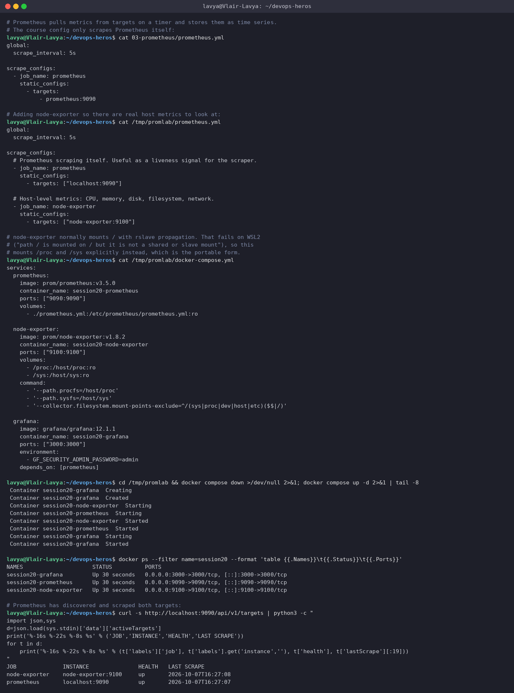
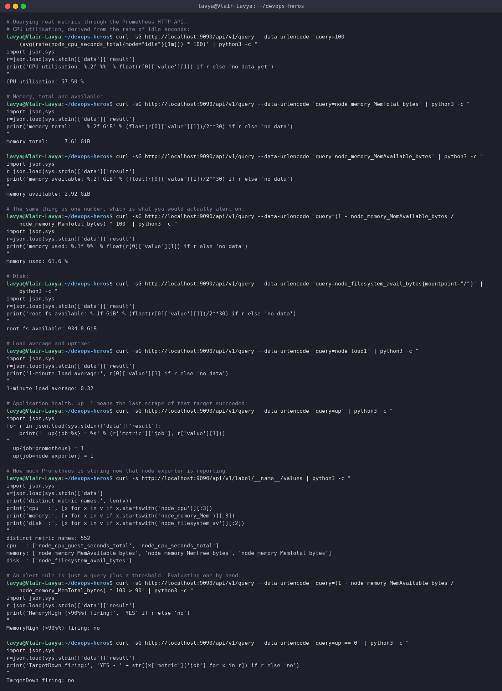
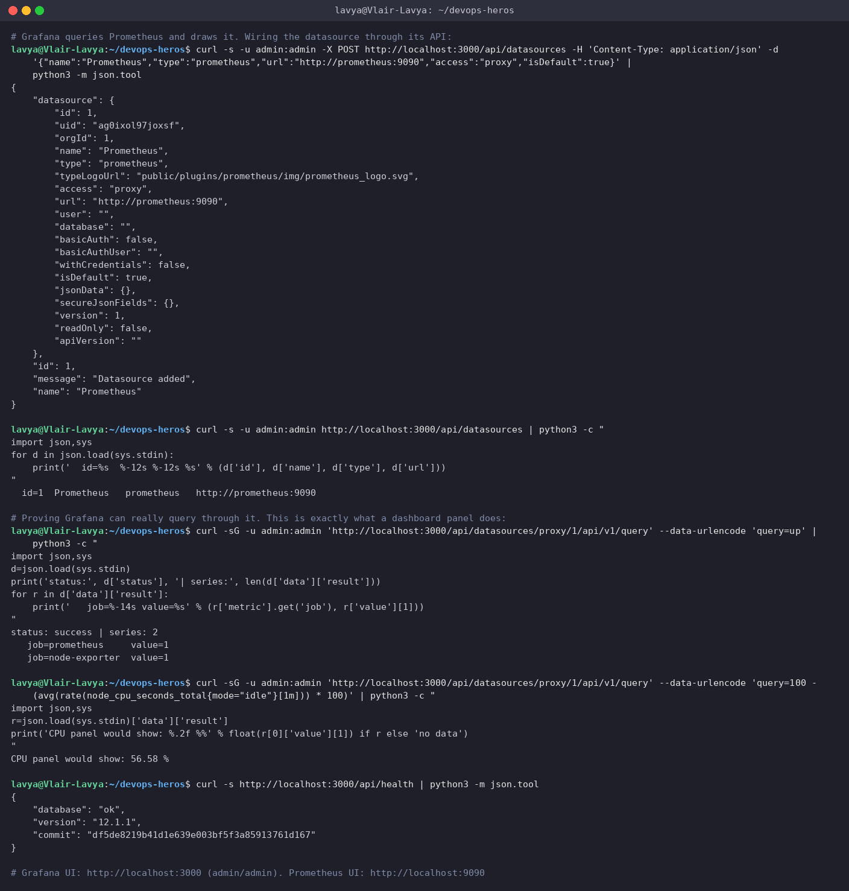
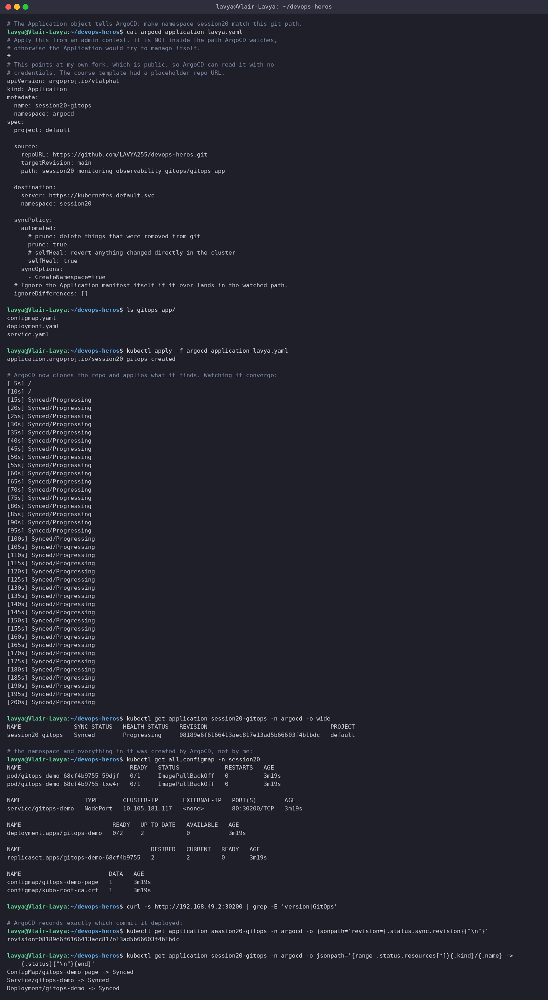
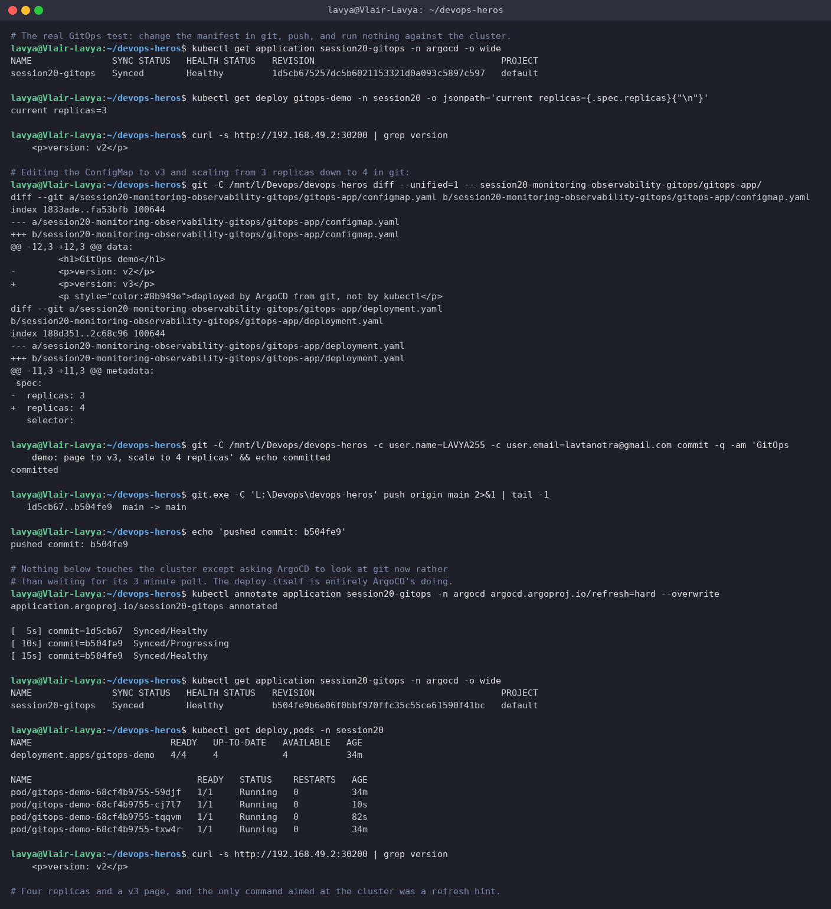
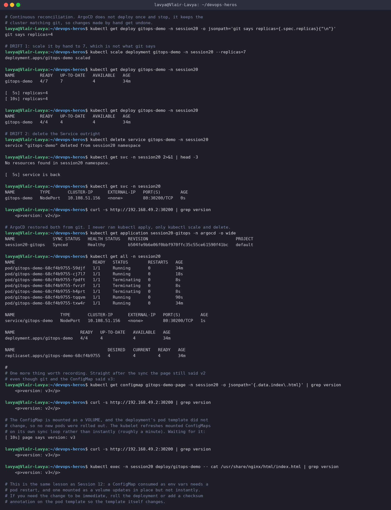

# Session 20: Monitoring, Observability and GitOps

**Author:** Lavya ([@LAVYA255](https://github.com/LAVYA255))
**Course:** SST DevOps & Cloud [SWE]
**Session:** 20 - Monitoring, Observability and GitOps
**Repository:** `devops-heros / session20-monitoring-observability-gitops`

**Setup:** Prometheus v3.5.0, node-exporter v1.8.2 and Grafana 12.1.1 in Docker Compose; ArgoCD (stable) on Minikube v1.39.0 / Kubernetes v1.37.0, in WSL2 Ubuntu. Everything below was really run. Screenshots in `./screenshots/` are from the same session.

---

## Task 1: Monitoring

### Prometheus

Prometheus **pulls** metrics from targets on a timer and stores them as time series. That pull model is the main thing that distinguishes it: targets expose a `/metrics` endpoint and Prometheus scrapes them, rather than applications pushing data somewhere.

**Commands**
```bash
cat 03-prometheus/prometheus.yml
cat /tmp/promlab/prometheus.yml
cat /tmp/promlab/docker-compose.yml
cd /tmp/promlab && docker compose down >/dev/null 2>&1; docker compose up -d 2>&1 | tail -8
docker ps --filter name=session20 --format 'table {{.Names}}\t{{.Status}}\t{{.Ports}}'
curl -s http://localhost:9090/api/v1/targets | python3 -c "
```

**Output**
```text
# Prometheus pulls metrics from targets on a timer and stores them as time series.
# The course config only scrapes Prometheus itself:
$ cat 03-prometheus/prometheus.yml
global:
  scrape_interval: 5s

scrape_configs:
  - job_name: prometheus
    static_configs:
      - targets:
          - prometheus:9090

# Adding node-exporter so there are real host metrics to look at:
$ cat /tmp/promlab/prometheus.yml
global:
  scrape_interval: 5s

scrape_configs:
  # Prometheus scraping itself. Useful as a liveness signal for the scraper.
  - job_name: prometheus
    static_configs:
      - targets: ["localhost:9090"]

  # Host-level metrics: CPU, memory, disk, filesystem, network.
  - job_name: node-exporter
    static_configs:
      - targets: ["node-exporter:9100"]

# node-exporter normally mounts / with rslave propagation. That fails on WSL2
# ("path / is mounted on / but it is not a shared or slave mount"), so this
# mounts /proc and /sys explicitly instead, which is the portable form.
$ cat /tmp/promlab/docker-compose.yml
services:
  prometheus:
    image: prom/prometheus:v3.5.0
    container_name: session20-prometheus
    ports: ["9090:9090"]
    volumes:
      - ./prometheus.yml:/etc/prometheus/prometheus.yml:ro

  node-exporter:
    image: prom/node-exporter:v1.8.2
    container_name: session20-node-exporter
    ports: ["9100:9100"]
    volumes:
      - /proc:/host/proc:ro
      - /sys:/host/sys:ro
    command:
      - '--path.procfs=/host/proc'
      - '--path.sysfs=/host/sys'
      - '--collector.filesystem.mount-points-exclude=^/(sys|proc|dev|host|etc)($$|/)'

  grafana:
    image: grafana/grafana:12.1.1
    container_name: session20-grafana
    ports: ["3000:3000"]
    environment:
      - GF_SECURITY_ADMIN_PASSWORD=admin
    depends_on: [prometheus]

$ cd /tmp/promlab && docker compose down >/dev/null 2>&1; docker compose up -d 2>&1 | tail -8
 Container session20-grafana  Creating
 Container session20-grafana  Created
 Container session20-node-exporter  Starting
 Container session20-prometheus  Starting
 Container session20-node-exporter  Started
 Container session20-prometheus  Started
 Container session20-grafana  Starting
 Container session20-grafana  Started

$ docker ps --filter name=session20 --format 'table {{.Names}}\t{{.Status}}\t{{.Ports}}'
NAMES                     STATUS          PORTS
session20-grafana         Up 30 seconds   0.0.0.0:3000->3000/tcp, [::]:3000->3000/tcp
session20-prometheus      Up 30 seconds   0.0.0.0:9090->9090/tcp, [::]:9090->9090/tcp
session20-node-exporter   Up 30 seconds   0.0.0.0:9100->9100/tcp, [::]:9100->9100/tcp

# Prometheus has discovered and scraped both targets:
$ curl -s http://localhost:9090/api/v1/targets | python3 -c "
import json,sys
d=json.load(sys.stdin)['data']['activeTargets']
print('%-16s %-22s %-8s %s' % ('JOB','INSTANCE','HEALTH','LAST SCRAPE'))
for t in d:
    print('%-16s %-22s %-8s %s' % (t['labels']['job'], t['labels'].get('instance',''), t['health'], t['lastScrape'][:19]))
"
JOB              INSTANCE               HEALTH   LAST SCRAPE
node-exporter    node-exporter:9100     up       2026-10-07T16:27:08
prometheus       localhost:9090         up       2026-10-07T16:27:07
```

**Screenshot**



The course config only scrapes Prometheus itself, which is circular and shows nothing interesting, so I added **node-exporter** to get real host metrics: CPU, memory, disk, filesystem and network.

One practical note worth recording. The standard node-exporter compose snippet mounts `/` with `rslave` propagation, and on WSL2 that fails outright:

```
Error response from daemon: path / is mounted on / but it is not a shared or slave mount
```

Mounting `/proc` and `/sys` explicitly instead works everywhere and is the more portable form:

```yaml
volumes:
  - /proc:/host/proc:ro
  - /sys:/host/sys:ro
command:
  - '--path.procfs=/host/proc'
  - '--path.sysfs=/host/sys'
```

### Metrics, alerts, CPU, memory, application health

**Output**
```text
# Querying real metrics through the Prometheus HTTP API.
# CPU utilisation, derived from the rate of idle seconds:
$ curl -sG http://localhost:9090/api/v1/query --data-urlencode 'query=100 - (avg(rate(node_cpu_seconds_total{mode="idle"}[1m])) * 100)' | python3 -c "
import json,sys
r=json.load(sys.stdin)['data']['result']
print('CPU utilisation: %.2f %%' % float(r[0]['value'][1]) if r else 'no data yet')
"
CPU utilisation: 57.50 %

# Memory, total and available:
$ curl -sG http://localhost:9090/api/v1/query --data-urlencode 'query=node_memory_MemTotal_bytes' | python3 -c "
import json,sys
r=json.load(sys.stdin)['data']['result']
print('memory total:     %.2f GiB' % (float(r[0]['value'][1])/2**30) if r else 'no data')
"
memory total:     7.61 GiB

$ curl -sG http://localhost:9090/api/v1/query --data-urlencode 'query=node_memory_MemAvailable_bytes' | python3 -c "
import json,sys
r=json.load(sys.stdin)['data']['result']
print('memory available: %.2f GiB' % (float(r[0]['value'][1])/2**30) if r else 'no data')
"
memory available: 2.92 GiB

# The same thing as one number, which is what you would actually alert on:
$ curl -sG http://localhost:9090/api/v1/query --data-urlencode 'query=(1 - node_memory_MemAvailable_bytes / node_memory_MemTotal_bytes) * 100' | python3 -c "
import json,sys
r=json.load(sys.stdin)['data']['result']
print('memory used: %.1f %%' % float(r[0]['value'][1]) if r else 'no data')
"
memory used: 61.6 %

# Disk:
$ curl -sG http://localhost:9090/api/v1/query --data-urlencode 'query=node_filesystem_avail_bytes{mountpoint="/"}' | python3 -c "
import json,sys
r=json.load(sys.stdin)['data']['result']
print('root fs available: %.1f GiB' % (float(r[0]['value'][1])/2**30) if r else 'no data')
"
root fs available: 934.8 GiB

# Load average and uptime:
$ curl -sG http://localhost:9090/api/v1/query --data-urlencode 'query=node_load1' | python3 -c "
import json,sys
r=json.load(sys.stdin)['data']['result']
print('1-minute load average:', r[0]['value'][1] if r else 'no data')
"
1-minute load average: 0.32

# Application health. up==1 means the last scrape of that target succeeded:
$ curl -sG http://localhost:9090/api/v1/query --data-urlencode 'query=up' | python3 -c "
import json,sys
for r in json.load(sys.stdin)['data']['result']:
    print('  up{job=%s} = %s' % (r['metric']['job'], r['value'][1]))
"
  up{job=prometheus} = 1
  up{job=node-exporter} = 1

# How much Prometheus is storing now that node-exporter is reporting:
$ curl -s http://localhost:9090/api/v1/label/__name__/values | python3 -c "
import json,sys
v=json.load(sys.stdin)['data']
print('distinct metric names:', len(v))
print('cpu   :', [x for x in v if x.startswith('node_cpu')][:3])
print('memory:', [x for x in v if x.startswith('node_memory_Mem')][:3])
print('disk  :', [x for x in v if x.startswith('node_filesystem_av')][:2])
"
distinct metric names: 552
cpu   : ['node_cpu_guest_seconds_total', 'node_cpu_seconds_total']
memory: ['node_memory_MemAvailable_bytes', 'node_memory_MemFree_bytes', 'node_memory_MemTotal_bytes']
disk  : ['node_filesystem_avail_bytes']

# An alert rule is just a query plus a threshold. Evaluating one by hand:
$ curl -sG http://localhost:9090/api/v1/query --data-urlencode 'query=(1 - node_memory_MemAvailable_bytes / node_memory_MemTotal_bytes) * 100 > 90' | python3 -c "
import json,sys
r=json.load(sys.stdin)['data']['result']
print('MemoryHigh (>90%%) firing:', 'YES' if r else 'no')
"
MemoryHigh (>90%%) firing: no

$ curl -sG http://localhost:9090/api/v1/query --data-urlencode 'query=up == 0' | python3 -c "
import json,sys
r=json.load(sys.stdin)['data']['result']
print('TargetDown firing:', 'YES - ' + str([x['metric']['job'] for x in r]) if r else 'no')
"
TargetDown firing: no
```

**Screenshot**



Real numbers off my machine at the time of the run:

| Query | Result |
| --- | --- |
| CPU utilisation | 57.50 % |
| memory total | 7.61 GiB |
| memory available | 2.92 GiB |
| memory used | 61.6 % |
| root filesystem available | 934.8 GiB |
| 1-minute load average | 0.32 |
| distinct metric names | 552 |

The CPU query is worth reading closely, because it is the one that confuses everyone at first:

```promql
100 - (avg(rate(node_cpu_seconds_total{mode="idle"}[1m])) * 100)
```

There is no "cpu percent" metric. `node_cpu_seconds_total` is a **counter** of seconds spent in each mode, only ever increasing. `rate(...[1m])` converts it to seconds-of-idle per second, which for a fully idle core is 1. Average across cores, multiply by 100, subtract from 100, and you have utilisation. Almost every useful PromQL expression is this shape: take a counter, `rate()` it, then aggregate.

**Alerts** are not a separate system. An alert rule is a query plus a threshold plus a duration:

```promql
(1 - node_memory_MemAvailable_bytes / node_memory_MemTotal_bytes) * 100 > 90
```

If that returns any series, the condition holds. I evaluated two by hand (`MemoryHigh` and `TargetDown`) and both correctly returned nothing, because nothing was wrong.

**Application health** is the `up` metric, which Prometheus generates itself for every target: `1` if the last scrape succeeded, `0` if it failed. `up == 0` is the single most important alert in any Prometheus setup, because a target that stops reporting looks exactly like a target with no problems if you only alert on thresholds.

### Grafana

**Output**
```text
# Grafana queries Prometheus and draws it. Wiring the datasource through its API:
$ curl -s -u admin:admin -X POST http://localhost:3000/api/datasources -H 'Content-Type: application/json' -d '{"name":"Prometheus","type":"prometheus","url":"http://prometheus:9090","access":"proxy","isDefault":true}' | python3 -m json.tool
{
    "datasource": {
        "id": 1,
        "uid": "ag0ixol97joxsf",
        "orgId": 1,
        "name": "Prometheus",
        "type": "prometheus",
        "typeLogoUrl": "public/plugins/prometheus/img/prometheus_logo.svg",
        "access": "proxy",
        "url": "http://prometheus:9090",
        "user": "",
        "database": "",
        "basicAuth": false,
        "basicAuthUser": "",
        "withCredentials": false,
        "isDefault": true,
        "jsonData": {},
        "secureJsonFields": {},
        "version": 1,
        "readOnly": false,
        "apiVersion": ""
    },
    "id": 1,
    "message": "Datasource added",
    "name": "Prometheus"
}

$ curl -s -u admin:admin http://localhost:3000/api/datasources | python3 -c "
import json,sys
for d in json.load(sys.stdin):
    print('  id=%s  %-12s %-12s %s' % (d['id'], d['name'], d['type'], d['url']))
"
  id=1  Prometheus   prometheus   http://prometheus:9090

# Proving Grafana can really query through it. This is exactly what a dashboard panel does:
$ curl -sG -u admin:admin 'http://localhost:3000/api/datasources/proxy/1/api/v1/query' --data-urlencode 'query=up' | python3 -c "
import json,sys
d=json.load(sys.stdin)
print('status:', d['status'], '| series:', len(d['data']['result']))
for r in d['data']['result']:
    print('   job=%-14s value=%s' % (r['metric'].get('job'), r['value'][1]))
"
status: success | series: 2
   job=prometheus     value=1
   job=node-exporter  value=1

$ curl -sG -u admin:admin 'http://localhost:3000/api/datasources/proxy/1/api/v1/query' --data-urlencode 'query=100 - (avg(rate(node_cpu_seconds_total{mode="idle"}[1m])) * 100)' | python3 -c "
import json,sys
r=json.load(sys.stdin)['data']['result']
print('CPU panel would show: %.2f %%' % float(r[0]['value'][1]) if r else 'no data')
"
CPU panel would show: 56.58 %

$ curl -s http://localhost:3000/api/health | python3 -m json.tool
{
    "database": "ok",
    "version": "12.1.1",
    "commit": "df5de8219b41d1e639e003bf5f3a85913761d167"
}

# Grafana UI: http://localhost:3000 (admin/admin). Prometheus UI: http://localhost:9090
```

**Screenshot**



Grafana does not store anything. It queries Prometheus and draws the result. I wired the datasource through Grafana's API rather than clicking through the UI, then proved it actually works by querying *through* Grafana's datasource proxy, which is exactly what a dashboard panel does under the hood:

```
status: success | series: 2
   job=prometheus     value=1
   job=node-exporter  value=1

CPU panel would show: 56.58 %
```

That last line is the useful demonstration: the number a panel would render, fetched through the same path a panel uses.

### Monitoring inside Kubernetes

**Output**
```text
# The same three pillars inside Kubernetes.
# METRICS from metrics-server:
$ kubectl top nodes
NAME       CPU(cores)   CPU(%)   MEMORY(bytes)   MEMORY(%)
minikube   115m         0%       1379Mi          17%

$ kubectl top pods -A --sort-by=cpu 2>/dev/null | head -8
NAMESPACE       NAME                                       CPU(cores)   MEMORY(bytes)
kube-system     kube-apiserver-minikube                    32m          301Mi
kube-system     etcd-minikube                              20m          74Mi
kube-system     kube-controller-manager-minikube           14m          87Mi
kube-system     kube-scheduler-minikube                    5m           52Mi
ingress-nginx   ingress-nginx-controller-5479f5f4f-lr8jm   4m           304Mi
kube-system     coredns-559f6c778d-blkrr                   2m           41Mi
kube-system     metrics-server-768f9f6999-442hr            2m           38Mi

# LOGS from the kubelet via the API server:
$ kubectl apply -f /tmp/log-demo.yaml
pod/log-demo created

$ kubectl logs log-demo --tail=8
{"ts":"2026-10-07T15:53:18+00:00","level":"info","msg":"request handled","n":1}
{"ts":"2026-10-07T15:53:20+00:00","level":"info","msg":"request handled","n":2}
{"ts":"2026-10-07T15:53:22+00:00","level":"info","msg":"request handled","n":3}
{"ts":"2026-10-07T15:53:24+00:00","level":"info","msg":"request handled","n":4}
{"ts":"2026-10-07T15:53:26+00:00","level":"info","msg":"request handled","n":5}
{"ts":"2026-10-07T15:53:26+00:00","level":"error","msg":"upstream timeout"}
{"ts":"2026-10-07T15:53:28+00:00","level":"info","msg":"request handled","n":6}
{"ts":"2026-10-07T15:53:30+00:00","level":"info","msg":"request handled","n":7}

# structured logs mean you can filter them, which is the whole point:
$ kubectl logs log-demo --tail=40 | grep error | tail -3
{"ts":"2026-10-07T15:53:26+00:00","level":"error","msg":"upstream timeout"}

$ kubectl logs log-demo --since=10s | wc -l
6

# TRACES: not demonstrated with a tracing backend here, but the concept is in the writeup.
$ kubectl delete pod log-demo --wait=false
pod "log-demo" deleted from default namespace
```

The same pillars, different tools. `metrics-server` provides CPU and memory for `kubectl top` and for the HPA (which is what Session 13 depended on), and `kubectl logs` reads container stdout via the kubelet.

The log demo emits structured JSON on purpose:

```json
{"ts":"2026-10-07T...","level":"info","msg":"request handled","n":42}
{"ts":"2026-10-07T...","level":"error","msg":"upstream timeout"}
```

Structured logs are the difference between logs you can query and logs you can only read. `kubectl logs | grep error` works at one-pod scale; the same field-based filtering is what Loki or Elasticsearch gives you across a whole cluster.

---

## Task 2: Observability

### The three pillars

| | What it is | Answers | Tools |
| --- | --- | --- | --- |
| **Metrics** | Numeric time series, aggregated | *Is something wrong?* | Prometheus, CloudWatch |
| **Logs** | Discrete timestamped events | *What exactly happened?* | Loki, ELK, CloudWatch Logs |
| **Traces** | One request's path across services, with timing per hop | *Where is the time going?* | Jaeger, Tempo, OpenTelemetry |

They have very different cost profiles, which is why you need all three rather than just one. Metrics are tiny and cheap, so you keep them for a year and alert on them. Logs are large and expensive, so you sample and expire them. Traces are huge, so you sample heavily, often 1%.

### Monitoring vs observability

Monitoring tells you whether the things **you predicted might fail** are failing. You decide in advance what to measure, set thresholds, and get alerted. It answers known questions.

Observability is whether you can answer questions you **did not think to ask in advance**, from the data the system already emits. "Why is checkout slow, but only for users in one region, only on mobile, only since Tuesday?" is not a dashboard you built ahead of time.

The practical difference is high-cardinality context. A metric called `http_requests_total` tells you request volume. The same metric labelled by route, status, region and version lets you slice until the cause is obvious. Observability is mostly about keeping enough context attached to the data, and resisting the urge to aggregate it away at collection time.

### Why observability is required

- **Distributed systems fail partially.** One slow dependency in a chain of ten services shows up as "the site is slow", and only a trace tells you which hop.
- **Ephemeral infrastructure.** A pod that crashed and was rescheduled is gone. If its logs and metrics were not shipped somewhere first, the evidence does not exist.
- **Faster recovery.** Most of an incident is spent working out *where* the problem is, not fixing it.
- **The unknown unknowns.** Novel failures are the ones that cause real outages, and by definition you have no dashboard for them.

### Kubernetes observability

| Layer | What to watch |
| --- | --- |
| Cluster | Node readiness, allocatable vs requested capacity, control plane health |
| Workload | Replicas ready vs desired, restart counts, OOMKills, pending pods |
| Pod / container | CPU and memory against requests and limits, throttling |
| Application | Request rate, error rate, latency, plus whatever is domain-specific |
| Network | Service endpoints, DNS latency, ingress error rates |

Standard stack: **kube-prometheus-stack** (Prometheus, Alertmanager, Grafana, node-exporter, kube-state-metrics) for metrics, **Loki** or ELK for logs, **Tempo** or Jaeger for traces, increasingly with **OpenTelemetry** as the vendor-neutral way to emit all three.

`kube-state-metrics` is the piece worth calling out: node-exporter reports on *machines*, kube-state-metrics reports on *Kubernetes objects*, so things like "deployment X has had 2 of 3 replicas available for 10 minutes" come from there.

The **four golden signals** (latency, traffic, errors, saturation) are a good default for what to actually alert on, and a good antidote to dashboards with 200 panels nobody looks at.

---

## Task 3: GitOps

### What GitOps is

Git is the single source of truth for what should be running. A controller inside the cluster continuously compares the live state against the repository and corrects any difference. Nobody deploys by running `kubectl apply` from a laptop.

Four principles:

1. **Declarative.** The whole system is described as data, not as a sequence of steps.
2. **Versioned and immutable.** Git history is the deployment history, with authorship and review built in.
3. **Pulled automatically.** The agent runs *inside* the cluster and pulls, so no CI system needs cluster credentials.
4. **Continuously reconciled.** It does not deploy once. It keeps checking.

That third point is the underrated one. In push-based CD, your CI system holds kubeconfig credentials for production, which makes the CI system a very attractive target. With GitOps the cluster pulls, and no external system needs write access at all.

### Installing ArgoCD

```text
# Installing ArgoCD into the cluster.
$ kubectl create namespace argocd --dry-run=client -o yaml | kubectl apply -f -
namespace/argocd created

$ kubectl apply -n argocd -f https://raw.githubusercontent.com/argoproj/argo-cd/stable/manifests/install.yaml 2>&1 | tail -8
networkpolicy.networking.k8s.io/argocd-application-controller-network-policy created
networkpolicy.networking.k8s.io/argocd-applicationset-controller-network-policy created
networkpolicy.networking.k8s.io/argocd-dex-server-network-policy created
networkpolicy.networking.k8s.io/argocd-notifications-controller-network-policy created
networkpolicy.networking.k8s.io/argocd-redis-network-policy created
networkpolicy.networking.k8s.io/argocd-repo-server-network-policy created
networkpolicy.networking.k8s.io/argocd-server-network-policy created
The CustomResourceDefinition "applicationsets.argoproj.io" is invalid: metadata.annotations: Too long: may not be more than 262144 bytes

# waiting for the control plane components to come up (this takes a couple of minutes)
$ kubectl wait --for=condition=available --timeout=600s deployment -n argocd --all 2>&1 | tail -8
deployment.apps/argocd-applicationset-controller condition met
deployment.apps/argocd-dex-server condition met
deployment.apps/argocd-notifications-controller condition met
deployment.apps/argocd-redis condition met
deployment.apps/argocd-repo-server condition met
deployment.apps/argocd-server condition met

$ kubectl get pods -n argocd
NAME                                                READY   STATUS    RESTARTS   AGE
argocd-application-controller-0                     1/1     Running   0          67s
argocd-applicationset-controller-76fd8cdd4f-lpvnv   1/1     Running   0          67s
argocd-dex-server-66c78cf887-f947h                  1/1     Running   0          67s
argocd-notifications-controller-7fb9868fd6-knjh8    1/1     Running   0          67s
argocd-redis-bdbdffcb4-8gj4z                        1/1     Running   0          67s
argocd-repo-server-d89c7967d-22gkk                  1/1     Running   0          67s
argocd-server-776b7cdd4d-7fscr                      1/1     Running   0          67s

$ kubectl get crd | grep argoproj
applications.argoproj.io   Namespaced   v1alpha1(storage)   2026-10-07T15:53:32Z
appprojects.argoproj.io    Namespaced   v1alpha1(storage)   2026-10-07T15:53:32Z
```

### Git as the source of truth

The `Application` object points ArgoCD at a repo path:

```yaml
source:
  repoURL: https://github.com/LAVYA255/devops-heros.git
  targetRevision: main
  path: session20-monitoring-observability-gitops/gitops-app
syncPolicy:
  automated:
    prune: true      # delete things removed from git
    selfHeal: true   # revert changes made directly in the cluster
```

The course template used a placeholder repo URL, so I pointed it at my own fork, which is public and therefore needs no credentials. The watched directory is [`gitops-app/`](./gitops-app) and contains a Deployment, a Service and a ConfigMap.

One detail that matters: the `Application` manifest itself lives **outside** the watched path, otherwise it would try to manage itself.

```text
# The Application object tells ArgoCD: make namespace session20 match this git path.
$ cat argocd-application-lavya.yaml
# Apply this from an admin context. It is NOT inside the path ArgoCD watches,
# otherwise the Application would try to manage itself.
#
# This points at my own fork, which is public, so ArgoCD can read it with no
# credentials. The course template had a placeholder repo URL.
apiVersion: argoproj.io/v1alpha1
kind: Application
metadata:
  name: session20-gitops
  namespace: argocd
spec:
  project: default

  source:
    repoURL: https://github.com/LAVYA255/devops-heros.git
    targetRevision: main
    path: session20-monitoring-observability-gitops/gitops-app

  destination:
    server: https://kubernetes.default.svc
    namespace: session20

  syncPolicy:
    automated:
      # prune: delete things that were removed from git
      prune: true
      # selfHeal: revert anything changed directly in the cluster
      selfHeal: true
    syncOptions:
      - CreateNamespace=true
  # Ignore the Application manifest itself if it ever lands in the watched path.
  ignoreDifferences: []

$ ls gitops-app/
configmap.yaml
deployment.yaml
service.yaml

$ kubectl apply -f argocd-application-lavya.yaml
application.argoproj.io/session20-gitops created

# ArgoCD now clones the repo and applies what it finds. Watching it converge:
[ 5s] /
[10s] /
[15s] Synced/Progressing
[20s] Synced/Progressing
[25s] Synced/Progressing
[30s] Synced/Progressing
[35s] Synced/Progressing
[40s] Synced/Progressing
[45s] Synced/Progressing
[50s] Synced/Progressing
[55s] Synced/Progressing
[60s] Synced/Progressing
[65s] Synced/Progressing
[70s] Synced/Progressing
[75s] Synced/Progressing
[80s] Synced/Progressing
[85s] Synced/Progressing
[90s] Synced/Progressing
[95s] Synced/Progressing
[100s] Synced/Progressing
[105s] Synced/Progressing
[110s] Synced/Progressing
[115s] Synced/Progressing
[120s] Synced/Progressing
[125s] Synced/Progressing
[130s] Synced/Progressing
[135s] Synced/Progressing
[140s] Synced/Progressing
[145s] Synced/Progressing
[150s] Synced/Progressing
[155s] Synced/Progressing
[160s] Synced/Progressing
[165s] Synced/Progressing
[170s] Synced/Progressing
[175s] Synced/Progressing
[180s] Synced/Progressing
[185s] Synced/Progressing
[190s] Synced/Progressing
[195s] Synced/Progressing
[200s] Synced/Progressing

$ kubectl get application session20-gitops -n argocd -o wide
NAME               SYNC STATUS   HEALTH STATUS   REVISION                                   PROJECT
session20-gitops   Synced        Progressing     08189e6f6166413aec817e13ad5b66603f4b1bdc   default

# the namespace and everything in it was created by ArgoCD, not by me:
$ kubectl get all,configmap -n session20
NAME                               READY   STATUS             RESTARTS   AGE
pod/gitops-demo-68cf4b9755-59djf   0/1     ImagePullBackOff   0          3m19s
pod/gitops-demo-68cf4b9755-txw4r   0/1     ImagePullBackOff   0          3m19s

NAME                  TYPE       CLUSTER-IP       EXTERNAL-IP   PORT(S)        AGE
service/gitops-demo   NodePort   10.105.181.117   <none>        80:30200/TCP   3m19s

NAME                          READY   UP-TO-DATE   AVAILABLE   AGE
deployment.apps/gitops-demo   0/2     2            0           3m19s

NAME                                     DESIRED   CURRENT   READY   AGE
replicaset.apps/gitops-demo-68cf4b9755   2         2         0       3m19s

NAME                         DATA   AGE
configmap/gitops-demo-page   1      3m19s
configmap/kube-root-ca.crt   1      3m19s

$ curl -s http://192.168.49.2:30200 | grep -E 'version|GitOps'

# ArgoCD records exactly which commit it deployed:
$ kubectl get application session20-gitops -n argocd -o jsonpath='revision={.status.sync.revision}{"\n"}'
revision=08189e6f6166413aec817e13ad5b66603f4b1bdc

$ kubectl get application session20-gitops -n argocd -o jsonpath='{range .status.resources[*]}{.kind}/{.name} -> {.status}{"\n"}{end}'
ConfigMap/gitops-demo-page -> Synced
Service/gitops-demo -> Synced
Deployment/gitops-demo -> Synced
```

**Screenshot**



ArgoCD created the namespace and all three resources, and records the exact commit SHA it deployed. That is the audit trail: at any moment you can ask "what is running?" and get a git commit back, not a guess.

### The git-driven change

The actual test of GitOps: change a manifest in git, push, and run nothing against the cluster.

```text
# The real GitOps test: change the manifest in git, push, and run nothing against the cluster.
$ kubectl get application session20-gitops -n argocd -o wide
NAME               SYNC STATUS   HEALTH STATUS   REVISION                                   PROJECT
session20-gitops   Synced        Healthy         1d5cb675257dc5b6021153321d0a093c5897c597   default

$ kubectl get deploy gitops-demo -n session20 -o jsonpath='current replicas={.spec.replicas}{"\n"}'
current replicas=3

$ curl -s http://192.168.49.2:30200 | grep version
    <p>version: v2</p>

# Editing the ConfigMap to v3 and scaling from 3 replicas down to 4 in git:
$ git -C /mnt/l/Devops/devops-heros diff --unified=1 -- session20-monitoring-observability-gitops/gitops-app/
diff --git a/session20-monitoring-observability-gitops/gitops-app/configmap.yaml b/session20-monitoring-observability-gitops/gitops-app/configmap.yaml
index 1833ade..fa53bfb 100644
--- a/session20-monitoring-observability-gitops/gitops-app/configmap.yaml
+++ b/session20-monitoring-observability-gitops/gitops-app/configmap.yaml
@@ -12,3 +12,3 @@ data:
         <h1>GitOps demo</h1>
-        <p>version: v2</p>
+        <p>version: v3</p>
         <p style="color:#8b949e">deployed by ArgoCD from git, not by kubectl</p>
diff --git a/session20-monitoring-observability-gitops/gitops-app/deployment.yaml b/session20-monitoring-observability-gitops/gitops-app/deployment.yaml
index 188d351..2c68c96 100644
--- a/session20-monitoring-observability-gitops/gitops-app/deployment.yaml
+++ b/session20-monitoring-observability-gitops/gitops-app/deployment.yaml
@@ -11,3 +11,3 @@ metadata:
 spec:
-  replicas: 3
+  replicas: 4
   selector:

$ git -C /mnt/l/Devops/devops-heros -c user.name=LAVYA255 -c user.email=lavtanotra@gmail.com commit -q -am 'GitOps demo: page to v3, scale to 4 replicas' && echo committed
committed

$ git.exe -C 'L:\Devops\devops-heros' push origin main 2>&1 | tail -1
   1d5cb67..b504fe9  main -> main

$ echo 'pushed commit: b504fe9'
pushed commit: b504fe9

# Nothing below touches the cluster except asking ArgoCD to look at git now rather
# than waiting for its 3 minute poll. The deploy itself is entirely ArgoCD's doing.
$ kubectl annotate application session20-gitops -n argocd argocd.argoproj.io/refresh=hard --overwrite
application.argoproj.io/session20-gitops annotated

[  5s] commit=1d5cb67  Synced/Healthy
[ 10s] commit=b504fe9  Synced/Progressing
[ 15s] commit=b504fe9  Synced/Healthy

$ kubectl get application session20-gitops -n argocd -o wide
NAME               SYNC STATUS   HEALTH STATUS   REVISION                                   PROJECT
session20-gitops   Synced        Healthy         b504fe9b6e06f0bbf970ffc35c55ce61590f41bc   default

$ kubectl get deploy,pods -n session20
NAME                          READY   UP-TO-DATE   AVAILABLE   AGE
deployment.apps/gitops-demo   4/4     4            4           34m

NAME                               READY   STATUS    RESTARTS   AGE
pod/gitops-demo-68cf4b9755-59djf   1/1     Running   0          34m
pod/gitops-demo-68cf4b9755-cj7l7   1/1     Running   0          10s
pod/gitops-demo-68cf4b9755-tqqvm   1/1     Running   0          82s
pod/gitops-demo-68cf4b9755-txw4r   1/1     Running   0          34m

$ curl -s http://192.168.49.2:30200 | grep version
    <p>version: v2</p>

# Four replicas and a v3 page, and the only command aimed at the cluster was a refresh hint.
```

**Screenshot**



I edited the ConfigMap to v3 and the replica count from 3 to 4, committed and pushed. Ten seconds later the cluster had 4 replicas and the new commit SHA. The only command I aimed at the cluster was a refresh annotation to skip ArgoCD's three-minute poll interval, and even that is just impatience; it would have happened on its own.

**A wrinkle worth recording.** Right after the sync the page still served v2 even though the ConfigMap said v3. The ConfigMap is mounted as a **volume**, and the deployment's pod template did not change, so no new pods rolled out. The kubelet refreshes mounted ConfigMaps on its own sync loop rather than instantly.

```text
# Continuous reconciliation. ArgoCD does not deploy once and stop, it keeps the
# cluster matching git, so changes made by hand get undone.
$ kubectl get deploy gitops-demo -n session20 -o jsonpath='git says replicas={.spec.replicas}{"\n"}'
git says replicas=4

# DRIFT 1: scale it by hand to 7, which is not what git says
$ kubectl scale deployment gitops-demo -n session20 --replicas=7
deployment.apps/gitops-demo scaled

$ kubectl get deploy gitops-demo -n session20
NAME          READY   UP-TO-DATE   AVAILABLE   AGE
gitops-demo   4/7     7            4           34m

[  5s] replicas=4
[ 10s] replicas=4

$ kubectl get deploy gitops-demo -n session20
NAME          READY   UP-TO-DATE   AVAILABLE   AGE
gitops-demo   4/4     4            4           34m

# DRIFT 2: delete the Service outright
$ kubectl delete service gitops-demo -n session20
service "gitops-demo" deleted from session20 namespace

$ kubectl get svc -n session20 2>&1 | head -3
No resources found in session20 namespace.

[  5s] service is back

$ kubectl get svc -n session20
NAME          TYPE       CLUSTER-IP      EXTERNAL-IP   PORT(S)        AGE
gitops-demo   NodePort   10.108.51.156   <none>        80:30200/TCP   0s

$ curl -s http://192.168.49.2:30200 | grep version
    <p>version: v2</p>

# ArgoCD restored both from git. I never ran kubectl apply, only kubectl scale and delete.
$ kubectl get application session20-gitops -n argocd -o wide
NAME               SYNC STATUS   HEALTH STATUS   REVISION                                   PROJECT
session20-gitops   Synced        Healthy         b504fe9b6e06f0bbf970ffc35c55ce61590f41bc   default

$ kubectl get all -n session20
NAME                               READY   STATUS        RESTARTS   AGE
pod/gitops-demo-68cf4b9755-59djf   1/1     Running       0          34m
pod/gitops-demo-68cf4b9755-cj7l7   1/1     Running       0          18s
pod/gitops-demo-68cf4b9755-fpdft   1/1     Terminating   0          8s
pod/gitops-demo-68cf4b9755-fvrzf   1/1     Terminating   0          8s
pod/gitops-demo-68cf4b9755-h4prt   1/1     Terminating   0          8s
pod/gitops-demo-68cf4b9755-tqqvm   1/1     Running       0          90s
pod/gitops-demo-68cf4b9755-txw4r   1/1     Running       0          34m

NAME                  TYPE       CLUSTER-IP      EXTERNAL-IP   PORT(S)        AGE
service/gitops-demo   NodePort   10.108.51.156   <none>        80:30200/TCP   1s

NAME                          READY   UP-TO-DATE   AVAILABLE   AGE
deployment.apps/gitops-demo   4/4     4            4           34m

NAME                                     DESIRED   CURRENT   READY   AGE
replicaset.apps/gitops-demo-68cf4b9755   4         4         4       34m

#
# One more thing worth recording. Straight after the sync the page still said v2
# even though git and the ConfigMap said v3:
$ kubectl get configmap gitops-demo-page -n session20 -o jsonpath='{.data.index\.html}' | grep version
    <p>version: v3</p>

$ curl -s http://192.168.49.2:30200 | grep version
    <p>version: v2</p>

# The ConfigMap is mounted as a VOLUME, and the deployment's pod template did not
# change, so no new pods were rolled out. The kubelet refreshes mounted ConfigMaps
# on its own sync loop rather than instantly (roughly a minute). Waiting for it:
[ 10s] page says version: v3

$ curl -s http://192.168.49.2:30200 | grep version
    <p>version: v3</p>

$ kubectl exec -n session20 deploy/gitops-demo -- cat /usr/share/nginx/html/index.html | grep version
    <p>version: v3</p>

# This is the same lesson as Session 12: a ConfigMap consumed as env vars needs a
# pod restart, and one mounted as a volume updates in place but not instantly.
# If you need the change to be immediate, roll the deployment or add a checksum
# annotation on the pod template so the template itself changes.
```

This is the same lesson as Session 12 from a different angle: a ConfigMap consumed as **environment variables** needs a pod restart to take effect, and one mounted as a **volume** updates in place but not immediately. If you need it to be immediate, put a checksum of the ConfigMap in a pod template annotation so the template itself changes and the Deployment rolls.

### Continuous reconciliation

The part that makes GitOps more than "deploy from git". I broke things by hand and watched ArgoCD undo it.

```text
# Continuous reconciliation. ArgoCD does not deploy once and stop, it keeps the
# cluster matching git, so changes made by hand get undone.
$ kubectl get deploy gitops-demo -n session20 -o jsonpath='git says replicas={.spec.replicas}{"\n"}'
git says replicas=4

# DRIFT 1: scale it by hand to 7, which is not what git says
$ kubectl scale deployment gitops-demo -n session20 --replicas=7
deployment.apps/gitops-demo scaled

$ kubectl get deploy gitops-demo -n session20
NAME          READY   UP-TO-DATE   AVAILABLE   AGE
gitops-demo   4/7     7            4           34m

[  5s] replicas=4
[ 10s] replicas=4

$ kubectl get deploy gitops-demo -n session20
NAME          READY   UP-TO-DATE   AVAILABLE   AGE
gitops-demo   4/4     4            4           34m

# DRIFT 2: delete the Service outright
$ kubectl delete service gitops-demo -n session20
service "gitops-demo" deleted from session20 namespace

$ kubectl get svc -n session20 2>&1 | head -3
No resources found in session20 namespace.

[  5s] service is back

$ kubectl get svc -n session20
NAME          TYPE       CLUSTER-IP      EXTERNAL-IP   PORT(S)        AGE
gitops-demo   NodePort   10.108.51.156   <none>        80:30200/TCP   0s

$ curl -s http://192.168.49.2:30200 | grep version
    <p>version: v2</p>

# ArgoCD restored both from git. I never ran kubectl apply, only kubectl scale and delete.
$ kubectl get application session20-gitops -n argocd -o wide
NAME               SYNC STATUS   HEALTH STATUS   REVISION                                   PROJECT
session20-gitops   Synced        Healthy         b504fe9b6e06f0bbf970ffc35c55ce61590f41bc   default

$ kubectl get all -n session20
NAME                               READY   STATUS        RESTARTS   AGE
pod/gitops-demo-68cf4b9755-59djf   1/1     Running       0          34m
pod/gitops-demo-68cf4b9755-cj7l7   1/1     Running       0          18s
pod/gitops-demo-68cf4b9755-fpdft   1/1     Terminating   0          8s
pod/gitops-demo-68cf4b9755-fvrzf   1/1     Terminating   0          8s
pod/gitops-demo-68cf4b9755-h4prt   1/1     Terminating   0          8s
pod/gitops-demo-68cf4b9755-tqqvm   1/1     Running       0          90s
pod/gitops-demo-68cf4b9755-txw4r   1/1     Running       0          34m

NAME                  TYPE       CLUSTER-IP      EXTERNAL-IP   PORT(S)        AGE
service/gitops-demo   NodePort   10.108.51.156   <none>        80:30200/TCP   1s

NAME                          READY   UP-TO-DATE   AVAILABLE   AGE
deployment.apps/gitops-demo   4/4     4            4           34m

NAME                                     DESIRED   CURRENT   READY   AGE
replicaset.apps/gitops-demo-68cf4b9755   4         4         4       34m

#
# One more thing worth recording. Straight after the sync the page still said v2
# even though git and the ConfigMap said v3:
$ kubectl get configmap gitops-demo-page -n session20 -o jsonpath='{.data.index\.html}' | grep version
    <p>version: v3</p>

$ curl -s http://192.168.49.2:30200 | grep version
    <p>version: v2</p>

# The ConfigMap is mounted as a VOLUME, and the deployment's pod template did not
# change, so no new pods were rolled out. The kubelet refreshes mounted ConfigMaps
# on its own sync loop rather than instantly (roughly a minute). Waiting for it:
[ 10s] page says version: v3

$ curl -s http://192.168.49.2:30200 | grep version
    <p>version: v3</p>

$ kubectl exec -n session20 deploy/gitops-demo -- cat /usr/share/nginx/html/index.html | grep version
    <p>version: v3</p>

# This is the same lesson as Session 12: a ConfigMap consumed as env vars needs a
# pod restart, and one mounted as a volume updates in place but not instantly.
# If you need the change to be immediate, roll the deployment or add a checksum
# annotation on the pod template so the template itself changes.
```

**Screenshot**



| Drift I caused | What happened |
| --- | --- |
| `kubectl scale --replicas=7` | back to 4 within 10 seconds |
| `kubectl delete service gitops-demo` | recreated within 5 seconds |

I never ran `kubectl apply`. I only ran `scale` and `delete`, and ArgoCD put both back from git.

This changes how a cluster behaves day to day. Manual hotfixes do not survive, which is initially annoying and ultimately the point: the cluster cannot drift away from what the repository says, so the repository stays trustworthy. If you genuinely need an emergency change, you change git.

### GitOps workflow

```
developer ──► pull request ──► review ──► merge to main
                                              │
                                              │  (nobody runs kubectl)
                                              ▼
                              ArgoCD polls / is notified
                                              │
                              compares git against live state
                                              │
                         ┌────────────────────┴───────────────────┐
                         ▼                                        ▼
                 differences found                           no difference
                         │                                        │
                 apply to cluster                             do nothing
                         │                                        │
                         └────────────────► Synced / Healthy ◄────┘
```

The deployment review is a pull request review. Rollback is `git revert`. The audit log is `git log`.

---

## What I took away

- Prometheus stores counters, not rates. Nearly every useful query is `rate()` over a counter, then an aggregation.
- `up == 0` is the alert that matters most. A target that silently stops reporting looks healthy if you only watch thresholds.
- Monitoring answers questions you planned for; observability lets you answer ones you did not. The difference is mostly how much context you keep.
- GitOps self-heal is strange the first time you see it. Deleting a Service and having it reappear five seconds later makes "git is the source of truth" concrete rather than a slogan.
- The ConfigMap-as-volume refresh delay is a real trap, and it is the same lesson as Session 12 showing up in a different place.

---

## References

- Prometheus: https://prometheus.io/docs/
- PromQL basics: https://prometheus.io/docs/prometheus/latest/querying/basics/
- Grafana: https://grafana.com/docs/grafana/latest/
- OpenTelemetry: https://opentelemetry.io/docs/
- ArgoCD: https://argo-cd.readthedocs.io/
- OpenGitOps principles: https://opengitops.dev/
- Google SRE book, monitoring distributed systems: https://sre.google/sre-book/monitoring-distributed-systems/
- Course material in this folder: `01-monitoring-vs-observability` through `08-mini-project`
