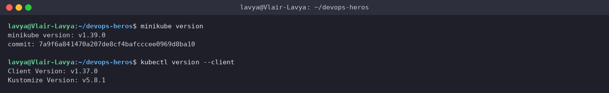
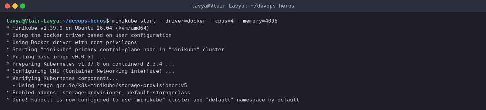
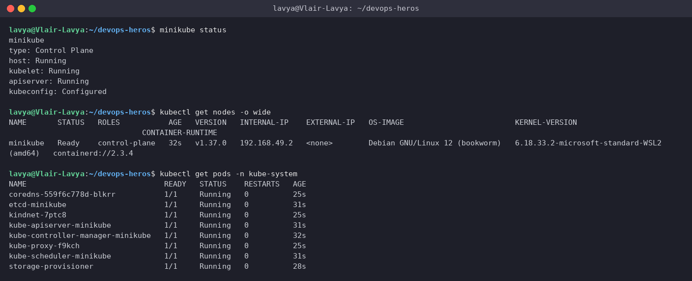
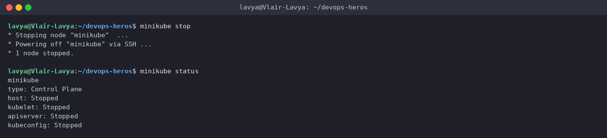

# Session 9: Kubernetes Fundamentals & Minikube Cluster Setup

**Author:** Lavya ([@LAVYA255](https://github.com/LAVYA255))
**Course:** SST DevOps & Cloud [SWE]
**Session:** 09 - Kubernetes Fundamentals
**Repository:** `devops-heros / session9-k8s`

**My setup:** Windows 11 → WSL2 (Ubuntu 26.04) → Docker Engine 29.1.3 → Minikube v1.39.0 (docker driver) running Kubernetes v1.37.0 on containerd 2.3.4. All commands below were run inside the WSL terminal; the outputs are pasted exactly as they came back, and every screenshot in `./screenshots/` is a capture of that same terminal session.

---

## Task 1: Minikube & kubectl Installation Verification

Confirm that both `minikube` and the Kubernetes CLI (`kubectl`) are installed and on the `PATH`.

**Commands**
```bash
minikube version
kubectl version --client
```

**Output**
```text
$ minikube version
minikube version: v1.39.0
commit: 7a9f6a841470a207de8cf4bafcccee0969d8ba10

$ kubectl version --client
Client Version: v1.37.0
Kustomize Version: v5.8.1
```

**Screenshot**



> I installed both as plain binaries into `~/.local/bin` (no package manager needed): `kubectl` from `dl.k8s.io/release/stable.txt` and `minikube-linux-amd64` from the GitHub releases page.

---

## Task 2: Starting the Minikube Cluster

Create a single-node Kubernetes cluster inside a Docker container using the docker driver.

**Command**
```bash
minikube start --driver=docker --cpus=4 --memory=4096
```

**Output**
```text
$ minikube start --driver=docker --cpus=4 --memory=4096
* minikube v1.39.0 on Ubuntu 26.04 (kvm/amd64)
* Using the docker driver based on user configuration
* Using Docker driver with root privileges
* Starting "minikube" primary control-plane node in "minikube" cluster
* Pulling base image v0.0.51 ...
* Preparing Kubernetes v1.37.0 on containerd 2.3.4 ...
* Configuring CNI (Container Networking Interface) ...
* Verifying Kubernetes components...
  - Using image gcr.io/k8s-minikube/storage-provisioner:v5
* Enabled addons: storage-provisioner, default-storageclass
* Done! kubectl is now configured to use "minikube" cluster and "default" namespace by default
```

**Screenshot**



> Minikube pulls its `kicbase` image, boots the control plane, wires up the CNI, enables the default addons, and finally points `kubectl` at the new cluster. Note that the base image and Kubernetes preload were already cached from my first run, which is why there is no download progress in this capture.

---

## Task 3: Verifying Cluster Status & Node Health

Check that the host, kubelet and API server are all running and that the node reports `Ready`.

**Commands**
```bash
minikube status
kubectl get nodes -o wide
kubectl get pods -n kube-system
```

**Output**
```text
$ minikube status
minikube
type: Control Plane
host: Running
kubelet: Running
apiserver: Running
kubeconfig: Configured

$ kubectl get nodes -o wide
NAME       STATUS   ROLES           AGE   VERSION   INTERNAL-IP    EXTERNAL-IP   OS-IMAGE                         KERNEL-VERSION                              CONTAINER-RUNTIME
minikube   Ready    control-plane   32s   v1.37.0   192.168.49.2   <none>        Debian GNU/Linux 12 (bookworm)   6.18.33.2-microsoft-standard-WSL2 (amd64)   containerd://2.3.4

$ kubectl get pods -n kube-system
NAME                               READY   STATUS    RESTARTS   AGE
coredns-559f6c778d-blkrr           1/1     Running   0          25s
etcd-minikube                      1/1     Running   0          31s
kindnet-7ptc8                      1/1     Running   0          25s
kube-apiserver-minikube            1/1     Running   0          31s
kube-controller-manager-minikube   1/1     Running   0          32s
kube-proxy-f9kch                   1/1     Running   0          25s
kube-scheduler-minikube            1/1     Running   0          31s
storage-provisioner                1/1     Running   0          28s
```

**Screenshot**



> The single `minikube` node is both control plane and worker. The `kube-system` listing is a nice sanity check: every control-plane component from Task 5 (etcd, apiserver, controller-manager, scheduler) is visible as a real pod, plus CoreDNS, kube-proxy and the kindnet CNI.

---

## Task 4: Stopping the Minikube Cluster

Power the cluster down cleanly so it releases CPU/RAM, without deleting its state.

**Commands**
```bash
minikube stop
minikube status
```

**Output**
```text
$ minikube stop
* Stopping node "minikube"  ...
* Powering off "minikube" via SSH ...
* 1 node stopped.

$ minikube status
minikube
type: Control Plane
host: Stopped
kubelet: Stopped
apiserver: Stopped
kubeconfig: Stopped
```

**Screenshot**



> `minikube stop` keeps the container and all cluster data around, so the next `minikube start` is fast ("Restarting existing docker container"). `minikube delete` is the one that wipes everything.

---

## Task 5: Kubernetes Architecture & Core Components

A short summary of what I read in the [official architecture docs](https://kubernetes.io/docs/concepts/architecture/), mapped to what I could actually see in my own cluster in Task 3.

```text
                     CONTROL PLANE  (the "minikube" node in my cluster)
   +------------------------------------------------------------------+
   |   etcd  <---->  kube-apiserver  <---->  kube-scheduler            |
   |                      ^                                            |
   |                      +-------->  kube-controller-manager          |
   +---------------------------|--------------------------------------+
                               |  (all traffic goes through the API server)
          +--------------------+--------------------+
          v                                         v
   +-----------------------+                +-----------------------+
   |      WORKER NODE      |                |      WORKER NODE      |
   |  kubelet   kube-proxy |                |  kubelet   kube-proxy |
   |  container runtime    |                |  container runtime    |
   |  [Pod] [Pod] [Pod]    |                |  [Pod] [Pod]          |
   +-----------------------+                +-----------------------+
```

### Control plane

| Component | What it does |
| --- | --- |
| **kube-apiserver** | The front door. Every `kubectl` call, every controller and every kubelet talks to the cluster through this REST API. It is the only thing that reads/writes `etcd`. |
| **etcd** | Consistent key-value store holding the entire desired state of the cluster (Deployments, Services, Secrets, ...). Lose etcd and you lose the cluster's memory. |
| **kube-scheduler** | Watches for Pods with no node assigned and picks one, based on resource requests, taints/tolerations, affinity rules, etc. It only decides; the kubelet does the running. |
| **kube-controller-manager** | Runs the reconciliation loops (Node, ReplicaSet, Deployment, EndpointSlice controllers...) that keep nudging *current state* toward *desired state*. |

### Worker node

| Component | What it does |
| --- | --- |
| **kubelet** | The agent on every node. Gets PodSpecs from the API server, asks the container runtime to start the containers, runs the probes and reports status back. |
| **kube-proxy** | Programs iptables/IPVS rules so a Service's virtual IP actually reaches the right Pod IPs. |
| **Container runtime (CRI)** | Actually pulls images and runs containers. My cluster uses `containerd 2.3.4`; older clusters used Docker directly. |
| **Pod** | Smallest deployable unit - one or more containers that share a network namespace (one IP) and volumes. Usually one app container, sometimes with an init or sidecar container. |

### How they interact (a `kubectl apply` in one breath)

`kubectl` sends the manifest to the **API server** → it is validated and persisted in **etcd** → the relevant **controller** notices the new object and creates Pods → the **scheduler** assigns each Pod a node → that node's **kubelet** tells **containerd** to run it → **kube-proxy** updates its rules so Services can reach the new Pod → the kubelet keeps reporting health back to the API server.

---

## References

- https://kubernetes.io/docs/tutorials/kubernetes-basics/
- https://minikube.sigs.k8s.io/docs/start/
- https://kubernetes.io/docs/concepts/architecture/
- https://github.com/Nency-Ravaliya/Kubernetes
